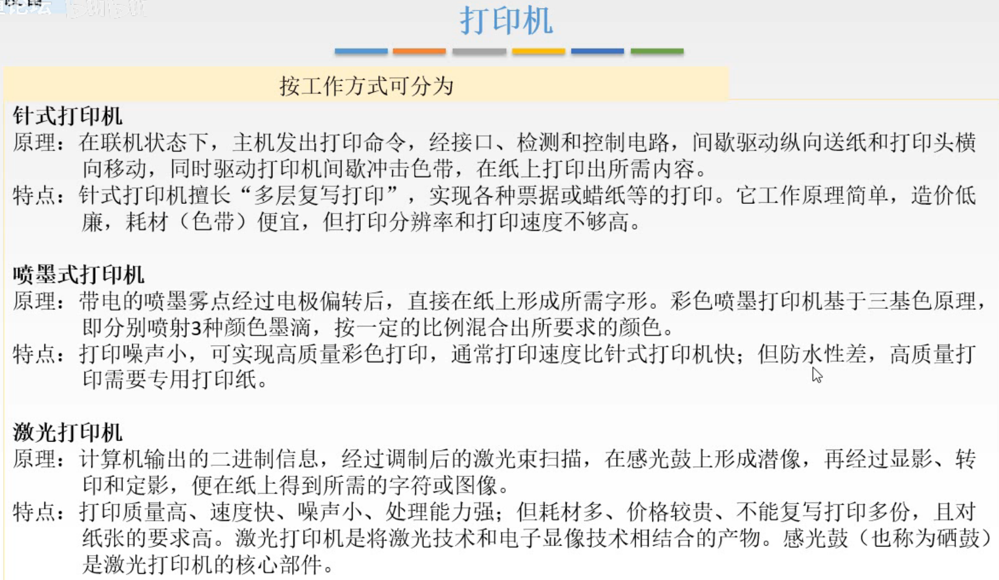

# 外部设备

介绍一下外设的基本原理。

主要介绍：

输入设备：键盘、鼠标，
输出设备：显示器、打印机，

外存储器：放在下一节介绍。

## 一. 外部设备

图1.外部设备

外设也称外围设备，是除了主机以外的、能直接或间接与计算机交换信息的装置。

分为：

1. 输入设备：

   用于向计算机系统输入命令和文本、数据等信息的部件。

   键盘和鼠标是最基本的输入设备。

2. 输出设备：

   用于将计算机系统中的信息输出到计算机外部进行显示、交换等的部件。

   显示器和打印机是最基本的输出设备。

3. 外存设备

   出了计算机内存及CPU缓存等以外的存储器。

   硬磁盘、光盘等是最基本的外村设备。

   外存既可以做输入设备，也可以做输出设备。

### 1.1 输入设备

图2.输入设备

键盘：

自己看图2，我不想写了。

鼠标：

自己看图2吧。

了解一下就行了。	

### 1.2 输出设备

#### 1.2.1 显示器

图3.显示器

显示器的一些指标：

1. 屏幕大小：

   对角线的长度。

2. 分辨率：

   像素的个数，以宽 $\times$ 高来表示，单位是像素个数。

3. 灰度级：

   在黑白显示器中是像素点的有多少种亮度，在彩色显示器种是像素点有多少种颜色。控制一个像素点的亮度/颜色由一个二进制位表示，n位二进制位可以表示 $2^n$ 种不同的亮度/颜色。8位就对应256级。

4. 刷新：

   每个像素点亮的时间有限，需要在消失之前重新扫描一遍，这个过程就叫刷新。
   刷新频率：单位时间内扫描整个屏幕内容的次数。一般要大于20Hz才觉得屏幕没有闪烁。

5. 显示存储器（VRAM）

   也称刷新存储器，为了刷新图像，就要先把要显示的一帧的图像信息存储在刷新存储器中。

   **显示存储器的容量**=分辨率 $\times$ 灰度级位数。
   **显示存储器的带宽**=分辨率 $\times$ 灰度级位数 $\times$ 帧率。

下面当作科普读物看看。

图4.显示器分类

按照显示器所用的显示器件可分为：

1. 阴极射线管（CRT）显示器
2. 液晶显示器
3. LED（发光二极管）显示器

各自的介绍就看图4吧。

下面对**阴极射线管显示器**再细分：

图5.字符显示器

1. 字符显示器

   介绍自己看图5。

   字符的ASCLL代码存放在视频存储器VRAM（就是VRAM不过前面中文写的是显示存储器，一样的）

图6.字符显示器原理

字符发生器就是右边的红框部分，

比如输出字符C，拆分成一行一行存储，第一行0111110，第二行1000001，......。

这些二进制就存在字符发生器的最左边的 $ROM_1$ 中（假设是这个存储体中），每个存储单元存一行二进制。

其他的ROM就存的其他的字符。

显示存储器VRAM里面存的是字符的ASCLL码，比如要输出C，把VRAM中C的ASCLL码传给字符发生器，字符发生器找到该ASCLL码对应的ROM，传给输出缓冲寄存器，然后后续......再输出。

有一个小知识点，如果算字符显示器的VRAM容量，是等于里面存的字符数量乘以ASCLL码的长度。
当然一般遇到算VARM容量是指前面说的那个分辨率乘以灰度级位数。

图7.图形显示器、图像显示器

2. 图形显示器

   图形显示器是通过控制电子束的移动来画出图像。比如一个O，就在不停地沿着O的轨迹射出一个不断移动的电子束，达到持续显示（刷新）的目的。

   与字符显示器的区别是，字符显示器是控制每个点的亮/暗。显示O，是固定射出O的电子束，O这个字符是存在字符发生器中的，其ASCLL码在VRAM中。
   大概理解为字符显示器每一个像素点都对应一个电子发射器，亮就发射，不亮就不发射。

3. 图像显示器

   直到有这个就行了。

图8.按扫描方式分

按扫描方式分为：

1. 光栅扫描显示器

   一行一行的扫描，

   扫描到某个位置时，决定这个位置亮不亮。

2. 随机扫描显示器

   只在需要显示的位置扫描，下一帧还是不亮的地方就不扫描它。

#### 1.2.2 打印机

图9.打印机

按印字原理分为：

1. 击打式打印机
2. 非击打式打印机

按打印机工作方式：

1. 串式打印
2. 行式打印

自己看图9。

图10.按工作方式分

按工作方式分：

1. 针式打印机
2. 喷墨式打印机
3. 激光打印机

自己看图10。

## 二. 本节回顾

图11.本节回顾

主要会算显示器的容量、带宽。

2020.09.23

