# 外存储器

接着介绍外部设备-外存储器。

## 一. 外存储器

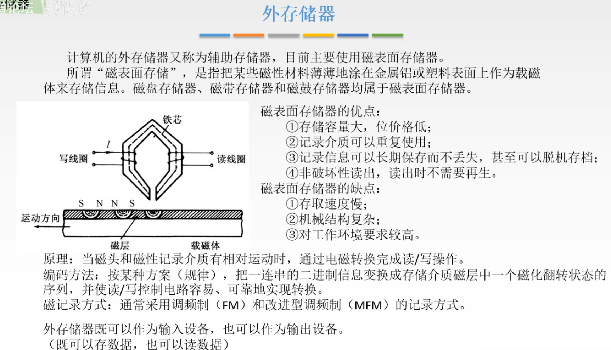

图1.外存储器

外村又称辅助存储器，目前主要使用磁表面存储器。

工作原理：
**串行工作**模式。
如图1中，磁头有着写线圈和读线圈，通过给写线圈加上电流，通过电磁感应，可以改变磁载体表面的磁层的状态（南/北极方向，不同方向代表0/1）。
同样可以通过磁头在对应位置，在读线圈中产生感应电流，从而读出0/1。

优点：
存储容量大、位价格低；
记录介质可以重复使用；
记录信息可以长期保存而不丢失，甚至可以脱机存档；
非破坏性读出，读出时不需要再生。（不像DRAM那样破坏性读出还需要刷新）

缺点：
存取速度慢；（毕竟磁头一个一个移动到相应位置，然后读/写，很慢）
机械结构复杂；
对工作环境要求高；

外存既可以作为输入设备，也可以作为输出设备。

## 二. 磁盘存储器

磁盘存储器是外存的一种。

### 2.1 磁盘设备的组成

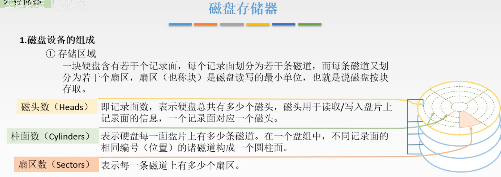

图2.磁盘存储器

#### 2.1.1 存储区域

一个硬盘含有若干个记录面，每个记录面分为若干条磁道，每条磁道又划分不同扇区，扇区（也称块）是磁盘读写的最小单位，即磁盘按快存取。

磁头数Heads：硬盘有多少个用于读/写记录面的磁头。

柱面数Cylinders：硬盘每一盘面上有多少条磁道。
（突然反应过来Cylinders，柱面，就是在记录面这个面上磁道在空间上是一个柱面嘛）

扇区数Sectors：每条磁道分为多少个扇区（块）。

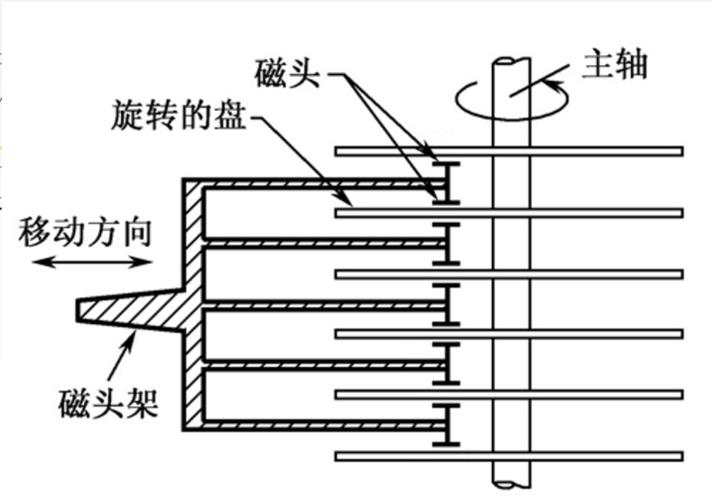

图3.磁盘存储器示意图

图3中，磁头有5个，最外面的2个记录面是没有磁头读/写的，所以计算该磁盘存储器是不算最外面的2个记录面的容量的，即该磁盘为10个面的容量。
如果最外面加上两个磁头，那就是12个面的容量。

#### 2.1.2 硬盘存储器

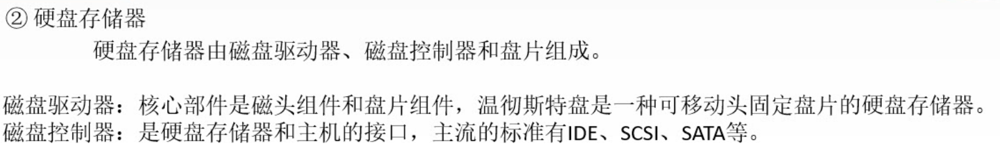

图4.硬盘存储器

硬盘存储器是磁盘存储器的一种。
（按盘基分的话，另一种是软盘。）
（盘基，硬盘用非磁性轻金属，软盘是挠性塑料。）

硬盘存储器由磁盘驱动器、磁盘控制器和盘片组成。

磁盘驱动器：核心部件是磁头组件和盘片组件（主要是机械部分，图5中的机械臂、中间转动盘片的驱动轴）

磁盘控制器：是硬盘存储器和主机的接口，主流的标准有IDE、SCSI、SATA等。

温彻斯特盘是移动磁头，盘片固定的硬盘存储器。

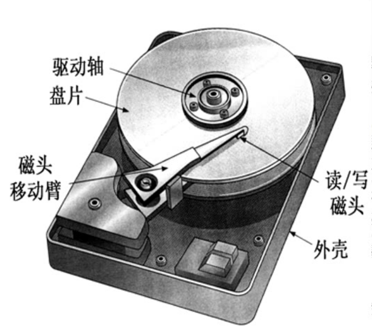

图5.硬盘存储器示意图

硬盘示意图。

### 2.2 磁盘存储器的性能指标

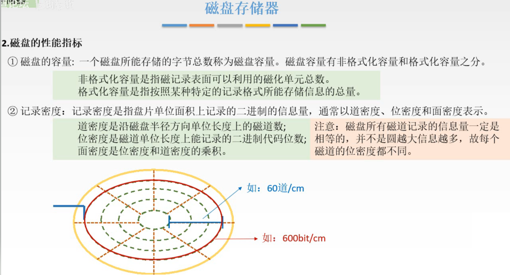

图6.磁盘容量、记录密度

### 2.2.1 磁盘的容量

一个磁盘所能存储的字节总数。

磁盘容量又有非格式化容量和格式化容量之分：

非格式化容量：磁记录表面可利用的磁化单元总数。
格式化容量：按照某种特定的记录格式所能存储信息的总量。

意思是，非格式化容量指这个可使用的位数。而格式化容量，指数据按照一定格式存储，就会有些短的数据不会用完这个格式的长度，利用不充分，所以格式化容量小于非格式化容量。

#### 2.2.2 记录密度

盘片上单位面积上记录的二进制信息量，通常以道密度、位密度、面密度来表示。

道密度：沿磁盘半径方向单位长度上的磁道数。
位密度：磁道单位长度上能记录的二进制代码位数。
面密度：位密度与道密度的乘积。

以图6下方图为例，道密度为60道/cm。

注意，盘片并不会用完所有面积，主要在内环和外环会留有一段距离，因为太中心和太边缘容易出问题。

最外圈磁道的位密度600bit/cm。
注意，半径不同，磁道周长也不同，但磁道的信息量是相等的。所以不同磁道的位密度是不同的，内圈位密度大，外圈位密度小。
因为磁盘是按块存取的，需要保存每块的信息量一样，不然的话按块存取，半径不同的磁道取出来的数据长度就不一样了。

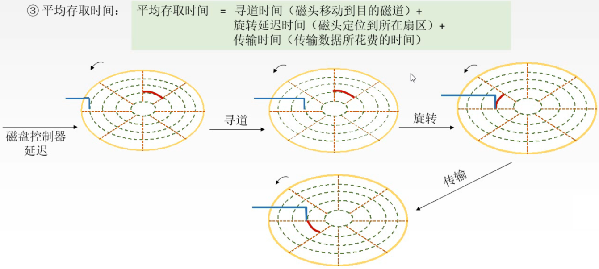

图7.平均存取时间

#### 2.2.3 平均存取时间

**平均存取时间**

**平均存取时间=寻道时间（磁头移动道目的磁道）+旋转延迟时间（磁头定位到目的扇区）+传输时间（传输数据耗时）。**

过程如图7，传来控制信号，磁头先移动到磁道，再移动到扇区，然后开始读取数据。

注意，因为磁头到目的磁道、目的扇区，其相对位置是随机的，可能会涉及到一些调度算发。
所以在计算存取时间时，除非题目给出了移动到目的磁道、目的扇区的时间，否则使用**平均时间**，即寻道时间=磁头从最外圈到最内圈用时的一半，旋转延迟时间=磁头转一圈用时的一半。
因为磁盘控制器接收到信号也需要一段时间译码，所以如果题目给出了磁盘控制器的用时，也需要加上。

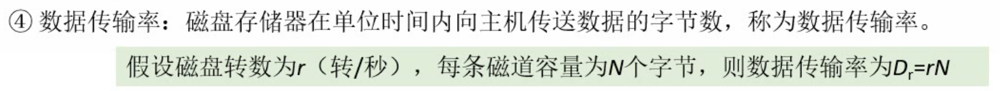

图8.数据传输率

#### 2.2.4 数据传输率

磁盘存储器在但单位时间内向主机传送数据的字节数。

通常题目中会给出磁盘转数r（转/秒），每条磁道容量位N个字节，则数据传输率为rN。

### 2.3 磁盘地址

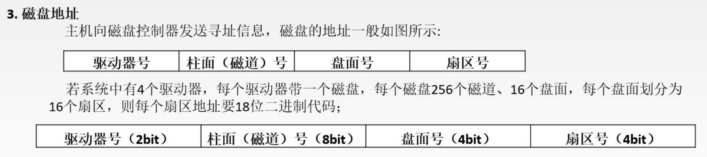

图9.磁盘地址

显然磁盘存储器也是需要地址的。

磁盘地址格式一般为：驱动器号+柱面（磁道）号+盘面号+扇区号。

图9给出了给磁盘编址的例子，自己看吧。

### 2.4 硬盘的工作过程

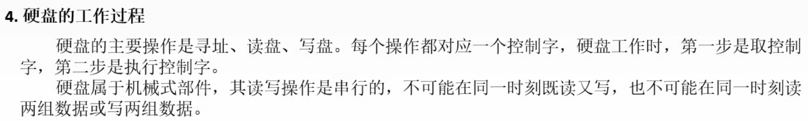

图10.

硬盘的主要操作就是寻址、读盘、写盘。

每个操作对应一个控制字，硬盘工作时，第一步是取控制字，第二步是执行控制字。

硬盘属于机械式部件，其读写操作是**串行**的。
无法同时读写，也无法同时读/写复数组数据。

### 2.5 磁盘阵列

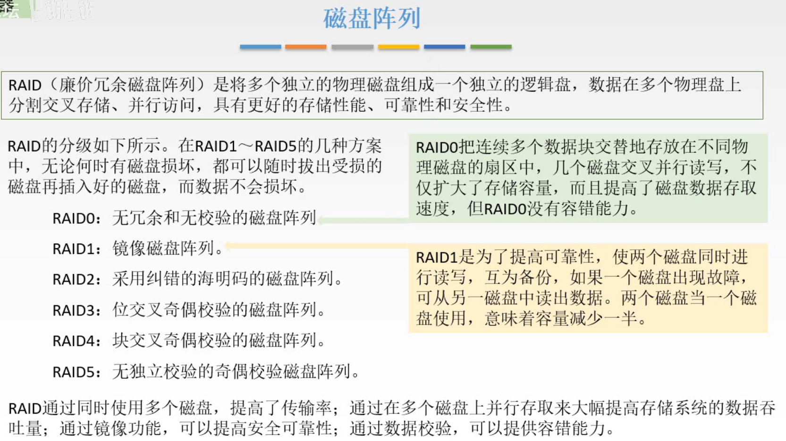

图11.磁盘阵列

就是把多个独立的物理磁盘组成一个大的逻辑盘。

反之磁盘比较便宜，只用一个磁盘又怕磁盘坏了，数据就没了；或者磁盘存储的信息发生了错误。
拿干脆就多买几个磁盘来做成一个磁盘阵列RAID，还能提高速度。

有几种方案，RAID0-RAID5。每种方案，详细看图11。
除了RAID0，其他RAID1-RAID5，都可以随时拔出受损的磁盘，再插入好的磁盘，而数据不会损坏。

因为做了备份呀，提高了安全可靠性。
RAID1的备份就是同时两个磁盘都进行读写操作，互为备份。显然太浪费了。
后面RAID2-RAID5的方法都是采用校验码的方式，不用很蠢得完全备份一份，而是存其校验码，来确保数据没错，提高容错能力。

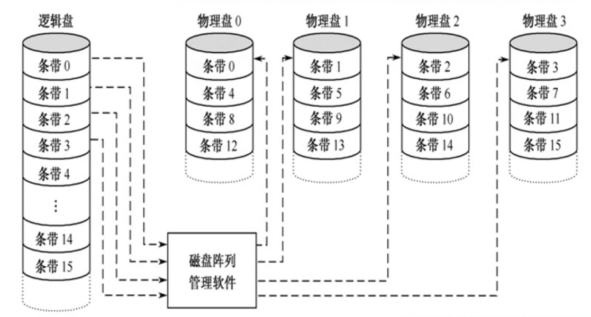

图12.磁盘阵列RAIN0示意图

RAID0方案示意图。

RAID0，感觉就是类似于在存储系统那章中学过的，交叉编址的多体并行存储器。

这里的逻辑盘是一个虚拟的概念，只是用户使用是可以当作一个逻辑盘来使用。

RAID0方案，提高了速度，但显然还是没有考虑到数据损坏，磁盘可能会坏的情况，所以没有容错能力。

## 三. 光盘存储器

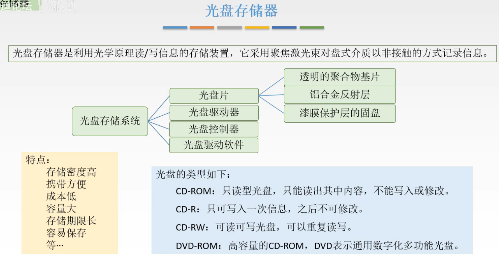

图13.光盘存储器

啊啊啊，看图13吧，念一遍就好。

## 四. 固态硬盘

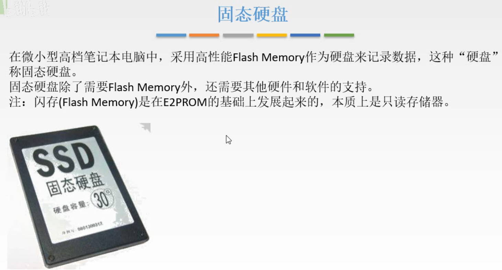

图14.固态硬盘

固态硬盘采用的是闪存，在前面只读存储器ROM一节中，闪存本质上是只读存储器。虽然ROM也已经发展出了确实是可以写的。但读的速度明显快也写的速度。

固态硬盘，自然也是读的速度明显快于写的速度。

与U盘的区别，U盘中用的闪存芯片比较少，比较容易出问题。
固态硬盘用了多组闪存芯片，用了一些特殊的算法管理起来，所以速度更快，可靠性也更高。

## 五. 本节回顾

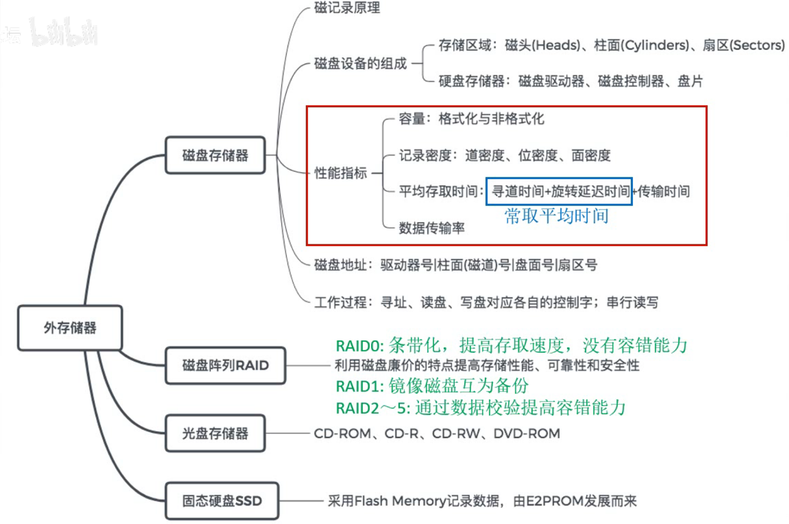

图15.本节回顾

这节主要是性能指标，其中存取时间的计算。

2020.09.24