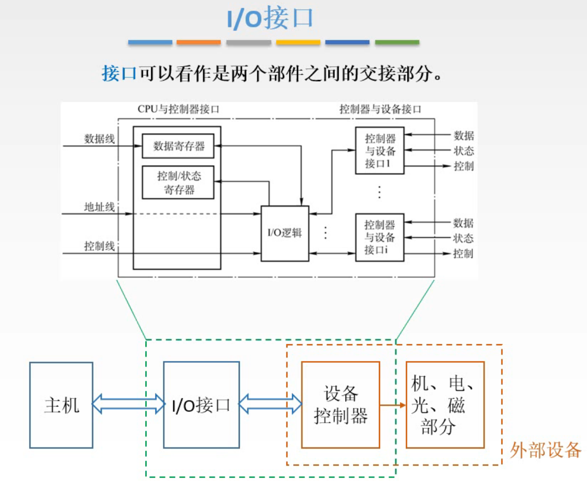
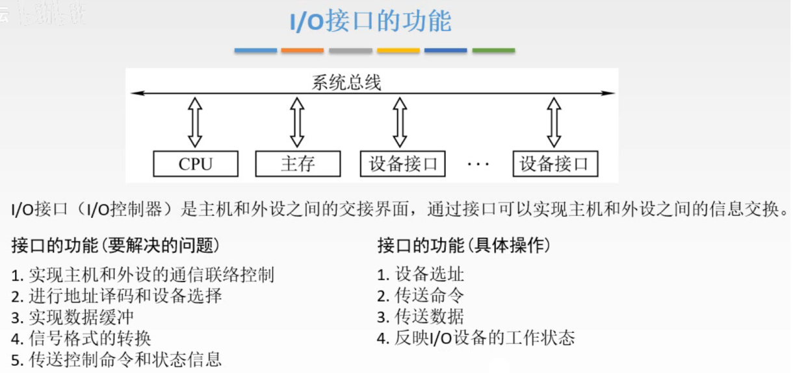
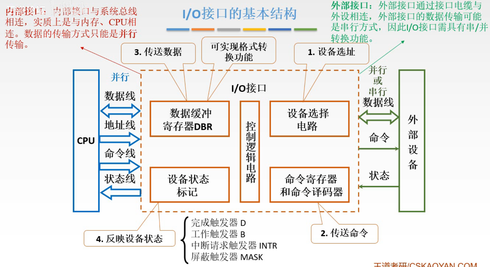
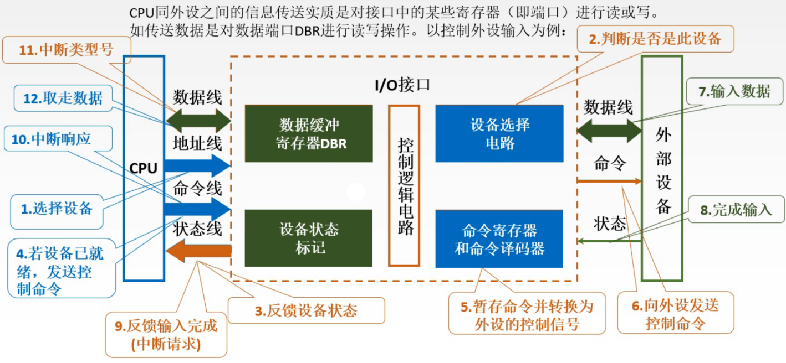
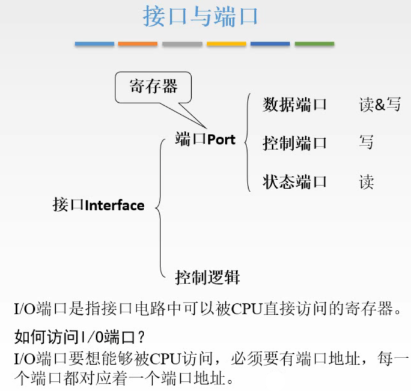
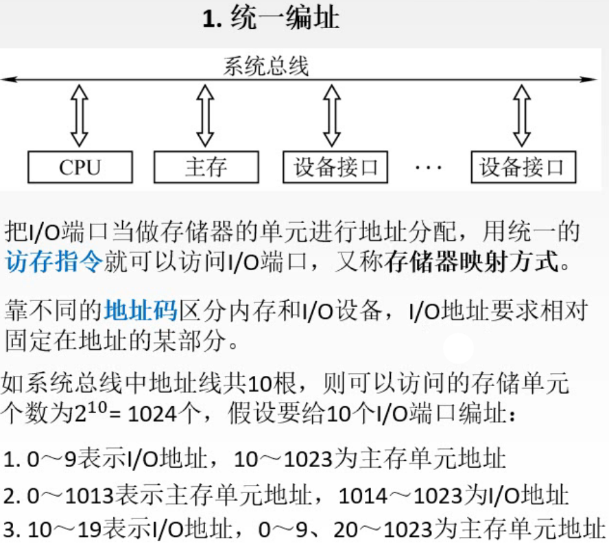
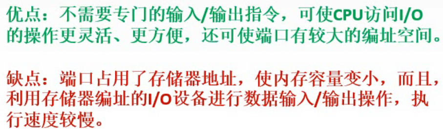
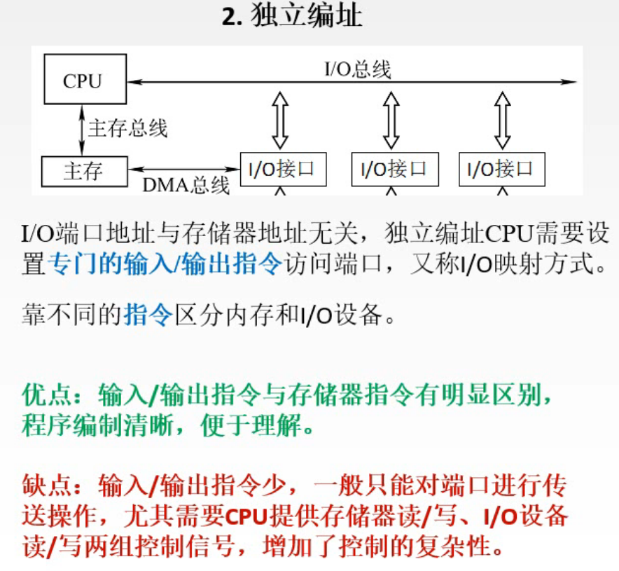
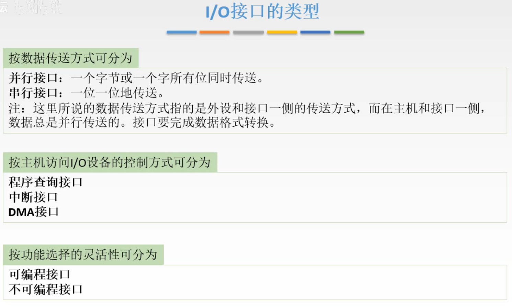
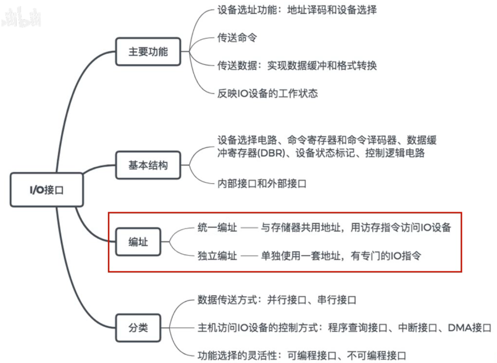

# I/O接口

I/O接口，主要就是解决外设和主机之间的连接问题。

## 一. I/O接口

图1.I/O接口

前面也说过，两个部件之间的交接部分称为接口。

在<计算机组成原理>中，讨论的是主机与设备控制器之间的I/O接口。

在<操作系统>中，则认为是I/O接口和设备控制器整体为接口。

## 二. I/O接口的功能

图2.I/O的功能

分析采用总线来连接外设和主机，I/O接口应该具有何种功能，

图2中画的示意图是单总线结构来分析。

要解决的问题有：

实现主机与外设的通信联络控制；（要能联络上）
进行地址译码和设备选择；（用于确定控制/交流的设备）
实现数据缓冲；（两个部件速度可能差距太大）
信号格式转换；（数据要能转换为对方能识别的格式）
传送控制命令和状态信息；（能够传递控制命令已经发出自己的状态信息）

意味着I/O接口需要能够执行以下具体操作：

设备选址；
传送命令；
传送数据；
反映I/O设备的工作状态。

根据这些来设计I/O接口的基本结构。

## 三. I/O接口的基本结构

图3.I/O的基本结构

I/O接口中：

设备选址：**设备选择电路**。
将CPU发来的地址与该接口自己存的地址进行对比，来判断该接口是否被选中。

传送命令：**命令寄存器和命令译码器**。

传送数据：**数据缓冲寄存器DBR**。
实现数据缓冲和格式转换的功能。

反映设备状态：**设备状态标记**
常用标记有：
完成触发器D，表示设备完成工作；
工作触发器B，表示设备正在工作；
中断请求触发器INTR，用于向CPU发送请求；
屏蔽触发器MASK，用于优先级的控制，用来表示当前的请求有没有机会被CPU响应。

上述设备需要协同工作，还需要一个**控制逻辑电路**

现实中，这里设计的I/O接口实际上是一个电路板，是一个装置。
所以对CPU侧，需要提供**内部接口**，与系统总线相连，数据传输方式为**并行**。
对外设侧提供的接口称为**外部接口**，由于外设多种多样，所以是**可能并行可能串行的**。所以I/O接口还需要提供串/并转换的功能。

图4.I/O的工作流程

简单说一遍工作流程，以控制外设输入为例：

1. CPU通过地址线传递这个外设的信号，
2. I/O接口从地址线收到信号，设备选择电路将其与自身地址进行判断，
3. 假设判断相同，将相应的设备标记反馈给CPU，
4. CPU收到反馈信号，假设该外设准备就绪，CPU发送控制命令给该I/O接口，
5. 命令传给了I/O接口中的命令寄存器和命令译码器，暂存命令并转换为了外设的控制信号，
6. 通过与外设连接的命令线，向外设发送控制信号，
7. 外设接收到控制命令，将数据通过数据线写入到数据缓冲寄存器DBR中，
8. 数据传输完成后，通过外设的状态线来通知I/O接口传输完成，
9. I/O接口改变设备状态标记，通过状态线对CPU反馈输入完成，这里假设采用中断请求方式，就是发出中断信号，
10. CPU接收到中断请求，并且决定响应，就通过命令线发送中断响应，
11. I/O接口接收到中断响应后，先通过数据线传递给CPU中断类型号，
    这是因为CPU之前接收到了中断请求，但并不知道要干什么，只是响应了，知道自己要中断，CPU发出中断响应之后，继续在做自己的事情，比如保存正在执行的任务之类的，所以需要I/O接口传给CPU中断类型号，让CPU根据中断类型号来判断，哦是要对这个I/O接口的DBR进行一个读取操作。
12. CPU接收到中断类型号后，从数据缓冲寄存器DBR中取走数据。

补充，在 2012 真题的选择题中，确实说明了 " 命令字、状态字、中断类型号 " 都是在 I/O 总线上的数据线上传输的。
但又在王道视频中，出现了状态线、命令线。
而且我确实在网上看到有状态线、命令线。
只能说记着吧，如果题目没说状态线、命令线，那就走数据线？大概是这样？

可以看出，CPU与外设的信息传输，实质是CPU对I/O接口中的某些寄存器进行读写。
所以实际上I/O接口的地址，是这些**寄存器的地址**。
这些寄存器也称为**端口**。

## 四. 端口

### 4.1 接口与端口

图5.接口与端口

这里区分一下接口和端口这两个概念。

**I/O端口**是接口中的**CPU可以直接进行访问的寄存器**，
接口不止有端口，还有其他东西，比如控制接口运行的控制逻辑。

对接口里面的端口就可以分类：
数据端口，读写
控制端口，只写
状态端口，只读

### 4.2 I/O端口编址方式

CPU如何访问I/O端口，那还是地址啊，自然又是怎么编址的问题。

#### 4.2.1 统一编址

图6.统一编址

统一编址，把I/O端口当作存储器的单元进行地址分配，这样接口和主存就能使用同一套地址线，用统一的访存指令就可以访问I/O端口，又称为**存储器映射方式**。
依靠**地址**来区分主存和I/O端口。

图6下方给出了例子，比如10根地址线，可以在设计时给出一段地址作为I/O端口的地址。
但I/O端口的地址要求固定在地址的某几位上，如图6例子中10个I/O端口的地址都是在固定的4个位置的二进制位。

图7.统一编址优缺点

优点：不需要再使用专门的输入/输出指令，只需要和主存使用同一条指令，CPU访问I/O的操作更灵活，更方便，而且端口也有了较大编址空间。

缺点：因为端口的地址占用了地址线的一些表示，所以可访问的内存容量变小（不是物理层面的容量变小，而是因为用于表示主存的数量变小），而且利用存储器编址的I/O设备进行数据输入/输出操作，执行速度较慢。

#### 4.2.2 独立编址

图8.独立编址

独立编址，主要对应有I/O总线的结构。

注意到CPU访问主存和CPU访问I/O设备，是不同的总线，所以二者不影响，地址可以重复。

但是，这样CPU就需要设置专门的输入/输出指令来访问端口，毕竟靠地址无法区分是主存还是端口了。
所以是靠不同**指令**来区分内存和I/O端口。

又称**I/O映射方式**。

优点：程序编址清晰，便于理解。
缺点：输入/输出指令少，一般只能对端口进行传送操作；需要CPU提供对存储器和对I/O设备读写的两组控制信号，增加了控制的复杂性。

因为对端口的指令是新编的，而前面统一编址的方式，端口和存储器的指令是统一的，所以对端口可以进行的操作就很多（怪不得前面说灵活），但是现在这种独立编址方式，不会给I/O端口编很多指令，所以只有简单的指令。

## 五 I/O接口分类

图9.I/O接口的类型

按数据传送方式：

1. 并行接口
2. 串行接口

注意，这里指**接口与外设**方面的数据传送，因为外设多种多样，接口得配合外设。
而接口与主机侧肯定**并行**传送的。

按主机访问I/O设备的控制方式：

1. 程序查询接口
2. 中断接口
3. DMA接口

按功能选择的灵活性可分为：

1. 可编程接口：I/O通道、I/O处理机，就是可编程接口
2. 不可编程接口

## 六. 本节回顾

图10.本节回顾

2020.09.24

