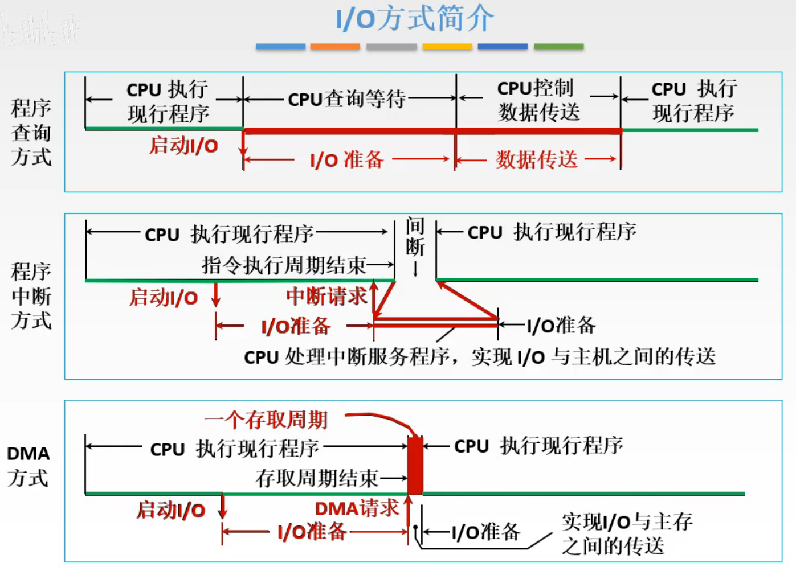
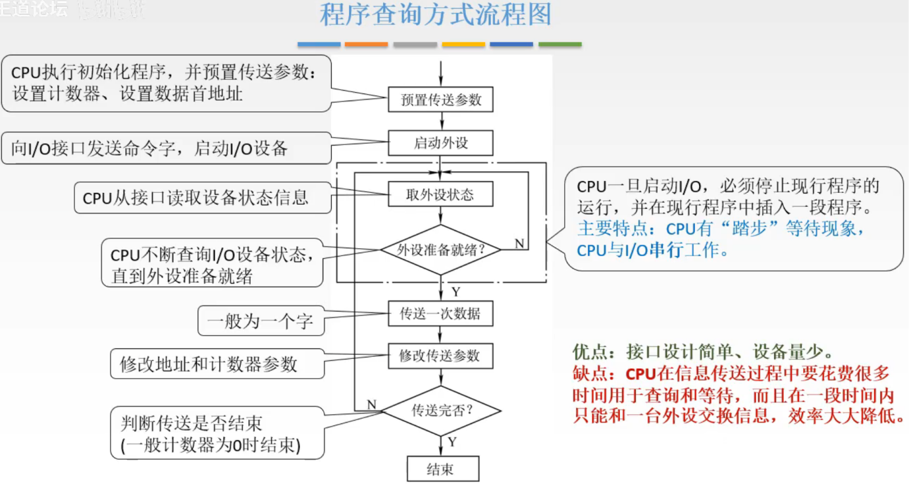
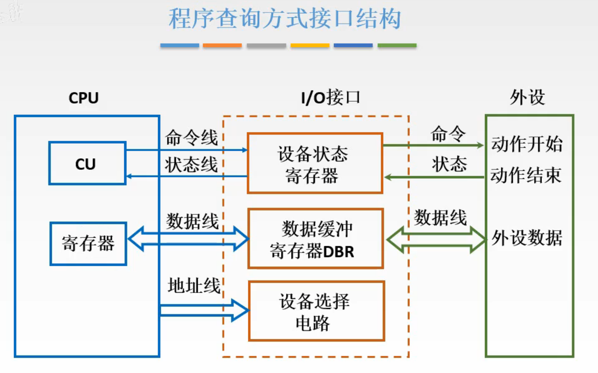
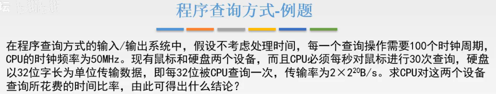
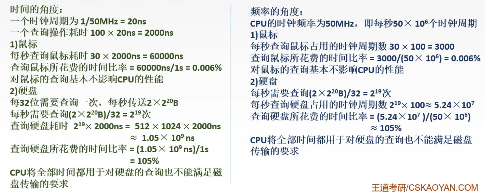
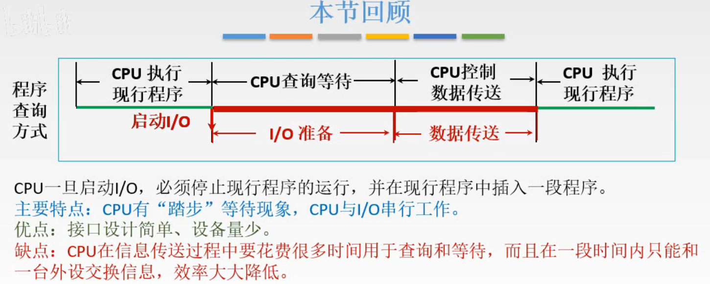

# 程序查询方式

这一节开始讲I/O方式，也就是CPU与I/O设备如何进行数据交换。

## 一. I/O方式简介

图1.I/O方式简介

I/O方式有三种，过程其实在1201基本概念那节我就写过了。这里就简单说说

I/O方式分为：

1. 程序查询方式

   开始，CPU在执行程序，

   然后执行到一个时间点，这个程序需要进行I/O操作，于是CPU发出启动I/O工作的信号，

   而I/O设备需要时间来准备，而且本身比较慢，
   在这个过程中，CPU不断查询I/O的状态，来不断确定I/O有没有把准备好，CPU并没有去做其他事。

   直到查询到I/O反馈准备好了，CPU控制进行数据的传输，

   传送结束后，再继续执行程序。

2. 程序中断方式

   在1201基本概念中写过，在1204I/O接口中以外设输入为例写过过程。

3. DMA方式

   在1201基本概念中写过了。

这一节讲**程序查询方式**。

## 二. 程序查询方式流程图

图2.程序查询方式流程图

在程序查询方式中，当进入了CPU查询程序状态、控制数据传输的这个阶段，实际上就是CPU运行了一个程序。
图2为该程序的流程图。

1. 最开始是要设置一些参数，CPU执行初始化程序，并预置传送参数：设置计数器、设置数据首地址，

2. 向I/O接口发送命令字，启动I/O设备，

3. I/O接口接收到命令字后，会把状态反馈给CPU，

4. CPU通过这个状态信息来判断外设是否准备好了，

   如果准备好了就进入下一步工作，传送数据；
   如果没有准备好，就再查询一次，再通过新查询到的状态来判断。

   图2中框内的过程就是CPU"踏步"等待的过程，这个过程中CPU没有执行其他任务而是一直再重复地进行查询状态，知道外设准备完毕。
   所以CPU和I/O是**串行**工作。
   也就是在现行程序中间插入了一段程序。

5. 当外设准备好了，CPU控制开始传送数据，一般这个数据是一个字，
   （为什么是一个字，在下面程序查询方式的接口中会说到）

6. 传送完成之后，更新一下参数，也就是修改地址和计数器，把地址定位到下一个需要传送的数据，修改计数器是表示这次已经传送结束了。

7. 根据计数器的值来判断本次传送是否结束

   一般以计数器为0时结束；
   如果计数器不为0，说明没有结束，回到查询外设状态的那步。

优点：接口设计简单、需要的硬件少。（毕竟大部分任务都是CPU在做）
缺点：CPU需要花费很多时间用于查询和等待，而且在一段时间内都只能与一个外设交换信息，效率低。

## 三. 程序查询方式接口结构

图3.程序查询方式接口

图3省去了部分细节。

程序查询方式的接口中，主要有：

1. 设备状态寄存器

   可以存放一些外设的状态，并且可以结合CPU发来的一些命令以及当时的每一位的状态，向外设发出一些命令。

   能这样简化主要是因为，程序查询过程中的一些逻辑判断主要都是由CPU来完成的，所以接口中就不需要太多硬件设计来完成这个逻辑控制，只需要设备状态寄存器，通过简单的状态位来对外设发送命令就行了。

2. 数据缓冲寄存器DBR

   CPU和外设之间交流数据，是先把数据写入数据缓冲寄存器DBR，然后再取走。

   为什么前面说一次传送一个字，因为程序查询方式中，数据缓冲寄存器DBR的数据传向主机，是先传入**CPU中的寄存器**的，就算是传入主存的数据，也是先到这个寄存器，再去主存。所以因为这个寄存器的限制，一般一次是传送一个字。

   所以本质还是寄存器之间的交换数据。

3. 设备选择电路

   就是来判断是不是选中了自己。

## 四. 例题

图4.例题

不考虑处理时间。

每一个查询操作需要100个周期，CPU时钟频率位50MHz。

对鼠标每秒查询30次，

对硬盘没有直接给出查询次数。

图5.例题解答

解答就看图5，我就不写一遍了。

硬盘，每秒需要查询 $2\times2^{20}B/4B=2^{19}次$，图5里写的32，只是没有加bit的单位，小毛病。

用频率的角度，把时钟周期作为单位来算还快点，就不用算出时间了。

结论都是，
鼠标基本不影响CPU性能，
硬盘，就算CPU全部时间用于对硬盘的查询也无法满足硬盘的传输要求。

## 五. 本节回顾

图6.本节回顾

2020.09.24

