# 中断系统

在讲I/O方式的第二种，程序中断方式之前，先讲讲中断系统。

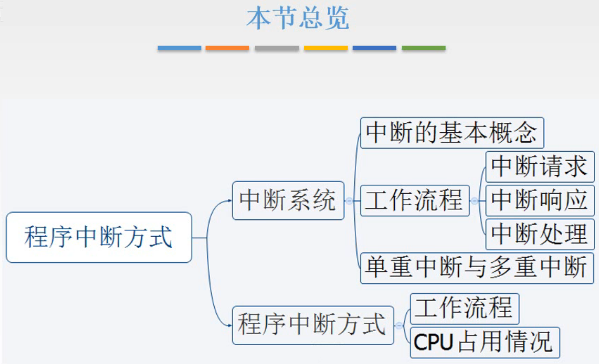

图1.本节总览

首先，中断这种方式，是用来提高系统的工作效率的。

而I/O方式中的程序中断方式，只是中断机制在控制I/O设备数据传送这方面的一个具体应用。

所以这一节先把中断系统给讲清楚了，然后下一节讲再I/O设备的控制中，中断机制是如何起作用的。

## 一. 中断的基本概念

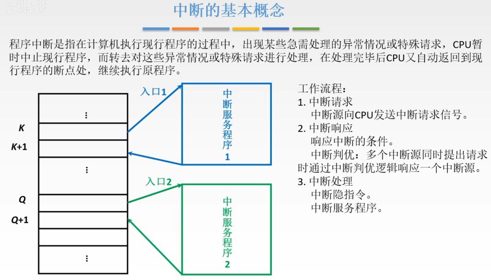

图2.中断的基本概念

程序中断是指，计算机执行现行程序的过程中，出现某些继续处理的异常情况或特殊请求，CPU暂时中止现行程序，转而去对这下异常情况或特殊情况请求进行处理，在处理完毕后CPU又自动返回现行程序的断电处，继续执行源程序。

图2中左方，例如当前正执行地址K处的指令，我们希望K地址的指令结束后，接下来不是执行K+1处的指令，而是转而去执行另一个程序，这另一个程序就称为**中断服务程序**。

中断服务程序执行结束后，再回过头来继续执行K+1处的指令。

## 二. 工作流程

工作流程为：

1. 中断请求

   中断源向CPU发送中断信号：

   因为原本指令是顺序执行的，所以想要K处指令结束后中断，自然需要一个触发机制，也就是中断源向CPU发送中断信号。
   CPU会在某条指令（到下面中断请求标记会解释）结束后，会统一的检测这些信号，如果检测到有中断请求，就会考虑进入第二步，中断响应。
   但不是必定进入中断响应啊，因为可能CPU没空呢。

2. 中断响应

   响应中断的条件：

   需要满足一定的条件CPU才会响应中断。

   中断判优：

   同时可能有多个中断源发出中断请求，通过中断判优逻辑决定响应哪一个中断源。

3. 中断处理

   中断隐指令：

   中断处理也就是要运行中断服务程序，为了保证运行中断服务程序结束后能够返回继续执行现行程序，所以在运行前进行保存断电的工作，这个工作就是由中断隐指令完成。

   中断服务程序：

   就是运行中断服务程序。

下面每个步骤依次来分析。

### 2.1 中断请求

#### 2.1.1 中断请求的分类

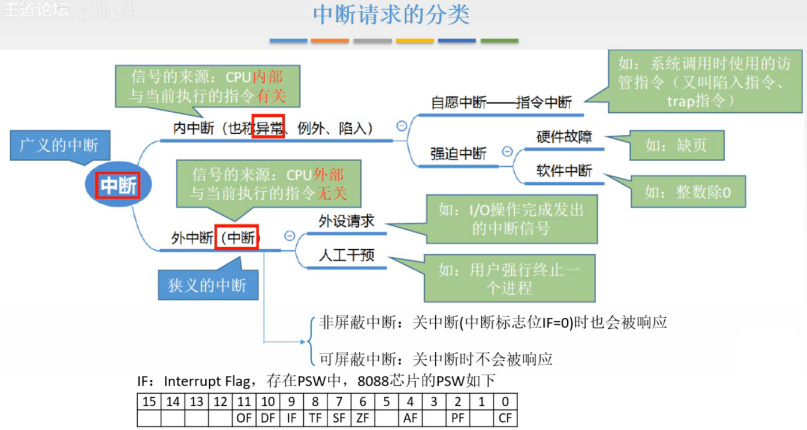

图3.中断请求的分类

显然，产生中断的原因是有很多种的，多个中断源，对于中断请求的原因是不一样的，所以先对中断请求进行分类。

（这里是<操作系统>中的分类图，简单说一下详细在<操作系统>再学）

广义的中断，任何打断现行程序运行的都是中断：

1. 内中断（异常、例外、陷入）

   中断信号来自CPU内部的中断，与当前执行的指令有关。
   这里CPU内部一般指CPU和主存，什么鬼CPU内部还算主存啊，嗷视频说是因为CPU和主存都是和指令有关的，所以算进去了）

   1.1 自愿中断-指令中断

   执行这条之间的结果，就是发生中断，是正常的，在计划之中的。
   比如当运行的用户进程或系统实用进程欲请求操作系统内核为其服务时，说是操作系统从用户态转变为内核态，只能使用中断，于是专门设计了访管指令来中断。

   1.2 强迫中断

   强迫中断是意料之外、计划之外的中断

   ​	1.2.1 硬件故障

   ​	比如硬件出现了故障，如缺页。

   ​	1.2.2 软件中断

   ​	比如出现了除以0的情况。

2. 外中断（中断）

   中断信号来自CPU外部的中断，与当前执行的指令无关。
   外中断一般就叫做中断了，但其实是狭义的中断，不过题目一般说中断就指外中断，自己看题判断是指广义的还是指外中断吧。

   2.1 外设请求

   来源于外设的中断，
   比如I/O准备完成发出的中断信号。

   2.2 人工干预

   来自人工干预的中断，
   比如用户强行终止一个进程。

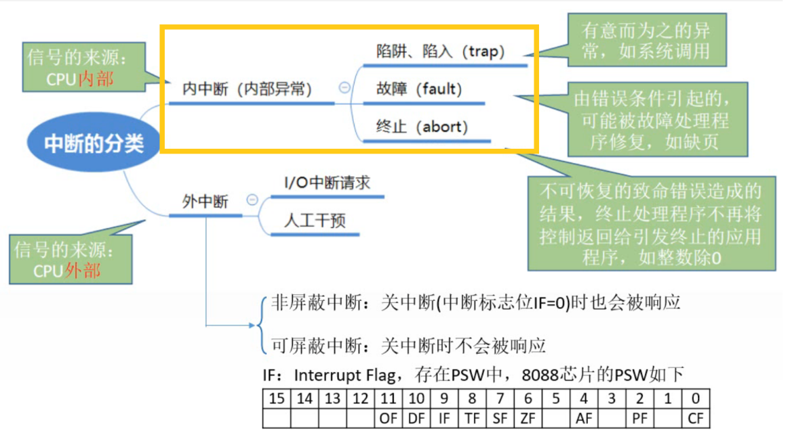

图4.内中断的另一种分类方式

对内中断、外中断内部各自又可用另一种方式分类。

内中断：

1. 陷阱、陷入（trap）

   有意安排的内中断，比如刚才举的访管指令。

2. 故障（fault）

   由错误条件引起的，可能被故障处理程序修复的，比如缺页。

   修复完，修复好后可以返回返回继续执行这个程序。

3. 终止（abort）

   没法修复的致命错误，那就只有把程序终止掉了。

外中断：

1. 非屏蔽中断

   通过引入中断标志位IF，来根据中断标志位IF判断是否响应。

   而非屏蔽中断是与IF无关的，即IF=0，CPU处于关中断状态，这个中断请求也是会被响应的。

2. 可屏蔽中断

   也就是收到中断标志位IF的控制的，当IF=0，CPU处于关中断状态，其中断请求不会被响应。

   中断标志位IF，Interrupt Flag，一般存在PSW中，占用一个二进制位。
   如80088芯片的PSW中IF在第9位。

#### 2.1.2 中断请求标记

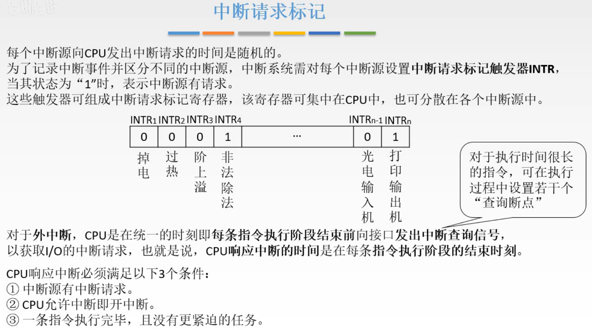

图5.中断请求标记

给中断请求分类后，下一步是使CPU知道接收到的中断是哪一个中断源发出的，是什么类型的中断。

对每个中断源设置一个**中断请求标记触发器INTR**，每个触发器对应一个中断源，当该中断源提出中断请求时，将其对应的触发器改为1。
CPU检测触发器，检测到为1的触发器，就能知道是哪个中断源提出的中断请求。 

这些触发器可以整合为一个统一的中断请求标记寄存器，设置在CPU当中，如图5；也可分散放在各个中断源中。

前面说了，**内中断是和当前指令有关**，比如在执行除法指令时，那就可以查询一下图5中的非法除法位，为1说明出现了终止abort-非法除法，这就叫和指令有关，不需要在某个时间点统一安排查询，毕竟没运行除法指令查这个干嘛呢。
而**外中断，和当前指令是无关**的，外设随时都可能发出中断信号，所以需要在一些时间点专门的发出信号来查询一下有没有中断请求。

对**外中断**，CPU是在统一的时刻，即每条指令的执行阶段结束前（也有说法是执行阶段结束前就查询），向接口发出**中断查询信号**，以获取I/O的中断请求，如果有中断，那么这条指令的执行就会进入中断周期，如果没有就下一条指令。
也就是说，**CPU响应中断的时间是在每条指令执行阶段的结束时刻**。
（这不就是前面学的指令划分为：取址周期-间址周期-执行周期-中断周期嘛。）

如果程序的执行周期很长，也可能在执行过程中设置若干个"查询断点"，在设置的时刻就查询一次。

当然CPU也不一定响应中断，响应中断的条件：

中断源有中断请求；
CPU运行中断，即开中断
一条指令执行完毕，且没有更紧迫的任务。

### 2.2 中断响应

CPU能够知道中断信号是哪个中断源发出的了，但是如果同时有多个中断源发出中断信号，那么CPU应该响应哪一个中断源呢？

这就是中断判优要解决的问题。

#### 2.2.1 中断判优-实现

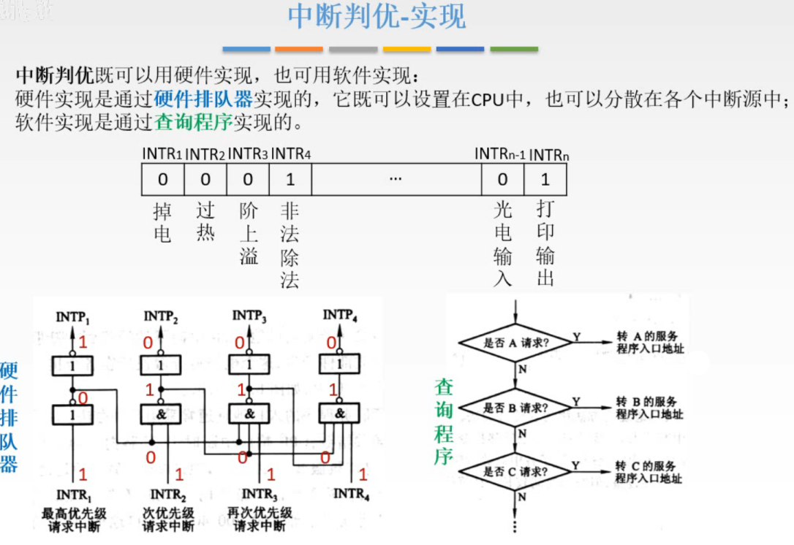

图6.中断判优-实现

**中断判优**，由硬件或软件实现都行。

硬件实现，通过**硬件排队器**实现，既可以设置在CPU中，也可以分散在各个中断源中。
软件实现，通过**查询程序**实现。

图6左下方为硬件排队器，逻辑还是很简单的，比如 $INTR_4$ 就需要 $INTR_{1}\sim INTR_{3}$ 都为0，最终的 $INTP_4$ 才会输出1。
简单的说就是把优先级高的信号线分支连接到优先级低的信号线上，这样优先级低的信号线会受到优先级高的信号线的控制，而优先级最高的信号线则直接通过去了。

图6右下方为软件实现的查询程序，依次查询各个中断源的状态，依次查询自然也有了优先级。

于是软件、硬件都能解决判断多个中断源同时发出中断信号应该响应哪一个的问题。

#### 2.2.2 中断判优-优先级设置

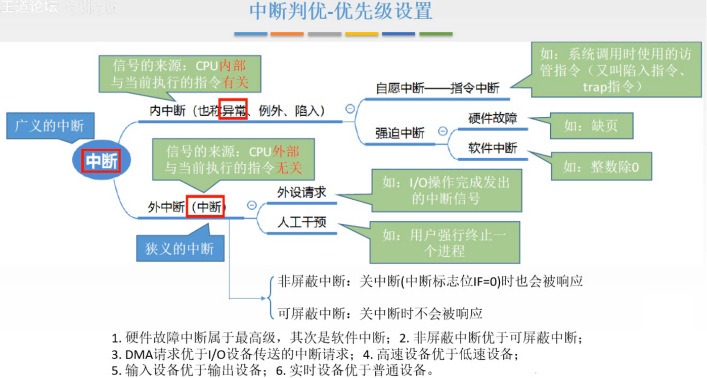

图7.中断判优-优先级设置

接着就是，既然有优先级，那么如何合理的设置各个中断源的优先级。

1. 硬件故障中断属于最高级，其次是软件中断。
2. 非屏蔽中断优于可屏蔽中断。
3. DMA请求优于I/O设备传送的中断请求。
4. 高速设备优于低速设备。
5. 输入设备优于输出设备。
6. 实时设备优于普通设备。

### 2.3 中断处理

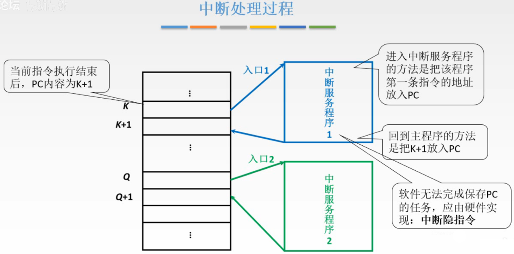

图8.中断处理过程

当处理中断的时候，当前指令K结束后，PC内容为K+1，但接下来是去执行中断服务程序（中断服务程序也在主存中），中断服务程序结束后，再把K+1放回PC，继续执行K+1。

显然是需要在执行中断服务程序之前，把K+1先找个地方保存起来，等待后续存回PC。
而软件是无法完成保存的任务，因为K之后执行任意一条指令，都需要取指，把PC中的值就覆盖掉了。
也就是就算你本意是写了一个程序用来保存当时PC中的值，但你首先得把你的保存的程序取指，于是PC里的内容就被覆盖了。

所以是使用硬件来实现保存的功能。
由硬件完成保存PC的任务的一系列操作称为**中断隐指令**。

#### 2.3.1 中断隐指令

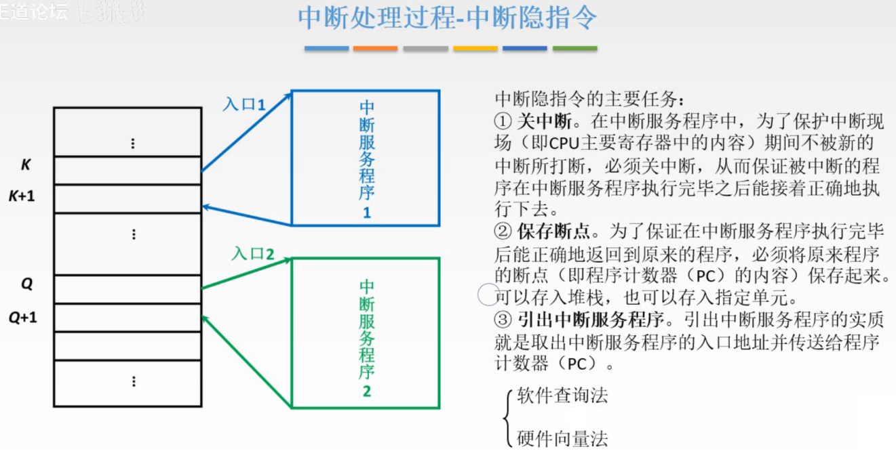

图9.中断隐指令

中断隐指令的主要任务：

1. 关中断：

   当前正在执行K，转而去执行中断服务程序，结束后回来继续执行K+1，自然不止需要保存PC中的K+1，因为执行K时，当时的状态，比如一些中间结果可能存在一些寄存器中，在中断后回来继续执行K+1时还要用到，所以这些也要保存下来。
   而这个保存过程是需要不能被打断的，所以关中断，即保证保存当前状态这个期间的保存操作不会被打断，由此中断后回来还能正常继续运行。

   **注意**，中断隐指令进行的操作是关中断+第二点保存断点（PC），而并不包含保存寄存器中的内容的操作，寄存器中内容的保存是由中断服务程序来保存的。

   关中断，也就是不响应中断，至于什么时候再开中断，看后面单重中断和多重中断。

2. 保存断点：

   保存此时PC中的内容（断点）。
   可以用堆栈方式保存，也可以是存入指定单元保存。

3. 引出中断服务程序：

   实质就是把中断服务程序的入口地址放入PC中。
   有两种引出方法：
   采用软件的软件查询法，（知道就好）
   采用硬件的硬件向量法，（主要掌握）。

##### 2.3.1.1 硬件向量法

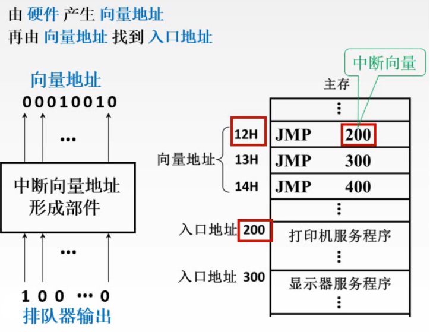

图10.硬件向量法-例子一

硬件向量法，

把不同中断服务程序的入口地址，统一的存在主存当中。
这些入口地址就叫做**中断向量**，该单元本身也有一个地址，叫做**向量地址**。

由中断向量地址形成部件，产生向量地址，再由向量地址中的内容指出中断向量。

图10例子，在中断判优中，讲过了，排队器会给出一个信号，该信号传递给中断向量地址形成部件，就会形成向量地址。
例如，假设排队器输出100...0表示按优先级现在应该考虑响应打印机的中断请求，于是中断向量地址形成部件输出打印机服务程序的向量地址0010010，通过向量地址找到中断向量，就能找到打印机服务程序的入口地址了。

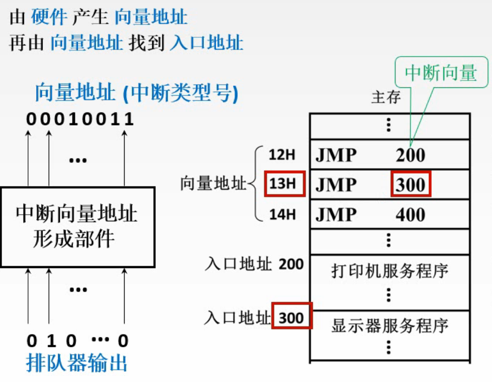

图11.硬件向量法-例子二

再举一个例子。

同样的，假设排队器输出的是010...0表示当前按优先级应该考虑响应显示器的中断信号，于是中断向量地址形成部件输出显示器服务程序的向量地址0010011，通过向量地址找到中断向量，就能找到显示器服务程序的入口地址了。

注意的是，有的系统中，中断向量地址形成部件不是直接给出向量地址，而是给出**中断类型号**，中断类型号和向量地址就是一个简单的**倍数关系**。

为什么要存向量地址这样间接找中断服务程序，而非一次直接找到呢？
因为采用间接这样的方式，向量地址是不用改变的，而其他的服务程序的地址、指令条数就可以方便的修改，修改后把入口地址存放入对应的向量地址就好了。

#### 2.3.2 中断服务程序

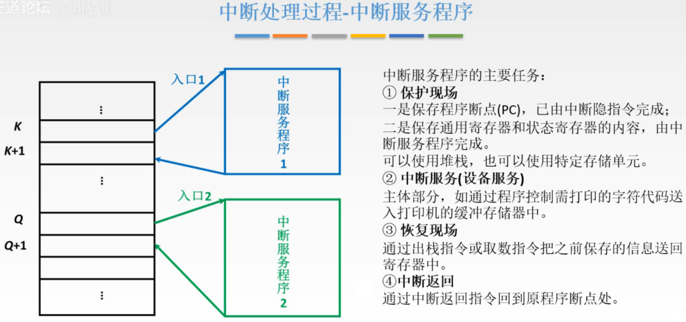

图12.中断服务程序

中断服务程序的主要任务：

1. 保护现场：

   保护现场分为两部分：
   一是保存程序断点（PC），已经由中断隐指令完成。毕竟软件无法保存PC的内容。
   二是保存通用寄存器和状态寄存器的内容，由中断服务程序完成。虽然执行中断服务程序一开始就覆盖了PC，但此时其他寄存器的内容是没有被修改的，所以再中断服务程序的开头就写上保存寄存器内容的指令，来保存。
   可以用堆栈方式保存，也可以是存入指定单元保存。

2. 中断服务（设备服务）：

   主体部分，

3. 恢复现场：

   把保护现场时保存的东西，送回寄存器。

4. 中断返回：

   通过中断返回指令返回原本程序断点处。中断返回指令作用就是把之前保存的PC中的内容放入PC中。

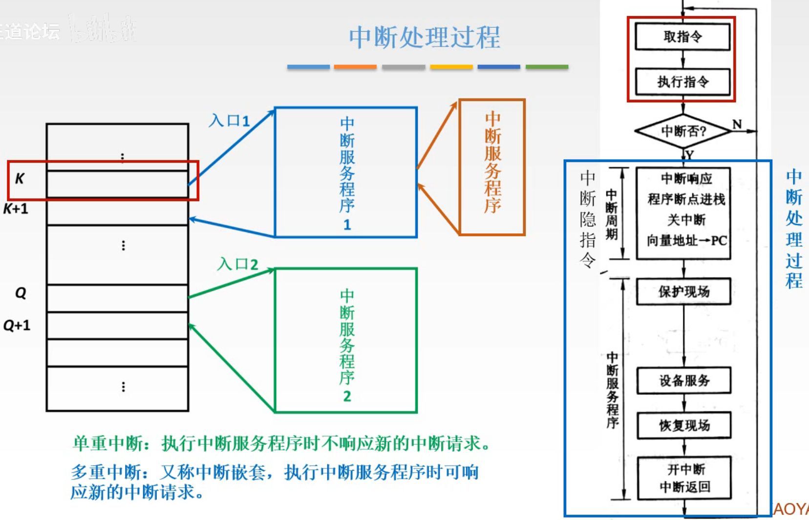

图13.中断处理过程

说一遍图13右侧的流程：

1. 取指令，
2. 执行指令，
3. 指令执行阶段结束的时刻判断，查询是否产生的中断，
   如果没有中断，就进入下一条指令
4. 如果有中断且CPU决定响应该中断，进入中断周期，中断周期也就是完成中断隐指令的任务，
5. 然后进入中断服务程序，
   保护现场，设比服务，恢复现场，中断返回，开中断。
   这里是以单重中断为例，所以这时才开中断。
   多重中断就不一样了，看下面单重中断和多重中断。

其中，中断隐指令（中断周期）+中断服务程序，这一阶段就是中断处理过程。

注意，图 13 中右侧写的是 " 向量地址 $\rightarrow$ PC "，是错误的。
由 2012 真题选择题判断，中断隐指令是**形成中断服务程序入口地址并送入 PC**。

注意到，实际上执行中断服务程序时，中断服务程序就变成了CPU现行程序，那么它是否还可以被中断呢？

**单重中断**：执行中断服务程序时不响应新的中断请求。
**多重中断**：又称中断嵌套，执行中断服务程序时可响应新的中断请求。

## 三. 单重中断与多重中断

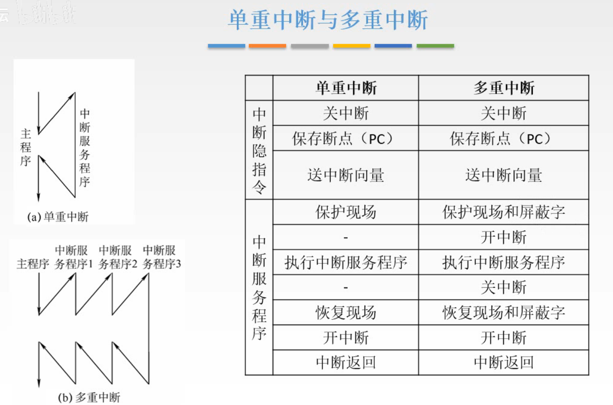

图14.单重中断与多重中断

详细对比一下单重中断和多重中断。

本质区别就是执行中断服务程序时能否响应新的中断请求。

单重中断的流程上面讲过了，这里就将多重中断：

1. 取指令，
2. 执行指令，
3. 指令执行阶段结束的时刻判断，查询是否产生的中断，
   如果没有中断，就进入下一条指令
4. 如果有中断且CPU决定响应该中断，进入中断周期，中断周期也就是完成中断隐指令的任务，
5. 然后进入中断服务程序，
   **保护现场和屏蔽字，**
   **开中断，**
   **执行中断服务程序**
   **关中断**，
   **恢复现场和屏蔽字**
   **开中断，**
   中断返回。

注意到，共同点，在保存与恢复的阶段都是关中断的状态，毕竟为了保存被打断程序能正常返回继续执行。
但执行中断服务程序过程中，多重中断是开中断的，因为要给打断的机会嘛。

多重中断多出来的屏蔽字，接着讲，中断屏蔽技术。

## 四. 中断屏蔽技术

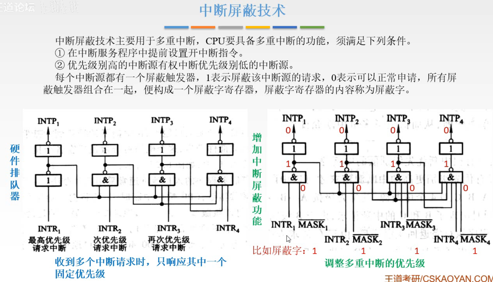

图15.

中断屏蔽技术主要用于多重中断，CPU要具备多重中断的功能，需要满足以下条件：

1. 在中断服务程序中提前设置开中断指令。

   显然嘛，不开中断都不响应的，的开中断才能多重中断呀。

2. 优先级高的中断有权中断优先级别低的中断源。

   如果不按优先级来，那谁都可以打断别人，中断频发的时候那不就无限中断下去了，发中断信号打断了我我又发了一个，你又发了一个......

这个优先级的管理，就叫做**中断屏蔽技术**。
每个中断源都对应一个**屏蔽触发器**，通常1代表屏蔽该中断源的请求，0代表可以正常申请。所有屏蔽触发器组合在一起，便构成了一个**屏蔽字寄存器**，其内容称为**屏蔽字**。

其电路实现：

如图15，左方是排队器的电路显示，在排队器上修改，加入了一个 $\overline{MASK}_i$ 信号，就增加了中断屏蔽功能。

CPU响应某个设备的中断请求后，将对应的屏蔽字发送到 $\overline{MASK}_i$ ，如图15右方图，发送的信号为1111，取反为0000，从而使 $INTP_1\sim INTP_4$ 都必为0，也就是它们的请求信号被屏蔽了。

通过调整屏蔽字，可以调整多重中断的优先级。

比如，如果屏蔽字信号是1011，那么第2个设备是没有被屏蔽的。

图16.屏蔽字设置的规律

总结屏蔽字设置的规律：

1. 一般用1表示屏蔽，0表示可以正常申请。
2. 每个中断源对应一个屏蔽字。
3. 屏蔽字中1越多，优先级越高。每个屏蔽字中至少有一个1（至少能屏蔽自己的中断）。

**屏蔽字例题**

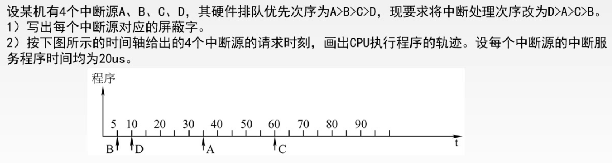

图17.例题

排队顺序是ABCD，要是的中断处理的次数改为DACB。

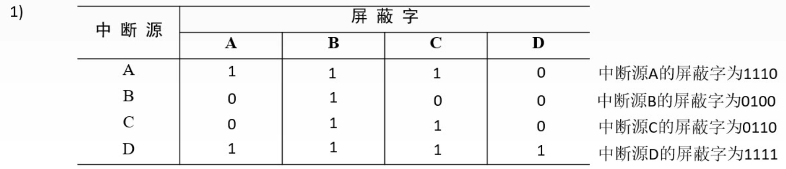

图18.例题第一问解答

第一问

A的排队顺序先，CPU把A的屏蔽字发送出去，中断顺序DACB，所以A的屏蔽字不能屏蔽A，要能ACB，所以为1110。

同理可得B的为0001，C为0110，D为1111。

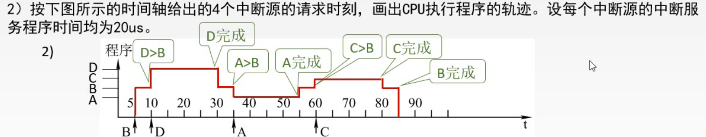

图19.例题第二问解答

第二问

5us，进入B，
10us，B被D打断，B共执行5us，因为中断顺序DACB，
30us，D完成，因为D的中断顺序最高，
35us，B被A打断，B共执行10us，
55us，A完成，
60us，B被C打断，B共执行15us，
80us，C完成，
85us，B共执行20us，B完成。

## 五. 本节回顾

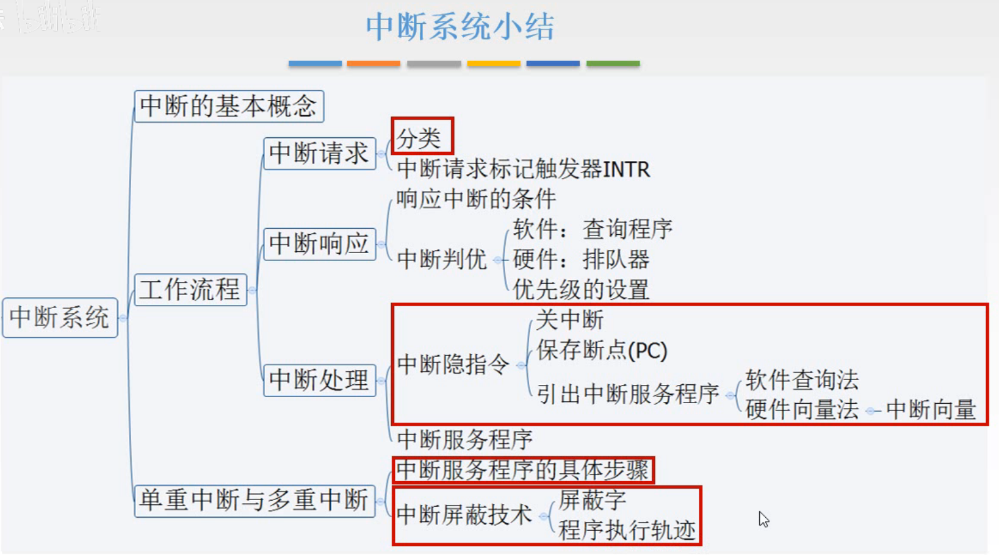

图20.本节回顾

2020.09.27

