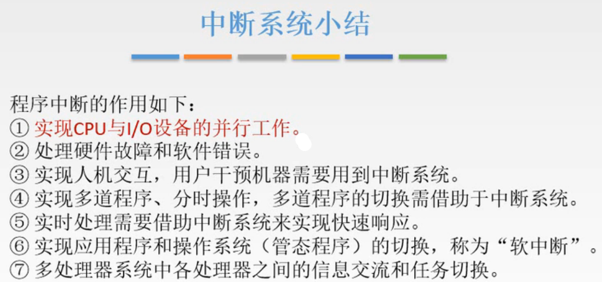
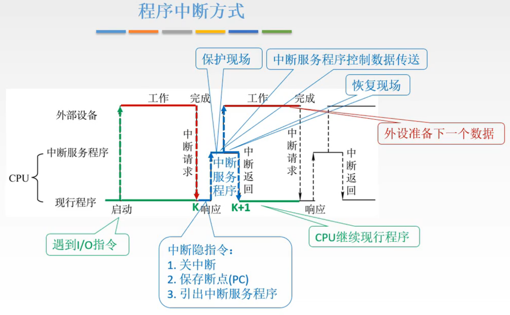
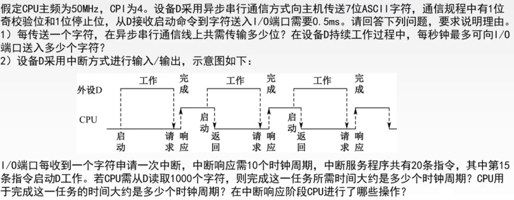
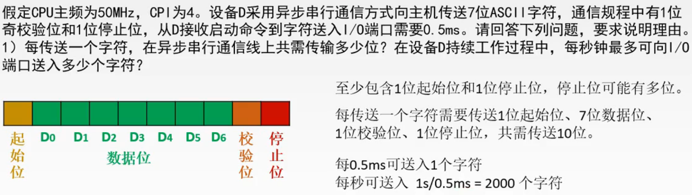
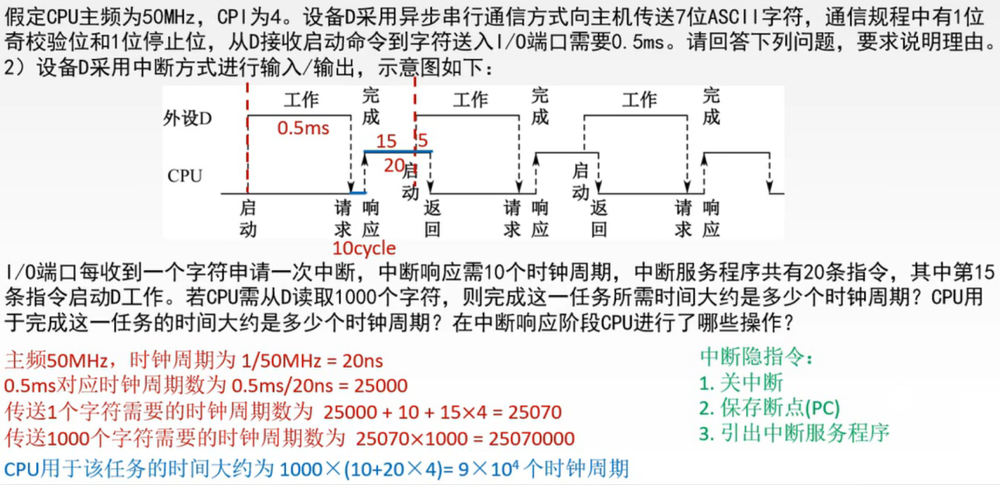

# 程序中断方式

上一节介绍了中断系统，这里就可以开始讲I/O方式中的程序中断方式了。

图1.中断系统小结

这里是中断系统的小结，我们就讲I/O系统中，I/O方式的，程序中断方式。
其他的自己念一念就好。

## 一. 程序中断方式流程

图2.程序中断方式

1. 一开始，CPU在执行某个现行程序，然后遇到了I/O指令，
2. 于是启动外设的工作，启动之后，CPU继续运行现行程序，外设同时在准备CPU想要的数据，
3. 外设准备好之后，向CPU发出中断请求，
4. CPU接收到中断请求后，假设正在执行K处的指令，先执行中断隐指令：关中断、保存断点、引出中断服务程序。
   中断隐指令由硬件完成。
5. 中断隐指令完成后，CPU执行中断服务程序，但中断服务程序开头首先是保存现场，然后才是控制本次数据传送，
6. 本次数据传送完成后，再次启动外设工作，准备下一次数据，同时进行恢复现场，再中断返回。
7. 中断返回后，CPU继续执行K+1处的指令。

一个小细节，第一次启动外设工作，与中间过程中数据传输的多次启动外设工作不同，
第一次启动是在现行程序中通过I/O指令来启动，中间过程中是在中断服务程序中来启动，
于是第一次通过I/O指令来启动，外设可能是还需要一段准备工作的，如果题目提到，要加上。

## 二. 例题

图3.例题

第一问，考的是通信总线的概念，第二问才是程序中断方式。

图4.例题解答-第一问

第一问。

首先，虽然题目没说有起始位，但是确实有起始位。
那为什么说了有停止位而没说有起始位呢，因为停止位可能为多位，所以题目说明了1位停止位。
（当然，如果题目真就这么没说起始位，求稳就两种情况都写一遍吧，如果考虑则为...不考虑则为......）

所以传递一个字符需要1位起始位+7位数据位+1位校验位+1位停止位=10位。

从D接收启动命令到字符送入I/O端口需要0.5ms，意思就是每0.5ms送入一个字符。
所以每秒送入1s/0.5ms=2000个字符。

图5.例题解答-第二问

第二问。

I/O端口每收到一个字符申请一次中断，也就是每0.5ms申请一次中断，

中断响应需要10个时钟周期，指中断隐指令这一段，

中断服务程序有20条指令，第15条启动I/O工作，于是剩下5条是用来恢复现场的。

题目问的是需要多少个时钟周期，所以显然先把ms，指令，换算成时钟周期。

主频50MHz，时钟周期为20ns，
0.5ms对应0.5ms/20ns=25000个时钟周期，
传送1个字符需要的时钟周期数为 $25000+10+15\times4=25070$ 个，
传送1000个字符则需要 $25070\times 1000=25070\times10^3$ 个时钟周期

这里我还晕了几秒，为什么没算入中断服务程序的后5条恢复现场的时间呢？
这里算的是外设启动到下一次外设启动为1个字符传递的时间。

对于CPU来说，CPU用于完成该任务的时间，其中CPU仅参与了中断隐指令+执行中断服务程序，于是CPU用于该任务的时间为 $(10+20\times 4)\times 1000=9\times10^4$ 个时钟周期。

中断响应阶段CPU进行了哪些操作，也就是中断隐指令的操作：关中断、保存断点、引出中断服务程序。

## 三. 本节回顾

看上一节的本节回顾。

2020.09.27

