# DMA方式

讲述I/O方式中的DMA方式。

## 一. 本节总览

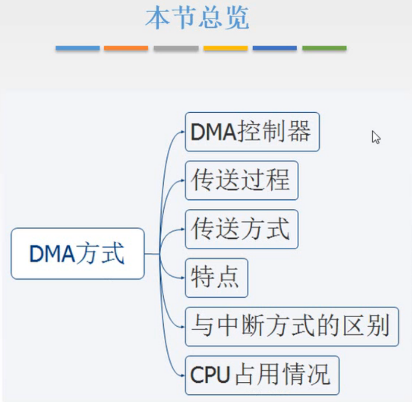

图1.本节总览

本节，先对程序中断方式的缺点进行讨论，由此引入DMA方式。

介绍DMA控制器。

介绍DMA方式的传送过程。

因为DMA控制器是能够自主的访问主存的，对于DMA控制器和CPU可能同时访问主存的情况设计了3种传送数据的方式来解决。

然后总结DMA方式的特点。

对比程序中断方式和DMA方式。

最后通过例题来计算CPU占用情况

## 二. DMA控制器

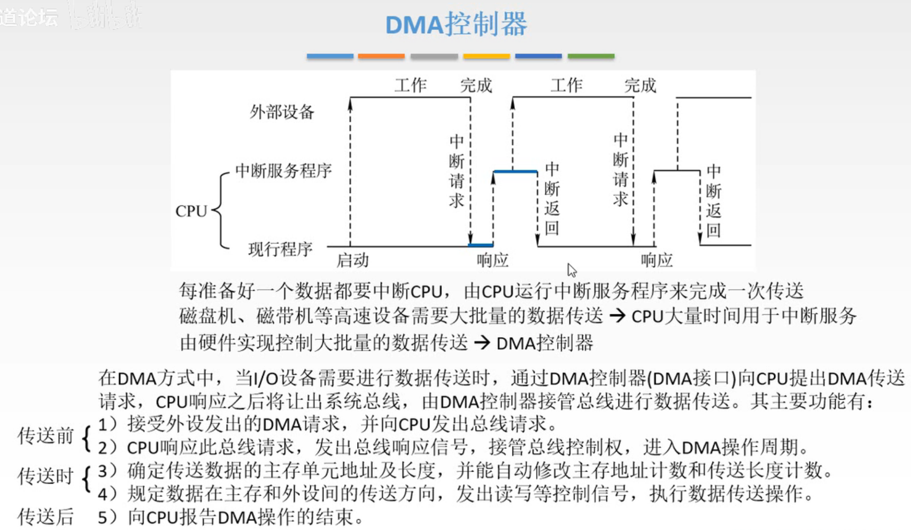

图2.DMA控制器

图2上方图为程序中断方式的流程图。

注意到程序中断方式，每传送一次数据，CPU就会中断一次，而如果遇上需要大量数据传输的情况，就会导致CPU大量时间用于中断服务，尤其是高速外设，准备时间短就越频繁打断CPU。

于是，将CPU控制数据传送的过程，交给一个专门的硬件-DMA控制器去做，CPU就不用管这个过程了。

**DMA控制器**，又叫DMA接口，指DMA方式下的I/O接口。

DMA方式的运行逻辑是，I/O设备通过DMA控制器向CPU提出DMA传送请求，CPU响应后将让出系统总线，由DMA控制器接管总线进行数据传送。
在DMA控制器控制数据传送的过程中，如果CPU不需要访存，那就可以进行自己的程序；如果CPU需要访存，则需要等待DMA控制器将系统总线使用权交还给CPU，再进行。

分析这个DMA控制器应该具有的功能：

传送前：

1. 能够接收外设发出的DMA请求，并向CPU发出总线请求。
2. CPU响应此总线信号，发出总线响应信号，接管总线控制权，进入DMA操作周期。

传送时：

3. 确定传输数据的主存单元地址及长度，并能自动修改主存地址计数和传送长度计数。
4. 规定数据在主存和外设间的传送方向，发出读写等控制信号，执行数据传送操作。

传送后：

5. 向CPU报告DMA操作结束。

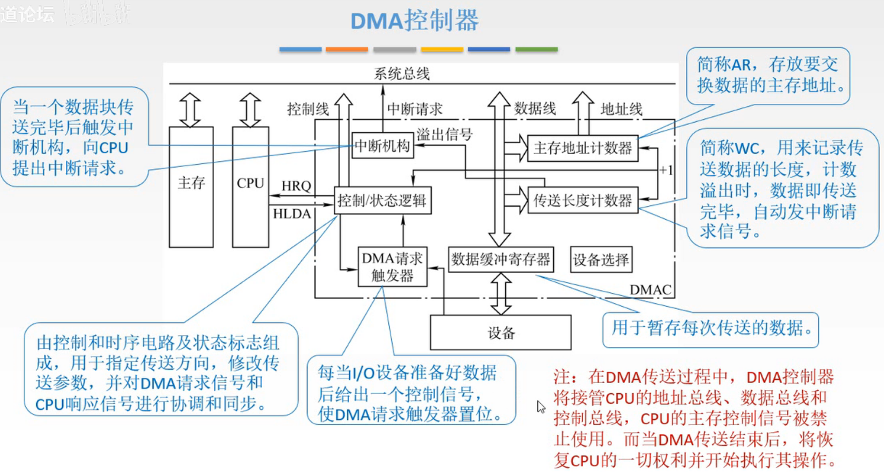

图3.DMA控制器内部结构

按照刚才分析的DMA控制器应该具备的功能，来看DMA控制器内部的结构，部件：

1. 控制/状态逻辑：

   DMA要能够接收各种请求，并且能够控制系统总线，所以要有一个控制/状态逻辑，由控制和时序电路及状态标志组成，用于控制整个传送过程，可以接收外设发来的DMA请求，可以向CPU发出使用总线的请求，并且之后主存地址计数器、传送长度计数器也是由它来修改。

2. DMA请求触发器：

   设备发送DMA到控制/状态逻辑，是先从设备发送控制信号到DMA请求触发器，使DMA请求触发器置位（置位，意思是写入1），控制/状态逻辑检测到DMA请求触发器变为1了，就会向CPU发出占用总线的请求。

3. 主存地址计数器AR：

   需要知道要传送的数据放在主存的哪个位置，或者即将要放到主存的哪个位置，通过主存地址计数器AR来存放该地址。

   每交换一次数据，AR 加 1，直到一批数据传送完毕为止。

4. 传送长度计数器WC：

   同样需要知道要传输的数据有多少个，由传送长度计数器WC（Word Count）记录，一般以补码值预置，每传送一个字，WC 加 1，当传送长度计数器 WC 溢出时（全为 0 时），表示传送该批数据传送完毕，自动向中断机构发送中断请求信号。
   如果以原码值预置，则是每传送一个字，WC 减 1 ，直到为 0 时表示该批数据传送完毕。自动向中断机构发送中断请求信号。

5. 数据缓冲寄存器BR：

   每次传送的数据要放到数据缓冲寄存器中。

6. 中断机构：

   当一个数据块，传送完毕后触发中断机构，向CPU发出中断请求。

   注意此处中断，与程序中断方式的中断是不一样的。
   程序中断方式中的中断，是为了让CPU来控制数据传送；
   这里的中断是告知CPU数据传送完毕了，让CPU看看还有没有事要做。

7. 设备选择：

   CPU用来选定一些外设的。

注意的是，在DMA传送过程中，DMA控制器接管CPU的地址总线、数据总线和控制总线，CPU的主存控制信号被禁止使用。当DMA传送结束后，将恢复CPU的一切权力并开始执行其操作。

这里补充一下<计算机组成原理>上的图：

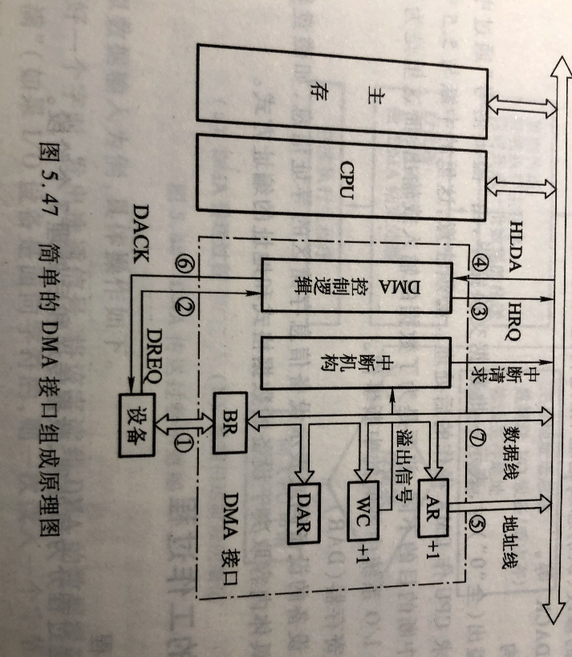

图4.简单的DMA接口组成原理图

<计组>中对这图的解释：

1. 主存地址寄存器AR：

   AR 用于存放主存中需要交换数据的地址。在 DMA 传送数据前，必须通过程序将数据在主存中的首地址送到主存地址寄存器。在 DMA 传送过程中，每交换一次数据，将地址寄存器的内容加 1，直到一批数据传送完毕为止。

2. 字计数器WC：

   WC 用于记录传送数据的总字数，通常以交换字数的补码值预置。在 DMA 传送过程中，每传送一个字，字计数器加 1，直到计数器为 0，即最高位产生进位时，表示该批数据传送完毕（如果交换字数以源码值预置，则每传送一个字，字计数器减 1，直到计数器为 0 时，表示该批数据传送结束。）于是 DMA 接口向 CPU 发出中断请求信号。

3. 数据缓冲寄存器BR：

   BR 用于暂存每次传送的数据。通常 DMA 接口与主存之间采用字传送，而 DMA 与设备之间可能是字节或位传送。因此 DMA 接口中还可能包括有装配或拆卸字信息的硬件逻辑，入数据移位缓冲寄存器、字节计数器等。

4. DMA 控制逻辑：

   DMA 控制逻辑负责管理 DMA 的传送过程，由控制电路、时序电路及命令状态控制寄存器等组成。每当设备准备好一个数据字（或一个字传送结束），就向 DMA 接口提出申请（DREQ），DMA 控制逻辑便向 CPU 请求 DMA 服务，发出总线使用权的请求信号（HRQ）。待收到 CPU 发出的响应信号 HLDA 后，DMA 控制逻辑便开始负责管理 DMA 传送的全过程，包括对主存地址寄存器和字计数器的修改、识别总线地址、指定传送类型（输入或输出）以及通知设备已经被授予一个 DMA 周期（DACK）等。

5. 中断机构：

   当字计数器溢出（全 " 0 "）时，表示一批数据交换完毕，由 " 溢出信号 " 通过中断机构向 CPU 提出中断请求，请求 CPU 作 DMA 操作的后处理。必须注意，这里的中断是为了报告一批数据传送结束。

6. 设备地址寄存器DAR：

   DAR 存放 I/O 设备的设备码或表示设备信息存储区的寻址信息，如磁盘数据所在的区号、盘面号和柱面号。具体内容取决于设备的数据格式和地址的编址方式。

**注意**，从<计组>书上的图（图4）中，DMA 与 CPU 使用的是同一总线。而并没有一个独立与总线的 DMA 总线存在。
有点奇怪。明明前面总线分类里的三总线结构，包括<计组>书上说：

>主存总线用于 CPU 与主存之间的传输；I/O 总线供 CPU 与各类 I/O 设备之间传递信息；DMA 总线用于高速 I/O 设备（磁盘、磁带）等与主存之间交换信息。在三总线结构中，任一时刻只能使用一种总线。主存总线与 DMA 总线不能同时对主存进行存取，I/O 总线只有在 CPU 执行 I/O 指令时才能用到。

而且<计组>书上在三总线结构的图也是和王道视频的图一样，在主存与 I/O 接口之间确实画了一条 DMA 总线。
那么，感觉在主存和 I/O 设备之间，确实应该是有一条真实存在的 DMA 总线的。

不过这里有一点奇怪，既然通路是相互独立的，为什么还要 " 在三总线结构中，任一时刻只能使用一种总线 " 呢。

在王道的习题里有一道题：

>问：在 DMA 方式下，主存和 I/O 设备之间有一条物理通路相连吗？
>
>答：没有。通常所说的 DMA 方式在主存和 I/O 设备之间建立了一条 " 直接的数据通路 "，使得数据在主存和 I/O 设备之间直接进行传送，其含义并不是在主存和 I/O 设备之间建立一条物理直接通路。而是主存和 I/O 设备通过 I/O 设备接口、系统中线及总线桥接部件等相连，建立一个信息可以相互通达的通路，这在逻辑上可视为直接相连的，其 " 直接 " 是相对于要通过 CPU 才能和主存相连的这种方式而言的。

所以，其实 DMA 总线，只是一个逻辑上的总线。

这样也解释一半，为什么 " 在三总线结构中，任一时刻只能使用一种总线 " ，因为 DMA 和 CPU 在逻辑上用的是不同的总线，但现实用的都是同一总线。

同样，在<计组>书上，DMA 停止 CPU 访问主存方式中，写的是：

> 当外设要求传送一批数据时，由 DMA 向 CPU 发送一个停止信号，要求 CPU 放弃地址线、数据线和有关控制线的使用权。在数据传送结束后，DMA 通知 CPU 可以使用主存，并把总线使用权交回给 CPU。

也印证了 DMA 与 CPU 使用的是同一物理总线。

现在应该确定了 DMA 总线是逻辑上的。
但还是无法确定 I/O 总线是否是逻辑上的。

由前面的内容：

> I/O 总线只有在 CPU 执行 I/O 指令时才能用到。
>
> 在三总线结构中，任一时刻只能使用一种总线。
>
> 及王道习题的答案

可以猜测，I/O 总线也是逻辑上的？这样也就说明了为什么 " 任一时刻只能使用一种总线 "。
**不过不能确定**。
当然三总线的重点还是在 DMA 方式，而非 I/O 总线。

## 三. DMA传送过程

### 3.1 预处理

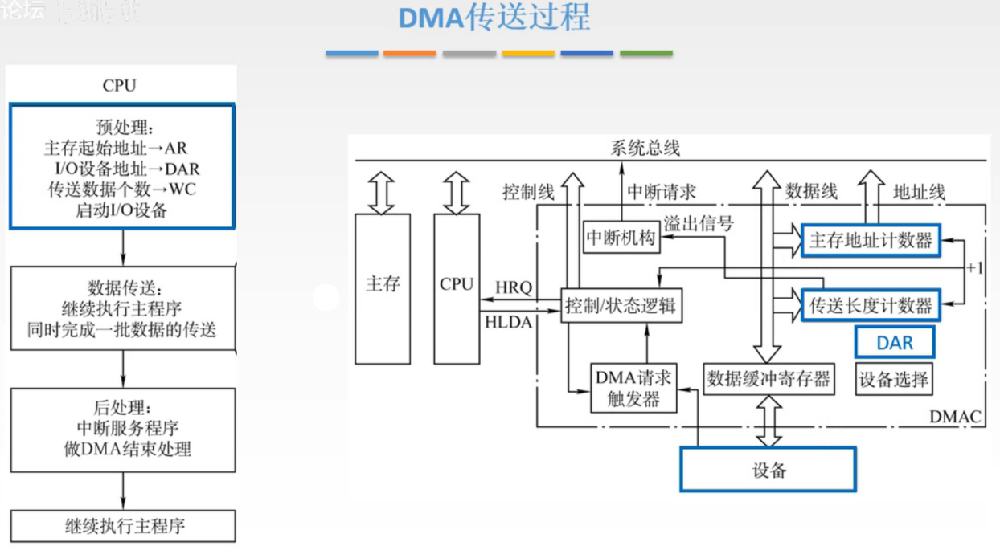

图5.预处理

预处理，由CPU来完成，主要对一些值进行初始化。

把传送数据的主存起始地址放入主存地址计数器AR中，
I/O设备地址放入DAR中，
传送数据长度放入传送长度计数器WC中，
准备好后启动设备工作，开始把第一个数据写入到数据缓冲寄存器中，或从中取出。

### 3.2 数据传送

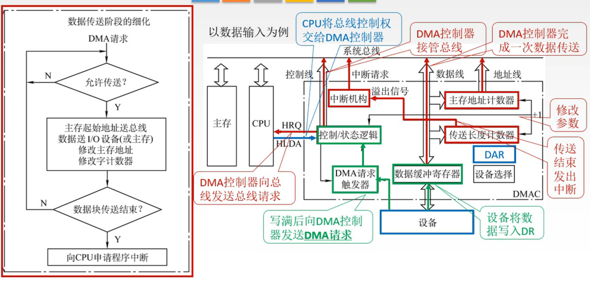

图6.数据传送

预处理后，CPU继续执行现行程序，由DMA控制器来完成本次数据传送。

以输入数据为例：

1. 设备把要传送的数据写入到数据缓冲寄存器中，
2. 写满后，向DMA控制器发送DMA请求，控制信号通过DMA请求触发器，达到控制/状态逻辑，注意是**外部设备**发出的DMA请求
3. 控制/状态逻辑，向CPU发出HRQ信号，即总线请求。
   有时候也会把 " 设备对DMA发送DMA请求，DMA对CPU发送总线请求 " 统称为DMA请求。
4. CPU接收到总线请求后，会判断是否要响应DMA请求，
5. 如果响应的话，CPU发出HLDA信号，表示响应该请求，并将总线控制权交给DMA控制器，
6. DMA控制器就可以控制总线了，
7. 通过地址线传出主存地址计数器AR中的地址，确定数据要传送到的主存地址，
8. 通过数据线完成一次数据传送，
9. 修改参数，也就是修改主存地址计数器AR，和传送长度计数器WC，
10. 修改参数后，需要判断传送长度计数器WC中的值，如果发送溢出，就会触发中断机构，
11. 触发中断机构，中断信号就会通过系统总线传到CPU，CPU就知道这个数据块，的传输就结束了。

后面就是进入后处理。

### 3.3 后处理

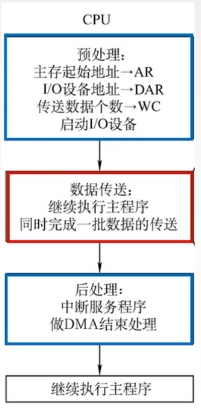

图7.后处理

后处理，CPU响应了中断机构的中断请求，进行了一个中断服务程序。

该中断服务程序的主要内容是，一方面是检验一下刚才的数据传送有没有错误，检验方法就是依靠校验位来检验；另一方面是如果CPU还有一块数据仍然需要这个设备进行传送，那么就在这个中断服务程序中进行下一次的预处理。

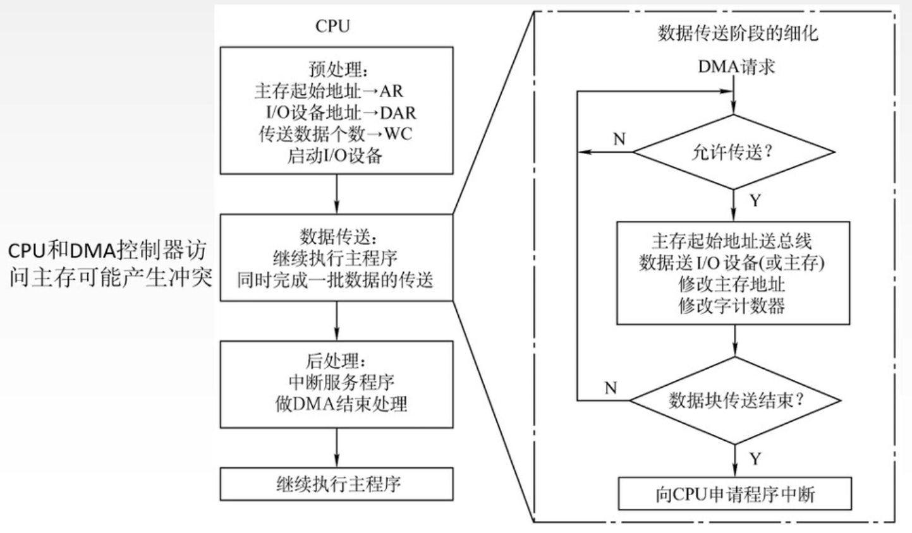

图8.总流程

图8就是总的流程图了。

可以发现，当DMA控制数据传送时，CPU在执行的程序也可能需要访问主存，由此产生冲突。

设计了3中方案来解决这个问题。

## 四. DMA传送方式

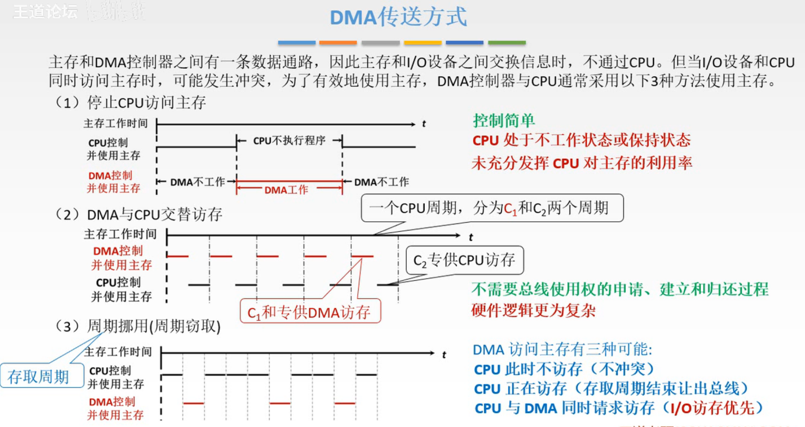

图9.DMA传送方式

当DMA控制器与CPU都需要访存时：

1. 停止CPU访问主存

   DMA工作，CPU不工作（我觉得不工作太绝对了，应该是不访存吧），等待DMA完成后才工作。

   <计组>书上是，当外设要求传送一批数据时，由 DMA 向 CPU 发送一个停止信号，要求 CPU 放弃地址线、数据线和有关控制线的使用权。在数据传送结束后，DMA 通知 CPU 可以使用主存，并把总线使用权交回给 CPU。

   控制简单，
   但CPU处于不工作状态或保持状态，未充分发挥CPU对主存的利用率。

2. DMA与CPU交替访存

   把一个CPU周期分为 $C_1$ 和 $C_2$ 周期， $C_1$ 由DMA访存， $C_2$ 由CPU访存。

   不需要总线使用权的申请、建立与归还过程，
   但硬件逻辑更为复杂。

3. 周期挪用（周期窃取）

   当DMA需要访存时，CPU让出一个或多个周期给DMA访存。所以此处周期挪用，周期指存取周期。

   就是三种情况：
   CPU此时不访存，那就DMA用；
   CPU此时正在访存，等CPU本次存取结束就给DMA用；
   CPU和DMA同时请求访存，DMA优先。

## 五. DMA方式的特点

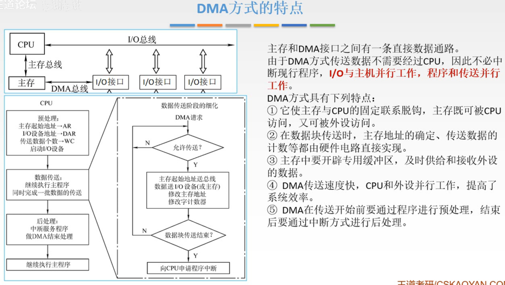

图10.DMA方式的特点

图10左上方为DMA方式的系统总线分布图，可见，高速外设的I/O接口和主存之间有DMA总线，DMA总线上有DMA控制器，DMA控制器可以自动地完成主存与I/O接口之间的数据传送。

总结一下DMA方式的特点：
啊自己看图10右方的特点吧，不想打一遍了。

在DMA方式下，**I/O与主机并行工作，程序与数据传送并行工作**。

## 六. DMA方式与中断方式

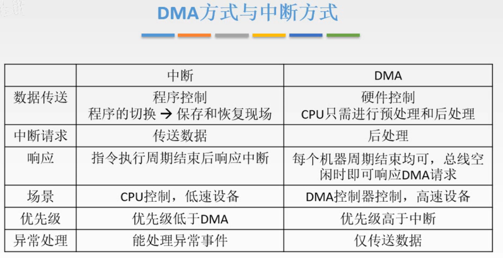

图11.DMA方式与中断方式对比

对于数据的传送：

程序中断方式：由中断服务程序控制，CPU进行现行程序与中断服务程序之间的切换，需要保持和恢复现场。
DMA方式：由硬件控制，CPU只需要进行预处理和后处理。

中断请求的目的：

程序中断方式：由CPU来控制数据的传送。
DMA方式：让CPU来进行后处理。

响应：

程序中断方式：只能在指令执行周期结束后响应。
**DMA方式：每个机器周期结束均可，总线空闲时（CPU不访存）即可响应DMA请求。**

根据<计组>上的DMA结构图（图4），只在中断机构发出的箭头标注了中断请求。所以我认为前面的 HRQ、HLDA 信号不是中断。
所以得出，DMA 方式中的中断是为了告知 CPU 数据传送完成，进行后处理。

使用场景：

程序中断方式：因为CPU直接控制，如果控制高速设备，会被频繁打断，所以多用于控制低速设备。
DMA方式：由DMA控制数据传输过程，控制高速设备。

优先级：

程序中断方式<DMA方式。
如果CPU同时受到中断请求和DMA请求，会优先响应DMA请求。

适用范围：

程序中断方式：中断本身是一种广泛应用的方式，能处理异常事件。
DMA方式：只专用于数据传送。

## 七. CPU占用情况

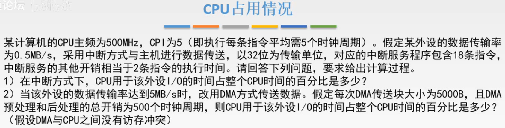

图12.例题

以例题的形式来看程序中断方式与DMA方式对CPU的占用情况。

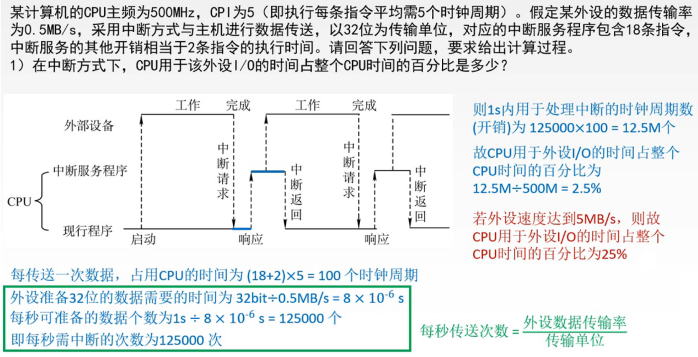

图13.例题解答-第一问

第一问，中断方式。

每次传送数据，占用到CPU的时间为 $(18+2)\times 5=100$ 个时钟周期。

传输一次数据的耗时 $\frac{4B}{0.5MB/s}=8\times10^{-6}s$ ，
时钟周期为 $\frac{1}{500MHz}=2\times10^{-9}s$ ，
可得，传输一次数据耗时 $\frac{8\times10^{-6}}{2\times10^{-9}}=4000$ 个时钟周期。其中100个周期为CPU控制进行数据传送。

于是CPU用于外设I/O的时间占整个CPU时间的百分比为 $\frac{100}{4000}=0.025$ 。

或者按图13来算，虽然我感觉没必要算1秒的。

新增问题，如果外设速度增加到5MB/s呢，那么CPU用于I/O的时间会占整个CPU时间的25%。
所以高速设备别用CPU控制啊。

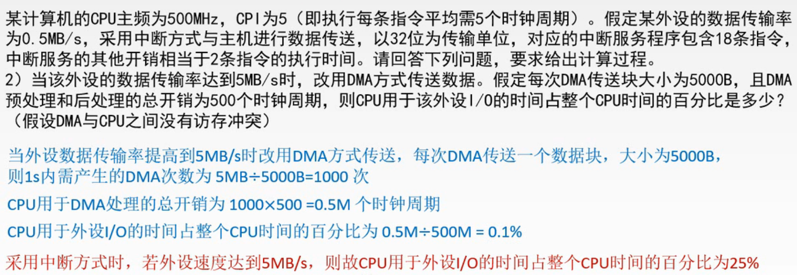

图14.例题解答-第二问

第二问，DMA方式。

外设速度变为了5MB/s。

DMA方式，传输5000B，传输部分耗时 $\frac{5000B}{5MB/s}=0.001s$ ，
转换为时钟周期为 $\frac{0.001s}{2\times10^{-9}}=500,000$ 个时钟周期。

CPU参与的预处理和后处理共耗时500个时钟周期。

于是本次传输CPU用于外设的时间占整个CPU时间占比为 $\frac{500}{500,000+500}=\frac{1}{1001}=0.1\%$ 。

图14还是按1秒来算的。

这里，图14中 $\frac{5MB/s}{5000B}=1000$ ，以及我自己，是将 M 当作 $10^6$ 。
感觉上，是认为 $5MB/s$ 是数据传送的，即通信方面的，所以认为单位是 $10^n$ ，而只有当指容量时，才认为单位是计组里的 $2^n$ 。

## 七. 本节回顾

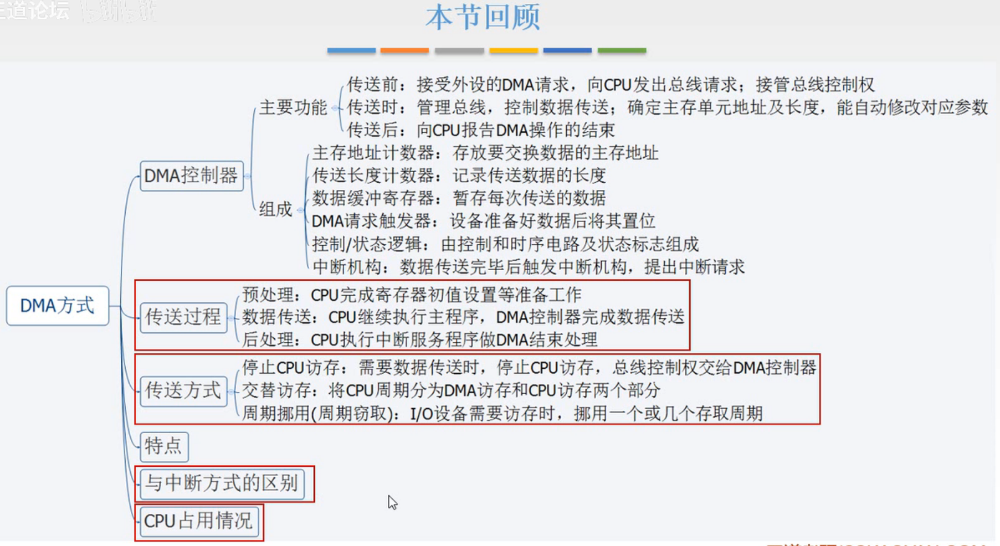

图15.本节回顾

2020.09.27

