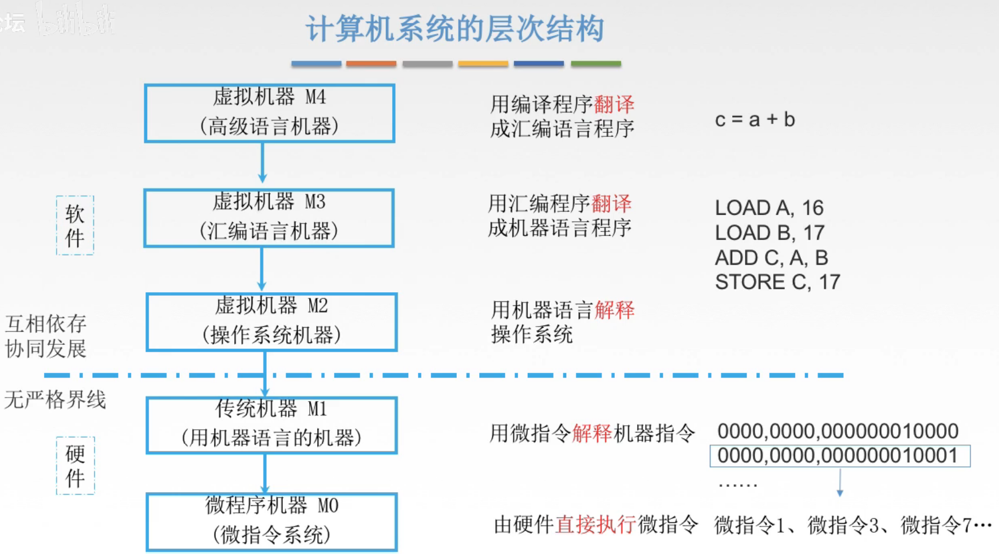

# 计算机系统的层次结构

## 一. 层次结构

图1.多层次结构的计算机系统

就是说本身只有一台计算机。

但是现在你可以想象成你有五台计算机，每台计算机只负责一种功能。

1. 虚拟机器M4（高级语言机器）：

   这台计算机的功能就是把我们写的高级语言翻译为汇编语言，然后传递给M3；

2. 虚拟机器M3（汇编语言机器）：

   接收到了汇编语言后，把汇编语言翻译为机器语言，然后传递给M2；

3. 虚拟机器M2（操作系统机器）：

   M3翻译得到的机器语言，还需要经过操作系统的调控，来执行；

   比如图中LOAD A，16；LOAD B，17这两步操作，如果不经过操作系统调控，会出现先读取的A被后读取的B覆盖了的情况。

4. 传统机器M1（机器语言机器）：

   接收到经过操作系统调控的机器指令，翻译为微指令，传给M0；

   可以发现机器指令其实很多都是重复的，比如0000代表LOAD，实际上0000是非常常用到的指令，但是每次都写0000就比较麻烦，机器指令还可以拆分为一条条微指令，于是将机器指令翻译为微指令，传递给M0；

5. 微指令机器M0（微指令系统）：

   接收到微指令，由硬件直接执行微指令。

但实际上啊，我们只有这一台计算机，而并非五台计算机，我觉得这里讲的意思就是说计算机的层次结构，各司其职，可以看作五台机器而已。

## 二. 冯·诺伊曼计算机的特点

1. 计算机由运算器、存储器、控制器、输入设备和输出设备五大部件组成；
2. 指令和数据以同等地位存放于存储器内，并可按地址访存；
3. 指令和数据均用二进制数表示；
4. 指令由操作码和地址码组成，操作码用来表示操作的性质，地址码用来表示操作数直在存储器中的位置；
5. 指令在存储器种按顺序存放。通常指令是顺序执行的，在特定条件下，可根据运算的结果或设定的条件改变执行顺序；
6. 机器与运算器为中心，输入输出设备与存储器之间的数据通过运算器完成。

2020.08.19