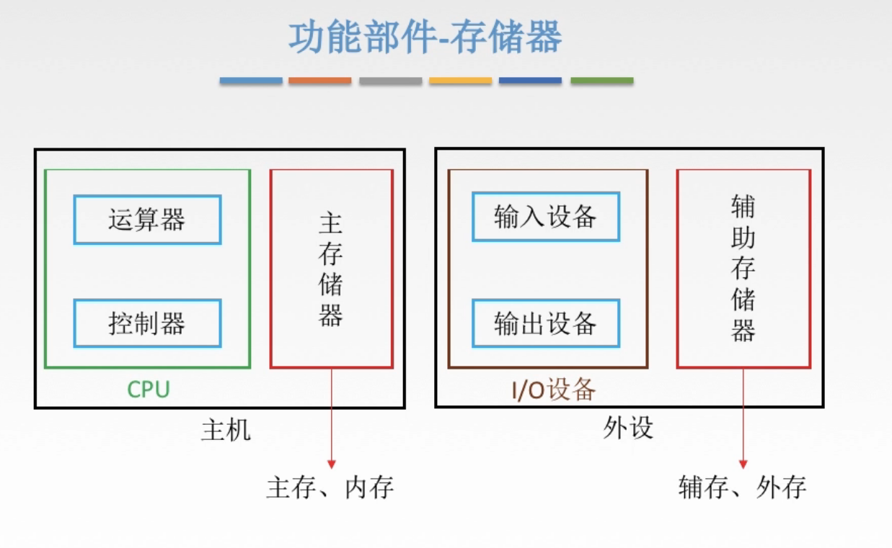
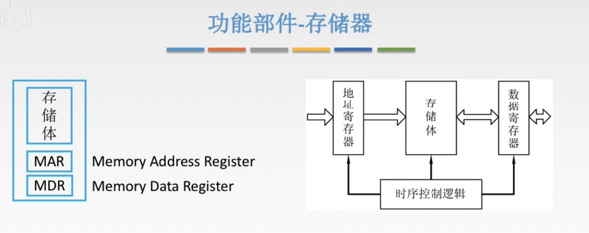
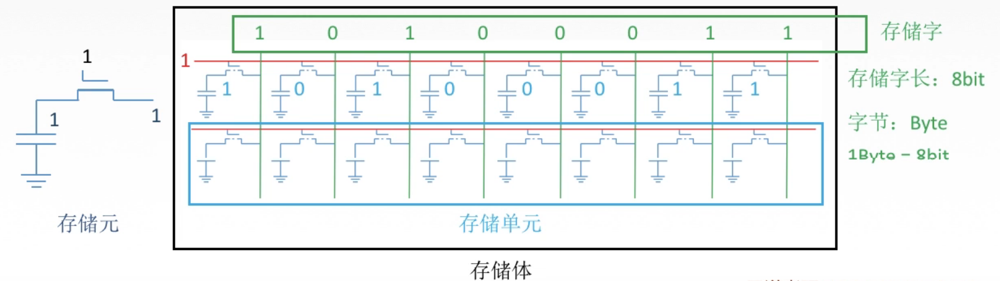
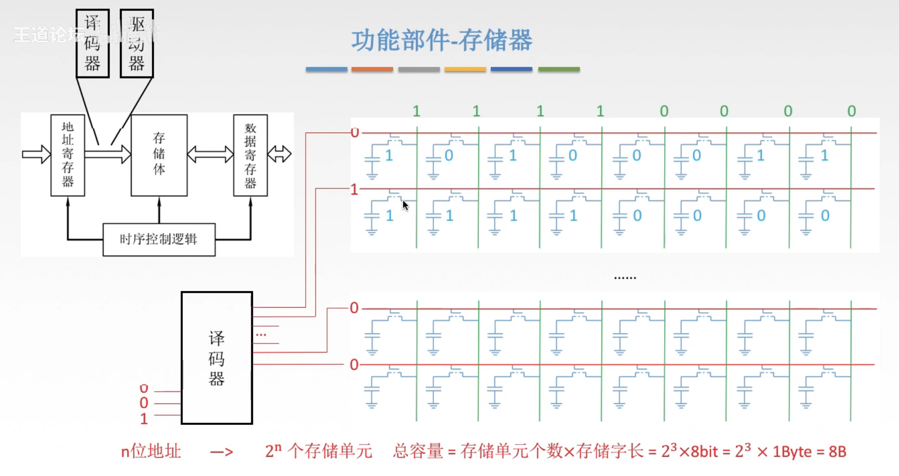
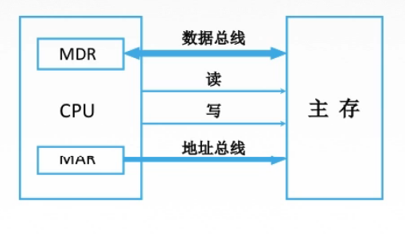

# 存储器

图1.回忆一下整体结构

这节内容主要讲主存。

其实辅存也可以看作是一种I/O设备。

图2.存储器结构

时序控制逻辑，现在暂且不用弄清是什么，只需要知道它的功能是完成整个流程的控制。

图3.

图3，左边是一个**存储元**，当我们要读取/写入数据时，发出信号，比如这里发出1代表读，然后电路接通，左边存储的1便传递到了右边的1。

那么把很多个存储元串联起来，比如图3右侧串联8个存储元，则一下就能读/写8位数据。当对红线发出读取指令1，电路连通绿线，存储元中的10100011便顺着绿线传递了出去，数据也就读取了出来。依照存储器的结构，也就传递到了MDR（数据寄存器）中。

这样，一次读取出来的存储元，叫做**存储单元**，即一个存储单元由多个存储元组成。
而很多的存储单元组成的，就叫做**存储体**。

一个存储单元读取出来的数据，叫做**存储字**，其位数叫做**存储字长**。
存储字长单位为，bit，位。图中存储字长为8bit。
另一个数据单位为，byte，字节。1byte=8bit，1字节=8比特。

so，存储字长也就基本决定了MDR的位数。

图4.

实际上在读取其中一个存储单元的数据时，需要给要读取的存储单元的红线通电1，而其他存储单元则全为0。
这是自然的，毕竟要确保读出来的数据确实是这个存储单元的，不然同时不止一个红线为1，那读出来的数据就乱了。

所以通过**译码器**来指定那条红线为1，其他都为0。

在图4中，假设存储体共有8个存储单元，于是译码器接入的红线有3根，因为 $2^3=8$ ，3根红线的0/1刚好足够一一对应存储单元的个数。
于是通过译码器，将输入的001，对应到将第2个存储单元为1，其余为0。

显然的，输入的地址位数（译码器接入红线根数）与存储单元的个数存在关系，即 **$n$ 位地址则对应有 $2^n$ 个存储单元**。

存储体的**总容量**，等于，存储单元个数 $\times$ 存储字长，也就是 $2^n\times$ 存储字长。

所以图4左上方的图中，在MAR和存储体之间，需要加入译码器和**驱动器**。

驱动器是干嘛的，因为读取要给很多红线供电，驱动器就是增强供电能力。
重点还是译码器，驱动器，知道就好。

图5.

虽说MAR，MDR在设计上是属于主存的。

但是在实际生活中实现的时候，MAR，MDR是做到CPU这块芯片里，所以会出现图5这种图。

但设计上还是输入主存的。

2020.08.19