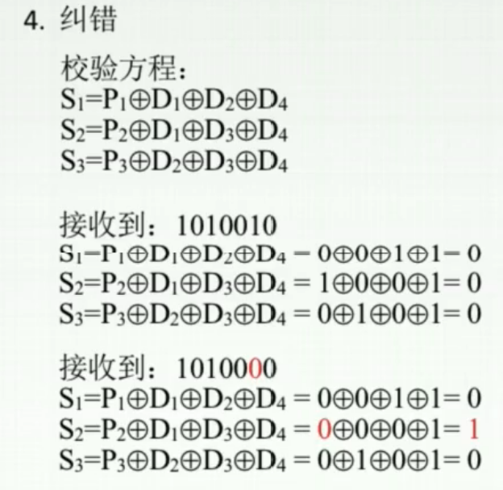
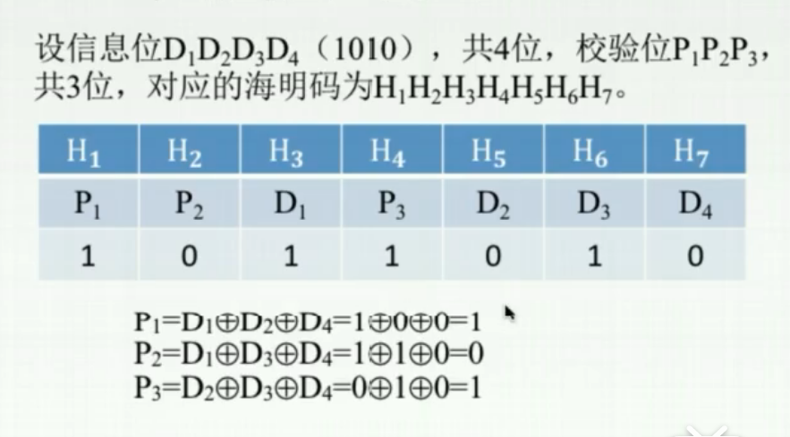

# 海明校验码

奇偶校验码，只能够告诉我们这一个数据错了，也就是说我们只能够知道这个数据整体有没有出错，但无法知道错的是这个数据中的哪一位。

于是为了不仅知道错了，还能知道错了哪一位数据，设计出了海明校验码。

先不说海明校验码，就说我们自己来设计。

**海明码的校验位应该用多少个**

假设一组数据有n个有效信息位，那么我们想要指出其中的出错位置，就需要k个校验位，使得 $2^k\geq n$ 对吧。

但是这样一来原本有n个有效信息位，加上k个指出错误位置的校验位，原本的数据长度就变为了n+k个，因为用来指出错误的k个校验位也会出错，所以k个二校验位应该也能指出n+k个位置的错误。
所以k应满足 $2^k\geq n+k$ 。

当然，也有可能数据传输过去根本就没有出错，就不需要指出哪一位错了，k个校验位应该显示为正常没有出错，比如使用0000代表数据无错。
所以k应满足 $2^k\geq n+k+1$ 。

**校验位的值**

假设有效性息位为 $D_4D_3D_2D_1$ ，校验位为 $P_3P_2P_1$ ，由D、P组成的海明码为 $H_7H_6H_5H_4H_3H_2H_1$ 。

可以想到，校验位的值自然不是随便填的，而是应该与整个信息正确与否相关，所以校验位的值应该是由有效信息位通过规定的计算方式计算得来。

于是在接收到数据后，通过对接收数据的有效信息位进行同样的计算，得出的校验位，与接收到的校验位对比，可以知道信息是否有出错。

而对比的方式就是异或，因为二进制代码的对比嘛，异或计算位相同返回0，不同返回1，是一个很方便的计算。
在这里新的校验位和接收信息中的校验位进行异或，同样也是3位二进制代码。而如果相同，异或结果为000。那么就可以想到，我们希望通过这个校验码的异或结果来表示出错位置。

**校验码的位置**

那么如果要采用异或结果来指出出错位置的话，意味着需要考虑这种情况，即：有效数据本身没有出错，但是校验位出错了。

当然这种情况下，异或结果不会是000，而同样是一个非000的二进制代码，于是，可以联想到，只要这个异或结果能够指向正确的出错位置，那么就能够达到校验的目的。

也就是说，如果只是校验位出错了，异或结果应该是指向出错的校验位的位置。

所以，校验位的位置必须要满足这种情况下的亦或的结果，而不能随意放置。

## 一. 海明校验码

我也懒得看证明过程了= =，下面就直接给结论吧。

### 1.1 海明码的位数

**k位校验位位数，应该满足** $2^k>n+k+1$ 。

**补充：**
**海明码纠错 $d$ 位，需要码距为 $2d+1$ 的编码方案；检错 $d$ 位，只需要码距为 $d+1$ 。** 

### 1.2 校验位的位置

假设有效性息位为 $D_4D_3D_2D_1=1010$ ，校验位为 $P_3P_2P_1$ ，由D、P组成的海明码为 $H_7H_6H_5H_4H_3H_2H_1$ 。以此为例。

校验位 $P_i$ 应该放置在 $2^{i-1}$ 位置上。
（即校验位只能在 $2^n$ 的位置，从 $2^0$ 位开始放，放完就行了。）

| $H_7$ | $H_6$ | $H_5$ | $H_4$ | $H_3$ | $H_2$ | $H_1$ |
| :---: | :---: | :---: | :---: | :---: | :---: | :---: |
|       |       |       | $P_3$ |       | $P_2$ | $P_1$ |

其余位置填上有效信息位：

| $H_7$ | $H_6$ | $H_5$ | $H_4$ | $H_3$ | $H_2$ | $H_1$ |
| :---: | :---: | :---: | :---: | :---: | :---: | :---: |
| $D_4$ | $D_3$ | $D_2$ | $P_3$ | $D_1$ | $P_2$ | $P_1$ |
|   1   |   0   |   1   |       |   0   |       |       |

### 1.3 校验位的值

把校验位插入后，对

凡是位置编号的二进制形式为，XXX1，的 $H_i$ 进行亦或，得到的值为 $P_1$ 的值；
凡是位置编号的二进制形式为，XX1X，的 $H_i$ 进行亦或，得到的值为 $P_2$ 的值；
凡是位置编号的二进制形式为，X1XX，的 $H_i$ 进行亦或，得到的值为 $P_3$ 的值；
凡是位置编号的二进制形式为，1XXX，的 $H_i$ 进行亦或，得到的值为 $P_4$ 的值......

其中进行异或 $\bigoplus$ 得到。

异或算法： $\begin{cases}0\bigoplus0=0\\0\bigoplus1=1\\1\bigoplus0=1\\1\bigoplus1=0\end{cases}$ ，相同为0，不同为1。 

图1.校验位的值

| $H_7$ | $H_6$ | $H_5$ | $H_4$ | $H_3$ | $H_2$ | $H_1$ |
| :---: | :---: | :---: | :---: | :---: | :---: | :---: |
| $D_4$ | $D_3$ | $D_2$ | $P_3$ | $D_1$ | $P_2$ | $P_1$ |
|   1   |   0   |   1   |   0   |   0   |   1   |   0   |

### 1.4 接收到信息的校验

对接收到的数据，
校验位 $P_1$ 和与刚才之对应的XXX1进行亦或，计算出 $S_1$ ，
校验位 $P_2$ 和与刚才之对应的XX2X进行亦或，计算出 $S_2$ ，
校验位 $P_3$ 和与刚才之对应的XXX1进行亦或，计算出 $S_3$ ，

由 $S_3S_2S_1$ 指出是否出错，如果出错指出出错位置。

图2.校验出错位置

知道哪一位错了之后，将其取反就行了。

有的时候例题会给的顺序是反着来的，那就顺序反一下计算就好了。

图3.顺序相反的例题

2020.08.21

全校验，指对整体进行校验，使得整体1的个数为奇数或偶数（奇偶校验）。
我遇到题说8位有效信息位，采用海明码，那就是4个海明码，题目说了一句 $P_{13}$ （指加上校验位后的最高位）采用全校验。
这里的意思是在海明码上在加上一位最高位，称为总校验位，用于奇偶校验，不指明的话，默认海明码是偶校验。

海明码：
不加总校验位，只能够检测到1位出错，并纠正。
加总校验位，能够检测到1位出错，并纠正；能够检测到2位出错，无法纠正。

2020.09.28

特地选择放置校验位 $P_i$ 的位置，使其位号可以以和的形式表示所有信息位 $H_i$ 的位号。
而指出出错位的 $S_n...S_1$ 中， $S_i$ 的位权与 $P_i$ 的位号相等。

（这是因为校验位 $P_i$ 都处于位号为 $2^n$ 处，二进制为 0001,0010,0100,1000,......）
（为了方便，下面以 [公式] 表示位号。）

即：$\begin{aligned} p(H_i)&=S_n\cdot p(P_n)+...+S_1\cdot p(P_1) \\&=S_n\cdot2^n+...+S_1\cdot2^1 \\S_n...S_2S_1&=S_n\cdot2^n+...+S_1\cdot2^1 \end{aligned}$， 其中 $S_j(1\leq j\leq n)=0或1$ 。

举例一，数据位出错：
例如，数据位 $D_2$ 的位号为 0101，则 $p(D_2)=1\cdot p(P_3)+1\cdot p(P_1)$ 。
可知，该数据位 $D_2$ 参与 $S_3,S_1$ 的异或计算， 所以当该数据位 $D_2$ 出错时，会导致 $S_3,S_1$ 等于 1。而 $S_3S_1$ 的位权等于 $P_3,P_1$ 的位号。

 $\begin{aligned} S_3S_2S_1 &=S_3\cdot 2^2+S_2\cdot 2^1+S_1\cdot 2^0\\&=1\cdot p(P_3)+1\cdot p(P_3)\\&=p(D_2) \end{aligned}$。 

举例二，校验位出错：
例如，校验位 $P_2$ 出错，$p(P_2)=p(P_2)$。 可知，该校验位 $P_2$ 只参与 $S_2$ 的异或计算， 所以当该校验位 $P_2$ 出错时，只会导致 $S_2$ 变为 1，使 $S_3S_2S_1=010$ ，即是：

 $\begin{aligned} S_3S_2S_1 &=0\cdot 2^2+1\cdot 2^1+0\cdot 2^0\\&=1\cdot p(P_2)\\&=p(P_2) \end{aligned}$ 。

2021.02.01