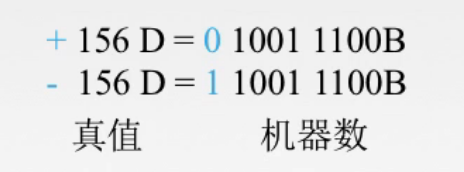
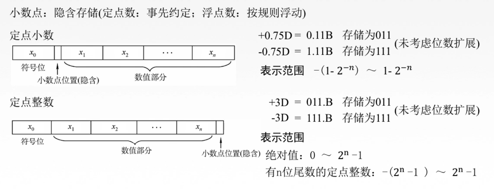
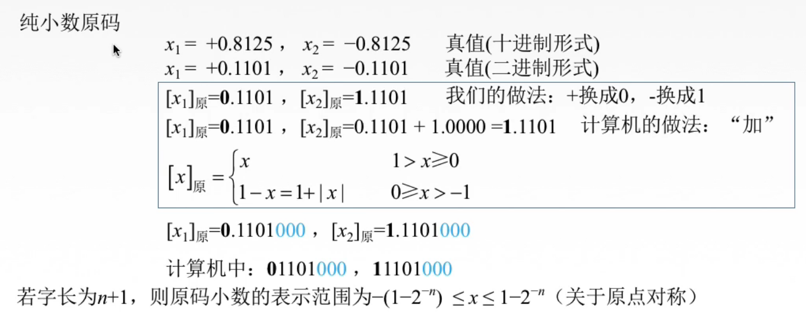
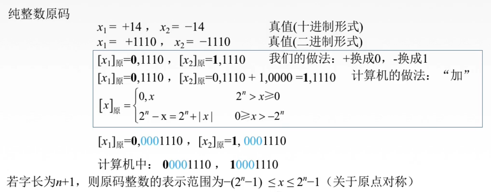

# 无符号数、原码

## 一. 无符号数

**无符号数**：没有符号的数，整个机器字长的全部二进制均为数值位，没有符号位。

因为全部位都用来表示数值，所以其能表示的数值范围就很好求了。

8位的二进制数：0000 0000（0）\~1111 1111（255）
16位的二进制数：0000 0000 0000 0000（0）\~1111 1111 1111 1111（65535）

## 二. 有符号数

真值：把带有+/-符号的数称为真值。

机器数：把符号"数字化"的数称为机器数。

图1.真值与机器数

定点数：事先约定好小数点的位置（也就是确定好小数点是在第几位后面），比其高位为整数部分，地位为小数部分。

浮点数：按照规则浮动。
double，float，这样按照规则计算表示的数吧，大概是因为采用科学计数法表示，所以给人小数点位置浮动的感觉？

图2.定点数

**定点小数**：指纯小数，小数点位置就在符号位之后。

1位符号位，n位数值位，表示范围（十进制）为： $-(1-2^{-n})\sim1-2^{-n}$ ，

这个范围，先算数值位，可以用等比数列求和算，也可以用高一位减去1的方法 $0.1111=1.0000-0.0001=1-2^{-n}$ 。然后符号位的正负算上就是 $-(1-2^{-n})\sim1-2^{-n}$ 啦。

定点小数原码的定义：$[x]_{原}=\begin{cases}x&0\leq x<1\\1-x&-1<x\leq0\end{cases}$ 。

**定点整数**：指存整数，小数点位置在有效数值位最低位之后。

1位符号位，n位数值位，表示范围（十进制）为： $-(2^n-1)\sim 2^n-1$ 。

定点整数原码的定义：$[x]_{原}=\begin{cases}x&0\leq x<2^n\\2^n-x&-2^n<x\leq0\end{cases}$ 。

图2里虽然画了小数点位置（隐含），但实际上并不真实存在着，只是为了方便理解才画的。实际没有真的存小数点。

图2里未考虑位数扩展的意思是，存储单元总不会就3位吧，如果是8位的话存的就是01100000了。

## 2.1 原码

原码：机器数中最简单的一种表示形式。
最高位为符号位，符号位为0表示正数，符号位为1表示负数，数值位即真值的绝对值。

为了书写方便，表意明晰，我们约定：

1. 用 $X$ 表示真值，用 $[X]_{原}$ 表示原码，用 $[X]_{补}$ 表示补码，用 $[X]_{反}$ 表示反码，用 $[X]_{移}$ 表示移码。

   就是 $X$ 表示真值，加个方括号 $[X]$ 表示机器数，再加个下标 $[X]_{...}$ 表示是哪一种机器数。

2. 用逗号隔开整数的符号位与数值位，小数点隔开小数的符号位与数值位。

   例如 $1,1110\quad1.1011$ 

图3.纯小数的原码

图3的说明：

将真值（十进制） 转换为真值（二进制），假设纯小数二进制的真值为 $x$ （注意啦是带符号的），

然后，当然作为机智的人，我们是直接把+/-写成0/1的，但是计算机没那么机智，

计算机根据+/-，进行不同处理，
如果+，则直接存储 $x$ ；
如果-，则存储（1- $x$ ），或者（1+| $x$ |）；

算完往后补全0到8位（假设是8位存储单元。

图4的说明：

将真值（十进制） 转换为真值（二进制），假设纯整数二进制的真值为 $x$ （注意啦是带符号的），

然后，当然作为机智的人，我们是直接把+/-写成0/1的，但是计算机没那么机智，

计算机根据+/-，进行不同处理，
如果+，则直接存储 $x$ ；
如果-，则存储（ $2^n-x$ ），或者（ $2^n+|x|$ ）；

算完往前补0至符号位后到8位（假设是8位存储单元）。

2020.08.24