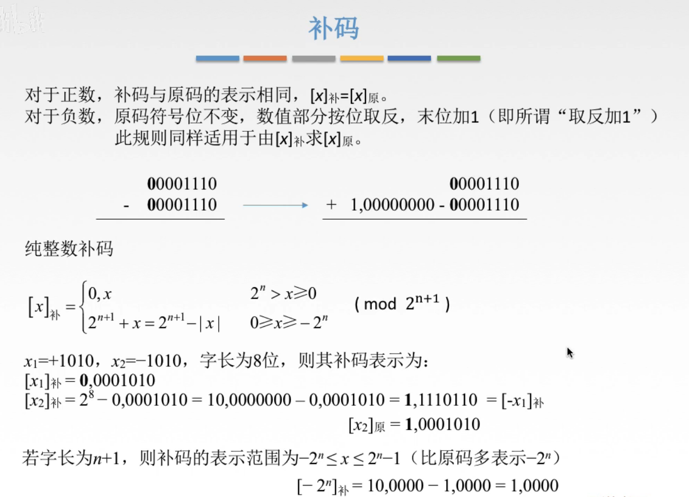
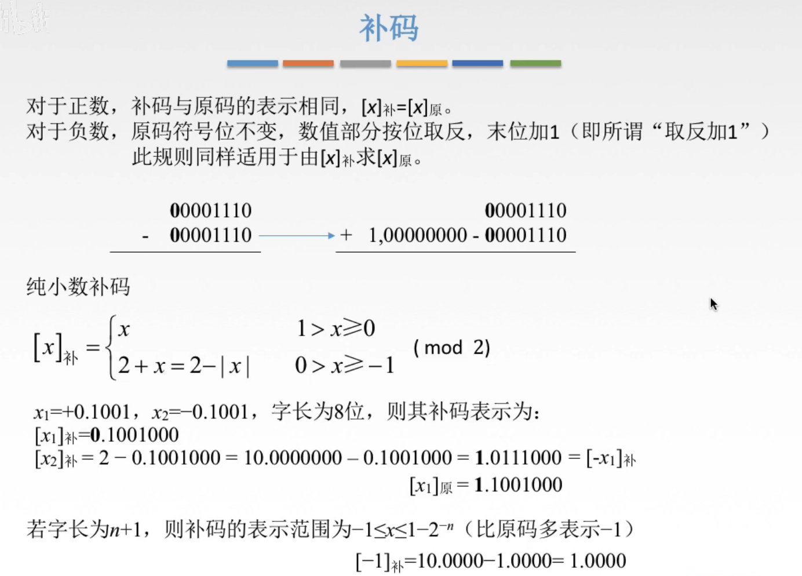
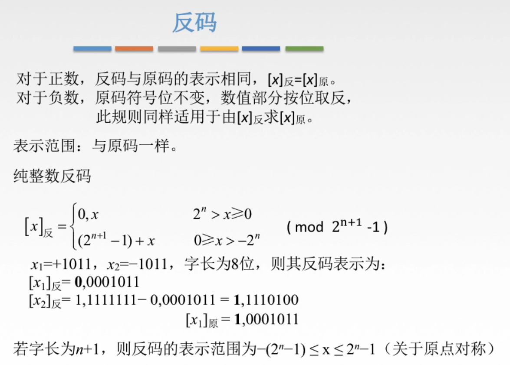
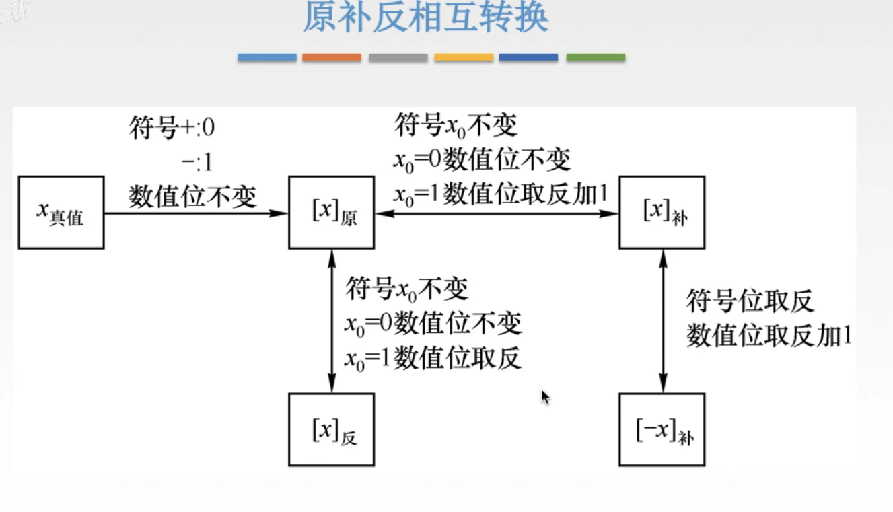
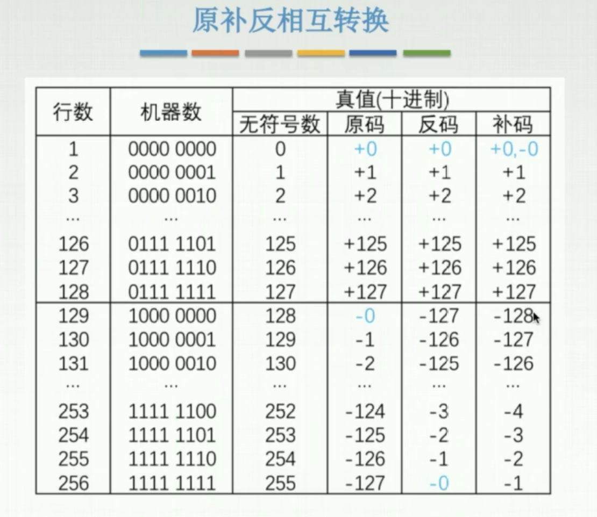
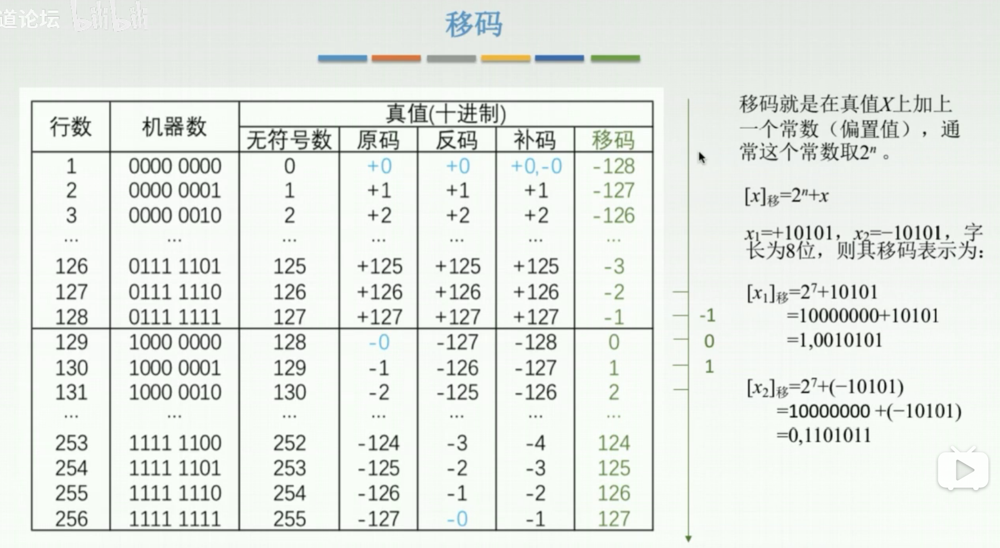
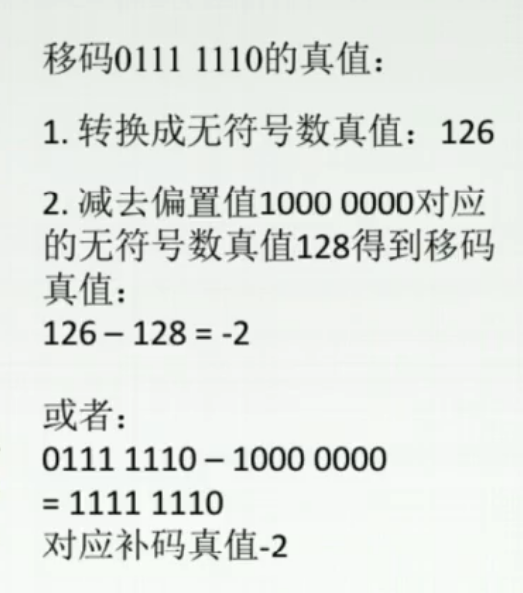
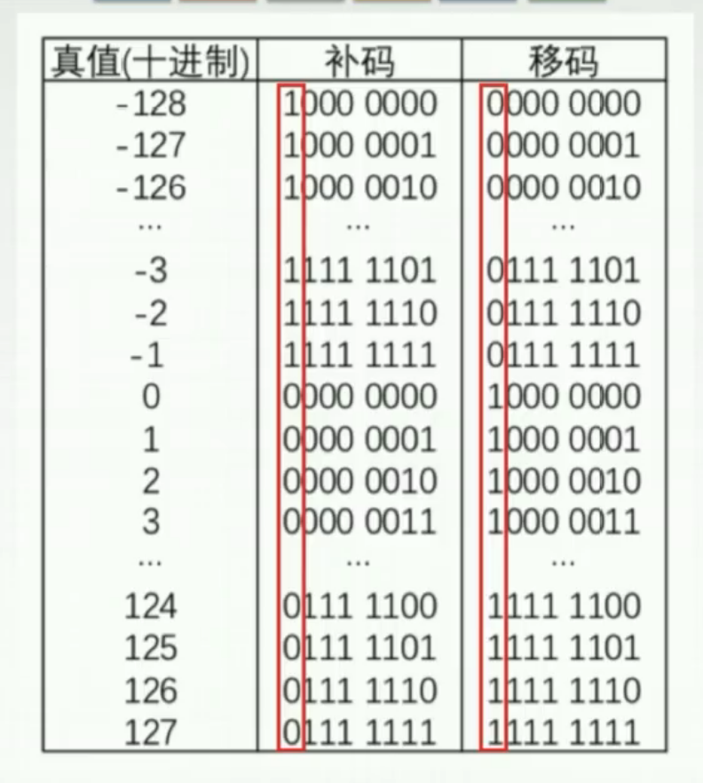

# 补码、反码、移码

## 一. 补码

**补码**：

正数，与原码相同；
负数，符号位与原码相同，数值位由原码取反末位+1。（同样适用于补码转原码）

转换：

1.   $[X]_{原}\rightarrow[X]_{补}$ ：正数不变；负数符号位不变，数值位取反末位+1。
2.   $[X]_{补}\rightarrow[X]_{原}$ ：同样的，正数不变；负数符号位不变，数值位取反末位+1。
3.   $[X]_{补}\rightarrow[-X]_{补}$ ：连同符号位一起全部取反末位+1。

**纯整数**：

纯整数补码的定义： $[x]_{补}=\begin{cases}0,x&0\leq x<2^n\\2^{n+1}+x&-2^n\leq x<0\end{cases}(\text{mod}\quad2^{n+1})$ ， 

图1.整数补码

图1最后，补码的表示范围，相比原码负数更负一个，是因为原码存在着0000 0000和1000 0000两个0，而补码的 $[1000\quad0000]_{补}=1000\quad0000$ ，定义为了 $-2^n$ ，而并未0。
所以比原码的 $-(2^n-1)$ 多表示一位数 $2^n$ 。

**纯小数**：

纯小数补码的定义： $[x]_{补}=\begin{cases}x&0\leq x<1\\2+x&-1\leq x<0\end{cases}(\text{mod}\quad 2)$ ， 

图2.小数补码

小数补码和整数补码都是一样的。都是原码取加一，包括 $[X]_{原}\leftrightarrow[X]_{补},[X]_{补}\leftrightarrow[-X]_{补}$ 也是同样的。

图2下面的表示范围， $[1.000\quad0000]_{补}=1.000\quad0000$ 定义为-1，所以比原码的 $-(1-2^{-n})$ 多表示一i个数-1。

## 二. 反码

**反码**：

正数，与原码相同；
负数，符号位与原码相同，数值位由原码取反。（同样适用于反码转原码）

反码就是原码转换补码的中间过渡。

纯整数反码的定义： $[x]_{反}=\begin{cases}0,x&0\leq x<2^n\\(2^{n+1}-1)+x&-2^n< x\leq0\end{cases}(\text{mod}\quad (2^{n+1}-1))$ ， 

图3.纯整数反码

反码表示范围与原码一样。
因为反码的 $[1111\quad1111]_{反}=0000\quad0000$ 和正数的0000 0000，也是共有两个0。

### 原补反相互转换图

图4.原补反相互转换图

图6.原补反表

图6可以看出。

原码、反码两个不同二进制对应着+0和-0，而补码的则只有一个0，于是补码多出一个二进制可以多表示一个数。

在正数，大家都一样。
在负数部分，原码是从-0开始到-127；反码因为取反嘛所以是-127到-0；补码则是反码+1，于是是-128到-1。

## 三. 移码

因为人们很难从补码直接判断其真值的大小，于是，移码就是为了方便比较两个数的大小。

可以看出，移码的排列大小顺序，是与二进制的大小顺序一致的。0000 0000（-128）\~1111 1111（127）。

图6.移码

实际上移码也就是在对真值上加上一个常数（偏置值， $2^n$ ，n 为数值位位数）， $[X]_{移}=2^n+X$ 。

或者说，将真值转换为移码，先将真值转换为补码，然后将其补码加上 $2^7 = 1000，0000$ （假定共 8 位）。

已知移码求真值：

图7.已知移码求真值

**移码与补码关系**

移码=补码符号位取反。

图7.移码与补码的关系

2020.08.24