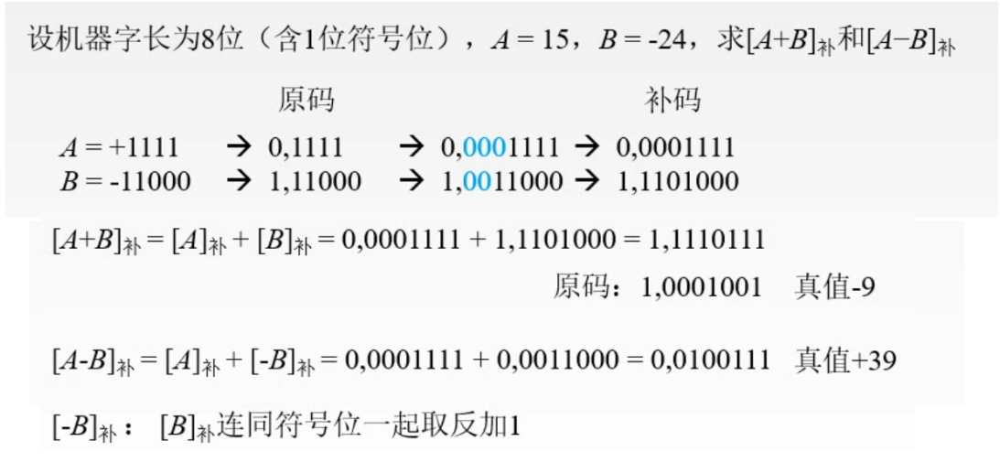
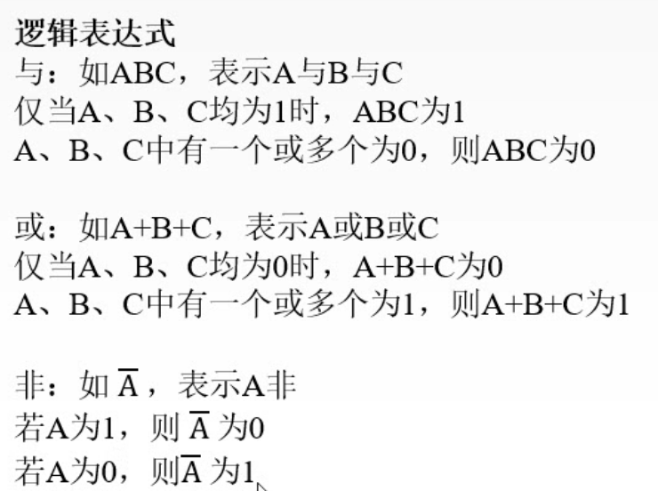
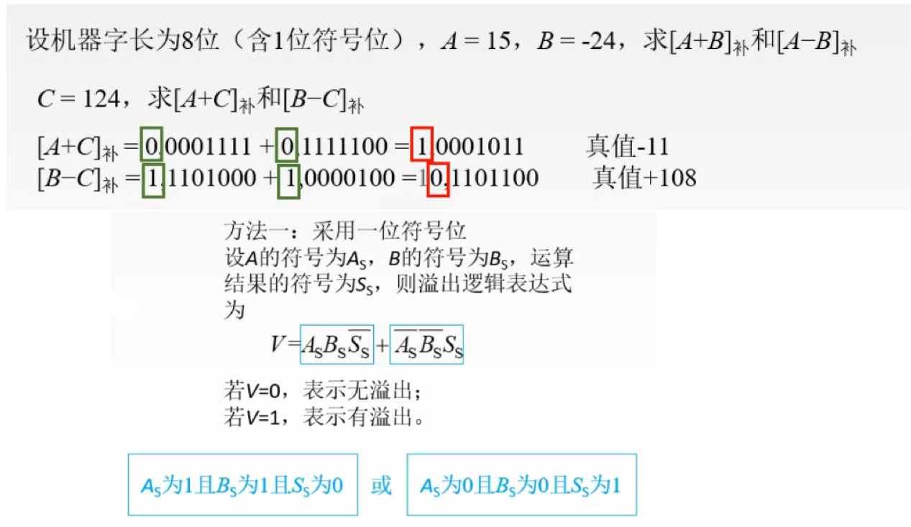
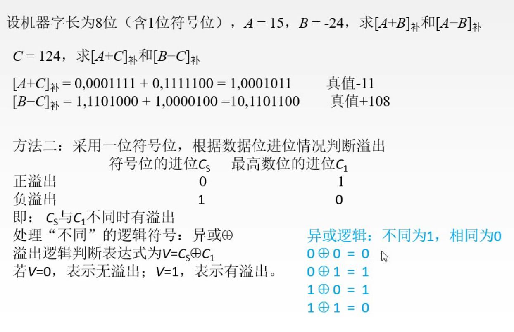
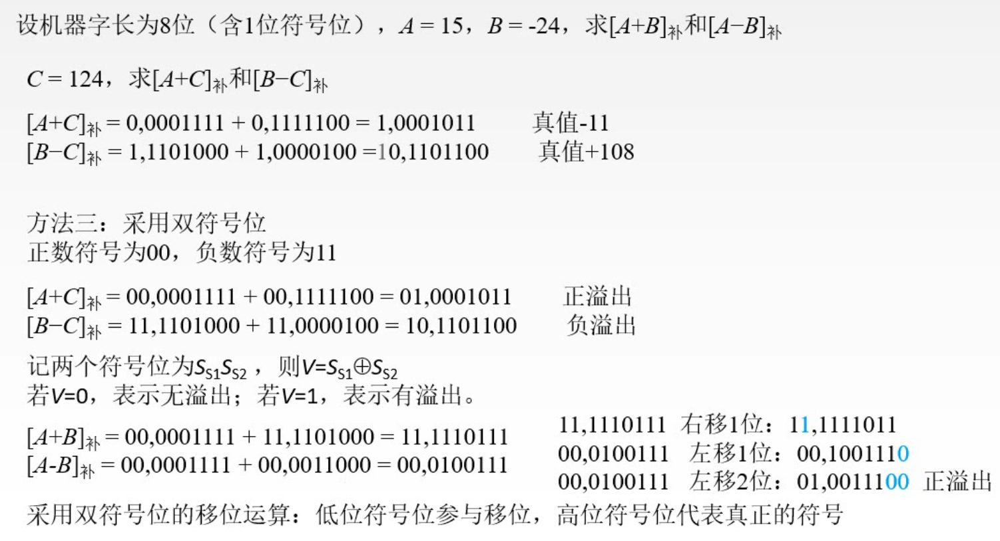
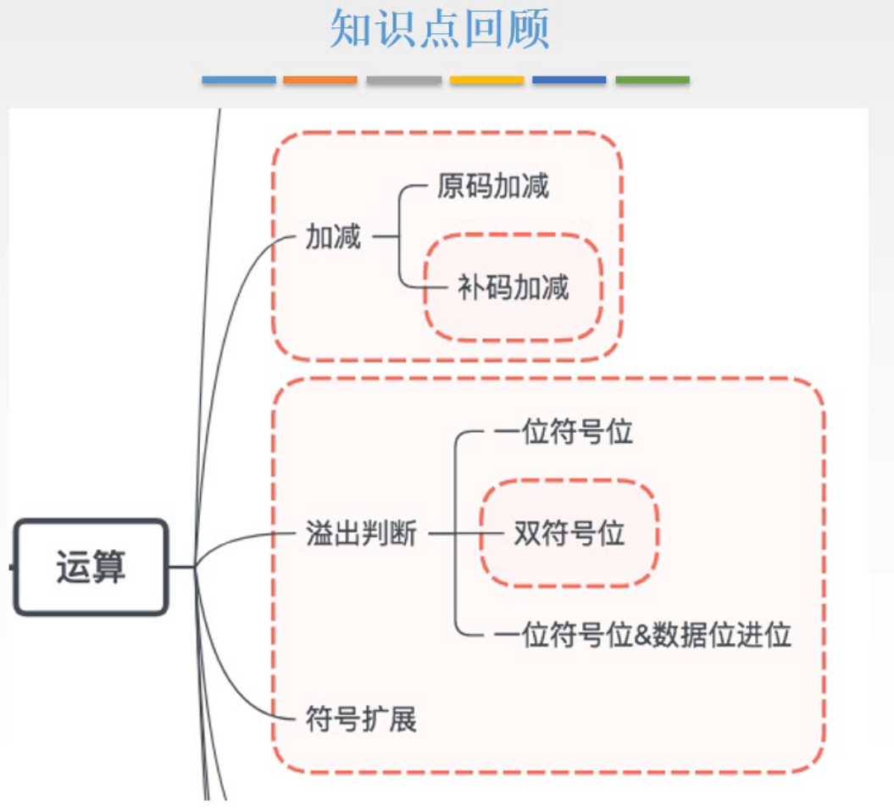

# 加减运算、符号扩展、溢出判断

## 一. 加减运算

### 1.1 无溢出的加减

前面提出了补码，而补码的主要作用就是，使得两个有符号数可以直接相加。

于是，在处理加减运算时，我们应该想到尽量写成 $x+y$ 的形式，然后计算 $[x]_{补}+[y]_{补}$ 。
就算是 $-x,-y$ ，也可以写成 $[-x]_{补}+[-y]_{补}$ ，然后 $[X]_{补}\rightarrow[-X]_{补}$ ：连同符号位一起全部取反末位+1。

图1.加减运算例题

### 1.2 符号扩展

同时，这个例题中，因为真值转换原码，二进制长度不足一个机器字长，所以进行**符号扩展**，也就是添0/1，使其长度为一个机器字长。

原码：
正数，数值位高位添0；
负数，数值位高位添0。

补码：
正数，数值位高位添0；
负数，数值位高位添1。

### 1.3 溢出问题

溢出又分为正溢出（上溢），负溢出（下溢）。
顾名思义就是，超过了正数上限，超过了负数下限。

有三种方法来处理溢出情况。

#### 1.3.1 用一位符号位判断溢出

对于加法，只有正数+正数，负数+负数才可能溢出。
对于减法，只有正数-负数，负数-正数才可能溢出。

当然减法可以转换为加法，总结就是，加法上，两个数的符号位同号才可能溢出。

这里首先补充一下逻辑表达式。

图2.逻辑表达式

判断溢出：

图3.判断溢出

采用逻辑表达式 $V=A_sB_s\overline {S_s}+\overline{A_s}\overline{B_s}S_s$ ，若 $V=1$ ，溢出；若 $V=0$ ，无溢出。

实际上就是把两种溢出情况描述了一遍。
 $A_sB_s\overline {S_s}$ ：当 $A_s,B_s$ 都为1，且 $S_s$ 为0时， $A_sB_s\overline {S_s}=1$ ，溢出。
 $\overline {A_s}\overline {B_s}S_s$ ：当 $A_s,B_s$ 都为0，且 $S_s$ 为1时， $\overline {A_s}\overline {B_s}S_s=1$ ，溢出。
然后两个又是或+的关系，所以 $V=1$ 表示溢出。

#### 1.3.2 采用一位符号位，根据数据位进位情况判断

图4.进位判断

观察可知，当符号位进位与最高数位进位分别为0，1时，会出现溢出情况。

于是采用逻辑表达式 $V=C_s\bigoplus C_1$ 判断溢出， $V=1$ ，溢出； $V=0$ ，无溢出。

#### 1.3.3 双符号位判断

图5.双符号位判断

双符号位，也就是在符号位这里采用的是两个符号位来判断符号。
00代表正数，11代表负数。

注意的是，实际上在计算机存储中仍然是只存储一个0/1的，毕竟存00/11和0/1也没啥区别。
但是在运算的时候，符号位的0/1会并行的送到两个用于符号位的单元中，就变成了00/11。

双符号位判断溢出，显然溢出会导致双符号变为01/10的情况。
采用逻辑表达式 $V=S_{s1}\bigoplus S_{s2}$ ，若 $V=1$ ，溢出； $V=0$ ，无溢出。

另一点，采用双符号位时，进行移位运算时，高位的符号位不参与移位运算，而低位的符号位是参与移位的。

## 本节知识点回顾

图6.本节知识点回顾

2020.08.26