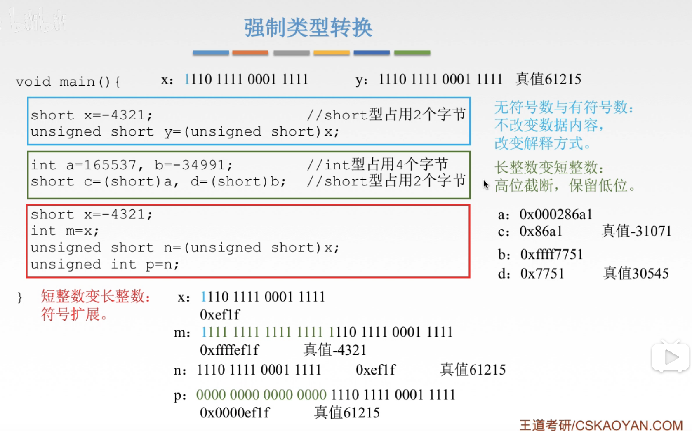

# 强制类型转换

图1.强制类型转换

### 1. 无符号数 $\leftrightarrow$ 有符号数。

不改变数据内容，只改变其解释方式。

显然的无符号数1000 0000，解释为127；
有符号数1000 0000，解释为-128。

### 2. 长整数变为短整数

将高位舍去，保留低位。

如4字节0x000286a1，强制转换为2字节为0x86a1。（0x表示十六进制）

### 3. 短整数变为长整数

正数，高位补0；
负数，高位补1。因为计算机中负数存储为补码形式。

不会改变真值。

2020.08.26