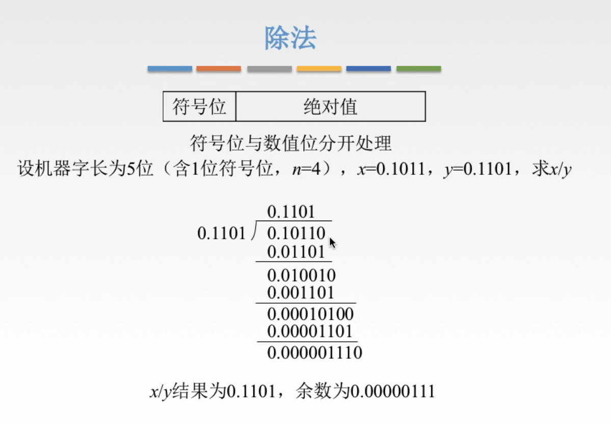
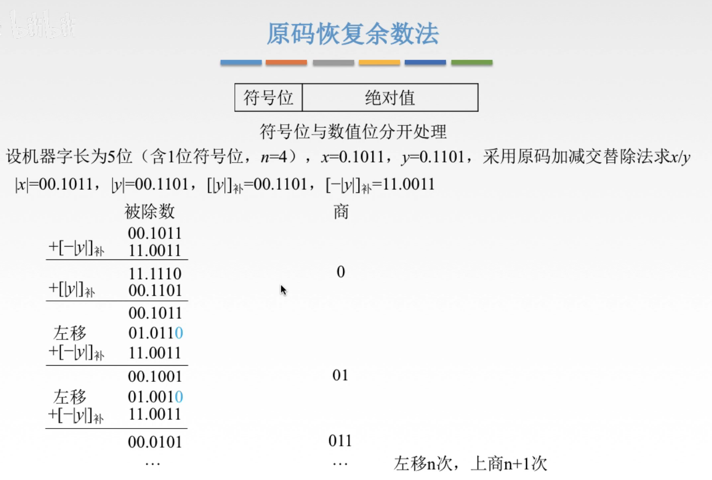
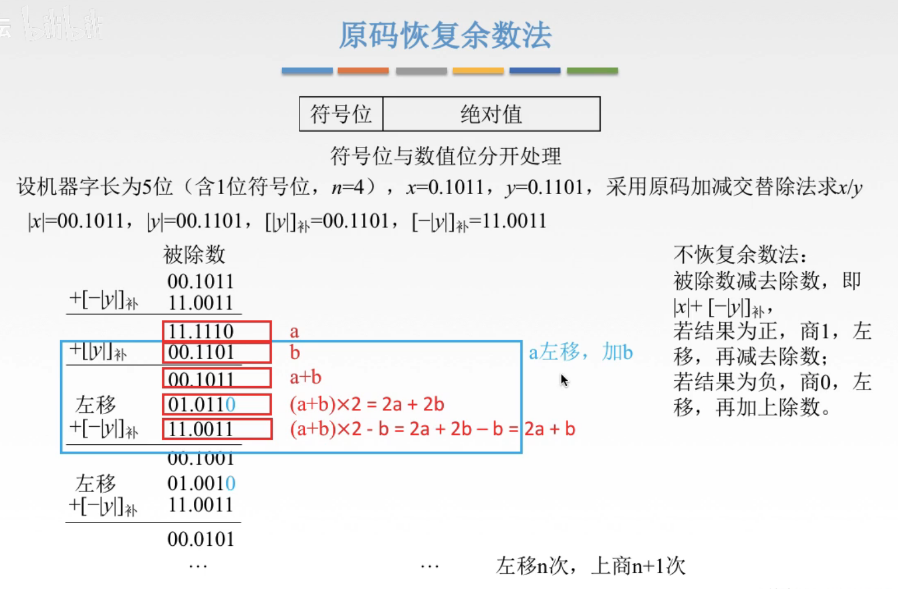
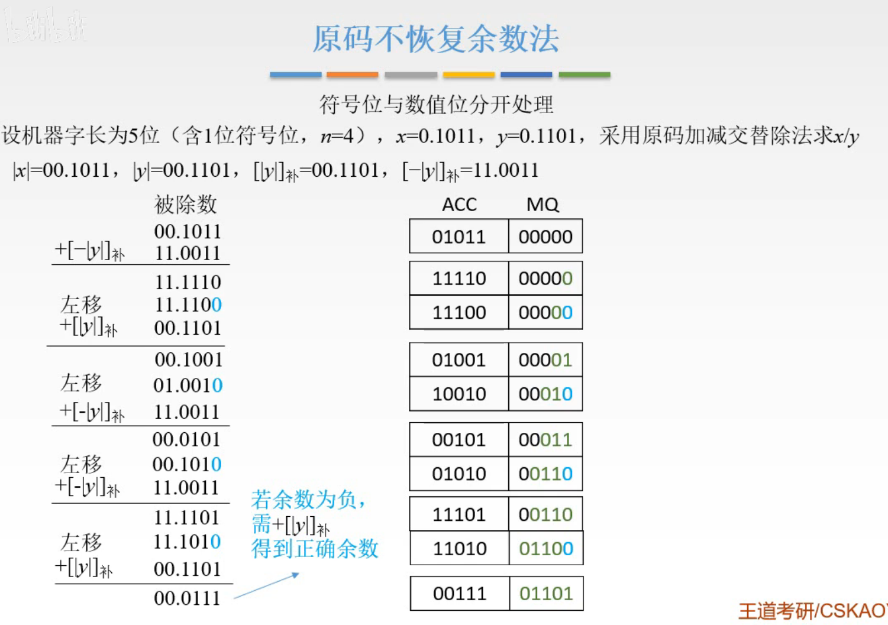
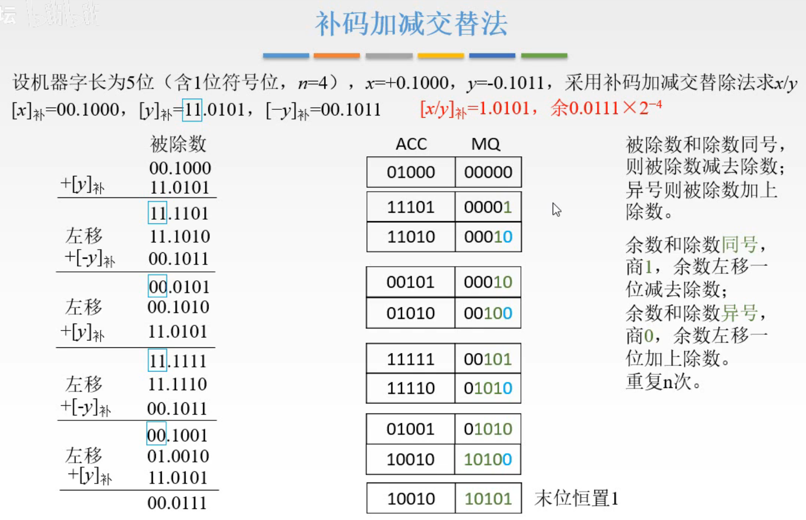
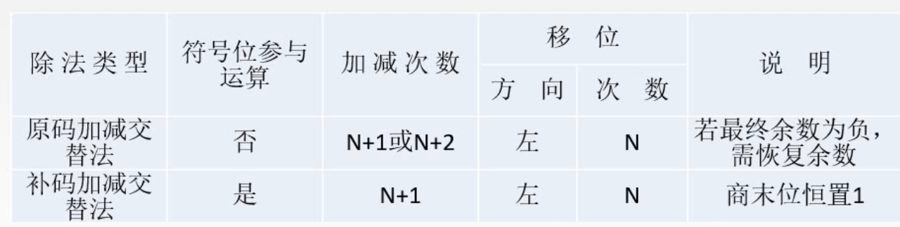

# 除法运算

乘除运算不是重点，因为乘除这两个知识点，交给机器去做，需要关注的细节太多了，手动操作的话就非常麻烦，而计组这门课还有这其他很多有价值的考点。

so，主要会算，知道特点就行了，没必要深入理解。

图1.正常手算的操作

## 一. 原码恢复余数法

同乘法一样的思路，也就是想办法将正常手算过程变为移位运算和加法运算。

图2.原码恢复余数法

详细操作 $x(被除数)\times y(除数)$ 。

1. 求出 $[|x|]_{原},[|y|]_{原}$ （或者说 $[|x|]_{补},[|y|]_{补}$ 也行），以及其补码 $[|y|]_{补},[-|y|]_{补}$ ，采用双符号位。
   因为符号位与数值位分开处理。
   所以处理数值位的补码时，也就是处理 $|x|,|y|$ 的补码啦。
   求 $[|y|]_{补},[-|y|]_{补}$ 是因为后续操作要用到加减，所以把 $|y|,-|y|$ 的补码都先求出来。
2. 用被除数 $|x|$ 减去 $|y|$ ，即 $[|x|]_{补}+[-|y|]_{补}$ ，
   如果结果为正数，说不够除， $|x|<|y|$ ，记商为0；
   如果结果为正数，说够除， $|x|>|y|$ ，记商为1。
3. 如果上一步商为0，则需要将差加上 $|y|$ ，恢复原本的数，即 $[|x|]_{补}+[-|y|]_{补}+[|y|]_{补}$ ；
   如果上一步商为1，则不需要恢复。
4. 以得到的数（商为0则是恢复的数，商为1则是差），重复2，3步骤，直到商满足了位数。
   便得到了最终结果的数值。
5. 将符号的结果与数值的结果拼在一起，就是最终的结果。

共计需要左移n次，上商n+1次。 

## 二. 原码不恢复余数法（原码加减交替法）

可以注意到在恢复余数法中，当商为0的情况下，其操作是可以简化的。

图3.恢复余数法中可简化的部分

当差为负数时，商0，设差为 $a$ ，减数为 $b$ ，那么在蓝色框中进行的操作为，恢复为被减数 $a+b$ ，然后左移一位 $(a+b)\times 2$ ，然后再进行商的下一位的操作，减去减数 $2a+2b-b$ ，
于是实际上当差为负数时，接下来的这一串操作可以直接化简为 $2a+b$ ，即：左移后加 $b$ 。就不用再什么恢复被减数再移位再减了。

详细操作： $x(被除数)/y(除数)$ ，

1. 首先因为符号位与数值位分开计算，所以将x,y取绝对值 $|x|=00.1011,|y|=00.1101$ ，采用两位符号位判断进位。
2. 然后将被除数 $|x|$ 写入ACC，0写入MQ。
3. 将ACC中的被除数减去 $|y|_{补}$ ，相当于加上 $[-|y|]_{补}$ ，得到和。
4. 将和存入ACC，
   如果和为正数，则商1，MQ低位变为1；
   如果和为负数，则商0，MQ低位变为0；
5. ACC和MQ作为整体左移一位，MQ低位暂时添0；
   如果上一步和为正数，则将ACC中的被除数减去 $|y|_{补}$ ，得到和，进入第4步；
   如果上一步和为负数，则将ACC中的被减数加上 $|y|_{补}$ ，得到和，进入第4步；
6. 循环进行第4，5步，直到MQ中的商填满MQ。
7. 此时MQ中的二进制就是其数值结果，
   最后的和如果为正，就是"余数"；如果为负，则需要再加上 $|y|_{补}$ 才是正确的"余数"。当然"余数"需要乘以 $2^{-n}$ ，n为进行了左移的次数，才是真的余数。
8. 将符号位结果与数值结果接起来，就是最终结果。

## 三. 补码加减交替法

图5.补码加减交替法

详细操作： $x(被除数)/y(除数)$ ，

1. 补码是符号位参与运算，
   算出 $[x]_{补},[y]_{补}$ ，以及要用到的 $[-y]_{补}$ ，采用两位符号位。
   
2. 将被除数 $|x|$ 写入ACC，0写入MQ。

3. 根据被除数与除数的符号位是否同号，

   同号，则加上 $[-y]_{补}$ ；
   异号，则加上 $[y]_{补}$ 。

   得到和。

4. 将和存入ACC，
   如果和与除数 $[y]_{补}$ 同号，则商1，MQ低位变为1；
   如果和与除数 $[y]_{补}$ 异号，则商0，MQ低位变为0；

5. ACC和MQ作为整体左移一位，MQ低位暂时添0；
   如果上一步的和 与除数 $[y]_{补}$ 同号，则将ACC中的被除数加上 $[-y]_{补}$ ，得到和，进入第4步；
   如果上一步的和 与除数 $[y]_{补}$ 异号，则将ACC中的被减数加上 $[y]_{补}$ ，得到和，进入第4步；

6. 循环进行第4，5步，直到MQ中的商填满MQ。
   注意MQ中商的最后一位，恒为1，末位恒放置1，直接写1就行。

7. 此时MQ中的二进制就是其最终结果，
   最后的和如果为正，就是"余数"，当然需要乘以 $2^{-n}$ ，n为进行了左移的次数，才是真的余数。

## 四. 原码/补码交替加减法对比

图6.原码/补码交替加减法对比

其实吧，原码/补码，在这里的意思我觉得就是符号位是否参与运算。
毕竟原码交替加减法里面，加减也是用的补码。

加减次数：
原码加减交替法：N+1次或N+2次，N+2次是因为余数为负需要再加一次 $[|y|]_{补}$ 。
补码加减交替法：N+1次。

补码加减交替法：末位恒置1，补码加减交替法商的最后一位就是1。

2020.08.28