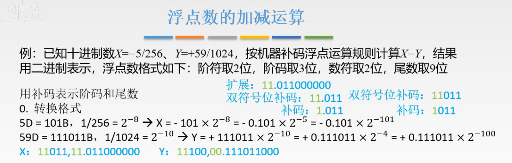
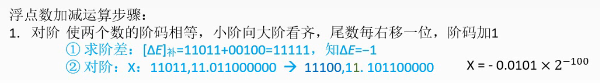
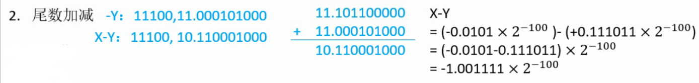
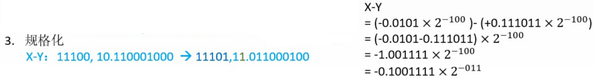
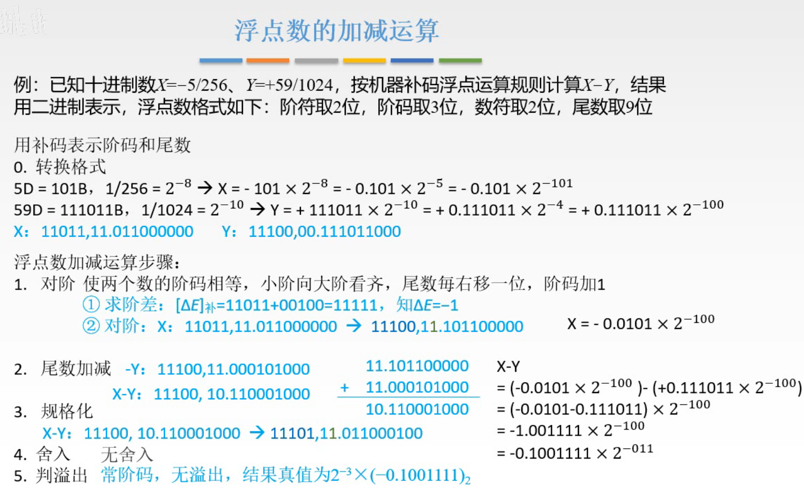
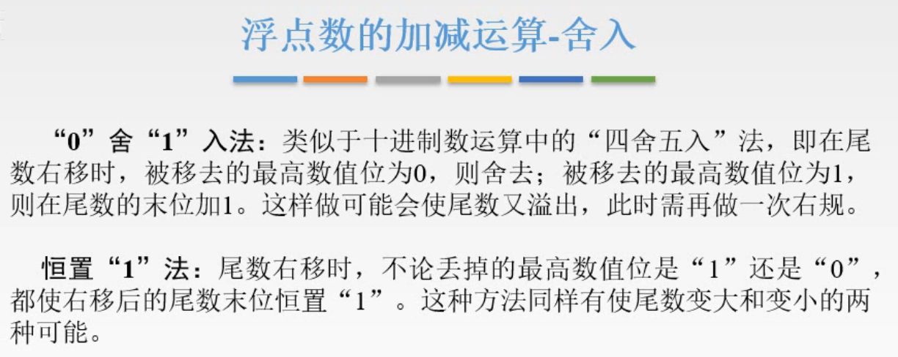
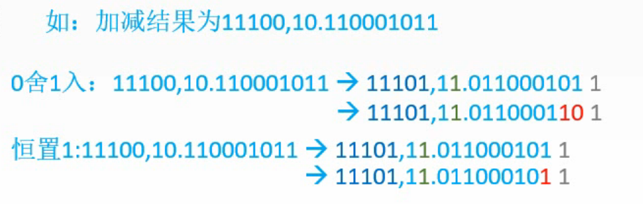
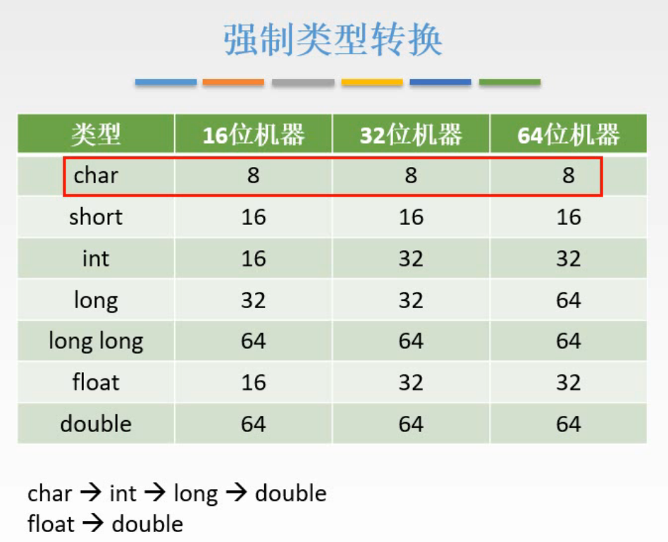
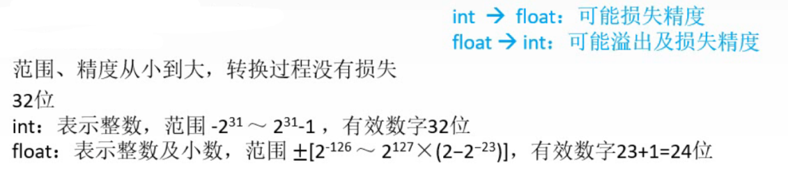
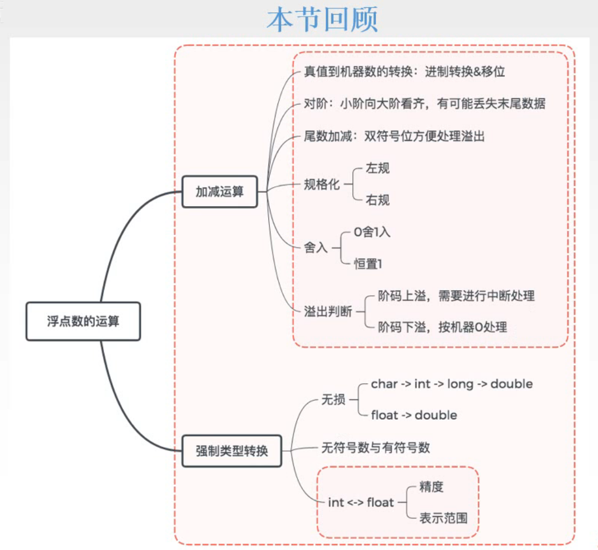

# 浮点数加减运算、强制类型转换

## 一. 加减运算

图1.浮点数加减运算步骤

通常呢，因为题目给出的数并非机器数，所以在1.对阶之前，第0步是将题目给出的数按照题目的格式写为机器数的形式。

直接以例题的形式来理解。

图2.第0步，写为机器数

注意到题目给了浮点数的格式，毕竟不给的话写个32，64位的也太长了。

### 第0步：将真值写为符合题目格式的机器数

看起来这个例题讲的浮点数并不是IEEE 754格式哦，而是前面401将的浮点数的格式。

 $X=-\frac{5}{256}=-101\times 2^{-8}=-0.101\times 2^{-5}=-0.101\times 2^{-101}$ ，

然后看看题目给的浮点数格式，

阶符取2位，阶码取3位： $-101\rightarrow[1011]_{补}\xrightarrow{阶符2位}[11011]$ ，
数符取2位，尾数取9位： $-0.101\rightarrow[1.011]_{补}\xrightarrow{数符2位}[11.011]\xrightarrow{补足位数}[11.011000000]$ ，

于是 $X$ 的机器数为： $11011,11.011000000$ 。

### 第1步：对阶

图3.第1步，对阶

其实就是把阶码变成一样的，然后就可以对尾数直接进行加减运算了。
提公因式嘛，十进制也是这样算的嘛， $a\times10^1-b\times 10^2=(0.a-b)10^{2}$ 。

首先求阶差，
也就是先确定两个数的阶码相差多少，随便拿一个数来，减去另一个数，比如这里是用X的阶码减去Y的阶码。
 $[X]_{补}-[Y]_{补}=[X]+[-Y]_{补}=11011+00100=11111$ ，所以X，Y两个数的指数相差1。X的指数比Y的指数小1。

然后把两个数的指数变为相等的。
这里改变的是X的阶码。因为X的指数比Y小1，于是X的阶码应该+1， $11011\rightarrow 11100$ ，
与此同时，毕竟指数部分改变了，那么要保证数不变，就对尾数部分要进行算术移位。
这里指数变大，小数点应该左移，也就是算术右移，$11.011000000\rightarrow11.101100000$ ，

对阶后的X为 $11100,11.101100000$ 。

### 第2步 尾数加减

图4.第2步，尾数加减

对阶完成后，就是图4右侧一样，提取公因式，进行尾数加减。

 $\begin{aligned}\left[X尾数\right]_{补}-[Y尾]_{补}&=[X尾]_{补}+[-Y尾]_{补}\\&=11.101100000+11.000101000\\&=10.110001000\end{aligned}$ ，

so，现在X-Y为： $11100,10.110001000$ ，然而这并不是最终的结果，毕竟你看符号位10，有问题呀。需要进行浮点数的规格化，右规。

### 第3步 规格化

图5.第3步，规格化

对得到的 $11100,10.110001000$ 进行右规格化，
指数减1，小数点左移1位，相当于尾数右移1位，得到 $11011,11.011000100$ ，

当然还没有结束，还需要判断进行运算后的数的舍入与溢出了。

### 第4步 舍入

 $11100,10.110001000\rightarrow 11011,11.011000100$ ，低位丢掉的是0，不影响数值，所以没有舍入。

###  第5步 溢出

 $11100,10.110001000\rightarrow 11011,11.011000100$ ，看得到的数的阶码的码符。

如果为11/00，正常的，说明无溢出；
如果为10/01，说明溢出了。

这里例题的例子是没有溢出的。

给一个完整的图：

图6.浮点数的加减运算例题过程

最终结果就是 $11011,11.011000100=(-0.100111100)_2\times2^{-3}$ 。

下面补充例题没有考到的舍入与溢出情况。

### 舍入方法

图7.舍入方法

由于在右规的时候被舍去了一位低位0/1，于是又两种处理方法：

**0舍1入法**

就是类似十进制的四舍五入，舍去的位为0，则不变；舍去的位为1，则结果的末位+1；

当然结果末位+1，可能导致进位以至于又溢出了（右规后数值位全为1），那么就需要再次右规。

**恒置1法**

无论舍去的低位是0还是1，结果的末位都为1。

不是+1啊，是末位就恒定放置1。

两种方法的举例：

图8.两种舍入方法的举例

## 二. 强制类型转换

补充了一下浮点数的东西，可以总结出两条不会损失精度的强制类型转换：
这里是以 32 位机器为例。

1.  $\text{char}\rightarrow\text{int}\rightarrow\text{long}\rightarrow\text{double}$ ，
2.  $\text{float}\rightarrow\text{double}$ 。

为什么int转double不会损失精度，double有52+1（1位隐藏存储的1）=53位数值位，显然的准确的表示完32位（数值位31位）的int，绰绰有余。

关于int与float的转换：

图10.int与float的转换

1. int转float，可能损失精度，
2. float转int，可能损失精度，可能溢出。

很简单嘛，int是32位，数值位是31位，float尾数是23+1（1位隐藏的）=24位，自然是无法准确表示int的所有数的。

而float的表示范围比int大很多，转换成int那很可能就溢出了。

## 三. 本节回顾

图11.本节回顾

2020.09.02

