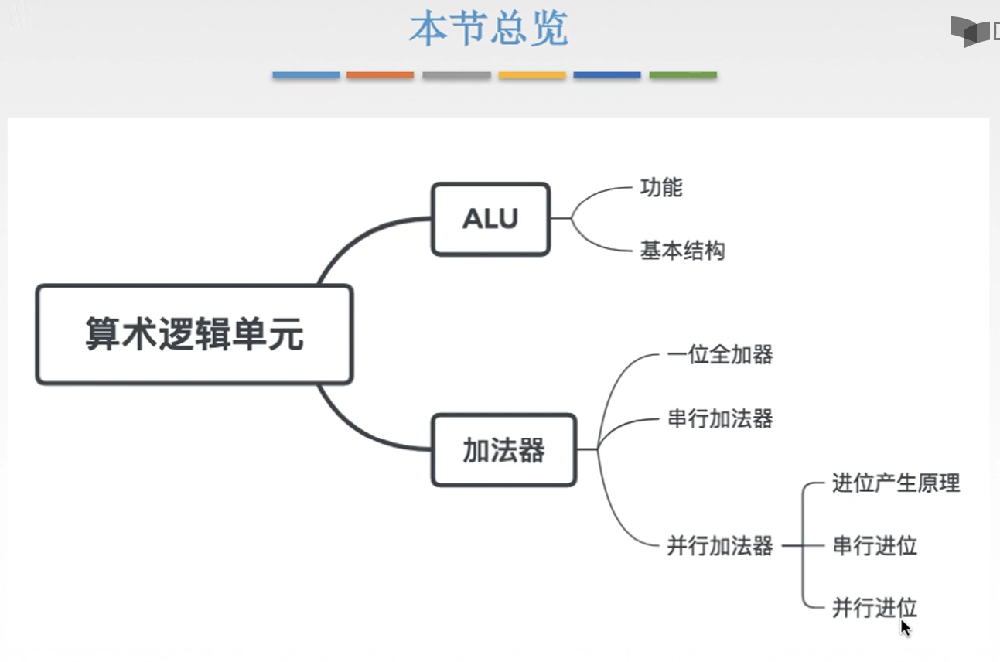
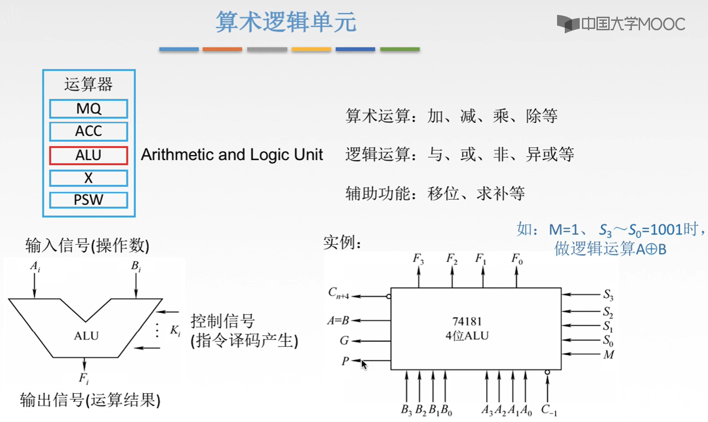
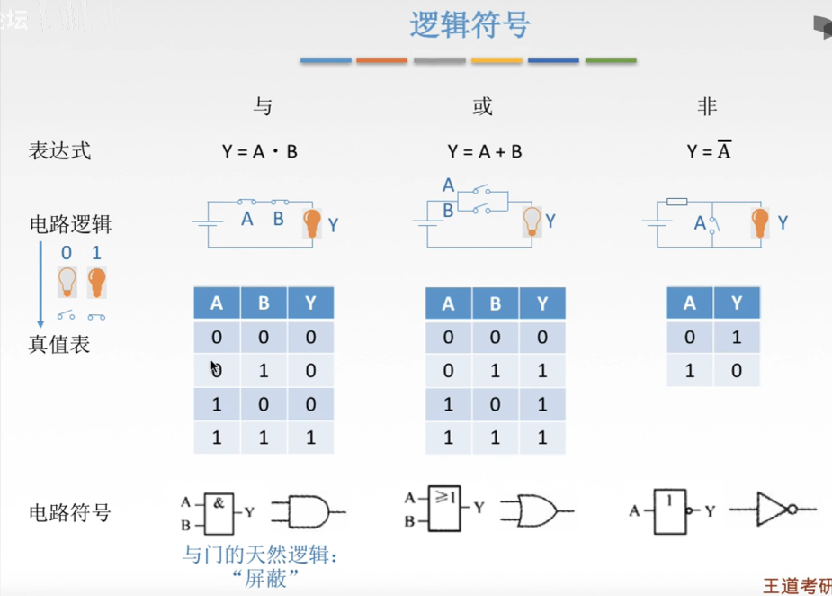
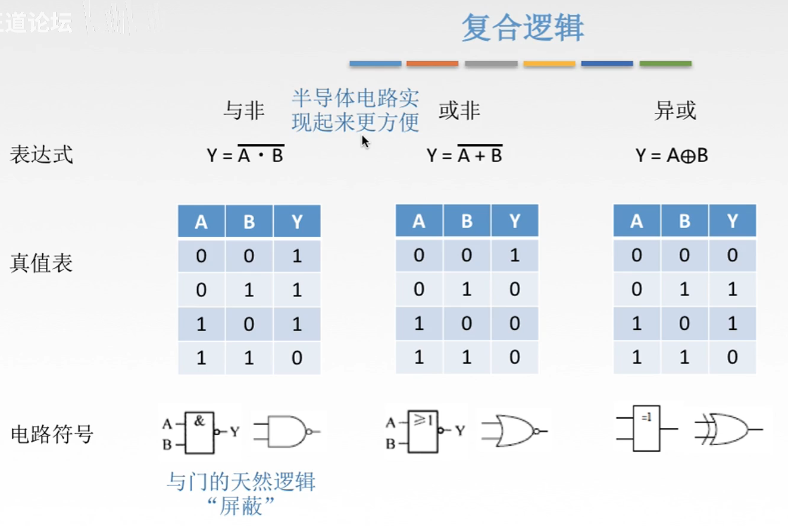
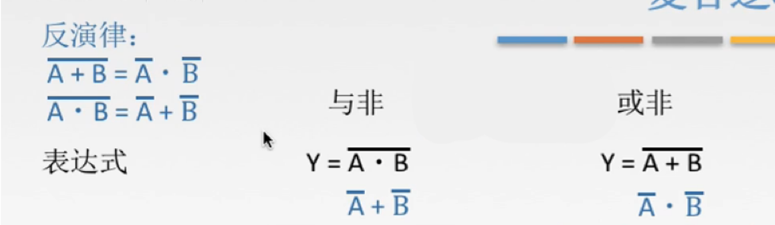
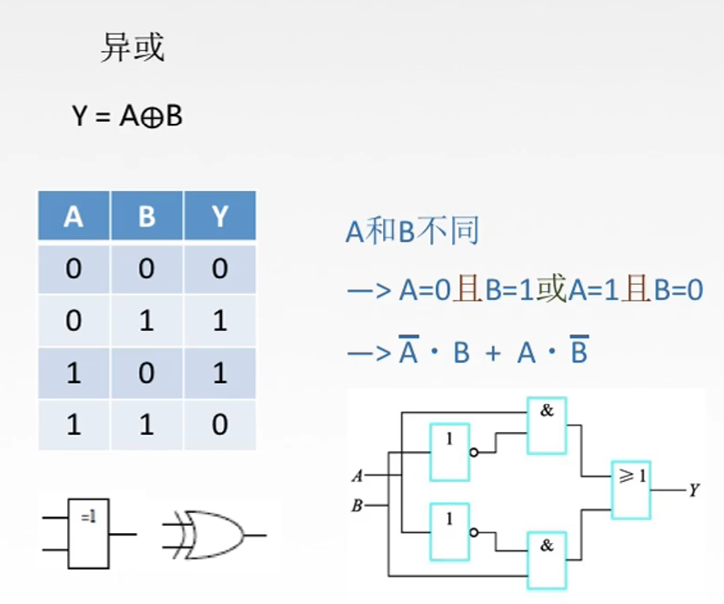
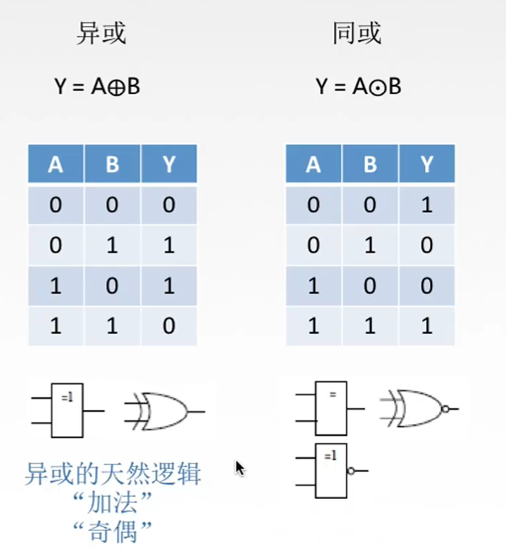

# 基本逻辑符号

图1.本节总览

算术逻辑单元，ALU，Arithmetic and Logic Unit，从这个英文名字就能看出，主要是进行算术运算和逻辑运算。

所以ALU具有的功能有：

算术运算：加、减、乘、除等；
逻辑运算：与、或、非、异或等，
辅助功能：比如移位，求补等。

图2.ALU简单介绍

简单说，如图2左下方所示，就是要对接收到的输入信号（操作数A，B）进行一些操作，得到结果F。
当然进行什么操作是被控制信号控制的，由指令译码产生（指令译码我还没学，不知道是什么东西，大概理解为是被控制就好了吧这里。）

图2右下方为实例，控制信号也就是右边的 $M,S_0,S_1,S_2,S_3$ ，通过其输入不同，决定4位ALU进行什么操作。

比如 $M=1,S_3\sim S_0=1001$ 时，做逻辑运算异或 $A\bigoplus B$ 。

书上看到还有什么正逻辑，负逻辑。
意思是，一般咱都是高电平为1，低电平为0；负逻辑是相反的，高电平为0，低电平为1。

比如"或"中，正逻辑为：

| A    | B    | F    |
| ---- | ---- | ---- |
| 0    | 0    | 0    |
| 1    | 0    | 1    |
| 0    | 1    | 1    |
| 1    | 1    | 1    |

那么负逻辑为：

| A    | B    | F    |
| ---- | ---- | ---- |
| 1    | 1    | 1    |
| 0    | 1    | 0    |
| 1    | 0    | 0    |
| 0    | 0    | 0    |

但好像这个正/负逻辑不是很重要，王道考研视频里都没提。

在这个计算过程当中，可能还要有与其他芯片的联系，所以图2右下实例的左侧还有输出的信号。

## 与、或、非

不顾这一节先介绍基本的逻辑符号。
怎么设计ALU放在下一节。

图3.与、或、非

表达式：

与： $Y=A\cdot B$ ，理解为串联电路，只能两个都为1，Y才为1；
或： $Y=A+B$ ，理解为并联电路，任意一个为1，则Y为1；
非： $Y=\overline A$ ，理解为短路吧，A为1则Y为0，A为0则Y为1。

电路符号：

方框的图形：
与：方框里面有个&符号；
或：方框里面为 $\geq 1$ ，挺好理解，或的表达式为 $Y=A+B$ ，自然只要任意为1，都是 $\geq 1$ 的；
非：方框里面写的1，但是注意方框后面有个圆圈，就代表相反。

另一种图形：
与：直线，圆弧；
或：曲线，更尖的弧；
非：三角形，小圆圈。

图3下面说与门的特点是"屏蔽"，意思是比如看A，当A为0时，Y不受B的影响；当A为1时，将B值不改变直接输出到Y。
就是这个意思，但我现在还不太能理解这个"屏蔽"效果有什么用。

## 复合逻辑-与非、或非、异或、同或

通过与、或、非三个逻辑，那么就可以组合起来形成复合逻辑。

图4.复合逻辑

与非：
在与之后，非一次。
电路符号，原本与的图形后面加上小圆圈。

或非：
或之后，非一次。
电路符号，原本或的图形后加上小圆圈。

与非与或非，也就是把真值反一下。
虽然感觉真值反一下好像也没啥区别，但这是因为在实际生活中，这种电路要比原本的与，或好实现一些。
所以通常做题什么的看到的也都是与非，或非。

图5.反演律

根据反演律，可以稍微推导一下：

与非： $Y=\overline{A\cdot B}=\overline A+\overline B$ ，
或非： $Y=\overline{A+B}=\overline A\cdot\overline B$ ，
(拆开，运算换一下)

接下来是实现异或。

图6.异或的实现

异或，符号为 $\bigoplus$ ， $Y=A\bigoplus B$ 。

（为了好记，想成里面有一个加号，是因为是用异或来实现计算机的加法的。）

异或的作用，对比A和B，不同输出1，相同输出0。
详细分析一下为：（A=0与B=1）或（A=1与B=0）输出1，当（A=1与B=1）或（A=0与B=0）输出0。
整理成公式为： $Y=\overline A\cdot B+A\cdot\overline B$ ，
最后就是电路实现。

图7.异或与二进制加法

异或具有的特点，就是用于加法和奇偶，比如在前面的校验码那里就经常用到异或。

观察图7可以注意到，异或正好对应着二进制的加法，而二进制加法的进位则是与与相同的。

关于二进制加法，在下一节讲。

下面补充一个，同或。

图8.同或

同或，符号为 $\bigodot$ ， $Y=A\bigodot B$ 。

可以看到同或相当于异或取非，
那么因为同或可以由异或取非得到，所以通常能用异或解决的问题就不用同或了，或者要用同或的地方，直接异或后面加个非门就行了。

so，同或的电路符号就是异或后面加上一个小圆圈。

2020.09.03