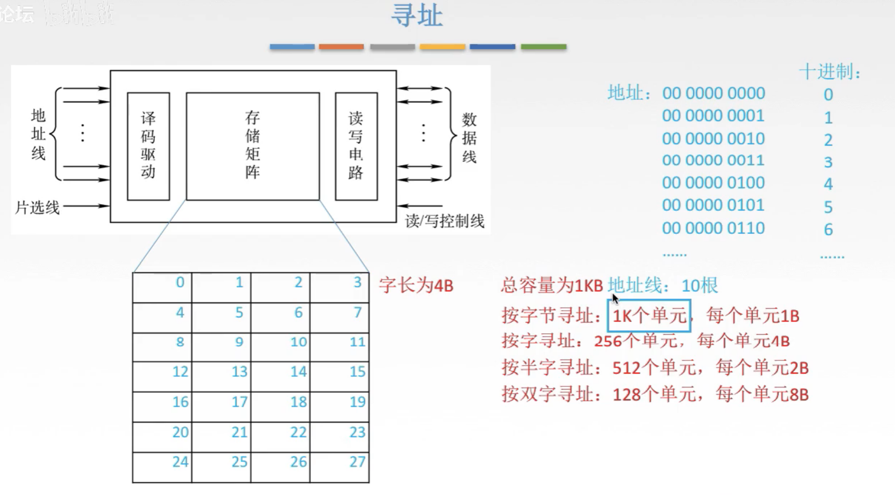

# 主存的简单概念及寻址概念

## 一. 本章总览

图1.本章总览

这里，高速缓冲存储器和虚拟存储器，经常合起来出一道综合题。

所以，协同工作这一部分的内容，需要学懂且具有设计能力。

## 二. 主存储器的简单模型

图2.

图3.

图2，图3的的内容在107存储器讲过了，放在这里当回忆一下。

下面接着讲新的。

图3，可以看出，这些部件都在时序控制逻辑的控制下进行操作，所以需要一个控制电路，来控制这些部件的协调工作。

图4.控制电路，接线

同样的，控制电路也要接受外部的命令，所以对外要接入**片选线，读控制线，写控制线**。

片选线：
就是整个芯片的开关，有两种控制模式。
一种叫高电平有效，即当片选线接入高电平，则整个电路工作，反之接入低电平则不工作。
另一种叫低电平有效，刚好与高电平有效果相反，即当片选线接入低电平，则整个电路工作，反之接入高电平则不工作。

读控制线、写控制线：
用来决定这次操作是读取，还是写入，以及什么时候读出去，什么时候写进来。
因为同一时间一般来说只有读或只有写，这两根线也可以合并为同一根线，为**读写控制线**。
具体设计为一根还是两根，根据题目来。

图5.

把这个结构封装起来，抽象化一下，变为了图5左下方的图。

译码驱动：
在前面107存储器也讲过，译码器需要接上驱动器，来帮助译码器扩大输送信号的能力。
主要还是掌握译码器的作用，把二进制形式的地址，映射成能够控制整个存储器工作的信号。

读写电路：
在MDR这一端还有一个读写电路，相当于结合上控制电路的读写控制信号，来控制整个读写过程的电路。

## 三. 存储单元的个数

重点需要熟练掌握的是，外面的这些接口，地址线、数据线、片选线、读/写控制线。
一方面是它们的功能，一方面是它们的数量。

图6.

地址线：
一般对应MAR的位数。
n位地址，对应 $2^n$ 个存储单元。
也就是 $2^n$ 行。

数据线：
一般对应MDR的位数。
MDR也就是对应的列数。

所以知道地址线与数据线数量，就知道总容量了。
图6里，总容量就等于 $2^3$ 行乘以 $8$ 列，单位bit。

总容量换成 $A\times B$ 位存储芯片（存储字数 $\times$ 存储字长），这样的的描述方式，就一目了然地址线和数据线的数量了。
常见的描述里举例了， $8K\times 8$ 位，即 $2^{13}\times8\text{bit}$ ，地址线13位，数据线8位。

单位换算。
 $K:2^{10},M:2^{20},G:2^{30},T:2^{40}$ 。

## 四. 寻址

图7.

在这里，图7中，假设存储矩阵中存储单元为4字节，假设总容量为1KB。

首先说不同的寻址方式。
如图7右下方，有着不同寻址方式。
按字节，最小单元为1字节，共1K个单元；
按字寻址，这里应该是指存储字，即最小单元为4B，共256个单元；
按半字寻址，最小单元为半个存储字长；
按双字寻址，最小单元为两个个存储字长。

图8.按字节寻址

（以下，设定为每个字节都具有自己的字节地址。）

图8以按字节寻址为例，最小单元为1B，共1K个单元。

所以要表示 $2^{10}$ 个单元，对应的地址线应该为10根。

图9.按字寻址

如果按字寻址呢。

按照最小单元为4B，共 $256=2^8$ 个单元，的规则来寻找。
也就是每4个分为一组，注意到，如图9由上方，发现在一个字内，有4个字节，而最低位的2位二进制位可以表示1，2，3，4，即可以用于区分一个字内的不同字节，或其顺序，而每一字的其余高位都是相同的。
所以按字寻址的方式的话，以相同高位作为字地址（把每个存储单元低位的字节地址作为字地址。），而最低2位用于区分一个字中4个字节的顺序位置。

（这里我没有找到书上或网上的说法，属于自己猜的：
给我的感觉是，如果采用按字寻址，我们一次是先找到一个字，4个字节。然后再根据最低两位，找到这个字中我们要读的那个字节。
这样查找也许比按字节寻址快？如果按字节是从0开始一个一个找上去，按字是一个字一个字的找上去的话。
主要是我没找到按字寻址是否能找到一个字节，还是一次是把整个字都出去，亦或都行？）

书上看到一个寻址范围的问题，对于24位地址线，存储单元为4字节，那么按字节寻址范围为 $2^{24}=2^{4}M=16M$ ，但是按字寻址的范围是 $2^{22}=2^2M=4M$ 。
这里我的理解是，因为存储单元为4字节，所以用最低2位二进制位就可以表示一个字中4个字节的顺序，于是当按字寻址时，所以用于表示字地址的位少了2位，变为了22位。

## 五. 大端、小端存储方式

关于地址编号处理完成了，那么如何存储数据呢。

图10.存储方式

如图10，一个存储单元4B，现在存入12345678H（H代表16进制），有两种存储方式：

大端方式：
数字高位存放低地址，数字低位存放高地址，
以数字高位所在的地址作为字地址。

小端方式：
数字高位存放高地址，数字低位存放低地址，
以数字低位所在的地址作为字地址。

## 六. 本节回顾

图11.本节回顾

2020.09.04