# 半导体存储器RAM

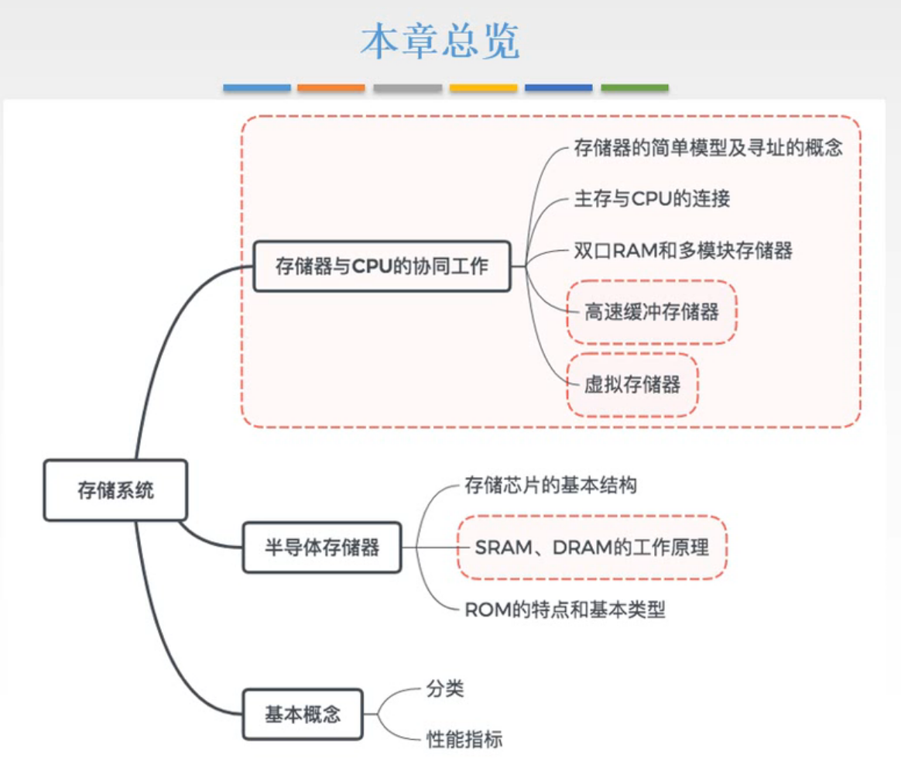

图1.还是本章总览

存储器与CPU的协同工作，一方面要知道它们是怎么连接的，一方面要知道如何提升存储器的工作速度以及容量。

关键理解如何从系统设计的角度来达到这两个目标。

主要的思路就是依靠局部性原理，以高速小容量的存储器配合上低速大容量的存储器，最终实现一个高速大容量的存储系统。

要解决三个问题，

1. 地址映射的问题。
2. 小容量的存储器买来后如何进行替换的问题。
3. 如何保持小存储器中数据副本与大存储器中数据母本的一致性的问题。

讨论这些问题时，我们是把存储器作为一个抽象的简单模型来讨论的，并没有讨论存储器是用什么材料制作的这类问题。

接下来我们先讨论材料问题，然后再接着解决上述问题。

# 一. 存储芯片的基本结构

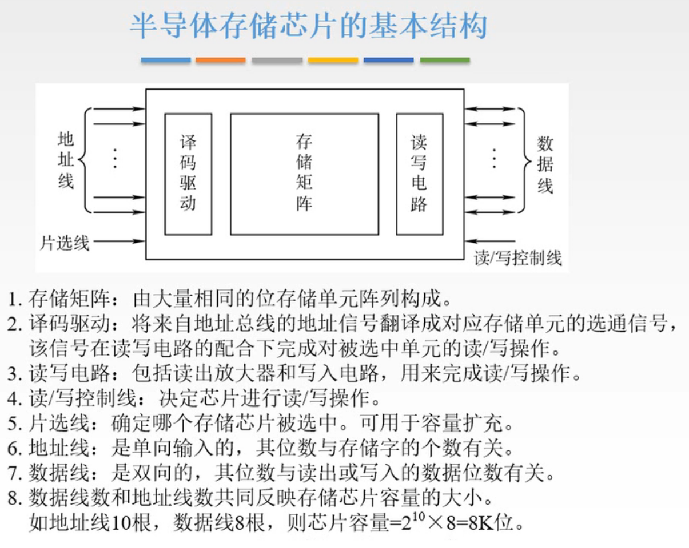

图2.基本结构

详细说明一下：

1. 存储矩阵：
   由大量相同的位存储单元阵列构成。

   作为存储的容器，要能实现存储的功能需要一些有控制功能的电路。

2. 译码驱动：
   将来自地址总线的地址型号翻译成对于存储单元的选通信号，该信号在读写电路的配合下完成对被选中单元的读/写操作。

3. 读写电路：
   包括读出放大器和写入电路，用来完成读/写操作。

以上三个就能够完成存储器的基本功能。
但存储器的工作依赖于外部功能部件给它的地址信号和控制信号

控制线：

4. 读/写控制线：
   决定芯片进行读/写操作。

   有两种设计方式，一种是读/写共用一根线，一种是读控制线，写控制线各用一根。
   作用是告诉存储器什么时候读/写，以及本次是读/写。

5. 片选线：
   确定了哪块存储芯片被选中。可用于容量扩充。

   作用是作为存储器的开关，根据开关的功能可以实现存储器容量的扩充，
   如果是多个存储器芯片同时开，同时关，就能实现存储器每次读取出来的位数的扩充。
   如果是多个存储器芯片轮流开，轮流关，就能实现存储器存储单元的扩充，也就是存储字个数的扩充。
   如果把多个芯片分组，每组内部同时开关，组间轮流开关，就同时实现了存储单元与存储位数的扩充。

信号线：

6. 地址线：
   单相输入，其位数与存储字的个数有关。

7. 数据线：
   双向的，其位数与读/写的数据的位数有关。

   地址线和信号线可以反应存储芯片的容量。

## 二. 半导体随机存取存储器

存储器中的存储阵列部分，存放数据需要使用什么材料和电路，对于主存来说，采用的都是半导体材料。
区别只在于使用半导体材料构成了不同的电路。

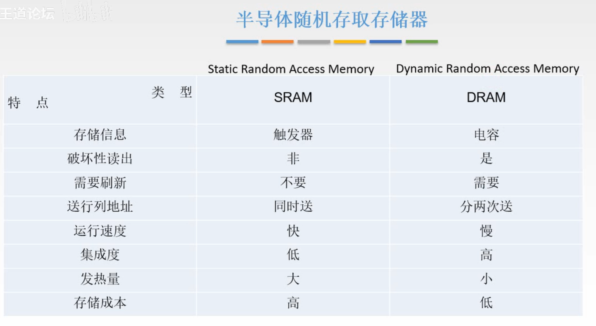

图3.半导体随机存储存储器，SRAM，DRAM

无论是SRAM还是DRAM，都是给出一个地址，电流迅速流过电路，就能够直接找到对应的存储单元，这样，对于随机给出的地址，到取出地址对应单元的数据，所耗费的时间基本上都是一样的，都是电流流过的时间，也就是访问单元所耗费的时间与其所在的物理位置没有关系，这样的存储器就叫做**随机存取存储器（RAM，Random Access Memory）**。

RAM中采用了触发器这种存储电路的叫做**静态随机存取存储器（SRAM，Static Random Access Memory）**，采用了电容器进行存储的叫做**动态随机存取存储器（DRAM，Dynamic Random Access Memmory）**。

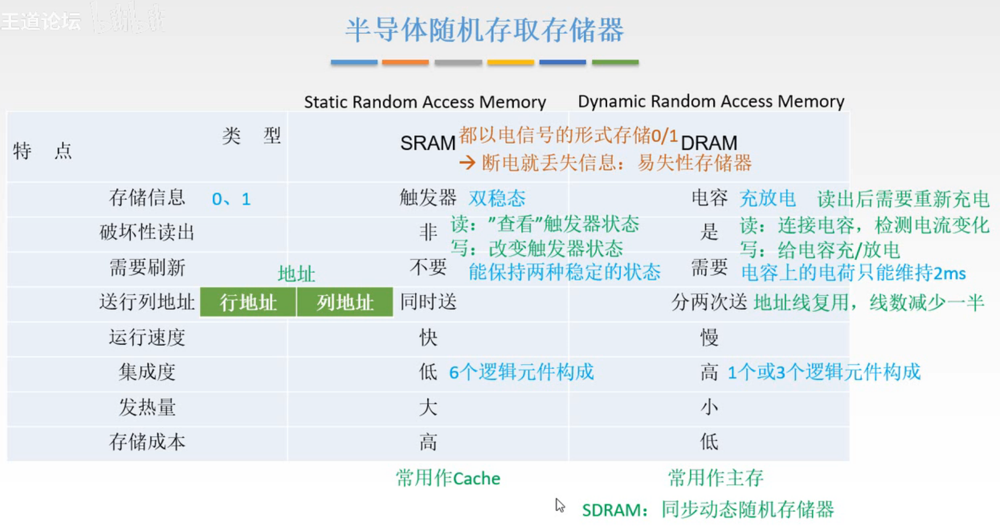

图4.SRAM与DRAM对比

**存储信息**：
存储的都为0，1。

SRAM采用的触发器电路可以稳定地保持两种状态，可以表示0，1。所以叫做静态嘛。
DRAM采用电容器存储，利用电容充放电的状态来表示0，1。但是因为电容是无法稳定保持有电状态，充电后的电荷是会缓慢流失的，所以使用电容来存储信息时需要不停的对之充放电。所以叫做动态嘛。

当然还是有共同的特点，那就是都要有点，SRAM，DRAM存储的0，1的信息，都是电流一直在上面流动来维持的，只要断了电，所有的信息都会被清除。
所以也叫**易失去存储器**。

**破坏性读出**：

SRAM，读出数据时不会破坏数据，只会查看一下数据而不会改变，所以是非破坏性读出。
DRAM，由于采用电容存储，读的时候是用一个探测电路去连通电容，然后坚持探测线上的电流变化来判断读到的是1/0，那如果读到1，自然电容放电就没了。自然读完之后需要给它的信息进行恢复。这种就叫做破坏性读出。

**需要刷新**：

SRAM，因为触发器能够稳定的保持状态，所以不需要刷新。
DRAM，由于电容上面的电荷一般只能维持2ms，久了就算你不读它它也没了，所以需要在电荷消失前，比如每隔2ms，把存储器每个单元重写一遍，这个重写的过程就叫做刷新。

**送行列地址**：

RAM的特点在于把地址分为了行地址与列地址（想象成二维数组）。

假设地址是20位。
SRAM的行地址、列地址长度不一定相等（想象一个 $m\times n$ 的二维数组），所以需要把整个地址送到地址线上，需要20根地址线。
DRAM是将地址分为了长度相等的两段（想象一个 $n\times n$ 的二维数组），既然长度相等啦，所以可以复用地址线，先送行地址进去，放个地方暂存着，再送列地址进去，然后再根据地址寻址。这样就只需要一半的地址线10根。

**运行速度**：

SRAM，因为触发器稳定的状态，不需要进行刷新，读出数据还要恢复这些操作，所以快。
DRAM，因为要刷新，读出数据要恢复，所以运行速度慢。

**集成度**：

主要看存储一个二进制位所需要的元件要多少个。

SRAM，一个触发器需要6个逻辑元件，所以集成度低。
DRAM，核心为电容，只需要1个或3个逻辑元件，自然集成度要高。

**发热量**：

SRAM，使用的逻辑元件多，所以连线多，发热量大。
DRAM，连线少，发热量小。

**存储成本**：

SRAM，用的元件多，那自然更贵。
DRAM，更便宜。

**用途**：

SRAM，因为运行速度快，常用作Cache，
DRAM，因为结构简单一些，也更容易做出大容量，常用作主存。

经过发展，现在有了SDRAM（同步动态随机存储器），也是一种动态随机存储器，现在的主存主要用SDRAM啦。

## 三. DRAM刷新问题

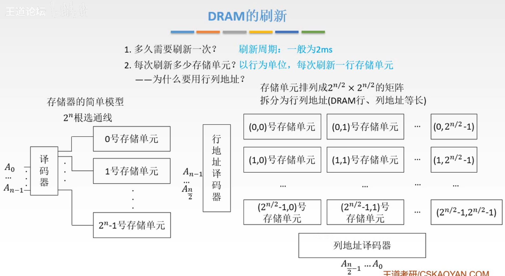

图5.DRAM的刷新问题（部分）

**多久刷新一次？**

刷新周期一般为2ms。

**每次刷新多少个存储单元？**

以行为单位，每次刷新一行存储单元。

这个问题其实是因为使用了行列地址。
那么**为什么要用行列地址？**

因为如果按照比较简单的一维的排序的话，如图5左下方，假设地址线为8根，那么选通线就需要 $2^8=256$ 根，更别说要是地址线32，64根了。那选通线怎么连嘛，数都数不清。

所以采用二维的方式来排序，如图5右下方。把地址拆成行列地址，其中DRAM的行、列地址等长。
通过行地址译码器和列地址译码器共同来确定一个存储单元。

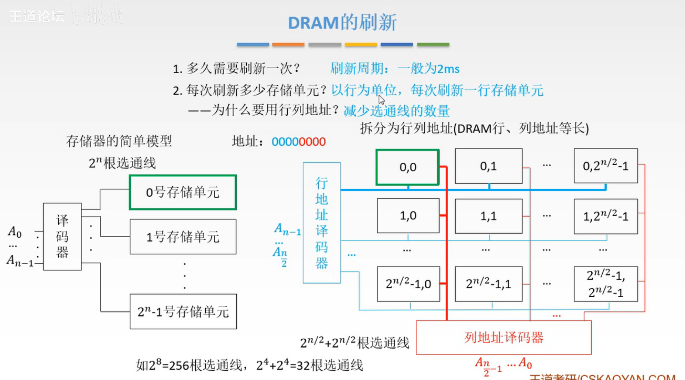

图6.行列地址

如图6，例子，假设8位地址，访问0000 0000，通过行地址译码器和列地址译码器就能够准确的选中 $(0,0)$ 这个存储单元了。

以行列地址的形式，假设地址为n位，则需要的选通线由 $2^n$ 根变为了 $2^{\frac{n}{2}}+ 2^{\frac{n}{2}}$ 根。大大减少了所需根数。

为什么要用行列地址？
可以减少选通线的数量。

那么再回答为什么要按行刷新，因为行地址译码器一次就能够选通一行存储单元，那就一次刷新一行呗，不然难道非要一个一个刷新吗。

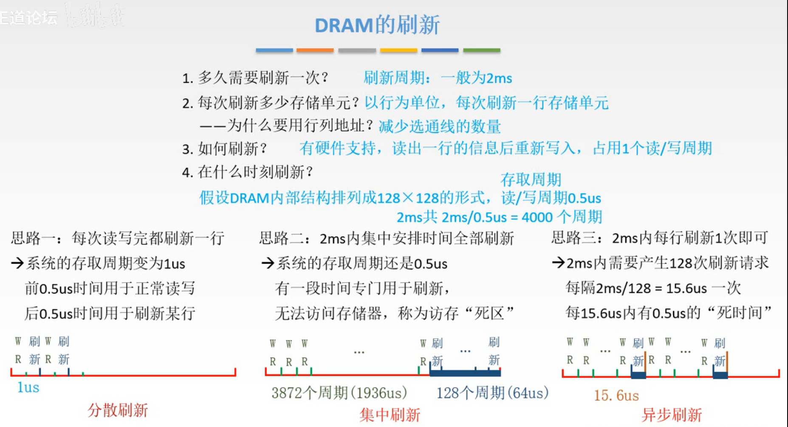

图7.刷新的时机

**如何进行刷新操作？**

有硬件支持，读出一行的数据后重新写入，占用一个读/写周期（占用一个读周期或者写周期，读周期与写周期其实时长不一样，但是为了方便，在设计时将二者时长设计成一样的。）

注意啦，虽然刷新也是读出后再写入，但是用时是占用一个读/写周期，也就是系统刷新一行和我读取一次数据或写入一次数据占用时长是相同的。

这个刷新过程是存储器内部的操作，是不需要CPU控制的。

刷新时是不需要片选的，也就是所有芯片同时刷新一行。（毕竟能一下解决的事为什么要分开干呢。）

**在什么时候进行刷新？**

有着三种方式进行刷新。

假设DRAM内部结构为 $128\times 128$ 的形式，读/写周期为0.5us。2ms就有4000个读/写周期。

存取周期：指两次连续启动两次读/写操作的所需最短时间。

读/写和刷新是分开由两套硬件控制的，当我们进行读/写时，无法进行刷新，同样的当系统刷新时，我们就无法进行读/写（毕竟读/写和刷新本质都是读/写操作嘛。）。

1. 分散刷新

   如图7左下方，我用一个周期进行读/写，然后系统用一个周期进行刷新某行，我和系统交替用，这样叫分散刷新。

   这样的话，两次连续读/写操作中夹着一个刷新操作，所以存取周期变为了1us。
   降低了系统的速度。

   显然在分散刷新中，2ms里有一半时间我都没法进行读/写操作。
   而且128行进行刷新只需要在2ms内刷新完一次，也就是在4000个周期里用128个周期进行刷新就行了，这样每隔128个周期就刷新了一次，多刷新那么多次干嘛。

   （分散刷新是不存在死时间的，因为读/写+刷新相当于一个绑定操作了吧，所以不算有死时间吧。）

2. 集中刷新

   在2ms中集中安排出128个周期专门用于刷新，如图7正下方。

   这样的方法，存取周期还是0.5us。

   但是，在集中刷新的时间里，我们就没法进行读/写操作了，把这段时间称为"死时间"，或者"死区"。

   （死时间，应该是指连续一段无法进行存取操作的时间，或者每次无法进行存取操作的时间。
   不然我感觉说不过去。
   如果是这个定义的话，就能解释为什么说分散刷新没有死时间，集中刷新为64us，异步刷新为0.5us。感觉可以这样理解，异步刷新"死"了128次，但是死时间是0.5us，应该吧。）

   有死区的存在那就很不舒服呀。

3. 异步刷新

   结合上面两种方式的特点，因为2ms中128行只需要刷新一次，所以把2ms的时间分成128段，每份 $2\text{ms}\div 128=15.6\text{us}$ ，每段中刷新一行。如图7右下方。

   也就是每15.6us中有0.5us用于刷新。
   异步刷新的死时间为0.5us。

   当然不止这样，因为只需要在每15.6us中有一次0.5us用于刷新就行了，而这0.5us的位置我们可以通过合理的指令安排，将这0.5us安排在我们程序不需要进行读/写的时间，而是去做其他事情。这样就实现了时间最大化利用。

#### 关于 DRAM 的行、列选通线

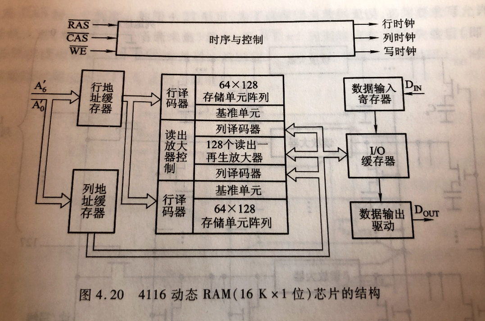

图8.DRAM（16Kx1）芯片的结构

在 DRAM 芯片内有时序电路，它受行地址选通 $\overline{RAS}$ 、列地址选通 $\overline{CAS}$ 以及写允许信号 $\overline{WE}$ 控制。

可以对比上一节讲的存储器中的控制电路，也就是 DRAM 芯片的控制电路是由行地址选通 $\overline{RAS}$ 、列地址选通 $\overline{CAS}$ 代替了片选线 $\overline{CS}$ ，所以，DRAM 是没有片选线的。

这一点主要是在于做王道上的一道题时，我算出来是 16 根，但王道答案是 17 根。原因就是这儿。

不过感觉其他地方用到这一点也很少，感觉很多题还是只说片选线 $\overline{CS}$ ，比如后面主存与 CPU 的连接，也是只说片选线 $\overline{CS}$ ，而没有细到 $\overline{RAS}$ 和 $\overline{CAS}$ 。
况且遇到的这道题也是 <王道> 自己出的题而非真题。
所以还是得自己知道，看情况来吧。

既然都看了这部分细节了，我还是写下来。

这里图旋转了一下。

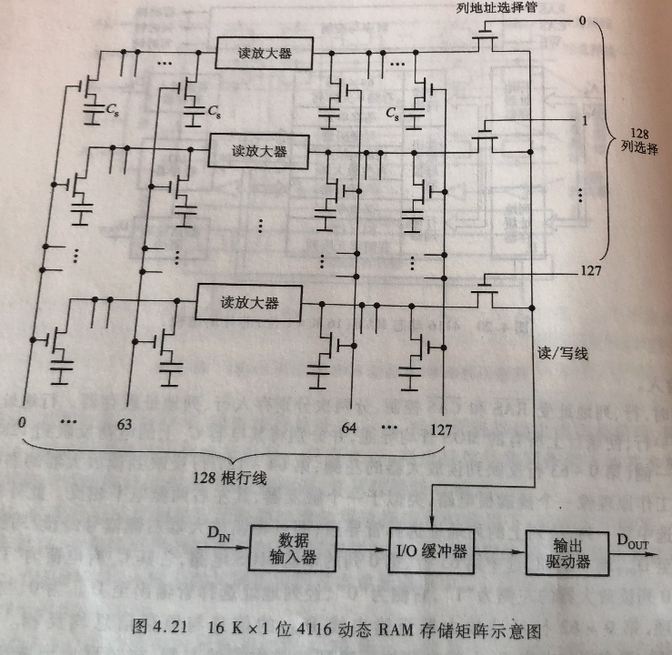

图9.16Kx1位 4116 DRAM 存储矩阵示意图

> 读出时，行、列地址受 $\overline{RAS}$ 和 $\overline{CAS}$ 控制，分两次分别存入行、列缓存器。

显然嘛，DRAM 使用地址复用技术，那么就是把地址分两次输入的，自然得控制第一次输入的是行地址，要传入行地址缓存器；第二次输入的是列地址，要传入列地址缓存器...

当然要受到控制。
甚至可以联想到，如何区分是行还是列地址的，应该与 CPU 取指、取数一样，交替来的呗（只是我这么想，并没有证实过）。

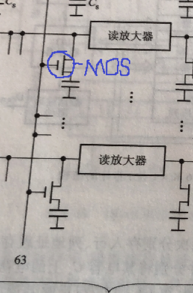

图10.MOS 管

> 行地址经行译码器后选中一行，使该行上所有 MOS 管均导通。

假设，行地址经行译码器后选中的是第 63 行，于是使 63 这个线通电。
则，63 线上的 MOB 管都导通，会使得 63 行这一行的存储单元的连线都导通。（MOB 管就是这么一个作用）

接着 63 行的存储单元中的电荷流出，流到读放大器。

> 读放大器的工作原理就像一个跷跷板电路，类似于一个 触发器，其左右两侧电平相反。

也就是若 63 行的存储单元中有电荷为 1，无电荷为 0。则流到读放大器左侧还是 1 or 0，但流过放大器到右侧就变为相反的了 0 or 1（称为反相）。

> 此外列地址经列译码器后选中某一列，该列上的列选中管导通，即可讲读放大器右侧的信号经读/写线、I/O 缓冲器输出至 $D_{OUT}$ 端。

注意到，只有当选中的列选择管通电时，该列才会与读/写控制线连通。

这里假设我们经过列译码器后选中的是第 0 列，于是只将第 0 列的 MOS 管通电。
则第 63 行的电流，虽然整行都流到了右边，但只有第 0 列的线才与读/写线接通了，能读出来。

---

**读放大器的作用**：猜测是因为信号随着线的长度而衰减，在该例中，第 64 行至第127 行，信号强度足够；而第 0 行至第 63 行，其信号传输到读/写线，可能就衰减到没有了。所以需要在中间加上放大器。

显然，如果读的是第 0 行至第 63 行里的数据，那么经过读放大器，读/写线与刚开始读出的信号是反相的；
而如果读的是第 64 行至第 127 行的数据，那么不会经过读放大器，读/写线与刚开始读出的信号是同相的。

不过这并不会引起错误。
因为既然要读，肯定得先写进去，才会有读的操作。
而对于第 0 行至第 63 行，写进去时也会经过读放大器，本来存的时候就是存的反相的信号，自然读出来时在经过读放大器反相，也就是原本的信号啦。

## 四. SRAM的读/写周期

### 4.1 SRAM读周期

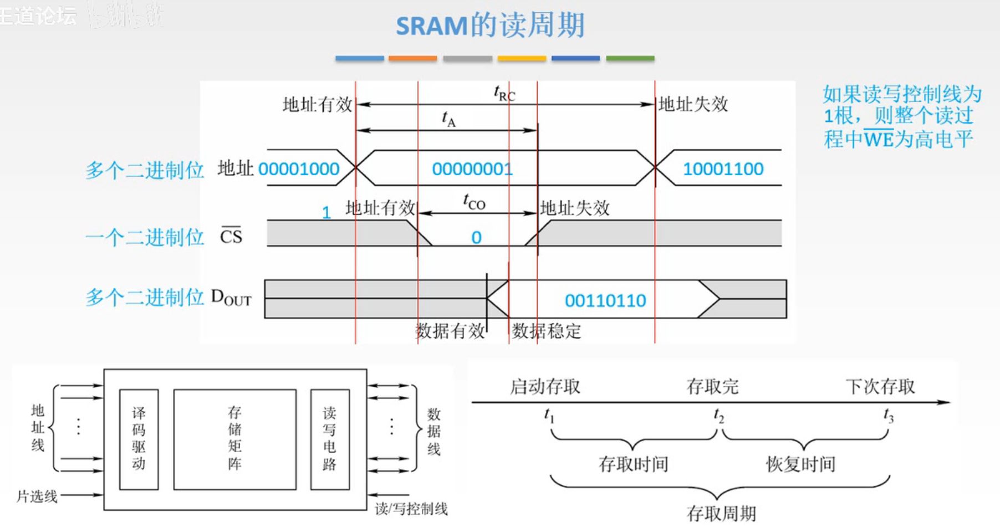

图11.SRAM的读周期

图8中， **$\overline{CS}$ 线的地址有效，地址失效，应该是片选有效，片选失效！我懒得改图了。**

 $\overline{CS}$ ：
片选信号，只有一个二进制信号，所以高地方代表信号1，低的地方代表信号0；加了横线 $\overline{CS}$ 代表低电平有效，高电平无效。

地址线和数据线 $D$ ：
因为是多个二进制位，所以画很多行来表示就很麻烦，所以画成多边形的样子，每个多边形表示一串二进制数。
如图8地址线中间的多边形，这里假设表示0000 0001地址。
同样的数据线中的多边形也代表着数据，这里假设为0011 0110。

下面开始讲一遍一个存取周期的流程：

1. 首先要把地址传过来，从图11左边第一根红线开始（周期开始）。
   但是并不是在第一根红线时刻地址就传送完成了，0000 0001通过不同的地址线传过来，那么每根线的送到的时间也不一样，有点慢有的快。所以要等一段时间这个地址才可用。
2. 等了一会儿后，地址传递好了，第二根红线开始，打开芯片的开关 $\overline{CS}$ 变为低电平，开始读这个地址的数据。
   当然读出数据还是需要时间的，看 $D_{\text{OUT}}$ 也是过了一段时间才到数据有效，所以 $\overline{CS}$ 别急着关，还是开一段时间，等到数据读出来，数据稳定后（第三根红线）才关掉开关（第四根红线），。
3. 在关闭开关后，数据线 $D_{\text{OUT}}$ 上的数据还要传送出去，所以数据线 $D_{\text{OUT}}$ 上的信号会维持一段时间，再关闭。
   但整个周期结束是地址线上的信号关闭为结束。

图8右下方：

存取时间：实际上，从读的过程开始（周期开始），到数据稳定，读的过程就已经结束了。

恢复时间：而后面到结束的一段时间，对于SRAM来说是为了保证整个过程的正确性，所以不能马上进行下一次存取，而要间隔一段时间。对于DRAM来说，恢复这个词更适合DRAM，毕竟DRAM读完就要进行恢复操作。

存取周期：存取时间+恢复时间。

因为这个例子中读/写控制线用的一条线，所以整个读过程中 $\overline{WE}$ ，写允许信号（低电平为写，高电平为读），始终为高电平，故省略没有画。

### 4.2 SRAM写周期

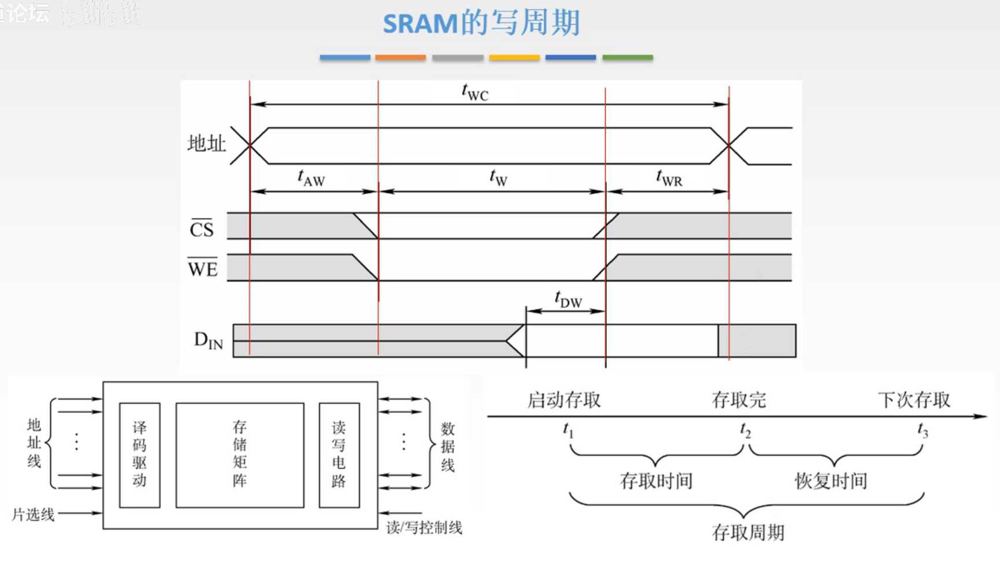

图12.SRAM写周期

整个存取周期：

1. 首先地址传过来，从左往右第一根红线开始，周期开始。
   同样的，等待一会儿，等地址传递完成。

   书上的说法是，写的时候因为数据线存在着前一周期的数据 $D_{\text{OUT}}$ ，所以第一根红线后， $\overline{CS},\overline{WE}$ 需要延迟一段时间后再改变状态，避免写入前一周期的数据。

2. 等待地址稳定后， $\overline{CS},\overline{WE}$ 变为低电平。（第二根红线）
    $\overline{CS}$ 变为低电平是打开芯片开关， $\overline{WE}$ 变为低电平是代表写。
    在 $t_{WD}$ 开始前，是等待要写入的数据稳定。
    
3. 写这个过程需要一段时间，所以 $\overline{CS},\overline{WE}$ 别急着变回去。
    $t_{WD}$ 开始，把要写入的数据开始写入进选中的单元。
   同样的，需要等待数据写进去稳定了，然后 $\overline{CS},\overline{WE}$ 再变回高电平（第三根红线）

4. 但还需要保持一下这个状态， $D_{\text{in}}$ 需要保持一段时间，确保数据可靠写入。
   地址线保持一段时间，然后地址失效（第四根红线）

存取周期：
存取时间：第一根红线（周期开始）到 $\overline{WE}$ 写信号失效（第三根红线）；
恢复时间： $\overline{WE}$ 写信号失效（第三根红线），到地址失效（第四根红线）。

## 五. 本节回顾

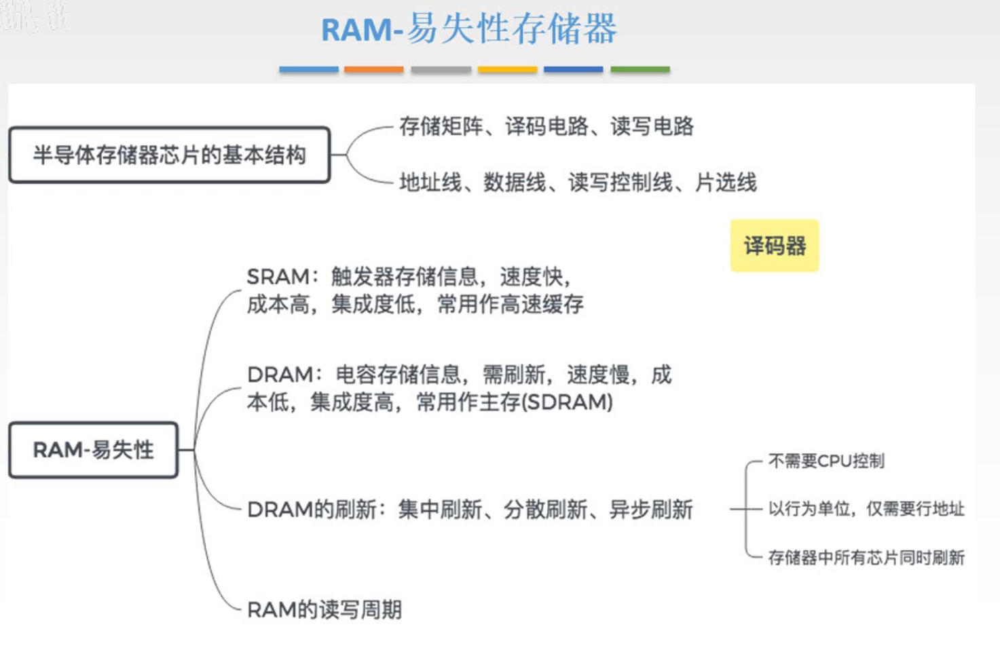

图10.本节回顾

2020.09.04