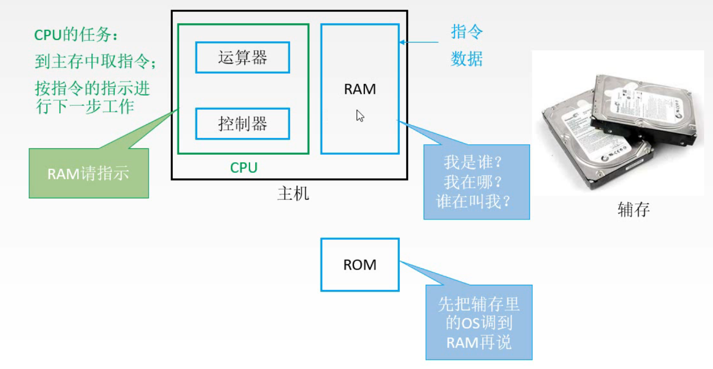

# 半导体存储器ROM

图1.RAM的问题

我们知道，主存储器中存储着指令和数据，CPU会从主存中取指令，然后执行。

当我们开机后，CPU就会自动得从主存中取指令。

而如果用易失性存储器RAM作为主存的话，那一断电里面存的东西都没了，那开机CPU取个啥。

所以需要一些断电后不会丢失内容的存储器。
当然这里不是说辅存，辅存根本就不会和CPU直接通信，辅存是通过I/O接口连接到主机的。

所以我们需要的是，掉电不丢失内容，而且能和CPU直接通信的存储器。

就是你啦，**只读存储器ROM（Read-Only Memory）**。

图2.

ROM的容量很小，但也足够存储一些关键的信息了。
比如指出操作系统在辅存的位置，然后将其通过I/O接口调入RAM中，然后CPU再去RAM中找，就能获得正确的指令了。

图3.

所以，主存实际上由RAM和ROM组成。

ROM负责存储一些开机后必要的信息。而一般的程序都是放在RAM中。
因为RAM读写速度快呀，而ROM最开始出现的时候甚至都不能写，现在虽然能写了但是速度很慢。（ROM掉电保存信息，要是读写也快，那还要RAM干嘛）

## ROM分类

图4.ROM分类

一开始是掩膜式只读存储器（MROM），只能写一次，所以制造商出厂的时候根据用户需求就写好了，用户就没法改了。
区分一下第三个中"可擦除"可编程"的概念，MROM是可编程的，不过是只有一次。但是是不可擦除的。

然后发展出了一次可编程只读存储器PROM，用户可以通过专门的设备（编程器）一次性写入，只有一次，之后就没法修改了。

接着又发展出了可擦除可编程只读存储器EPROM，可以多次擦除，多次写入，当然修改次数有限，写入很慢。
擦除有两种方法，紫外线擦除和电擦除。

闪存（Flash Memory），比如U盘，这个写入就快了，当然还是读快得多。

在闪存基础上加上一些控制单元，就是固态硬盘(Soild State Drives)。

（当然以上都没法替代RAM。）

## 本节回顾

图5.本节回顾

3个重要的地方：

1. 信号线（地址线，数据线，读写控制线，片选线）的作用
2. DRAM的刷新。
3. ROM，了解一下基本的类型，主要理解刚开始是只能读不能写的，后来虽然发展出了写的功能但比起读的速度慢很多。

2020.09.04