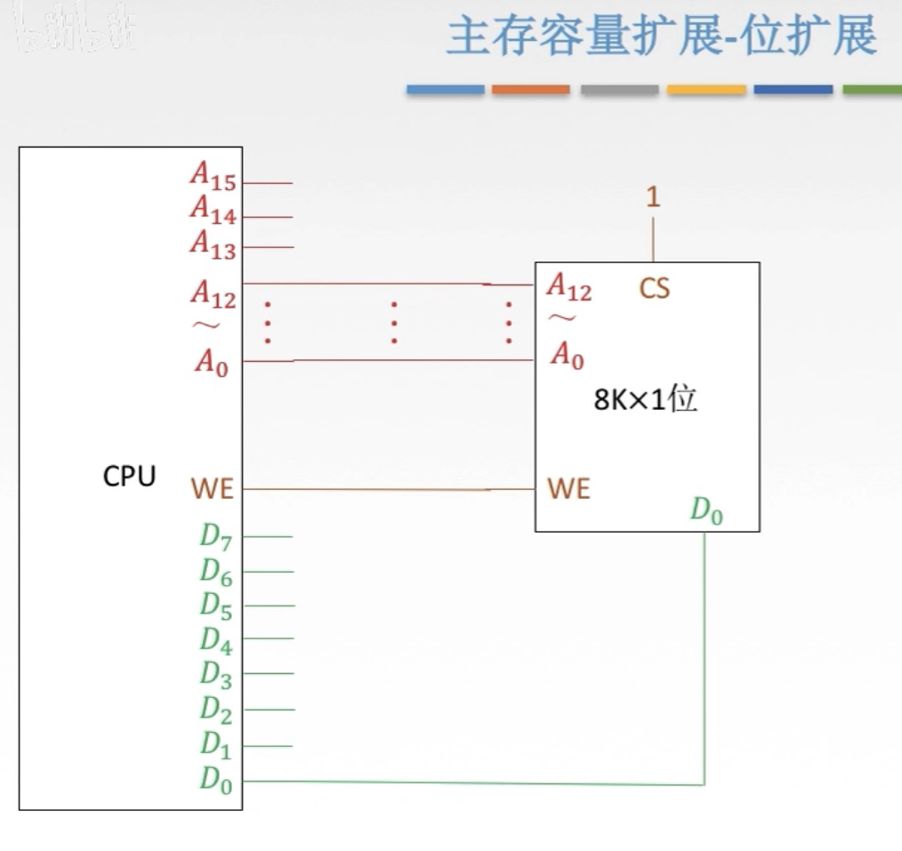

# 主存与CPU的连接

## 一. 连接方式与位扩展

图1.

回顾一下存储器的结构，然后去买一块 $8K\times 1$ 位的存储芯片。

 $8K=2^{13}$ ，所以地址线13根 $A_0\sim A_{12}$ ；1位，所以只需要一根数据线 $D_0$ ；读/写控制线，就用一根；然后是片选线。

图2.一个存储芯片与CPU相连

再买一个CPU，有16根地址线，8根数据线。

把CPU和存储芯片连接起来，CPU的 $A_{0}\sim A_{12}$ 连上存储芯片的 $A_{0}\sim A_{12}$ ；CPU的 $WE$ 连上存储芯片的 $WE$ ；CPU的 $D_0$ 连上存储芯片的 $D_0$ ；

让存储芯片随时保持工作状态，给CS线通上1。

显然这一个存储芯片不够CPU用的，CPU数据线8根，但是这一个存储芯片只有1根，于是再买一个。

图3.两个存储芯片与CPU相连

同样的，把CPU的 $A_{0}\sim A_{12}$ 与第二个存储器相连，第二个存储器的数据线就连到CPU的第二根数据线 $D_1$ 上，这样就能给CPU提供两位的数据了。

同样给第二个存储器CS通上1，保持工作状态。

那我买上8个存储器就行啦。

买8个存储芯片与CPU连接

连接方式就是这样：地址并行的传到每一个存储器，存储芯片数据线连到CPU对应的数据线上。

这样8块 $8K\times 1$ 位的存储芯片，就相当于 $8K\times 8$ 位的存储器啦。

这就是**CPU与主存的连接方式**以及**位扩展**方式。

## 二. 字扩展

当然除了扩展位数，我们还希望扩展存储单元的个数。

### 2.1 线选法

图5.字扩展

把两个 $8K\times 8$ 位的存储芯片与CPU相连，但是此时两个存储芯片CS线上的信号就不能同时都是1了。
如果同时都是1的话，两个存储芯片的数据同时传向CPU，显然这是不行的。

利用CPU还没用到的高位地址线 $A_{13},A_{14}$ ，分别连接两个存储芯片的CS线，

如果 $A_{13}=1,A_{14}=0$ ，于是第一块存储芯片工作，就可以将第一块存储芯片里的 $A_{0}\sim A_{12}$ 地址的数据传输给CPU。
同样的，如果 $A_{13}=0,A_{14}=1$ ，访问的便是第二块存储芯片里的数据。

这样能访问的存储单元数量就变为了两倍啦。

这种方式叫做**线选法**，也就是用一个地址线连通一个存储芯片。

图6.片选法

显然可知，两块存储芯片的地址为 $A_{14}A_{13}\sim A_0$ ，最高两位为 $A_{14}A_{13}$ ，其他位 $A_{12}\sim A_{0}$ 为芯片内部地址。
第一块存储芯片的地址为：01 0 0000 0000 0000~01 1 1111 1111 1111；
第二块存储芯片的地址为：10 0 0000 0000 0000~10 1 1111 1111 1111；

注意到，地址编号是不连续的。

显然注意到  $A_{14},A_{13}$ 只能为01或10，而不能为00或11。两个二进制位本身可以表示的4种状态，就没用完。
而且如果有n个存储芯片，进行字扩展，就要连n根线。

### 2.2 译码片选法

显然可以想到用译码器，还是以两块存储芯片为例子来讲。

图7.

如图7，只需要只使用一根 $A_{13}$ 连接两个存储芯片，在一条线上加上一个非门就行啦。
这就是一个最简单的译码器。

图8.

这个地址，还是写一下（虽然很简单我不想写的= =）：
第一块存储芯片的地址为：10 0000 0000 0000~11 1111 1111 1111；
第二块存储芯片的地址为：00 0000 0000 0000~01 1111 1111 1111；

地址编号是连续的。

当然这里只是一个最简单的译码器的情况，如果是更多个存储芯片，更多线，如译码器接入的是n根线，那么就能控制 $2^n$ 个存储芯片。

#### 2.2.1 译码器

图9.3根地址线的译码器

把地址线用 $CBA$ 标出来，把右边用 $Y_7Y_6Y_5Y_4Y_3Y_2Y_1Y_0$ 标注出来，都是下面为低位，上面为高位。

做题的标出来，不然别人怎么知道哪边是高位。

（之前的图上面都是上面低位来着，其实看题目要求，按题目要求的顺序来，没说要求那就随意。）

简单的说，想要右边 $Y_i$ 为1，那么 $CBA$ 就表示 $i$ 的二进制数就行了。（我感觉我说了废话= =）

现在图9这个译码器其实对应的是CS，也就是高电平有效的存储芯片。

图10.高电平有效与低电平有效对应的译码器

如图10左下方，当采用CS时，高电平有效，就使用图10左上方的译码器。

如图10右下方，当采用 $\overline{CS}$ 时，低电平有效，就使用图10右上方的译码器。
注意画小圆圈，以及 $\overline{Y_i}$ 上面有横线。

图11.译码器的使能信号

另外，控制译码器工作还有叫使能信号（Enable，EN）类似CS。

如图11，接线为EN，说明高电平有效，如果要使译码器工作，则EN线应该输入1。
反之，如果接线为 $\overline{EN}$ ，说明低电平有效，如果要使译码器工作，则EN线应该输入0。

图12.多个试能的译码器结构

更常见的译码器结构是有多个使能端的.

如图12，有三个使能端，若要是译码器工作，则应没圈的输入1，有圈的输入0，即 $G_1=1,\overline{G_{2A}}=0,\overline{G_{2B}}=0$ 。

图13.其他信号的译码器

如果 $G_1\overline{G_{2A}}\overline{G_{2B}}$ 是其他信号，如图13， $G_1\overline{G_{2A}}\overline{G_{2B}}$ 不为100，而是000，010，001，101，110，则译码器给出的信号就全为1111 1111，对应就没有连通任一个存储芯片。

图14.

使用2根地址线的译码器（3根的图画不下），采用 $\overline{CS}$ ，把存储芯片编号0，1，2，3。

可知：

0号存储器地址：00 0...0 ~ 00 1...1；
1号存储器地址：01 0...0 ~ 01 1...1；
2号存储器地址：10 0...0 ~ 10 1...1；
3号存储器地址：11 0...0 ~ 11 1...1。

再说一下，地址编号是连续的。

图15.

有的时候会出题，用的 $A_{15}A_{13}$ 而没有用 $A_{14}$ ，这样无论 $A_{14}$ 是多少，访问那片芯片取决于 $A_{15}A_{13}$ 。
（实际上不会这样设计，会出问题的。但是考试他可能会这么考你。）

这样的话，每片芯片的地址为：

0号存储器地址： $\begin{cases}000\quad0...0\\000\quad1...1\\010\quad0...0\\010\quad1...1\end{cases}$；
1号存储器地址： $\begin{cases}001\quad0...0\\001\quad1...1\\011\quad0...0\\011\quad1...1\end{cases}$；
2号存储器地址： $\begin{cases}100\quad0...0\\100\quad1...1\\110\quad0...0\\110\quad1...1\end{cases}$；
3号存储器地址： $\begin{cases}101\quad0...0\\101\quad1...1\\111\quad0...0\\111\quad1...1\end{cases}$；

（显然感觉有问题，看起来每一片存储芯片容量"翻倍"了，但实际上是每个存储单元都有了两个不同的地址，实际设计不会这么设计。）

### 2.3 字扩展两种方法对比

图16.子扩展两种方法对比

线选法：
n根线表示n个选片信号。
电路简单。
地址编号不连续。

译码片选法：
n根线表示 $2^n$ 个选片信号。
电路复杂。
地址编号连续，可以增加逻辑设计。（结合使能端可以进行一些逻辑的设计，但是王道视频里没讲说是结合题目里去看就知道了。）

## 三. 字、位扩展

字、位扩展，指既增加存储字的数量，又增加存储字长。

图17.字、位扩展

实际上就是把存储芯片多片作为一组，同一组中的不同存储芯片的数据线分别连到CPU不同的数据线上，完成位扩展；组与组之间，就是字扩展。

译码器的信号是并行的送给一组中的所有存储芯片。

这个字、位扩展一般考你选择什么芯片来组成。

## 四. 本节回顾

图18.本节回顾

2020.09.05