# 双口RAM和多模块存储器

CPU的运行速度比RAM高很多，所以要想办法提高RAM的运行速度。

双端口RAM和多模块存储器都是提高存储器速度的方案。
原理就是好好设计一下存储器的结构。

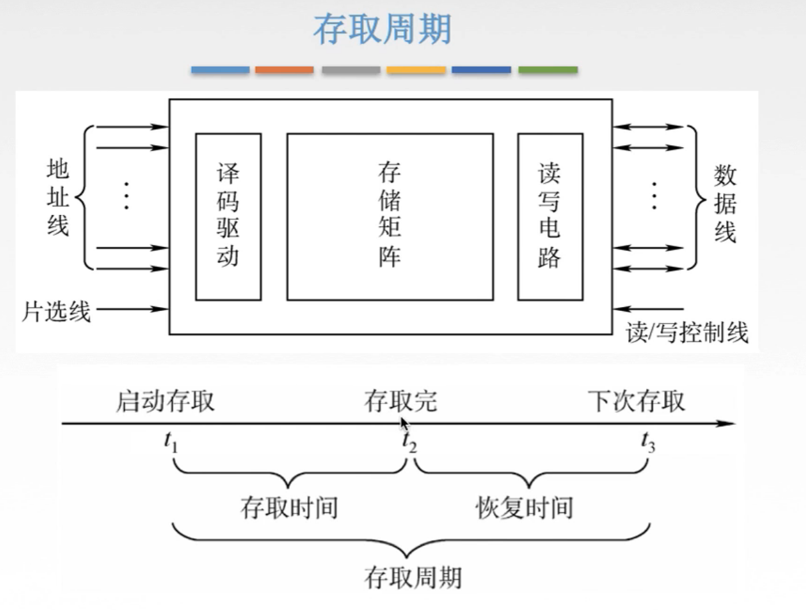

图1.存取周期

先来复习一下存取周期。

存取周期：指两次连续启动两次读/写操作的所需最短时间。

存取周期=存取时间+恢复时间。

实际上当存取时间结束时，已经完成一次存取的，但是并不能立即进行下一次存取，整个存储器芯片需要一段恢复时间。

那么如果可以将恢复时间利用起来，比如对多个不同时间能够进行存储的存储单元进行并行的操作，或者采用流水线的方案，当某个单元进入恢复时间时，可以对其他单元进行存取。

## 一. 双端口RAM

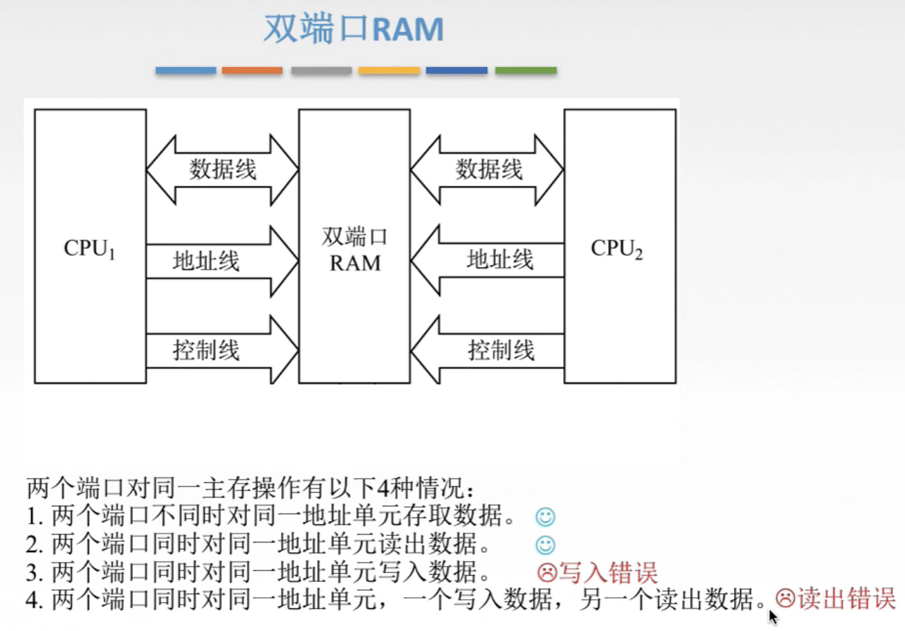

图2.双端口RAM

双端口RAM的解决思路是提供两个端口，同一个存储器具有两个独立的端口，并且分别具有两组相互独立的地址线、数据线和读/写控制线。

这样当两个端口就可以同时访问不同地址的数据时，就没有冲突。

当两个端口对同一主存进行操作时：

1. 两个端口不同时对同一地址单元存储数据。（没问题）
2. 两个端口同时对同一地址单元读出数据。（没问题）
3. 两个端口同时对同一地址单元写入数据。（有问题，写入错误，毕竟可能不知道最终写入的是啥）
4. 两个端口同时对同一地址单元，一个写入数据，另一个读出数据。（有问题，读出错误，我读出来的是原本的还是刚写入的呢）

为了解决两个端口对同一主存进行操作时可能会出现错误，于是新增"忙"信号。

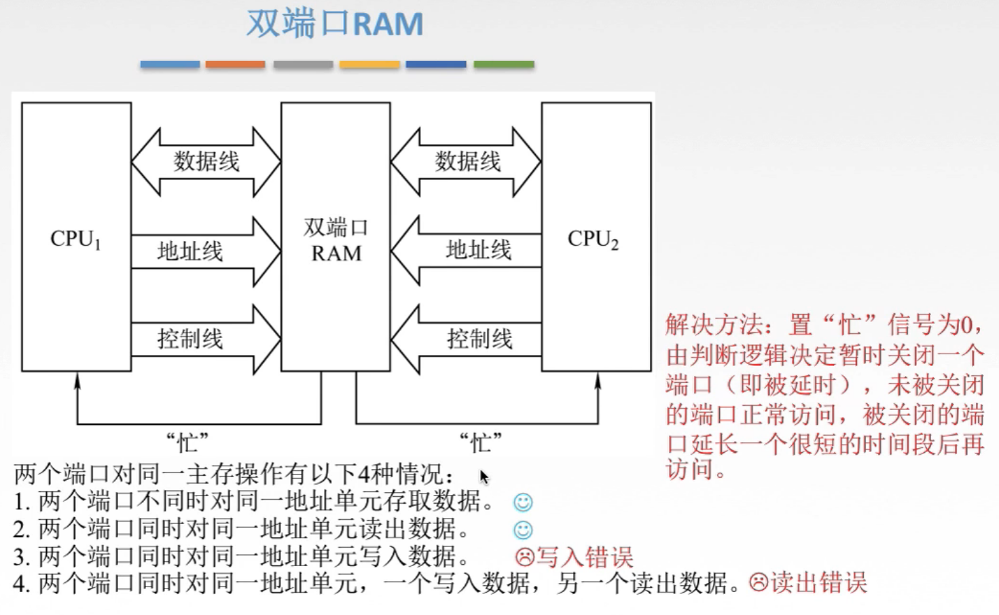

图3."忙"信号

如图3，当会出现冲突的时候，置"忙"信号 $\overline{BUSY}$ 为0，启动控制电路的工作，再由控制电路来决定谁先谁后。
这样就避免了冲突。

双端口RAM的提速效果，并不明显，而且需要两倍的接线。
当然再一些特别的地方可能会用到，比如需要两个CPU之间交换数据的场景。

这个双端口RAM不是重点。
下面这个解决方案才是重点。

## 二. 多模块处理器

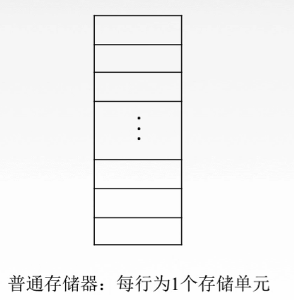

图4.普通存储器

先看普通的存储器，这个就很简单，每行是一个存储单元。每个地址就对应一行。

多模块存储器就是由多个这样的普通存储器构成。

### 2.1 单体多字存储器

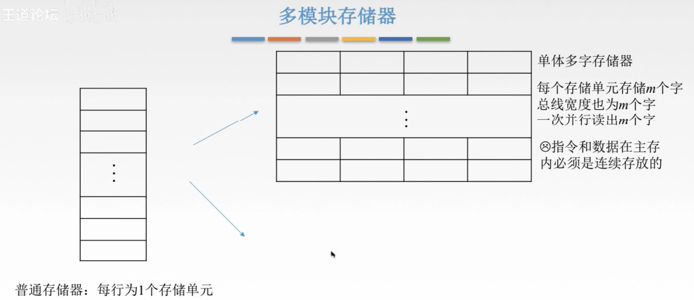

图5.单体多字存储器

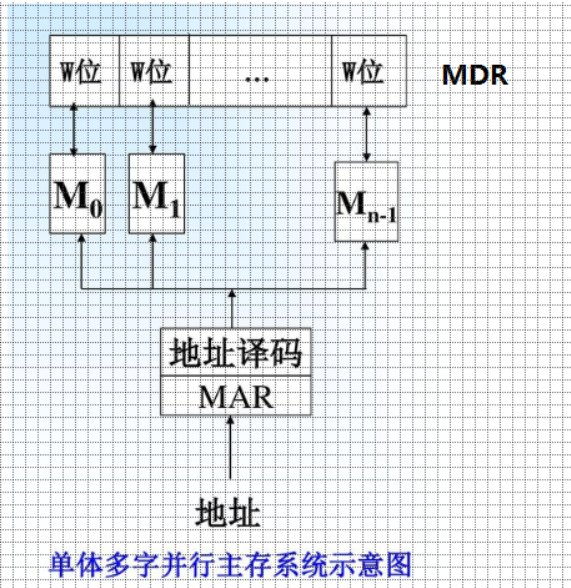

图6.单体多字存储器，网上找到感觉更容易理解

**单体多字存储器**：
将多个普通存储体并行工作，共用一套地址寄存器以及地址编码电路。

单体，指将多个存储体视为一体。多字，就是多字。

假设有m个存储器构成单体多字存储体，当CPU送出A地址到MAR，然后MAR送出的信号，并行送到每个存储体上，也就选中了每个存储体上A地址的存储单元，然后将每个存储体A地址的内容送到MDR，这样原本一次只能读1个存储单元，现在一下就能传输m个存储单元的数据了。

当然这样的话总线宽度也要变为m倍，或者传出数据先经过一个小的可以排队的硬件结构，依次送出。

那么要能够实现速度的提升，自然要求总线的宽度变为原本的m倍，为m个字。

但这样要求指令与数据在主存中必须是连续存放的。

指，单体多字存储器适用于指令和数据在内存中连续存放的情况，在这种情况下，可使得主存带宽提高 m 倍。但是，如果指令与数据分散，则效果不明显。

例如，比如从左到右，从上到下编号，1234//5678//...，那么我的指令与数据应该连续的按照 12345678 顺序进行存储。
而如果我第一条指令存在 1 ，而第二条指令存在 4，那第一次读出虽然能够并行地读出 1234 ，但只需要 1 中的第一条指令，
第二次并行读出 4567 也只需要 4 中的第二条指令。
麻烦又没有充分利用性能。

### 2.2 多体并行存储器

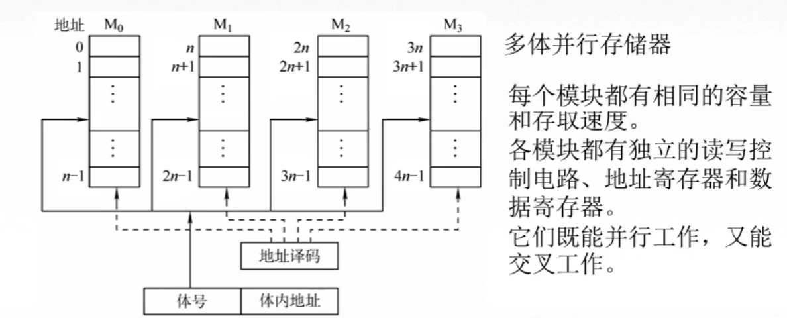

图7.多体并行存储器

与图6单体多次不同，多体并行存储器每个单独的存储器是具有自己独立的读写控制电路、地址寄存器和数据寄存器的。

每个存储器都具有相同的容量和相同的存取速度。（大概是为了方便设计和实现）

既然是独立的，那每个单独的存储器是能够**并行工作**的，当然也能**交叉工作**。

**并行工作**时，假设m个存储器，那么多体并行存储器是可以并行取出长度为mW的数据的，当然总线宽度也要变为m倍，或者传出数据先经过一个小的可以排队的硬件结构，依次送出。
这个时候的工作模式是类似于单体多字存储器的。

下面主要讲**交叉工作**：

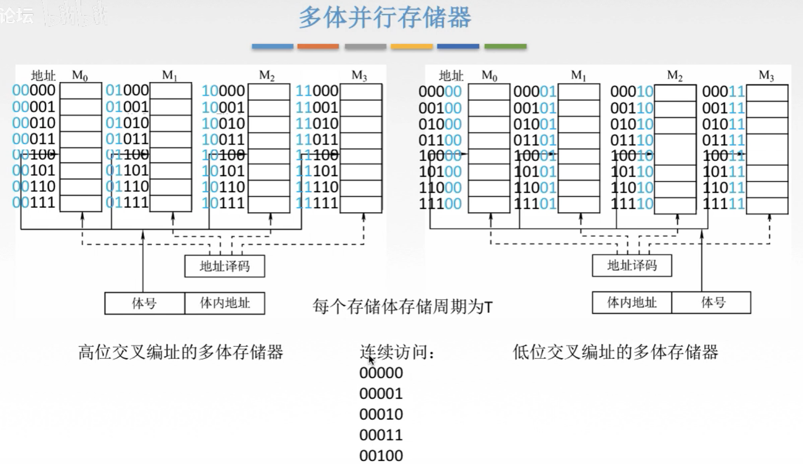

图8.多体并行存储器编址两种方式

图8中，假设为4块存储体构成，编号为 $M_0\sim M_3$ 。

#### 2.2.1 高位交叉编址

从上到下，从左到右编址。
可以注意到，可以使用高位来表示是哪块存储体，作为体号。

#### 2.2.2 低位交叉编址

从左到右，从上到下编址。
可以注意到，可以使用低位来表示是哪块存储体，作为体号。

假设每个存储体的存储周期为T，我们考虑连续访问一段连续的地址00000~00100（现实中计算机对存储单元的访问很多都是连续的，所以考虑这个是非常有意义的）。

为了方便分析，画时空图来分析。

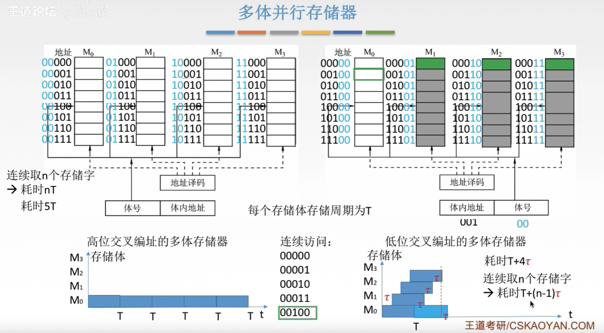

图9.高位交叉和低位交叉编址用时分析

图9下方为时空图，X轴为时间，Y轴为个存储体，方块为这段时间正在使用的存储体。

**高位交叉编址**：

显然00000~00100这段连续地址访问的都是存储体 $M_0$ ，只能依次进行存取。
总耗时：5T。
显然可以推出，访问n个连续的存储字，需要耗时nT。

感觉上就是实现了存储空间的扩容。

**低位交叉编址**：

访问的都是不同存储体，于是地址译码后，使用 $M_0$ ，
由于下一个访问地址处于另一个存储体中，于是无需等待 $M_0$ ，而是接受下一个地址，译码，使用 $M_1$ ，假设这段时间为 $\tau$ ；
重复这个操作，又经过 $\tau$ ，开始使用 $M_2$ ；
重复操作，又经过 $\tau$ 时间，开始使用 $M_3$ ；
下一个地址又为 $M_0$ 中的地址，在我们这个假设中只有4个存储器，如果设计的足够好的话，那么在经过 $\tau$ 时间，就会是 $M_0$ 刚好结束存取周期的时刻，于是又启动了 $M_0$ 。
总耗时： $T+4\tau$ 。
显然可以推出，访问n个连续的存储字，需要耗时 $T+(n-1)\tau$ 。

#### 2.2.3 流水线

流水线，就是指低位交叉编址的的多体存储体的工作模式。

会出题的，看题目是微观题还是宏观题。

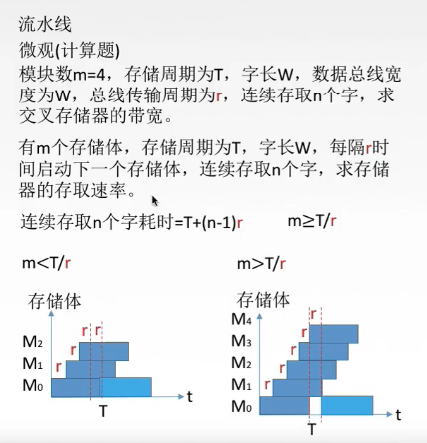

图10.流水线的微观题

微观题：

就是参数给的很详细的题。

题目，就是图10的题目。

中间部分是把题目翻译了一下。
有m个存储体，存取周期为T，字长为W，每隔r启动下一个存储体，求连续存取n个字的存取速率。

其实注意耗时 $T+(n-1)\tau$ 这个公式只能是在 $m\geq \frac{T}{r}$ 的时候才能用。
如图10左下方 $m<\frac{T}{r}$ 时，启动了 $M_2$ 后，所有存储体都在工作中，所以只能等待 $M_0$ 存取周期结束（这段时间没有利用），然后启动 $M_0$ 然后接着继续。所以不能等于 $T+(n-1)r$ 。
如图10右下方 $m\geq\frac{T}{r}$ 时，那么每隔 $r$ 时间都能启动一个存储体进行存取，时间充分利用，算出来就是 $T+(n-1)r$ 。（刚好等于的时候就是图9右下方的图，中间没有空隙）

一般来说，在设计的时候，直接设计为 $m\geq\frac{T}{r}$ 的结构就行。（就是让存储器m要多，随时都有存储器可以启动。）

求存取速率，也就是求带宽。
以 $r\times m\geq T$ 来解题，于是 $\begin{aligned}带宽=\frac{n\times W}{T+(n-1)r}\end{aligned}$ 。 

解题结束。

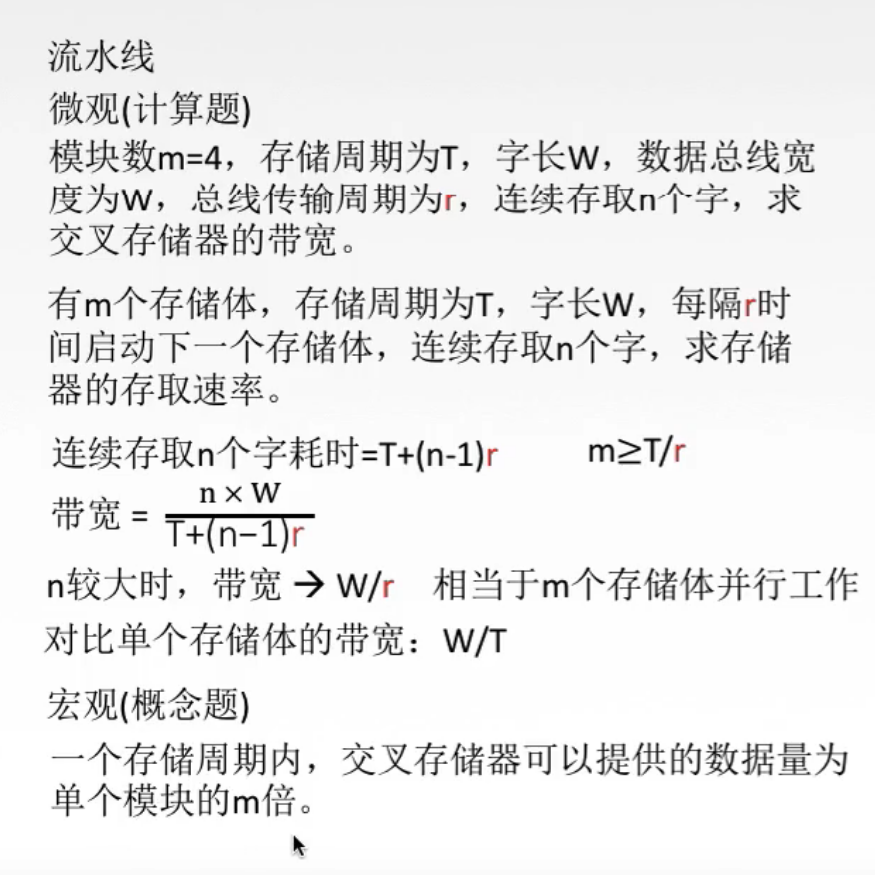

图11.流水线的宏观题

宏观题：

可以注意到，当n非常大时，忽略掉小的部分，
m个存储体组成的低位交叉编址的多体并行存储器： $\begin{aligned}带宽=\frac{W}{r}\end{aligned}$ 。 
对比单个存储体的带宽 $\begin{aligned}带宽=\frac{W}{T}\end{aligned}$ ，
可以发现， $\begin{aligned}\frac{m个存储体组成的...低位...多体并行存储器的带宽}{1个存储体的带宽}=\frac{T}{r}\end{aligned}$ 。
而我们一般设计时都会取 $m=\frac{T}{r}$ 的，
所以m个存储体组成的...低位...多体并行存储器，相当于m个存储体并行工作。

宏观题一般都是没有详细给你参数的，问你一些概念的题，比如图11最下面的一句话，正确。

## 三. 本节回顾

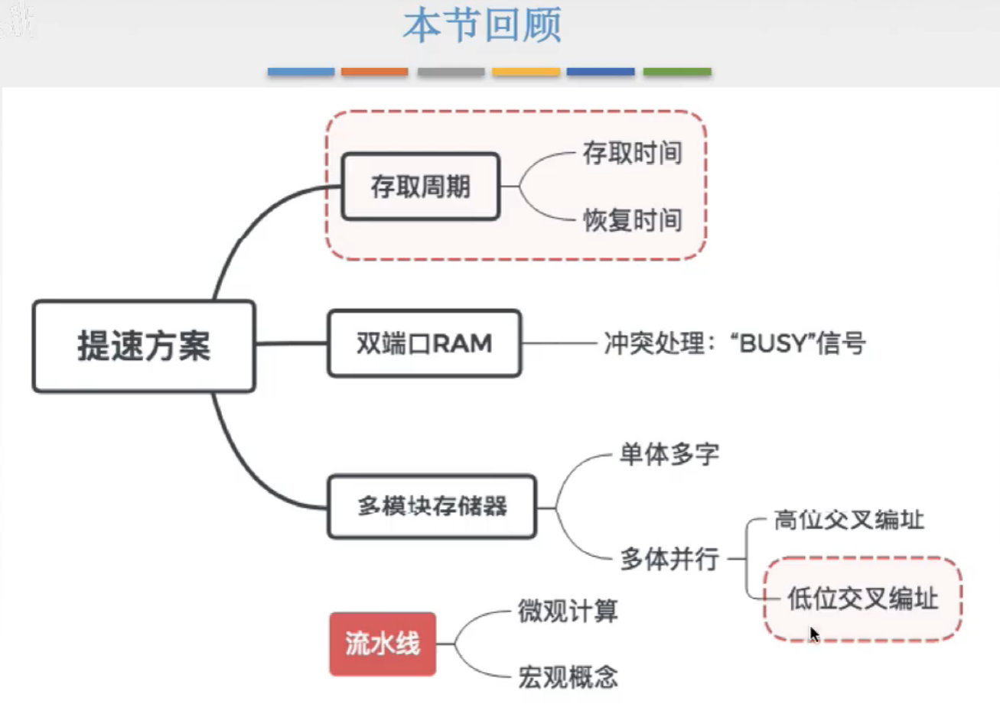

图12.本节回顾

2020.09.06

