# 指令格式

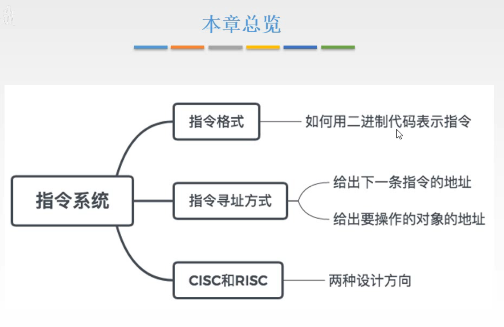

图1. 本章总览

这一章解决三个方向的问题：

1. 指令格式：
   如何使用二进制码来表示指令。
2. 指令的寻址方式：
   要解决的是计算机如何在指令的指导下进行工作。
3. CISC和RISC：
   解决上述问题的两种设计方式。

这一节，讲第一个问题，指令格式。

## 一. 指令

**指令**，又称机器指令：是指示计算机进行某种操作的命令，是计算机运行的最小功能单位。

一台计算机的所有指令的集合构成该计算机的**指令系统**，也称为**指令集**。

一台计算机只能执行自己指令系统的指令，不能执行其他系统的指令。
（指令是直接指示硬件进行工作，而不同计算机可能各自的硬件不同，设计的指令集也不同，所以只能使用自己的指令集。）

## 二. 指令格式

一条指令就是机器语言的一个语句，是一组有意义的二进制代码。

一条指令通常要包括**操作码字段**和**地址码字段**两部分。
操作码OP，地址码A。

操作码指出进行什么操作；地址码给出地址。

### 2.1 关于地址码的设计

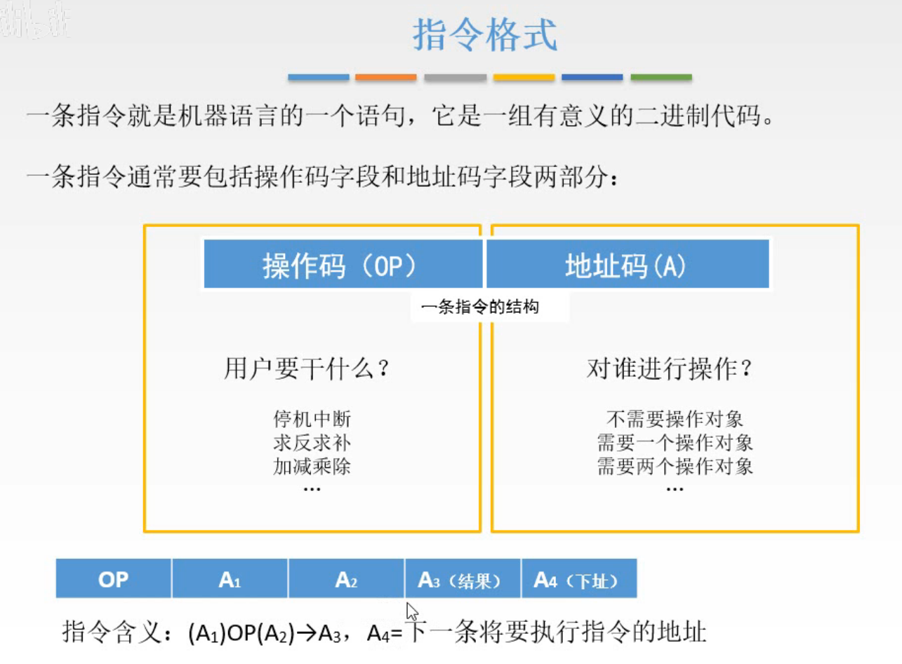

图2.指令格式

例如图2下方，我们来尝试自己定义一个指令格式。

该指令格式定义为 $OP+A_1+A_2+A_3+A_4$ ，含义为 $A_1$ 与 $A_2$ 地址所对应的操作对象进行OP操作，其结果存入 $A_3$ 处，下一条指令的地址在 $A_4$ 处。

简单的使用一些符号来表述： $(A_1)OP(A_2)\rightarrow A_3$ ，下一个指令地址为 $A_4$ 。其含义就是刚才说的意思。
地址不加括号为地址，加括号其实就是表示里面的内容。

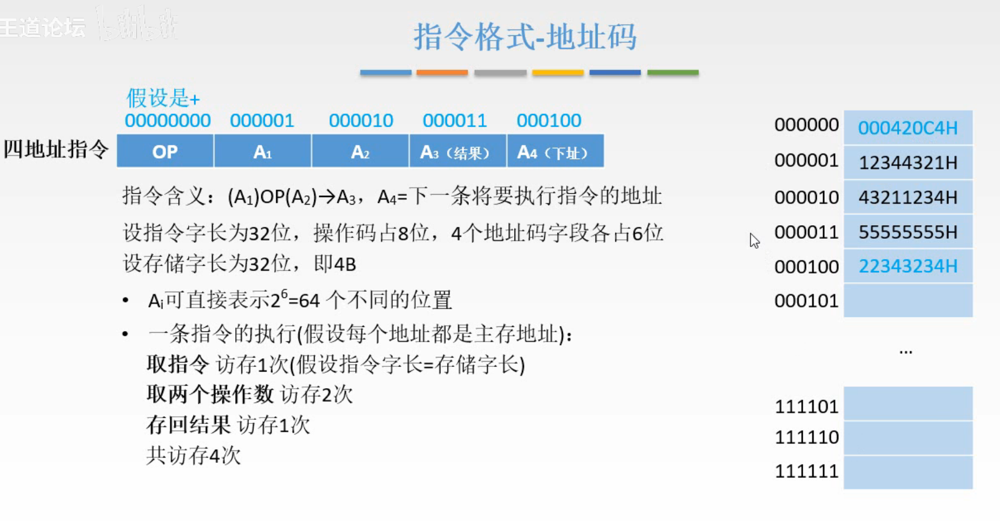

图3.

接着设计这个指令格式 $OP,A_1,A_2,A_3,A_4$ 各占的位数。

先假设指令字长为32位，我们就采用OP占8位，A都各自占6位。
再假设存储字长为32位，这样刚好一个存储单元放入一个指令。

那么假设现在这条指令为 00000000 000001 000010 000011 000100（000420C4H），存在主存000000中。
图3右方，蓝色存的指令，黑色是数据。

可知该指令需要进行4次访存。（当然是建立在指令和数据都在主存中，且指令字长=存储字长时）
首先从主存000000中取出指令，1次；
取000001，00010两个操作数，2次；
存入000011，1次；
共4次。
至于 $A_4$ 那就是下一条指令的事了。

这样的话，发现用于表示地址的A只有6位，只能表示 $2^6=64$ 个地址，太小啦。

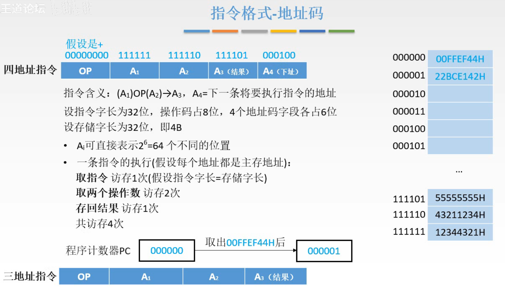

图4.优化一下

可以想到，我们将指令和数据分开存，将指令存在一起，而且是按执行顺序存在一起。

使用**程序计数器（PC）**，存着指令地址，在执行完一条指令后，自动+1，然后去对应地址取指令就行了。

这样原本的我们的**四地址指令**，就可以省出一个指明下一条指令地址的 $A_4$ 的位数，变为了**三地址指令**。

由此原本4个地址每个6位，可以变为3个地址每个8位，寻址范围增加到了 $2^8=256$ 。

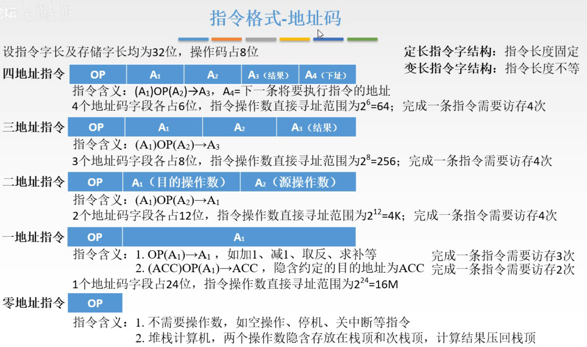

图5.X地址指令

同样的，如果一个指令中，能够减少需要表达的地址个数，就可以增加能够表示的地址范围。

**三地址指令**：

指令含义： $(A_1)OP(A_2)\rightarrow A_3$ ；

完成一条指令需要访存4次。
寻址范围 $2^8=256$ 。

**二地址指令**：

指令含义： $(A_1)OP(A_2)\rightarrow A_1$ ； 
对 $(A_1),(A_2)$ 进行OP的结果存放在 $A_1$ 中，就又省下一个地址的位置。
比如常用的算术和逻辑运算。

完成一条指令需要访存4次。
寻址范围 $2^{12}=4K$ 。

**一地址指令**：

指令含义： $OP(A_1)\rightarrow A_1$ ；
对 $(A_1)$ 进行OP的结果就存放在 $A_1$ 中，这样就只用一个地址了。
比如自增1，自减1，取反，求补等操作。

完成一条指令需要访存3次。

还有另一种操作：
指令含义： $(ACC)OP(A_1)\rightarrow ACC$ ；
对 $(ACC),(A_1)$ 进行OP操作，其结果就放在ACC中，这样就不用再访存存入主存了。

完成一条指令需要访存2次。

寻址范围 $2^{24}=16M$ 。

**零地址指令**：

当这个操作不需要操作数时，比如空操作，停机，关中断等指令。

或者堆栈计算机，两个操作数是默认放在栈顶和次栈顶的，结果压回栈顶，所以省掉了。

完成一条指令需要访存4次。

在前面的内容中，都是以定长指令字结构来讲述的，

按指令字长是否可变来划分，可分为：

1. **等长指令字结构**——指令系统中的所有指令字的长度都相等

   特点：
   可以都为单字长指令或半字长指令等
   结构简单，控制方便。

2. **变长指令字结构**——指令系统中的各种指令字的长度因功能而异，可以采用不同位数。

   特点：
   结构灵活，充分利用指令长度，但控制较复杂
   为提高指令运行速度和节省存储空间，设计指令系统时，通常尽可能把常用的指令设计为单字长或半字长格式

等长，就是所有指令都是相同长度，不一定非得是小于等于单字长。
变长，就是有长度不同的指令，比如有的指令是单字长，有的指令是两字长，有的是半字长。

对于变长，我理解的是，有的指令比较复杂，需要较多位数，但如果按照等长来设计，那么就会使其他根本用不着这么长位数的指令，占用的位数也与最长的指令占用的位数一样。
所以为了节省空间，一个指令需要多少位，那就给它刚好多少位（实际上还是字节的整倍数），就避免了短的指令与长的指令占用相同的位数而引起浪费。

不过实际上，指令的长度都是字节的整倍数

### 2.2 关于操作码的设计

关于操作码的设计有两个思路：

**定长操作码**：操作码OP的位数固定不变，n位操作码对应 $2^n$ 不同操作码。

**变长操作码**：最常见的变长操作码的实现方式是**扩展操作码**。

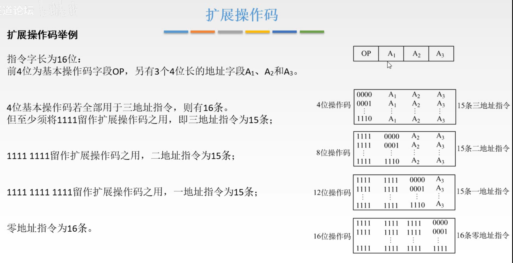

图6.扩展操作码

为了方便讨论，假设指令字长为16位，最高4位为**基本操作码**字段，另有3个4位长的地址字段 $A_1,A_2,A_3$ 。

那么定长操作码来说，OP固定为4位，所以只能够表示16条不同的操作。

扩展操作码的意思是，4位基本操作码，留着1111作为扩展操作码使用，当最高4位为1111时，变为二地址指令，于是三地址指令为15条；

当基本操作码为1111时，则变为二地址指令，其最高8位变为了操作码，当然二地址指令同时保留1111 1111 用于识别为一地址指令，于是二地址指令为15条；

同样的，当最高8位为1111 1111时，变为一地址指令，最高12为变为了操作码，同时保留1111 1111 1111用于变为零地址指令，于是一地址指令为15条；

零地址指令，1111 1111 1111 0000~1111 1111 1111 1111，不用保留1111了嘛，所以共16条。

个人感觉，前面讲的是指令字长不变，操作码长度不变，每省掉一个地址，就增加寻址范围；这里是指令字长不变，地址长度不变，用不到那么多地址的操作，就省下地址的位数用于扩展操作码能表示的操作个数。

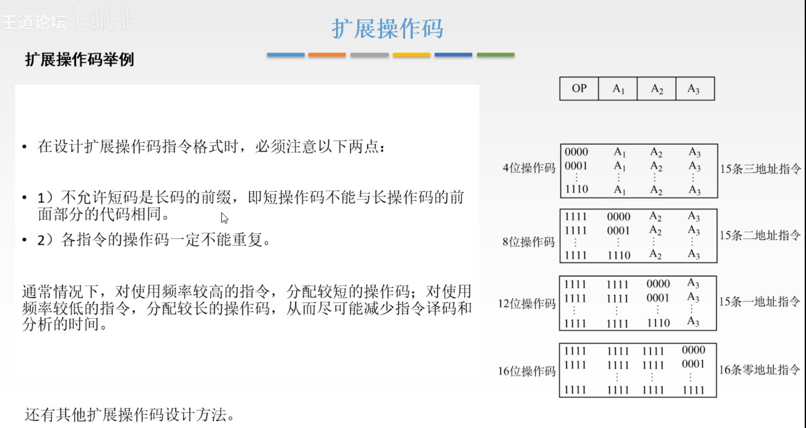

图7.

当然拓展操作码还有其他实现方式，刚才讲的是每个X地址指令，只保留了一个状态来进行扩展，那自然使用多个状态来进行扩展也是可以的。

只要注意以下两点：

1. 短操作码不能是长操作码的前缀；
   显然嘛1111作为了后面X地址指令的扩展，那1111本身就不能作为三地址操作码了。
2. 各指令操作码一定不能重复；

通常，使用频率高的操作，分配短的操作码；使用频率低的操作，分配比较长的操作码；从而尽量减少指令译码和分析的时间。
理解为读高位4位的时候需要判别是否是1111，所以操作码短那自然快，如果操作码为1111 1111 1111 0001，那就得判别3次是否为1111，自然比短的操作码慢。

#### 2.2.1 操作码例题

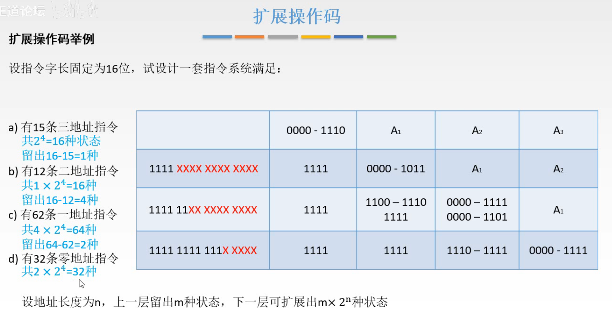

图8.操作码例题

15条三地址指令，
0000-1110 为三地址指令；

12条二地址指令，
1111 0000-1111 1011为二地址指令；
前面三地址指令留出了16-15=1种状态，于是二地址还需要表示12种状态；

62条一地址指令，
1111 1011 0000-1111 1111 1110为一地址指令；
二地址指令留出了16-12=4种状态，62=64-2，所以还需要表示16-2-14种状态；

32条零地址指令，
1111 1111 1110 0000-1111 1111 1111 1111；
一地址指令留出了16-14=2种状态， $32=16\times 2$ ，所以还需要表示16种状态。

如果遇到设计题目要的是30条零地址指令，那就挑出两个编码不要。

#### 2.2.2 关于操作码设计回顾

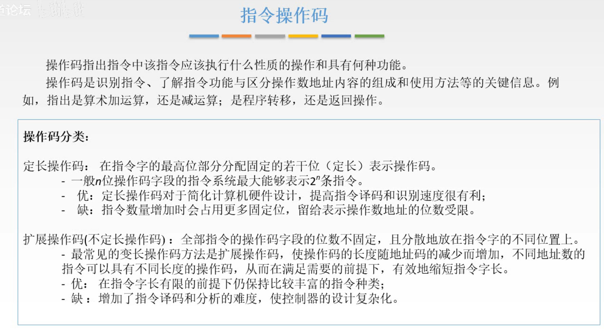

图9.关于操作码的设计

定长操作码：

一般多用于字长比较长的机器上。
操作码位数固定，优点是硬件上方便实现，速度快点。
缺点是，留给操作数的地址位数受限。

扩展操作码：

一般多用于字长不长的机器上。
操作码位数不固定，优点是在指令字长有限的情况下丰富了指令种类，
缺点，但是设计起来比较复杂，速度会降低。

## 三. 操作类型

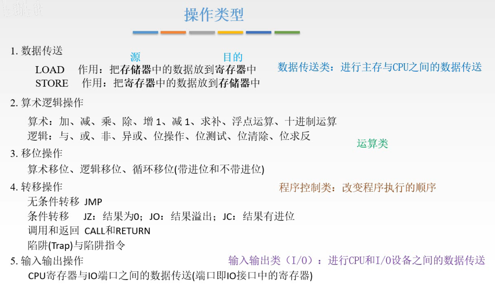

图10.操作类型

分类：

1. 数据传送类：

   机器内部的一些数据传送，比如LOAD，把存储器中的数据放入寄存器中；STORE，把寄存器中的数据存到存储器中。

2. 算术逻辑操作：

   算术：加、减、乘、除、自增1，自减1，求补、浮点运算、十进制运算。
   逻辑：与、或、非、亦或、位操作、位测试、位清除、位求反。

3. 移位操作：

   算术移位、逻辑移位、循环移位（带进位和不带进位）。

4. 转移操作：

   主要用来优化程序设计的转移操作。

   无条件转移 JMP
   条件转移 JZ：结果为0；JO：结果溢出；JC：结果有进位。
   涉及到函数的，调用与返回 CALL和RETURN。
   处理异常的，陷阱（Trap）与陷阱指令。

5. 输入输出操作：

   作用也是数据的传送，只不过是计算机内部和外部的传送，计算机内部由寄存器来负责，外部由I/O端口来负责。I/O端口也就是外设当中的寄存器，准确说是I/O接口中的寄存器。

另一种分类：

1. 数据传送类：

   进行主存和CPU之间的数据传送。

2. 运算类：

   上面分类的2，3。

3. 程序控制类：

   上面分类的4。改变程序执行的顺序。

4. 输入输出类

   进行CPU和I/O设备之间的数据传送。

## 四. 本节回顾

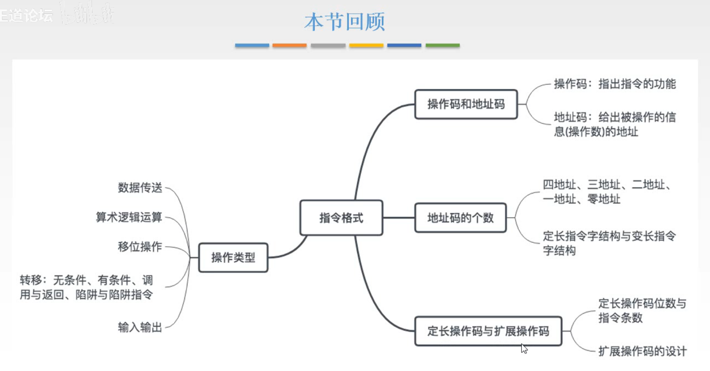

图11.本节回顾

2020.09.10