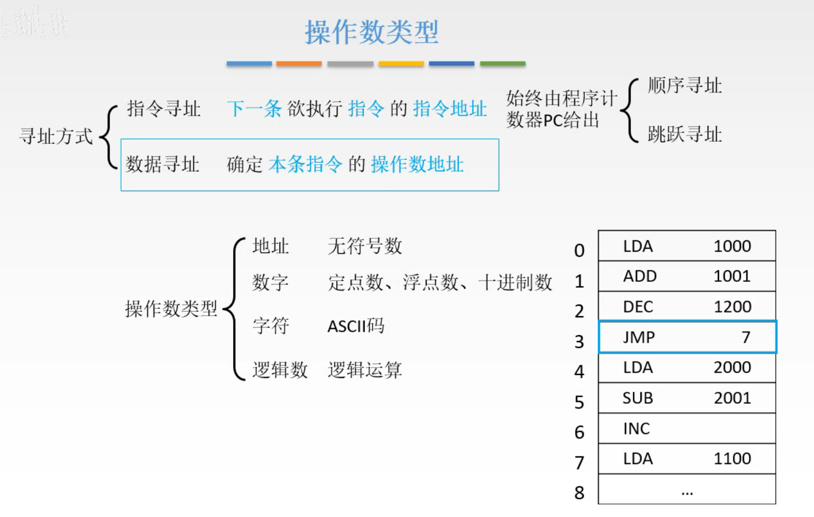
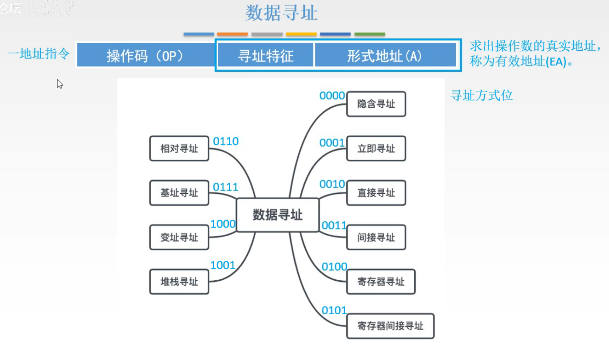
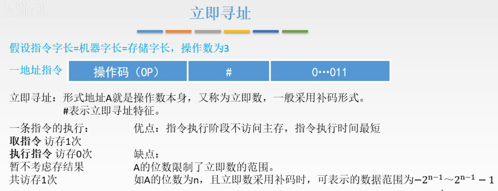
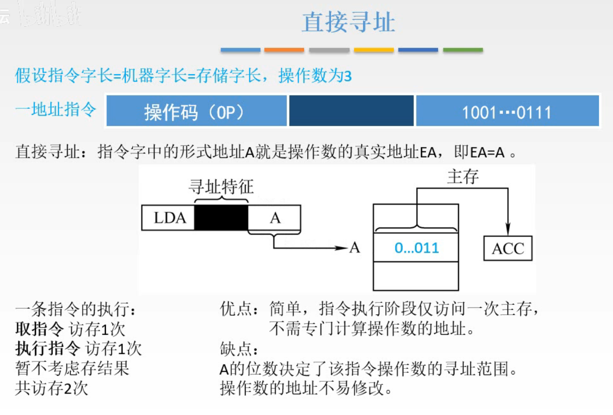
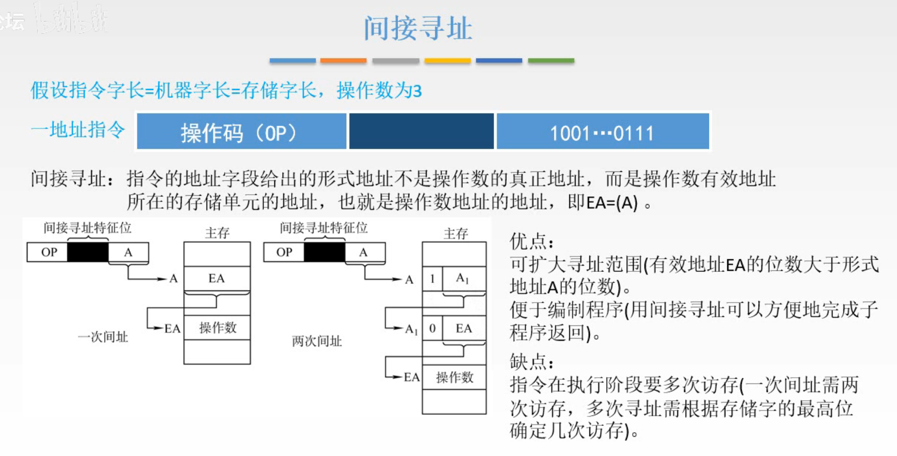
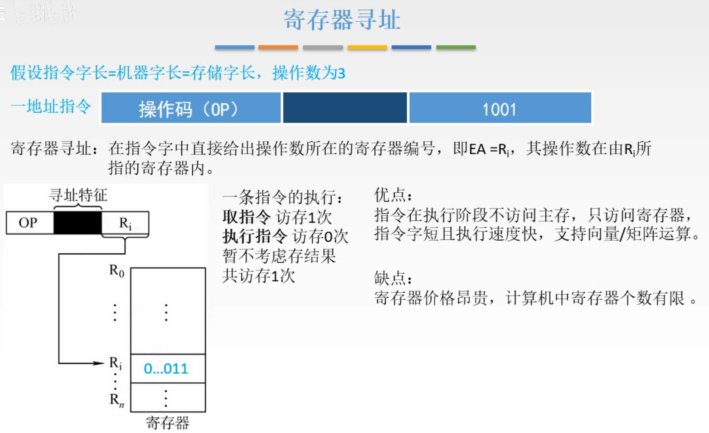
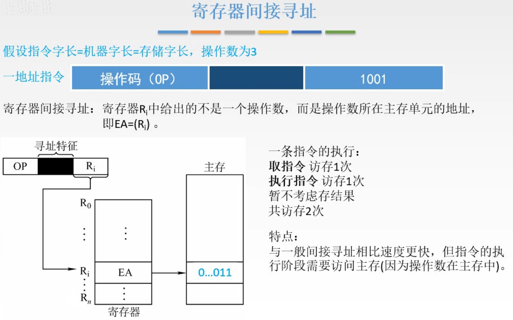
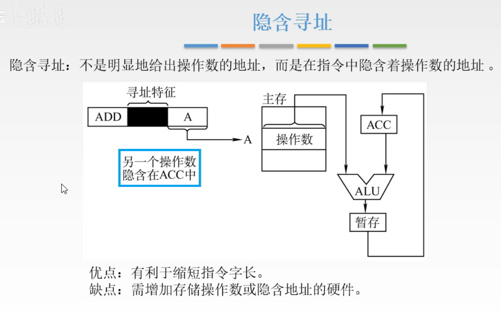
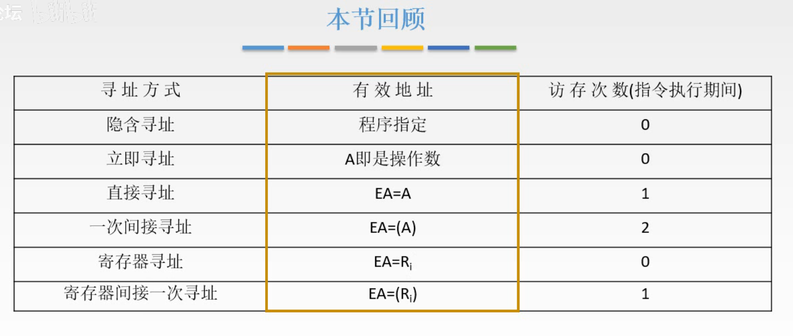

# 数据寻址

上一节讲了数据的存放，大端小端模式，边界对齐；以及指令寻址方式。

这节讲，如何在指令中表示一个操作数的地址，如何用这种表示得到操作数或者怎样计算处操作数的地址。

## 一. 操作数类型

图1.操作数类型

简单了解一下， 操作数的类型。

## 二. 数据寻址

图2.数据寻址方式

可以看到数据寻址有着很多种寻址方式，以一地址指令为例，我们可以想到，在地址A前，使用几位二进制位，来表示这条指令为什么寻址方式，这几个二进制位称为**寻址特征**。

（图2中的寻址特征0000，0001都是随便写的，不是真的就是这个映射= =）

这样，地址部分就叫做**形式地址**，这是因为现在这个地址不一定就是操作数的地址，而更多时候是得到形式地址，还要根据寻址特征，从而进行不同操作才转换为**有效地址（EA）**，即操作数的真实地址。

图3.二地址指令

同样的，二地址指令，原本的每个地址变为寻址特征+形式地址的形式。

三地址、四地址指令也同样的。

### 2.1 立即寻址

图4.立即寻址

立即寻址：
形式地址A就是操作数。又称为**立即数**，一般采用补码形式。

寻址特征：#，这个#实际上是几位二进制数啊，只是通常立即寻址的寻址特征用这个#来表示，比如汇编语言里就是用#表示立即寻址。

访存次数：1次。
取指令1次。

优点：速度最快；
缺点：表示范围受形式地址A的位数限制。

### 2.2 直接寻址

图5.直接寻址

直接寻址：

形式地址A就是操作数的地址，即EA=A，形式地址就是有效地址。

寻址特征：就不说了，不同题目不一样，包括后面的数据寻址方式，就不说寻址特征了，具体看题目给。

访存次数：2次。
取指令1次；
取操作数1次。

优点：简单，速度快，指令执行阶段只用访问1次主存；
缺点：形式地址A的位数限制了寻址范围；操作数地址不易修改。

### 2.3 间接寻址

图6.间接寻址

间接寻址：

一次间址：形式地址A指向的存储空间中存储的是操作数的地址，即 $EA=(A)$ 。
二次间址：形式地址A指向的 $A_1$ ， $(A_1)$ 是 $(EA)$ 的地址， $(EA)$ 是操作数的地址。通过存储单元前增加的一位用来判断是否是操作数地址，为0其存储的是操作数地址，为1则不是。

访存次数：
一次间址：3次；
二次间址：4次；

优点：扩大了寻址范围（毕竟一个存储空间的位数大于指令中的A的位数）；便于编制程序；地址容易修改。
缺点：需要多次访存。

### 2.4 寄存器寻址

图7.寄存器寻址

寄存器寻址：

形式地址A为寄存器的编号 $R_i$ ，即 $EA=R_i$ 。

访存次数：1次
取指令1次。

优点：执行阶段不访问主存，只访问寄存器；速度快（没有立即寻址快，毕竟立即寻址操作数都在指令里），因为寄存器数量少，所以A所需位数少，所以指令字短，；支持向量、矩阵运算。
缺点：寄存器太贵啦，所以缺点就是贵，寄存器数量少。

### 2.5 寄存器间接寻址

图8.寄存器间接寻址

寄存器间接寻址：

形式地址A为寄存器的编号 $R_i$ ，寄存器 $R_i$ 中是操作数的地址，即 $EA=(R_i)$ 。

访存次数：2次
取指令1次；
取操作数1次。

特点：比一般的间接寻址快（毕竟取地址是在寄存器里取）。

### 2.6 隐含寻址

图9.隐含寻址

隐含寻址：

是指该指令的操作就默认了，隐含了另一个操作数的地址。
（大概理解为看到这个操作数就知道要去默认的地址取数吧= =）

如图9，给出的形式地址A，可以是前面任一种寻址特征，另一个操作数是ACC中的数，进行操作后存入ACC中。

注意哦，隐含寻址是指有一个操作数是隐含的，实际上隐含寻址中的形式地址，是采用的上述数据寻址方式的。

优点：有利于缩短指令字长（毕竟不用写隐含的操作数的地址）
缺点：需要增加存储操作数或隐函地址的硬件。

## 三. 本节回顾

图10.本节回顾

这图只分析了指令执行期间的访存次数，也就是没算取指令这次访存。

2020.09.11