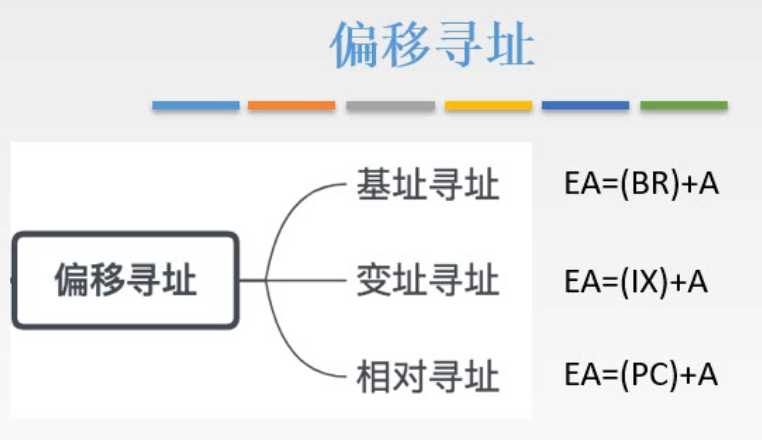
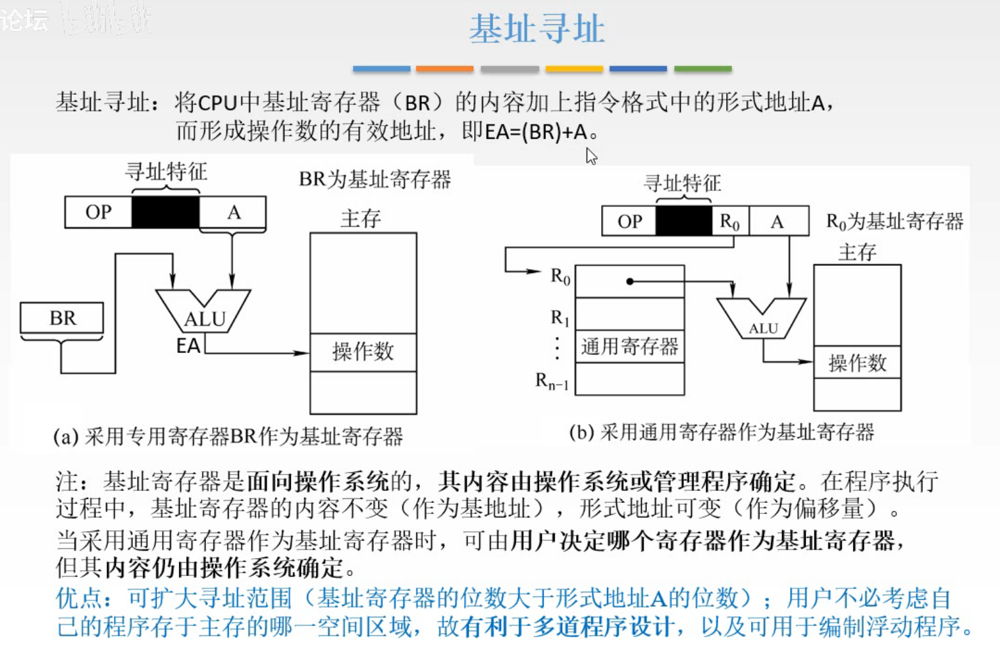
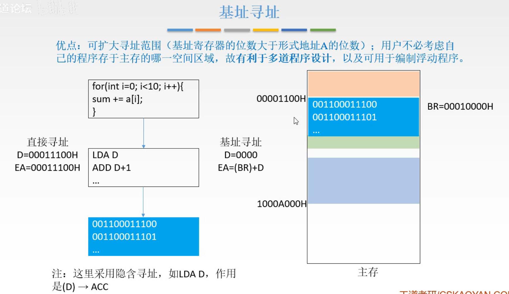
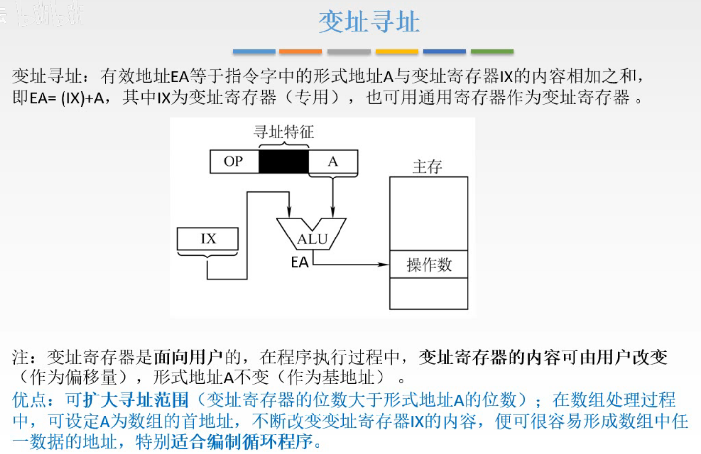
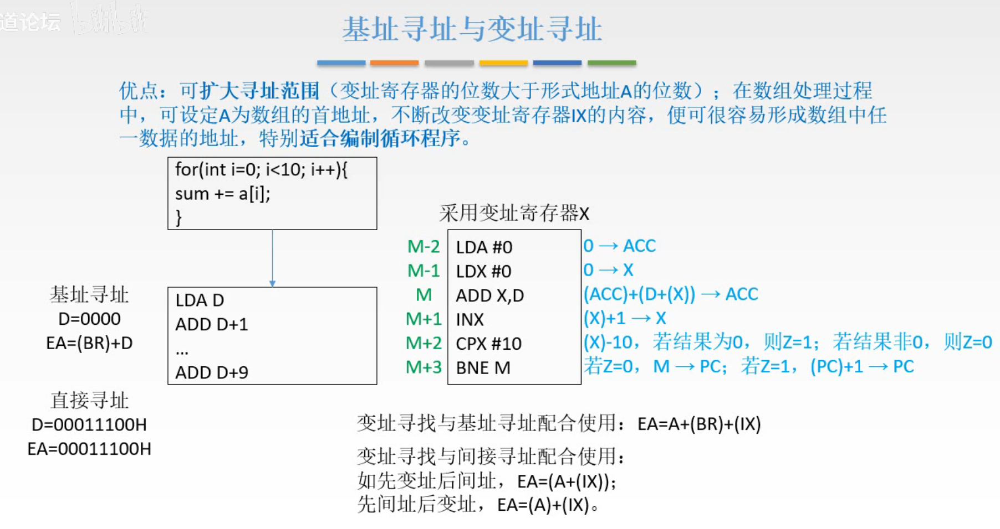
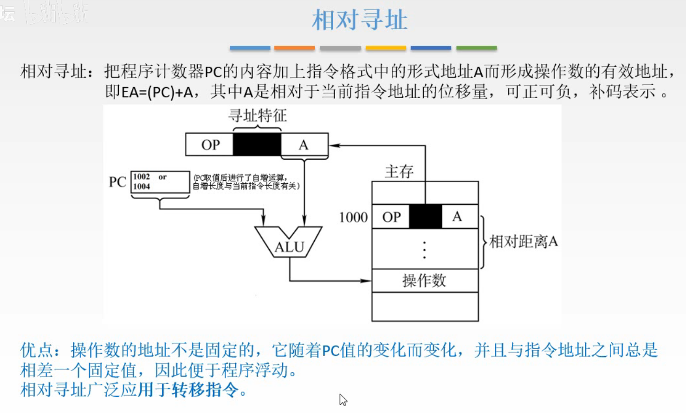
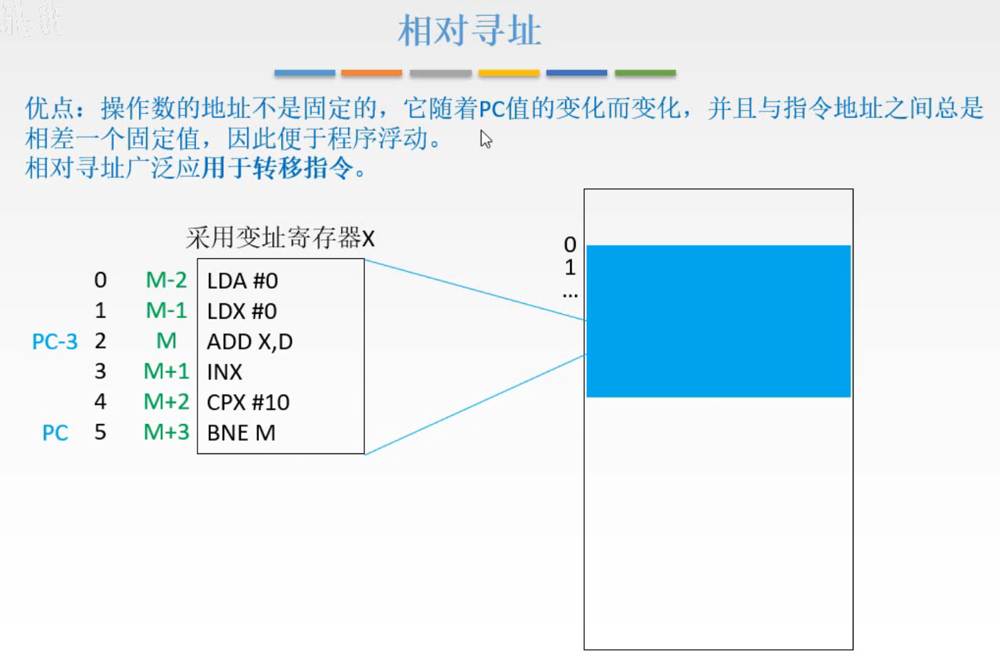
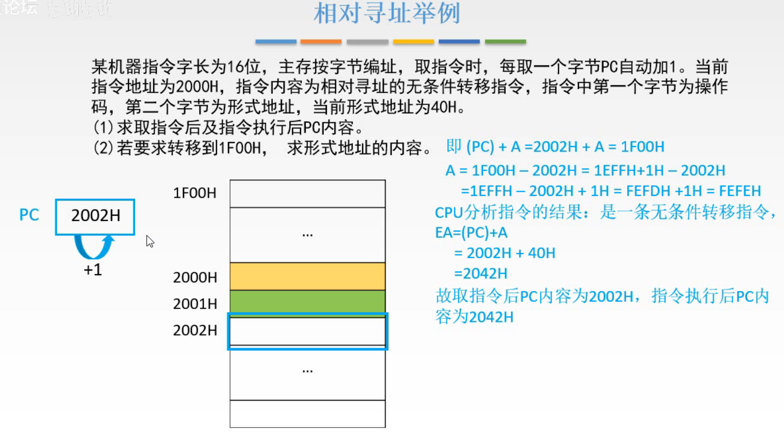
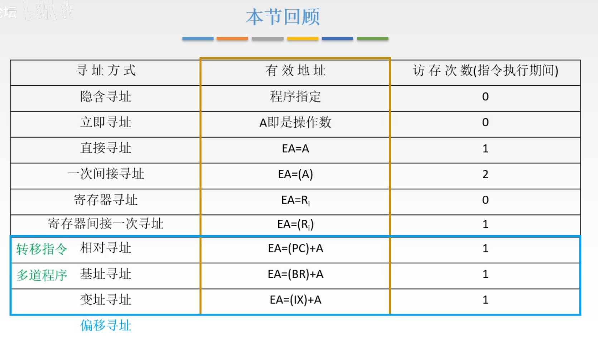

# 数据寻址-偏移寻址

图1.偏移寻址

上一节讲了数据寻址中的大约一半的寻址方式，立即、直接、间接、寄存器、寄存器间接、隐含寻址，这一节讲剩下四种寻址中的**偏移寻址**的中的三个。

偏移寻址，偏移嘛，那自然是有一个参照物，然后也有离该参照物的距离是多少。
自然，从图1不难看出，三种偏移寻址中的有效地址EA，都是某一个地址（参照物）加上形式地址（离参照物的距离）。
当然下面的用词是基地址（参照物）和偏移量（离参照物距离）。

## 一. 基址寻址

图2.基址寻址

基址寻址：

将CPU中的**基址寄存器（BR）**的内容，加上指令格式中的形式地址 A，形成有效地址，即 $EA=(BR)+A$ 。

当然也可以使用图2（b）的方式，不使用专门的BR，而是使用通用寄存器来作为BR，这样的话指令中就需要占用几位二进制位来指出是哪个通用寄存器。
采用专门的BR的话，如图2（a），就不需要占用几位来指出哪个寄存器。其操作隐含在操作码中，只要进行基址寻址就知道要去专门的BR中取数。

基址寄存器是**面向操作操作系统**的，其内容是由**操作系统或管理程序确定**。程序执行过程中，BR的内容不变（作为基地址），形式地址可变（作为偏移量）。**用户无法修改**。

当采用通用寄存器时，虽然用户可以决定使用哪个寄存器，但其内容仍然**由操作系统决定**。

优点：

1. 扩大寻址范围；
   因为基址寄存器的位数大于形式地址A的位数，两者相加之后，位数就是BR的位数了。
   这个优点三种偏移寻址都有= =。
2. **有利于多道程序设计**，用户不必考虑自己的程序在主存中的哪部分。
3. 可用于编制浮动程序。

图3.基址寻址特点

来解释图3，

比如写了一个程序，就是图3中的循环求和程序吧，那么整个程序运行是要先存入主存中的，假设数据是连续存在一起的，也就是把 $a[0]\sim a[9]$ 这 10 个数连续存在主存。
那么我们将 $a[0]$ 的地址 0001 0000 作为基址存入BR，在这个循环求和程序运行中采用基址寻址，于是每条指令的形式地址为 $0000,0001,....,1010$ ，每次基址寻址， $EA=(BR)+A$ ，就能够找到主存中的位置了。

这样，指令中的地址就不用写完整的主存的地址（省了位数），也不用关心每一个 $a[i]$ 在主存中的地址是多少了。

便于多道程序的设计，是指多个的程序，通常都是各自连续存储，那么只需要由操作系统根据主存使用情况，修改BR中的地址，就可以讲用户使用的逻辑地址转化为主存中的实际地址。

可用于编制浮动程序。程序浮动是指程序可能从内存的一部分移动到另一部分。我懂了，如果使用的是实际地址，要改存入内存的位置就非常麻烦，比如我要存入的内存空间被占用了，那这时我要换个地方存，如果采用基址寻址，只需要修改基址就行了。

顺道看到了书上的一句话，基址寄存器主要用于为程序或数据分配存储空间，故基址寄存器的内容通常由操作系统或管理程序确定，在程序的执行过程中BR的值是不可变的。

## 二. 变址寻址

图4.变址寄存器

变址寻址：

将**变址寄存器（IX）**的内容，加上指令格式中的形式地址A，形成有效地址，即 $EA=(IX)+A$ 。

同样的，可以使用专门的IX，也可以使用通用寄存器来作为变址寄存器，当然使用通用寄存器的话需要在指令中占用几位来指出是哪个通用寄存器。（图4里没画使用通用寄存器的图）

变址寄存器是**面向用户的**，在程序执行过程中，变址寄存器中的内容**可由用户改变**（作为偏移量），形式地址A不变（作为基地址）。
注意到，这里的基地址是A，反而变址寄存器里的内容是偏移量（怪不得叫变址寄存器）。
实际上变址寄存器会提供如自增1，自减1的功能，所以经常用于循环程序。

优点：

1. 扩大寻址范围。
   这是三种偏移寻址都有的呀。
2. **适合编制循环程序**。适合处理数组问题。

图5.变址寻址特点

还是之前的例子，如果采用基址寻址，那么ADD D+1这样ADD的指令，就要写9行，那如果是100个数求和，就有99行ADD的指令。直接寻址也是。相当于n个数求和，就需要写n条指令。

采用变址寻址的话，就可以使用一个简单的循环来完成。如图5。
LDA #0：把0存入ACC，
LDX #0：把0存入变址寄存器X，
ADD X,D：把D地址中的操作数和D+X地址中的操作数相加，存入ACC，
INX：变址寄存器自增1，
CPX #10： $(X)-10=0?z=1:z=0$ ，
BNE M：Z=0，修改PC中地址为ADD X,D指令的地址；z=1，PC内的数自增1。

所以适合循环程序呀。
而且为什么适合处理数组，那是因为数组是连续存放的呗。

实际上我感觉，就算用直接寻址，基址寻址什么的，也可以循环，只要使用内存中的一个数来计数就能完成循环，但是，诶，内存中，而寄存器是在CPU中，大概这就是为什么会有变址寄存器的出现吧。
所以是因为寄存器自增1快，所以把不变的基址是A，变化的偏移量是变址寄存器咯。

刚才是把程序作为在主存中连续存放来分析的，那么如果使得该程序在主存中的存放不是连续的呢。
所以实际情况是多种寻址方式混合着来使用的，
比如基址寻址与变址寻址配合使用： $EA=A+(BR)+(IX)$ ；这样既能实现程序在主存当中的浮动，也能实现循环的操作。
比如间接寻址与变址寻址配合使用：
先变址再间址： $EA=(A+(IX))$ ；
先间址再变址： $EA=(A)+(IX)$ 。

## 三. 相对寻址

图6.相对寻址

相对寻址：

将**程序计数器（PC）**的内容，加上指令格式中的形式地址A，形成有效地址，即 $EA=(PC)+A$ 。

这里的形式地址A是相对于当前地址的位移量。
基址寻址中的A是相对于一个固定的地址的偏移量，而相对寻址就是变化的，是相对于当前地址的偏移量。自然而然的想到，常用于转移类指令。

优点：

1. 操作数的地址不是固定的，它可随着PC值的变化而变，并且于指令地址之间总是相差一个固定值，因此便于**编写浮动程序**。
2. 广泛用于转移指令。

图7.相对寻址特点

如图7，在变址寻址中讲的是，BNE，M，其中M是ADD X,D的地址，把M写入PC就跳回了ADD X,D指令。

但是假设我们这个循环求和程序是一个大程序中的一部分，是可能被多次调用的，而多次调用，每次这个循环求和程序不一定都在主存中的固定的位置，是有可能存入主存的位置改变了的，那么每次都要修改M为当前ADD X,D的地址。

而注意到，BNE M和ADD X,D的相对位置是不变的。
所以相对寻址的方式就是，不用写M的地址，而是写相对位置，刚好PC中不是正好有下一条指令的地址嘛，所以用PC中的地址加/减相对位置，就是跳转的位置啦。

图8.相对寻址举例

读题：

指令字长为2B，主存按字节编址，当前PC中为2000H，每取一个字节PC自动加1。

第一问：

PC中为2000H，取2000H中的内容，PC自增1，而2000H只有1B，而指令字长为16位，所以一条指令没有取完；
PC中为2001H，取2001H中的内容，PC自增1，这时才取完了一条完整的指令。
PC中为2002H，方才取出的指令的内容为，无条件转移指令，形式地址为40H，于是执行指令： $EA=(PC)+40H=2042H$ 。

第二问：

 $\begin{aligned}1F00H&=(PC)+A\\1F00H-2002H&=A\\1H+1EFFH-2002H&=A\\1H+FEFDH&=A\\A&=FEFEH\end{aligned}$ ，

因为都是补码形式存在的，所以中间 $1EFFH-2002H$ 看起来不够减，应该是负的。实际上是因为计算机里只有加法， $2002H$ 到 $1F00H$ 自然是加A，高位溢出了。所以从高位借位来算就行了。

### 四. 本节回顾

图9.本节回顾

要知道各个寻址方式的有效地址是怎么得出的。

三种偏移寻址的优点，适合什么程序、指令。

2020.09.12