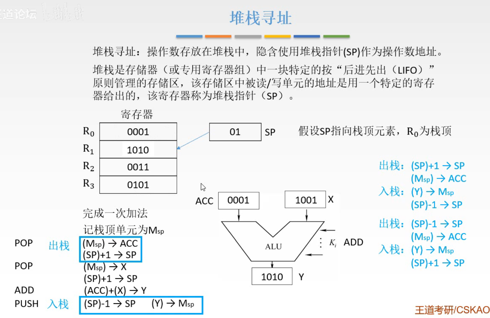
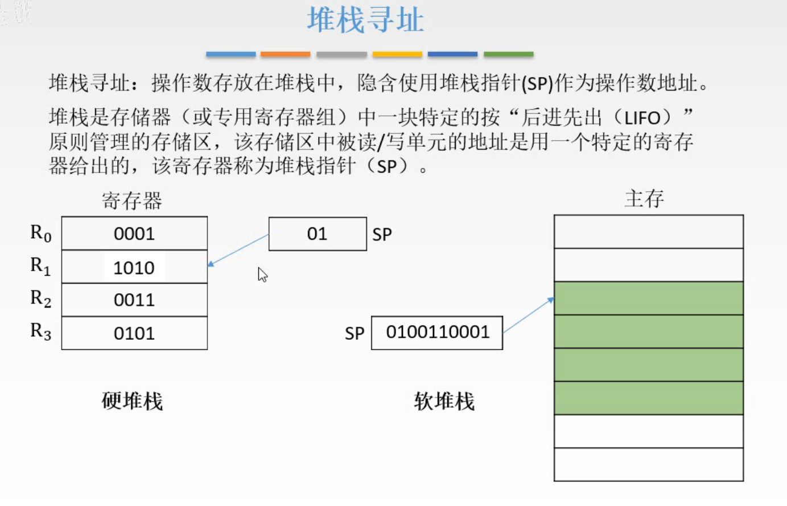

# 数据寻址-堆栈寻址

隐含寻址中，给出了一个操作数地址，隐含了一个操作数地址。

堆栈寻址，借助堆栈，所有操作数地址都隐含表示。

## 一. 堆栈寻址

图1.堆栈寻址

堆栈寻址：

操作数存放在堆栈中，隐含使用**堆栈指针（SP）**作为操作数地址。

堆栈：是存储器（或专用寄存器组）中一块特定按"后进先出"（LIFO）原则管理的存储区，该存储器中被读/写的地址是用一个特定的寄存器给出，改寄存器称为堆栈指针（SP）.

如图1，4个寄存器，后进先出原则，来完成一次加法。
（出栈）取第一个数到ACC：SP中为00，取出 $M_{SP}\rightarrow ACC$ ，$(SP)+1\rightarrow SP$ ，
（出栈）取第二个数到X：SP中为01，取出 $M_{SP}\rightarrow X$ ，$(SP)+1\rightarrow SP$ ，
进行加法操作： $(ACC)+(X)\rightarrow Y$ ，
（入栈）保存回来： $(SP)-1\rightarrow M,(Y)\rightarrow M_{SP}$ 。

当然这个例子是从地址高位（栈底）开始往地址低位（栈顶），类似的也可以从地址低位（栈底）开始往地址高位（栈顶），需要注意的就是，
从地址高位（栈底）开始往地址低位（栈顶），出栈时，SP自增1，入栈时SP自减1；
从地址低位（栈底）开始往地址高位（栈顶），出栈时，SP自减1，入栈时SP自增1。

图2.

使用寄存器来完成，称为**硬堆栈**；
使用存储器来完成，称为**软堆栈**。

毕竟寄存器贵，所以通常是用存储器来完成堆栈。

2020.09.12