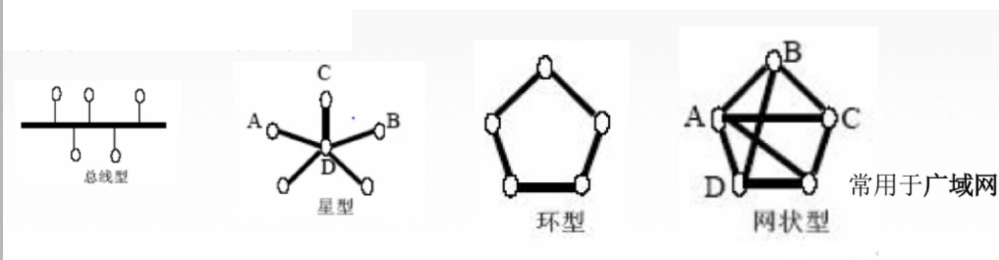

# 101 概念、组成、功能、分类

## 一. 概念

**计算机网络**（或简称为网络）由若干**结点（node）**和连接这些结点的**链路（link）**组成。

网络中的结点可以是计算机、集线器、交换机或路由器等。

网络之间还可以通过路由器互连起来，这就构成了一个覆盖范围更大的计算机网络，称为**互连网**。
也就是网络的网络。

习惯上，用画一个云将结点和链路包含进去，来表示网络。
那么本身计算机是可以被包含在云内的，但经常出现的情况是，为了讨论方便，比如讨论计算机之间的通信问题，常常将计算机画在云外，常称为**主机**，而云内只有路由器和连接路由器的链路了。

So，总结，网络将许多计算机（常称为主机）连接在一起，互连网将许多网络通过路由器连接在一起。

简单地区别一下互连网 internet 和互联网 Internet：
互连网 internet 是一个通用名词，泛指多个计算机网络互连而成的计算机网络，其通信协议不一定是 TCP/IP。
互联网 Internet 是一个专用名词，特指当前全球上最大的、开放的、由众多网络互相连接而成的特定互连网，采用 TCP/IP协议族作为通信的规则，且其前身是美国的 ARPANET。

## 二. 功能

1. 数据通信
2. 资源共享：硬件、软件、数据共享
3. 分布式处理：多台计算机各自承担同一工作的不同部分
4. 提高可靠性：这里可靠性指，网络中一台机器宕机了，也会有另一台机器可以作为替代。而自己单独一台电脑死机了，就没了。
5. 负载均衡：类似分布式处理，将任务进行平衡，分摊到多个计算机上进行。
6. 其他...

## 三. 组成

### 3.1 按组成部分

1. 硬件：主机、链路、路由器、交换器等等。
2. 软件：安装在硬件上的程序。
3. 协议：规则和约定的集合。

### 3.2 按工作方式

1. 边缘部分：

   由所有连接在互联网上的主机组成。这部分是**用户直接使用的**，用来进行通信（传送数据、音频或视频）和资源共享。

2. 核心部分：

   由大量网络和连接这些网络的路由器组成。这部分是**为边缘部分提供服务的**（提供连通性和交换）。

### 3.3 按功能

1. 通信子网：实现数据通信的。
2. 资源子网：实现资源共享（数据处理）的。

以OSI模型（Open System Interconnection Model，OSI七层协议）来看，通信系统中的数据流分为7个层次：

应用层
表示层
会话层
传输层
网络层
数据链路层
物理层

通信子网：网络层、数据链路层、物理层。由各种传输介质、通信设备、相应的网络协议组成。
资源子网：应用层、表示层、会话层。实现资源共享的设备和软件的集合。
传输层，属于上下两层的接口。

## 四. 分类

### 4.1 按分布范围分类

1. 广域网WAN（Wide Area Network），使用交换技术；
2. 城域网MAN（Metropolitan）；
3. 局域网LAN（Local），通常使用广播技术；
4. 个人区域网PAN。

### 4.2 按使用者分类

1. 公用网
2. 专用网

### 4.3 按交换技术分类

在后面 402数据交换方式 中详细介绍。

1. 电路交换

2. 报文交换

3. 分组交换

   3.1 数据报方式

   3.2 虚电路方式

### 4.4 按拓扑结构分类

1. 总线型
2. 星型
3. 环型
4. 网状型：通常用于广域网。

图1.按拓扑结构分类

### 4.5 按传输技术分类

1. 广播式网络：主机共享公共通信信道。（所有主机都可接收到信息，判断是否是自己的，是则接收，不是则丢弃。）
2. 点对点网络：使用分组存储转发和路由选择机制。（并非所有主机都可接收到信息，而是一对一的通信。）

2020.12.31