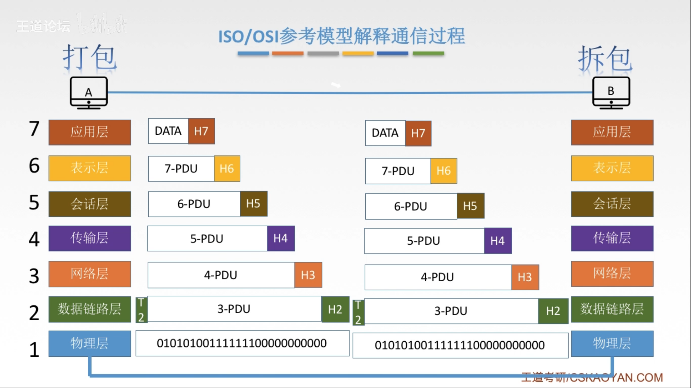

# 105 OSI 参考模型

OSI 的七层协议体系结构，概念清楚，理论也较完整，但复杂且不实用。
TCP/IP 体系结构（四层）则得到了广泛的应用，成为了事实标准。

在学计算机网络的原理时，我们往往采用折中的办法，采用一种只有五层协议的体系结构。

图1.计算机网络体系结构

这里可以回顾一下，计算机网络的组成

按照功能，其组成可分为：

1. 通信子网：实现数据通信的。
2. 资源子网：实现资源共享（数据处理）的。

在 OSI 参考模型中，
上三层为资源子网（应用层、表示层、会话层），负责数据处理。
中间运输层为通信子网与资源子网的接口。
下三层为通信子网（网络层、数据链路层、物理层），负责数据通信。

## 七. 7 应用层（Application Layer）

应用层直接提供为应用软件而设计的接口，用以与另一应用软件之间的通信。例如：HTTP、HTTPS、FTP、Telnet、SSH、SMTP、POP3等。

## 六. 6 表示层（Presentation Layer）

表示层把数据转换为能与接收者的系统格式兼容并适合传输的格式。

功能：

1. 数据格式转换
2. 数据加秘解密
3. 数据压缩和恢复

## 五. 5 会话层（Session Layer）

会话层负责在数据传输中设置和维护计算机网络中两台计算机之间的通信连接。

功能：

1. 建立、管理、终止会话。

2. 使用校验点，可使得会话在通信失效时从校验点继续恢复通信，实现数据同步。

   适用于传输大文件。

## 四. 4 运输层（Transport Layer）

传输层负责两个进程的通信，即**端到端**通信。
传输单位是**报文段**或**用户数据段**。

不同计算机上的两进程进行通信，这两进程都拥有其端口号。
接收到的数据通过端口号来将数据传给对应进程。
所以叫端到端通信。
OSI 参考模型上四层（7，6，5，4）都是端到端通信。
因为对这四层来说，下层透明，那么在这四层的角度看来就是直接在于进程通信。
下三层（3，2，1）叫**点到点**通信。

功能：

1. 可靠传输、不可靠传输：

   可靠传输：当没有收到确认信息时，再次发送数据。
   比如发送大文件，将大文件拆成多个报文段发送，假设每发送一个报文段受到确认信息后才发送下一个，如果一个报文段没有受到确认信息，则再次发送该报文段。

   不可靠传输：不需要建立连接，也不管什么确认机制，什么都不管，直接往外发送数据就完事了。

2. 差错控制：

   对于一些差错做出控制，比如一些报文段没有接收到，丢失了部分报文段，那么就对发送端提出发送这些报文段的信息。

3. 流量控制：

   当接收端的接收速度跟不上发送端的发送速度时，接收端对发送端发送信息，使发送端降低发送数据速度。

4. 复用分用：

   复用：多个应用层进程可同时使用下面的运输层的服务。
   分用：运输层把收到的信息分别交付给上面应用层中的相应进程。（通过端口号确定给哪个相应进程）

## 三. 3 网络层（Network Layer）

网络层主要任务是把分组从源端传到目的端，为分组交换网上的不同主机提供通信服务。
网络层传输单位是**数据报**。将运输层产生的报文段或用户数据包封装成**分组**或**包**进行传送。在<计网>书上有说明，本书把分组与数据报作为同义词使用。

功能：

1. 路由选择：

   选择合适的路由，也就是选择一个好的路径。

2. 流量控制：同上流量控制

3. 差错控制：

   比如通过数据的奇偶校验码、海明码等，检验数据传输是否出错。如果有错且能纠错，则纠错。如果有错且不能纠错，则丢弃该出错数据报。

   区别一下和运输层的差错控制。
   运输层只能说，哦三个报文段只收到了前后两个，你发一下中间那个，而并不具备校验纠错。

4. 拥塞控制：

   如果所有结点都来不及接收分组而要丢弃大量分组的话，网络就处于拥塞状态。
   因此要采取一定措施缓解这种拥塞。

## 二. 2 数据链路层（Data Link Layer）

数据链路层，主要任务是把网络层传下来的数据报组装成帧。
传输单位是**帧**。

功能：

1. 成帧：

   定义帧的开始和结束。
   开始与结束，指一段二进制段，比如定义该帧的起始是 01010101，结束是 10101010。

2. 差错控制：

   如果帧错，那么丢弃该出错帧，避免继续传递下去，浪费资源。
   如果位错，且需要修正数据，那么采用可靠传输协议来纠正出现的错误。

   同样区别一下和运输层的差错控制。
   运输层只能说，哦三个报文段只收到了前后两个，你发一下中间那个，而并不具备校验纠错。

3. 流量控制：同上

4. 访问控制（接入控制）：

   控制对信道的访问。

   比如当多个主机都只连接在同一用于传输的物理介质上，那么在广播式网络中，同时只能有一台主机使用该信道。

## 一. 1 物理层（Physical Layer）

物理层，主要任务是在物理媒体上实现比特流的透明传输。
就是将比特流转化为电信号发送出去，传输单位是**比特**。

物理媒体，指电缆，双绞线，无线电波等等都可。
透明传输，指不管所传数据是什么样的 bit 组合，都应当能够在链路上传播。

功能：

1. 定义接口特性：

2. 定义传播模式：

   单工模式：单向发送信息；
   半双工模式：双向且同时只能单向发送信息；
   双工模式：双向且能同时双向发送信息。

3. 定义传输速率：

4. 比特同步：

5. 比特编码：用多高电压表示 1，多少电压表示 0。

## 八. OSI 参考模型的通信过程

图2.OSI参考模型的通信过程

由计算机 A 应用程序发出的信息，从应用层，一层一层地往下，直到物理层，通过物理介质发送出去。

通常中间会经过多个路由器。
显然，路由器并不需要上四层，而只需要有下三层。
路由器接从物理介质收到信息，从物理界，一层一层往上，直到网络层，网络层具有路由选择的功能，然后又从网络层，一层一层往下，直到物理层，通过物理介质发送储器。

直到发送到计算机 B。
计算机 B 从物理介质收到信息，从物理层，一层一层网上，直到应用层，向相应的进程提供信息。

图3.OSI参考模型的通信过程

由计算机 A 应用程序发出的 DATA，

通过接口，到应用层，应用层通过接口接收到的上层数据，称为 **SDU（数据服务单元，Service Data Unit）**，应用层对 SDU 加上应用层的表头，成为应用层该层的 **PDU（协议数据单元，Protocol Data Unit）**；

通过接口，到表示层，应用层通过接口接收到的上层数据，此时的 SDU 本是应用程序发出的 DATA 加上应用层加上的表头，但对于表示层来说，只知道上层传下来的数据。表示层对 SDU 加上表示层的表头，成为表示层该层的 PDU。

通过接口，到会话层，会话层通过接口接收到的上层数据，此时的 SDU 本是 DATA 加应用层表头加表示层表头，但对于会话层来说，只知道上层传下来的数据。会话层对 SDU 加上会话层的表头，成为会话层该层的 PDU。

通过接口，到传输层，传输层对上层传下的 SDU 加上传输层的表头，成为传输层该层的 PDU。

通过接口，到网络层，网络层对上层传下的 SDU 加上网络层的表头，成为网络层该层的 PDU。

通过接口，到数据链路层，数据链路层对上层传下的 SDU ，不仅加上数据链路层的表头，也加上尾部，成为数据链路层该层的 PDU。

通过接口，到物理层，物理层对上层传下的 SDU 不进行修改，只是对将 SDU 的比特流，使用电信号，通过物理介质发送出去。

由计算机 B 的物理层接收到信息，

物理层由物理介质接收到信息，将电信号，变为比特流，

通过接口，到数据链路层，数据链路层通过接口接收到下层传上的 SDU，通过数据链路层的协议，可从该层表头、尾部获得信息，知道应该进行什么操作，然后将去除了该层表头、尾部的该层 PDU 传给上层。

通过接口，到网络层，网络层通过接口接收到下层传上的 SDU，通过网络层的协议，可从该层表头获得信息，知道应该进行什么操作，然后将去除了该层表头的该层 PDU 传给上层。

通过接口，到传输层，传输层从下层传上的 SDU 的传输层表头获得信息，进行一些操作，将去除了传输层表头的该层 PDU 传给上层。

通过接口，到会话层，会话层从下层传上的 SDU 的会话层表头获得信息，进行一些操作，将去除了会话层层表头的该层 PDU 传给上层。

通过接口，到表示层，表示层从下层传上的 SDU 的表示层表头获得信息，进行一些操作，将去除了表示层层表头的该层 PDU 传给上层。

通过接口，到应用层，应用层从下层传上的 SDU 的表示层表头获得信息，进行一些操作，将去除了应用层层表头的该层 PDU 传给上层应用程序。

2021.01.21