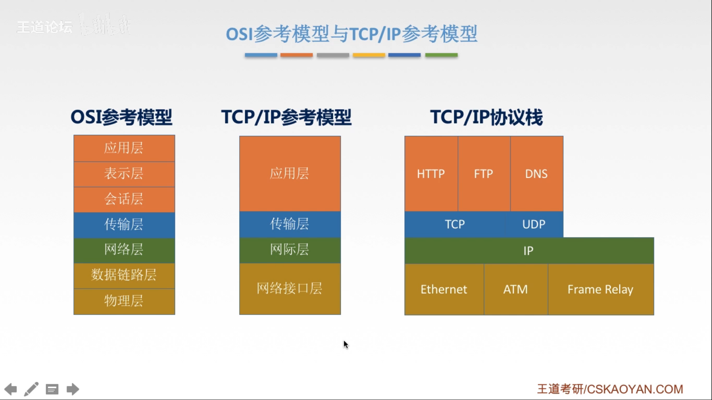
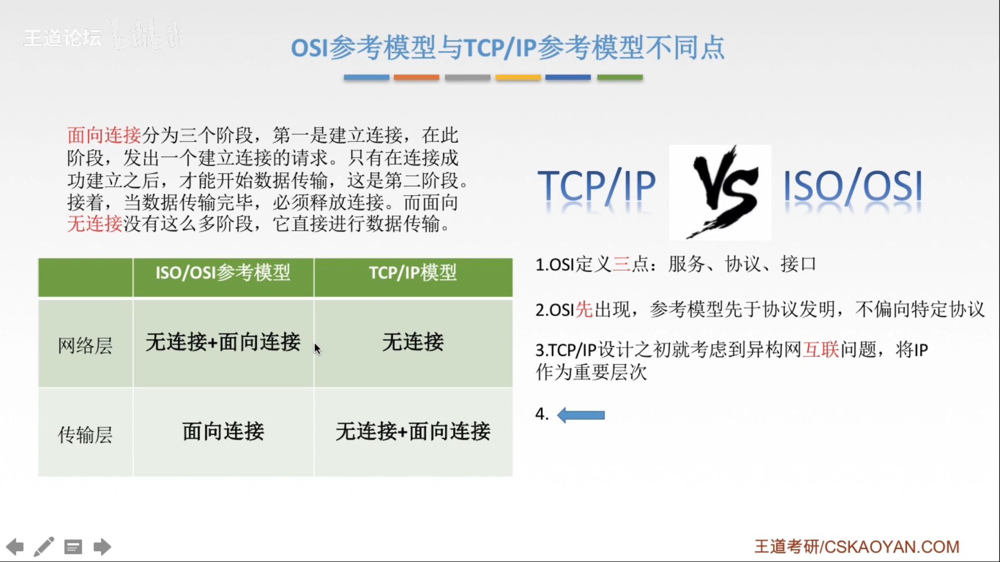
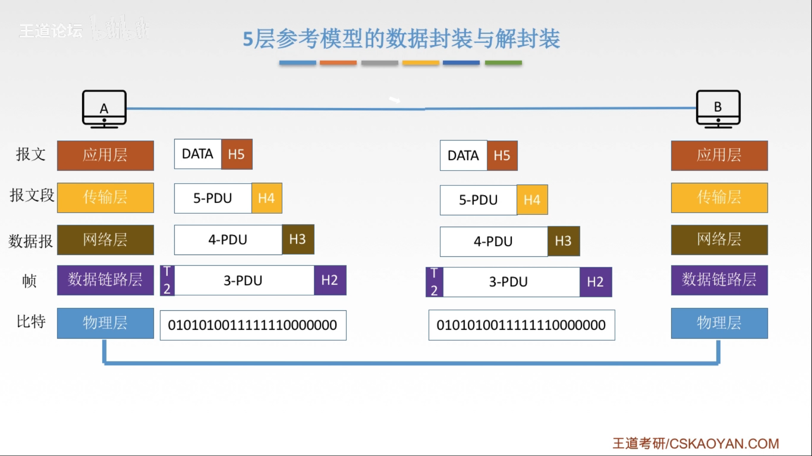

# 106 TCP/IP 参考模型和五层参考模型

## 一. TCP/IP 参考模型

图1.TCP/IP参考模型

TCP/IP 只分四层：应用层、传输层、网际层、网络接口层。

**协议栈**：因为从高层封装至底层，再从低层解包至高层，与栈的入栈、出栈非常相像。所以各层协议的组成的栈，称为协议栈。

为什么叫 TCP/IP，因为这两协议最常用......所以并不是只有这两协议......

### 1.1 TCP/IP 参考模型与 OSI 参考模型的不同

图2.TCP/IP 模型与 OSI 模型的不同

OSI 参考模型：
传输层：只有面向连接。
网络层：有无连接、面向连接。

TCP/IP 参考模型：
传输层：有无连接、面向连接
网络层：只有无连接。

面向连接：需要成功建立连接后，才能开始数据传输，传输完成后，必须释放连接。
无连接：不需要建立连接，直接进行输出传输。

## 二. 五层参考模型

在学计算机网络的原理时，我们往往采用折中的办法，综合了 OSI 和 TCP/IP 的优点，采用一种只有五层协议的体系结构。

| 层次       | 功能                                 | 主要协议         |
| ---------- | ------------------------------------ | ---------------- |
| 应用层     | 支持各种网络应用                     | FTP、SMTP、HTTP  |
| 传输层     | 进程-进程的数据传输                  | TCP、UDP         |
| 网络层     | 源主机到目的主机的数据分组路由与转发 | IP、ICMP、OSPF等 |
| 数据链路层 | 把网络层传下来的数据报组装成帧       | Ethernet、PPP    |
| 物理层     | 比特传输                             | Rj45、802.3      |

### 2.1 五层参考模型的数据封装与解封装过程

图3.五层参考模型的数据封装与解封装

计算机 A 的应用程序发出的数据 DATA，

通过接口，到应用层，应用层对上层传来的 SDU 加上应用层表头，成为了应用层的 PDU，称为**报文**（message）。

通过接口，到运输层，
如果使用的是 TCP 协议：
运输层对上层传来的 SDU 加上运输层表头，成为了运输层的 PDU，称为**报文段**（segment）。
如果上层传来的 SDU 过长，超过了运输层的传输能力上限，则对 SDU 进行分段，每段都加上运输层表头。
如果使用的是用户数据报协议 UDP ：
运输层对上层传来的 SDU 加上传输层表头，成为了运输层的 PDU，称为**用户数据报**。
UDP 不会分段，如果过长，则在网络层分组。

通过接口，到网络层，网络层对上层传来的 SDU （报文段或用户数据报），如果过长，则切分成多个分组或包，对每个分组或包加上网络层表头，成为了网络层的 PDU，称为**分组**或**包**。
如果是在 TCP/IP 体系中，由于网络层使用的是 IP 协议，则分组也叫作 **IP 数据报**，或简称**数据报**。
<计网>书中说明了，本书中把分组和数据报作为同义词使用。

根据网上查找的信息，使用 TCP/IP 协议时，如果信息过长，通常情况会在运输层分段，而分段后就小于网络层的长度限制了，所以不会轮到网络层分段。

通过接口，到数据链路层，数据链路层对上层传来的 SDU 组装帧，加上数据链路层的表头、尾部，成为了数据链路层的 PDU，称为**帧**。

通过接口，到物理层，物理层对上层传来的 SDU 就不添加信息了，将比特流以电信号的形式通过物理介质传输。

计算机 B 物理层接收到了信息，

物理层，从物理介质的电信号获得信息，传给上一层。

通过接口，数据链路层获得了下一层传来的 SDU，从数据链路层 PDU 的表头、尾部获得信息，进行对应操作，将除了数据链路层表头、尾部的数据传递给上一层。

通过接口，网络层获得了下一层传来的 SDU，从网络层 PDU 的表头获得信息，进行对应操作，
包括会确定是否为分段包，如果是，则根据信息，按序重新编成原始的报文段或用户数据报，
将除了网络层表头的原始的报文段或用户数据报传递给上一层。

通过接口，运输层获得了下一层传来的 SDU，从运输层 PDU 的表头获得信息，进行对应操作，
包括会确定是否为分段的报文段，如果是，则根据信息，按序重新编成原始的报文。
将除了运输层表头的数据传递给上一层。

通过接口，应用层获得了下一层传来的 SDU，从应用层 PDU 的表头获得信息，进行对应操作，将除了应用层表头的数据传递给上一层应用程序。

2020.01.22