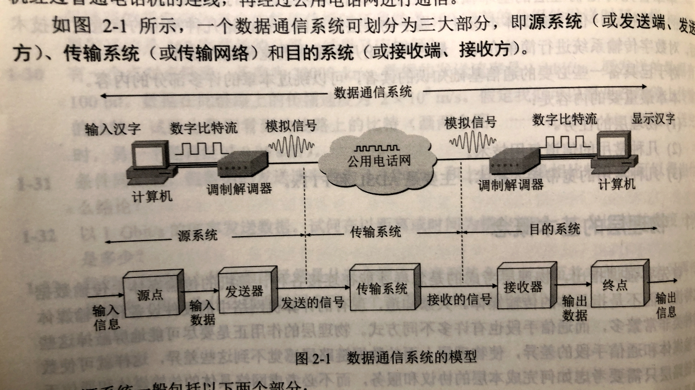

# 202 数据通信基础知识

补一补关于通信的知识。

## 一. 数据通信系统的模型

图1.数据通信系统的模型

以两台计算机，经过普通电话机和公用电话网，进行通信为例。

先说过程：
对计算机 A 输入信息，计算机 A 发出数字信号给调制解调器 A ，调制解调器 A 将数字信号转变为模拟信号，经由公用电话网，调制解调器 B 接受到该模拟信号，并将其转化为数字信号，发送给计算机 B，计算机将数字信号携带的信息显示出来。

一个数据通信系统可划分为三大部分：

1. **源系统**（发送方、发送端）
2. **传输系统**（传输网络）
3. **目的系统**（接收方、接收端）

源系统一般包括两个部分：

1. **源点**（source）：又称**源站、信源**。源点设备产生要传输的数据。
2. **发送器**：通常源点生成的数字比特流要通过发送器编码后才能够再传输系统中进行传输。

目的系统一般也包括两个部分：

1. **接收器**：接收传输系统传送过来的信号，并把它转换为能够被目的设备处理的信息。
2. **终点**（destination）：又称**目的站、信宿**。从接收器获取传送来的数字比特流。

上述模型中，
计算机 A 和调制解调器 A 为源系统，计算机 A 为源点，调制解调器 A 为发送器；
公用电话网为传输系统；
计算机 B 和调制解调器 B 为目的系统，计算机 B 为终点，调制解调器 B 为接收器。

现在有些计算机使用内置的调制解调器，所以在外部已经看不见了。

## 二. 数据通信相关术语

通信的目的是为了传送**消息**（message），话音、文字、图像、视频等都是消息。

**数据**（data）是运送消息的实体。通常是有意义的符号序列。

比如，在刚才的数据通信模型中，计算机 A 想发送文字 "你好" 到计算机 B ，文字 "你好" 是消息，而表示 "你好" 的，计算机可识别的 0101.... 比特流序列，是数据。
（也就是说，消息是抽象的，数据是实体呗。）

**信号**（signal）是数据在电气或电磁的表现。是数据在传输过程中的存在形式。

根据信号中代表消息的参数的取值方式不同，信号可分为两个大类：

1. **模拟信号**（**连续信号**）：代表消息的参数的取值是连续的。信号类似 $y=\sin x$ 的图像，连续的。
2. **数字信号**（**离散信号**）：代表消息的参数的取值是离散的。信号类似分段常量函数的图像，离散的。

## 三. 有关信道的几个基本概念

### 3.1 信道

**信道**（channel），信道与电路并不等同。
信道一般用来表示向某一个方向传送信息的媒体（就是有方向），因此一条通信电路往往通常包含一条发送信道和接收信道。

简单分类
从传输信号来分类，信道分为：模拟信道，数字信道。
从传输介质来分类，信道分为：无线信道，有线信道。

### 3.2 三种通信方式

从通信双方信息交互的方式来看，有三种基本通信方式：

1. **单向通信**（**单工通信**）：只能由一个方向的通信而没有反方向的交互。
2. **双向交替通信**（**半双工通信**）：通信双方都可以发送信息，但不同双方同时发送，当然也不能同时接收。
3. **双向同时通信**（**全双工通信**）：通信的双发可以同时发送和接收信息。

显然，单向通信只需要一条信道，而双向交替或双向同时通信都需要两条信道。 

## 四. 码元

在使用时间域（或简称时域）的波形表示数字信号时，代表不同离散数值的基本波形就成为**码元**。
也就是使用固定时长的不同的**基本波形**，来对应地表示不同的离散数值，这些基本波形就是码元。该固定时长称为**码元宽度**。

码元，是数字通信中数字信号的计量单位。
一个信号，就是一个码元。

当码元的离散状态有 M 个时，则称该码元为 **M 进制码元**。
例如，在使用二进制编码时，只有两种不同的码元（基本波形）：一种代表 0 状态，另一种代表 1 状态。

**1个码元可以携带多个比特的信息量**。
因为可以使信号波形与二进制对应起来。
比如，四进制码元，有四种不同的信号（基本波形），则可使该四种基本波形分别对应 00，01，10，11。此时一个码元携带2 bit 的信息量。
八进制码元，有八种不同的信号（基本波形），则可使该八种基本波形分别对应 000，001，010，011，100，101，110，111。此时一个码元携带 3 bit 的信息量。

### 4.1 速率

在<计算机网络>103性能指标已经介绍过了。
速率，也叫数据率、数据传输率、比特率。单位为 bit/s、b/s、bps（bit per second），指单位时间内传输的数据量。

这里是为了说，速率也可以使用**码元传输速率**和**信息传输速率**来表示。

**码元传输速率** $R_B$ ：别名**码元速率**、**波形速率**、**调制速率**、**符号速率**等。表示单位时间内数字通信系统所传输的码元个数（也可称脉冲个数、信号变化次数），单位是**波特**（baud）。

**信息传输速率** $R_b$ ：又称信息速率、比特率，单位 bit/s，表示单位时间内数字通信系统所传输的二进制码元个数。1 个二进制码元对应 1 个比特，所以就是单位时间内传输的比特数。

关系：
如果使用的 M 进制的码元，1 码元携带 n bit 的信息量，则 M baud（码元传输速率）等于M×n bit/s（信息传输速率）。
$$
R_b=R_B\log_{2}{M},(M为码元进制)
$$

2021.01.22

