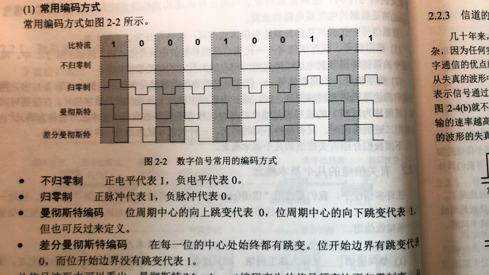
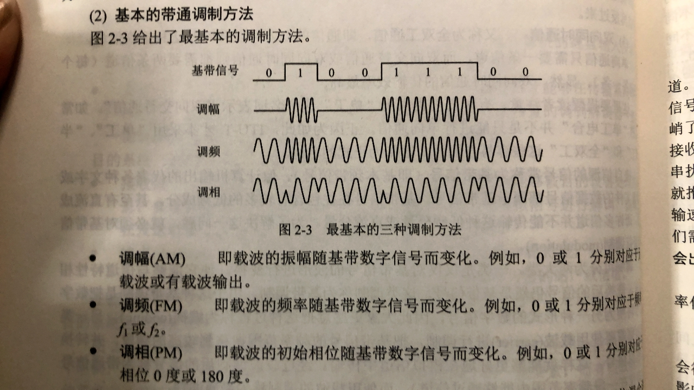

# 203 编码和调制

## 一. 信道上的信号

在上一节<202数据通信基础知识>中，已知了信道分为模拟信道和数字信道，分别用于传送模拟信号和数字信号。

对于信道上的信号，还有另一种分类方式：

1. **基带信号**：

   基带，基本频带的简称。基本频带是指频率范围在零频附近的这段带宽。
   此处的带宽，为通信中的带宽，而非计算机中的带宽，是频带宽度的简称，指信号所占据的频带宽度。

   处于基本频带的信号，我们称为基带信号。
   如，语音信号为 300-3400Hz，图像信号为 0-6MHz，频率低，都是基带信号（虽然对人来说频率很高，但在计算机、通信领域来说频率很低了。）

   **在计算机中**，信源发出的信号，通常都是基带信号。而且往往以**数字信号**的方式发出，即，高电平 1，低电平 0 的形式发出。
   如，计算机输出的代表各种文字或图像文件的数据信号都属于基带信号。

   由于基带信号频率很低，往往还有较多低频成分，甚至还有直流成分（电流或电压正负极性不随时间改变），一般不宜直接传输。近距离还可以，远距离不行，因为信号传播有衰减、损耗，距离远了就没了。
   这就需要把基带信号变换成其频带适合在信道中传输的信号（提高频率），并可在接收端进行反变换。

   基带信号在**数字信道**上传输。

2. **宽带信号**（<计网>书上是**带通信号**）：

   将基带信号进行调制后形成的频分复用**模拟信号**。

   因为宽带信号就是将基带信号经过**载波调制**后，把信号的频率范围搬移到较高频段，以便在信道中传输（仅在一段频率范围内能够通过信道）。

   宽带信号在**模拟信道**上传输。

我突然想起来了，高中物理学过，想要传播低频波 A（基带信号），将其与高频波 B（载波）叠加（调制），得到一个高频波 C（宽带信号、带通信号），将高频波 C 传播出去，接收端接收到后，将高频波 C 与高频波 B 抵消（解调），得到想要的低频波 A。

距离比较近时，计算机网络采用基带传输方式。计算机内部就是。（近距离，衰减小）
距离比较远时，计算机网络采用宽带传输方式。（远距离，衰减大，需要提高频率）

## 二. 编码与调制

为了解决传输问题，就必须对基带信号进行**调制**（modulation）。

实际上，调制分为**基带调制**和**带通调制**。
不过人们更愿意将基带调制称为**编码**（coding），所以我这里写得是 "编码与调制"。

1. **基带调制**（编码）：

   仅仅对基带信号的波形进行变换，使其能够与信道特性相适应。变换后的信号仍然是基带信号。
   由于这种基带调制是把数字信号转换为另一种形式的**数字信号**，因此大家更愿意把这种过程称为**编码**（coding）。

2. **带通调制**：

   使用**载波**（carrier）进行调制，把基带信号的频率范围搬移到较高的频段，并转换为**模拟信号**，这样就能够更好地在模拟信道中传输。
   经过载波调制后的信号成为**带通信号**（即仅在一段频率范围内能够通过信道），使用载波的调制就成为带同调制。

总结：
将基带信号转换为数字信号，**基带调制**，或称**编码**。
将基带信号转换为模拟信号，**带通调制**。

更普遍的：
信号转换为数字信号，编码；
信号转换为模拟信号，调制。

比如：
信号是数字信号，
通过**数字发送器**，转换为数字信号，编码；
通过**调制器**，转换为模拟信号，调制；

信号是模拟信号，
通过**PCM编码器**，转换为数字信号，编码；
通过**放大器调制器**，转换为模拟信号，调制；

## 三. 常用编码方式

**数字数据编码为数字信号。**

图1.数字信号常用的编码方式

可见图 1 中的编码方式：

1. **不归零制**：正电平代表 1，负电平代表 0。
2. **归零制**：正脉冲代表 1，负的脉冲代表 0。
3. **曼彻斯特编码**：位周期中心的向上跳变代表 0，位周期中心的向下跳变代表 1；也可反过来定义。
4. **差分曼彻斯特编码**：在每一位的中心处始终有跳变。位开始边界有跳变代表 0，而位开始边界没有跳变代表 1。

**自同步能力**：从信号波本身中提取信号时钟频率的能力。
<计网>书中只对比了不归零制和曼彻斯特编码：
曼彻斯特编码产生的信号频率比不归零制高（提高频率）。
曼彻斯特编码具备自同步能力。
不归零制不具备自同步能力，如果不事先知道信号时钟频率，是无法从接收的信号波中分析出一段信号里有多少 0/1 的。

<计网>书中没有明确指出说明归零制是否具备自同步能力，如果是图1中的归零制，我个人觉得是具备自同步能力的，但从网上信息和王道<计网>视频发现，归零制还有多种归零制，我看了一下确实也有其他种的归零制不具备自同步能力。

（2021.08.18）翻了翻王道书上：

>每个时钟周期的中间均跳变到低电平（归零），接收方根据跳变调整本方的时钟基准，这就为传输双方提供了自同步机制。

所以看来归零编码认为是有自同步能力的。

王道<计网>视频中的内容：

1. **非归零编码**（NRZ）：

   高电平表示 1，低电平表示 0。
   实现简单，没有纠错功能，且无法判断一个码元的开始和结束（无法判断时钟频率），以至于收发双方难以保持同步。（不具备自同步能力）

2. 归零编码（RZ）：

   对于信号电平在一个码元后都要恢复到零的编码称为归零编码。

3. 反向非归零编码（NRZI）：

   信号电平翻转表示 0，信号电平不变表示 1。
   当传输数据出现连续的 1 时，会无法判断时钟频率。所以不具备自同步能力。

4. **曼彻斯特编码**（Manchester Encoding）：

   将一个码元分成两个相等的间隔，前一个间隔为低电平后一个间隔为高电平表示码元 1；前一个间隔为高电平后一个间隔为低电平表示码元 0。也可采用相反的对应。
   特点，在每一个码元的中间必然会有电平跳变，该跳变既作为时钟频率，也作为数据信号，即曼彻斯特编码具备自同步能力。
   但所占的频带宽度是原始的基带宽带的两倍。
   每一个码元都被调成两个电平，所以数据传输速率只有调制速率（波特率）的 1/2。

   （这段曼彻斯特编码的解释，我是照着王道<计网>视频里写下来的。
   但我个人觉得，曼彻斯特编码应该是将不归零制的一个码元，分为了间隔相等的两个码元，变为了两个码元，所以调制速率（波特率）翻倍了。
   但这里王道<计网>视频以及网上我看到的信息都没有明确地说明，是否一个码元分隔后是两个码元。
   而且，我又确实在 Google 搜到了有书上用词与下面王道<计网>差分曼彻斯特编码的说法一样，用词都为半个码元。
   除非，调制速率（波特率）与码元速率并不是一个东西。这样才能是出现还是一个码元不变，但调制速率翻倍。
   但王道<计网>视频以及我在 Google 搜到有书上说，码元速率也叫波特率、调制速率。那就是一个东西呀，说明码元确实是由一个变为了两个。
   唉，姑且，认为是一个码元分隔成了两个码元吧。）

5. **差分曼彻斯特编码**：

   若码元为 1 ，则前半个码元的电平与上一码元的后半个码元电平相同；若为 0，则相反。
   特点，在每个码元中间都有一次电平的跳转，具备自同步能力，且抗干扰性强于曼彻斯特编码。

6. 4B/5B编码：

   在比特流中插入额外的比特以打破一串连续的 0 或 1，即用 5 个比特来编码 4 个比特的数据，之后再传给接收方。编码效率为80%。
   （曼彻斯特编码的编码效率为 50%）

   显然，原本 4 bit 只有 16 种排列，而 5 bit 有 32 种排列。编码使 4 bit 的16种排列与 5 bit 的16种排列对应，5 bit 剩余的没有对应的 16 种排列作为控制码（表示帧的开始、结束，线路的状态信息等），或保留。

## 四. 基本的带通调制方法

**数字数据编码为模拟信号。**

图2.最基本的调制方法

1. **调幅**（AM）：即载波的振幅随基带数字信号而变化。如，0 或 1 分别对应无载波或有载波输出。
2. **调频**（FM）：即载波的频率随基带数字信号而变化。如，0 或 1 分别对应频率 $f_1$ 或 $f_2$ 。
3. **调相**（PM）：即载波的初始相位随基带数字信号而变化。如，0 或 1 分别对应相位 0 度 或 180 度（正弦波、余弦波）。0000

也就是通过振幅、频率、相位不同来区分 0 或 1。
当然，这三种方式知识最基础的调制方法，为了到达更高的信息传输速率，会采用更复杂的多元制的振幅相为混合调制方法，比如，**正交振幅调制 QAM**（Quadrature Amplitude Moduylation）。

例题：某通信链路的波特率是 1200 baud，采用 4 个相位，每个相位有 4 种振幅的 QAM 调制技术，则该链路的信息传输速率是多少？

答：共有 $4\times4=16$ 种码元（波形），可见是 16 进制码元（码元有 16 种状态），1 个码元表示  4 个 bit（需要 4 位 bit 才能表示 16 种状态），则信息传输速率是 $1200\times 4=4800 bit/s$ 。

## 五. 模拟数据编码为数字信号

因为计算机内部处理的都是二进制数据，所以如果是模拟信号，需要将其通过抽样、量化、编码，转换成有限个数字表示的离散序列。

典型的例子就是对音频信号进行编码的**脉码调制（PCM）**，在计算机应用中，能够达到最高保真水平的就是 PCM 编码，被广泛用于素材保存及音乐欣赏，CD、DVD 以及常见的 WAV 文件中均有应用。

主要包括三步：

1. **抽样**：

   对模拟信号周期型扫描，把时间上连续的信号变为时间上离散的信号。

   为了使所有得离散信号能无失真地代表被抽样地模拟数据，根据**采样定理**：
   $$
   f_{采样频率}\geq 2 f_{信号最高频率}
   $$

2. **量化**：

   把抽样取得的电平幅值按照一定的分级标度转化为对应的数字值，并取整数，这就把连续的电平幅值转换为离散的数字量。

   也就是抽样获得的值，都是几点几，8.23，9.36，168.234，...，这样的，按照一定的分级标度，也就是使用一个分段函数来转化，比如值在 7.5-8.4，的都变为 8。

3. **编码**：

   把量化的结果转换为对应的二进制编码。

   量化后，有多少种不同的值，就是有多少种不同的状态，则需要同种数的码元。
   比如，量化后，有 4 种值，那么就用两个 bit 来描述 4 这种不同状态。有 16 种值，就需要用 4 个 bit 来描述这 16 种不同状态。这样就成了二进制编码。

### 5.1 为什么采样频率需要满足：$f_{\text{采样频率}}\geq 2 f_{\text{信号最高频率}}$ ？

前置知识点：模拟信号都是正弦波 $y=A\sin(\omega x+\varphi) $ 叠加得到的（傅里叶级数的知识在这里碰到了嘛）。
所以我们只分析一个正弦波。
那么对于已知一个波是正弦波，只需要知道该波在一个周期内的三个点，就可以确定这个正弦波。因为未知数是三个嘛 $A,\omega,\varphi$ 。
所以，当 $T_{采样周期}< \frac{1}{2}T_{信号周期}$ 时，就可以确保在一个周期内，采样到三个点。即 $f_{采样频率}> 2 f_{信号频率}$ 。
当然，如果是最理想的情况，只需要两个点，即采样的点为波峰、波谷这两个点，这就是最低的采样频率，此时正好 $f_{采样频率}= 2 f_{信号频率}$ 。
所以，对于一个正弦波采样，需要满足 $f_{采样频率}\geq 2 f_{信号频率}$ 。
由于模拟信号都是多个正弦波的叠加，所以需要满足：$f_{采样频率}\geq 2 f_{信号最高频率}$ 。

## 六. 模拟数据调制为模拟信号

比如，一个人说话的音频模拟信号，因为频率低，所以传输远的话，容易衰减没。所以需要将其调制为高频模拟信号。

接收端收到高频信号，经过解调，获得原本的低频信号。

2021.01.24

