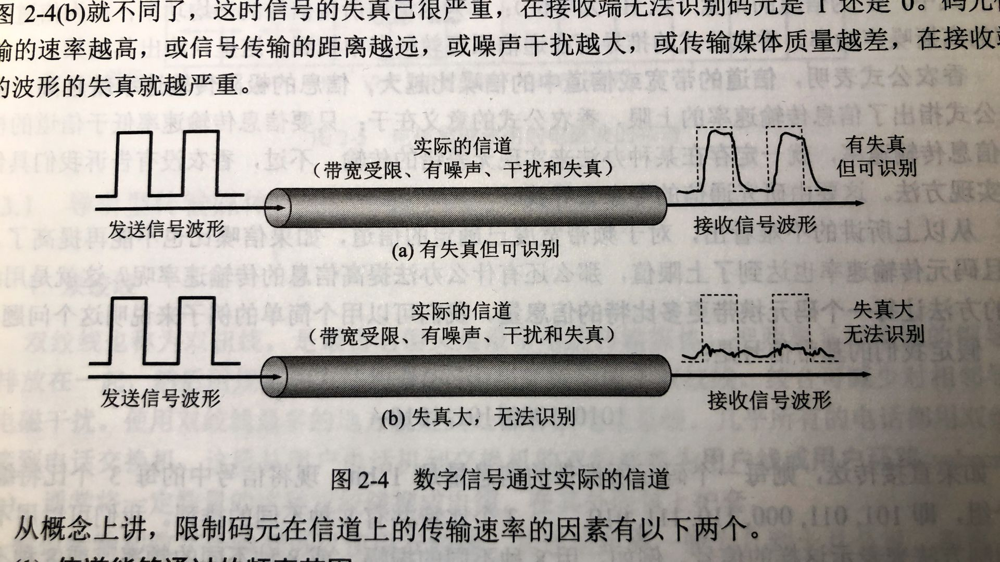

# 204 奈氏准则、香农定理

## 一. 奈氏定理（奈奎斯特定理）

### 1.1 失真

图1.失真

现实中的信道，并非理想中的信道，信号在实际的信道中传输会被多种因素影响，导致接收到的信号与发出的信号并不一致，这就叫作**失真**。

失真低，还好，比如图 1 中上方图，有失真，但仍可以识别信号。
像下方图，失真严重，就无法识别出信号了。

影响失真程度的因素：

1. 码元传输速率
2. 信号传输距离
3. 噪音干扰
4. 传输媒体的质量

### 1.2 码间串扰

一个信道，并非任何频率的信号都能够通过，而是只有频率在一个区间范围内的信号可以通过。
**信道带宽**，指能通过该信道的信号的最高频率与最低频率之差。

频率低为什么不能通过呢，因为频率低，自己就衰减没了。所以接收方收不到信号或无法辨别。
那么频率高，衰减了也有信号啊，为什么过高了也不能通过呢。简单的解释：因为频率过高，码元之间的距离过近，而信号在信道中传输会受到干扰，导致前后码元的界限模糊，接收端无法辨别。（复杂的解释，在<通信原理>中，我看不懂。）

### 1.3 奈氏定理

**奈氏定理**：
在理想（无干扰）低通（带宽受限）条件下，为了避免码间串扰，极限码元传输速率为 $2W \quad baud$ ，W 为信道带宽，单位 Hz。

这里的带宽，是通信中的带宽，所以单位是 Hz，在<计网>中也就只有奈氏定理和香农定理会用到 Hz 的带宽。其他地方都还是计网的带宽 bit/s，每秒最高传送 bit 数。

<计网>书上原话：

> 奈奎斯特给出了在假定的理想条件侠，为了避免码间串扰，码元的传输速率的上限值。奈氏准则的推导已超出本书的范围，这可在通信原理教科书中查阅到。我们需要知道的就是：**在任何信道中，码元传输的速率是有上限的，传输速率超过此上限，就会出现严重的码间串扰问题，是接收端对码元的判决（即识别）成为不可能**。
> 如果信道的频带越宽，也就是能够通过的信号的高频分量越多，那么就可以用刚搞速率传送码元二不出现码间串扰。

奈氏定理，给出的是码元传输速率的限制，而非信息传输速率的限制，显然嘛，毕竟 1 个码元可表示 n 个 bit。

所以，已知码元传输速率存在限制，要提高信息传输速率，那么就要设法提高 1 个码元可表示的 bit 数。
也就是上一节说到过的多元制的调制方法，如 QAM。

则在奈氏定理的条件下，最高信息传输速率为 $2W\log_2(V)$ ， $V$ 为码元的种类数量。

**例题**：在无噪声的情况下， 若某通信链路的带宽为 3kHz，采用 4 个相位，每个相位具有 4 中振幅的 QAM 调制技术，则该通信链路的最大数据传输率是多少？

答：共有 $4\times 4=16$ 种码元（波形），于是最多可使 1 个码元表示 4 bit。信道带宽为 3kHz，码元传播速率最高为 $2\times 3 = 6k\quad baud$ ，所以最大数据传输率为 $6k\times 4 = 24kbit/s$ 。

## 二. 香农定理

奈氏定理考虑的是理想（无干扰）低通的状态，而香农定理则是考虑到了信号在信道传播中会受到噪声的干扰。

### 2.1 噪声

**噪声**：噪声存在于所有电子设备和通信信道中。由于噪声是随机产生的，它的瞬时值可能会很大，因此噪声会使得接收端对码元的判决产生错误。但噪声的影响是相对的。如果信号相对较强，那么噪声的影响就相对较小。因此**信噪比**就很重要。

**信噪比**：信号的平均功率和噪声的平均功率之比，常记为 $S/N$ ，并用**分贝**（dB）作为度量单位。
$$
信噪比(dB) = 10\log_{10}{(S/N)}(dB)
$$
这里注意，此处的公式是以分贝（dB）为单位的信噪比，所以才要将信噪比（S/N）转换一下单位。
因为可能存在 S/N 太大了的情况，写着也麻烦，取个对数，看着舒服一点。
做题的时候注意给的是有单位的 dB，还是没单位的比值 S/N。

### 2.2 香农定理

**香农公式**：在带宽受限且有噪音的信道中，为了不产生误差，信息传输率有上限值。
$$
C=W\log_2(1+S/N)(bit/s)
$$
式中， $C$ 为信道的**极限信息传输速率**； $W$ 为信道的带宽（单位 Hz）； $S$ 为信道中所传信号的平均功率； $W$ 为信道内部的高斯噪声功率。
具体证明也不细说，在通信原理教科书中能找到。

注意：
这里香农公式的信噪比使用的是 S/N，是没有单位的。
香农公式确定的是**信息传输速率**，而非码元传输速率。

香农公式表明，信道的带宽或信道中的信噪比越大，信息的极限传输速率就越高。
香农公式的意义在于：只要信息的传输速率低于信道的极限信息传输速率，就一定存在某种方法来实现无差错的传输。

当然，实际的信道的信息传输速率，往往是比香农公式的信息极限传输速率低不少的。

## 三. 简单总结一下奈氏定理与香农公式

假设条件：
奈氏定理：带宽受限、无噪声。
香农定理：带宽受限、有噪声。

目的：
奈氏定理：避免码间串扰，导致接收端无法判断一个码元的起始与结束。
香农定理：避免噪音干扰，导致接收端对码元的判决产生错误（1 误判为 0 或 0 误判为 1）。

确定的速率：
奈氏定理：最大码元传输速率。
香农公式：最大信息传输速率。

提高信息传输速率的方法：
奈氏定理：提高带宽；提高一个码元携带的比特数。
香农定理：提高带宽；提高信噪比。

**例题**：二进制信号在信噪比为 $127:1$ 的 4kHz 信道上传输，最大的数据率可达多少。

答：
根据香农公式： $C=4k\log_2(1+127)=28kbit/s$ 。
根据奈氏定理：最大码元传输速率为 $2\times 4k=8k\quad baud$ ，二进制信号指二进制码元，所以最大数据率为 $8kbit/s$ 。
所以，取最小，最大数据率为 $8kbit/s$ 。

2021.01.24