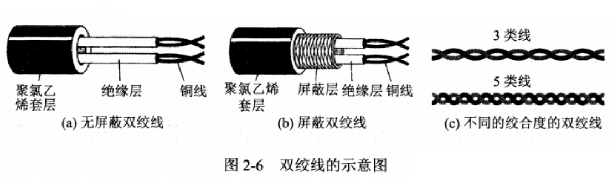
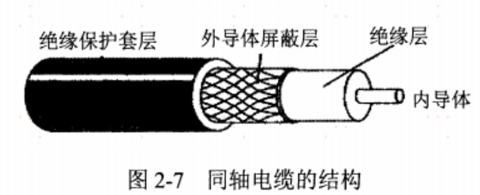
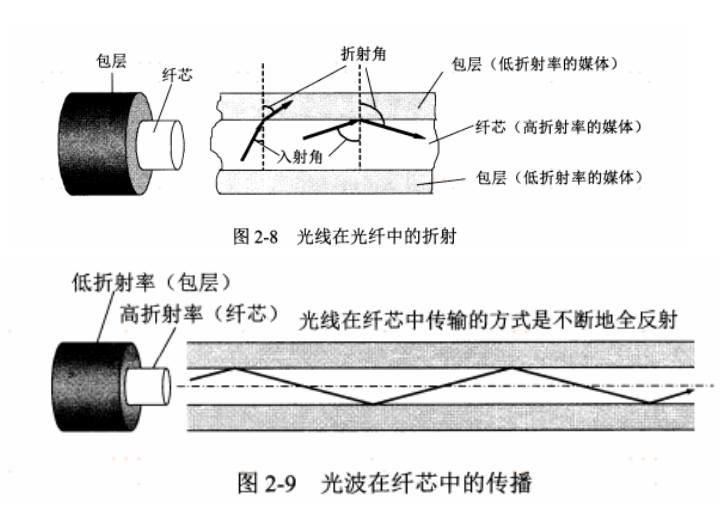
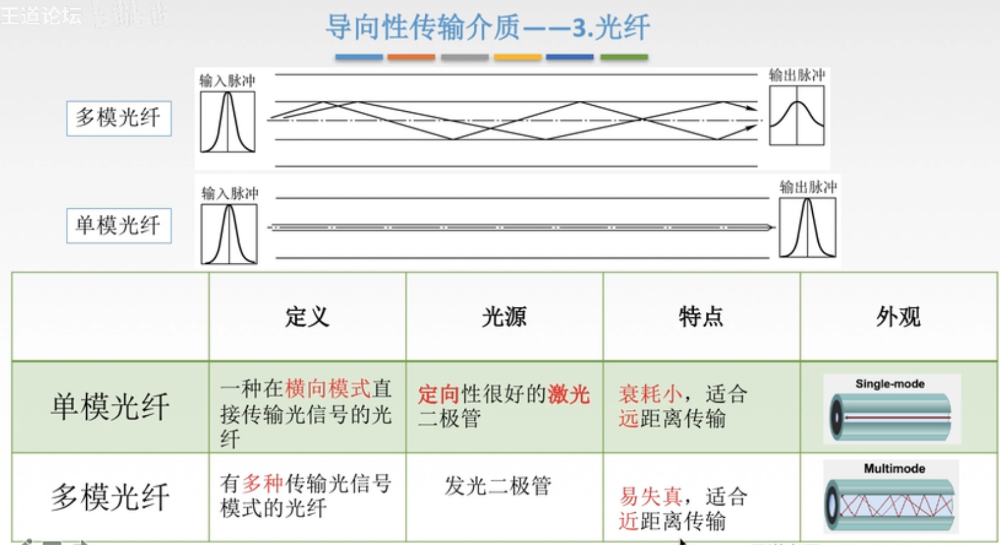
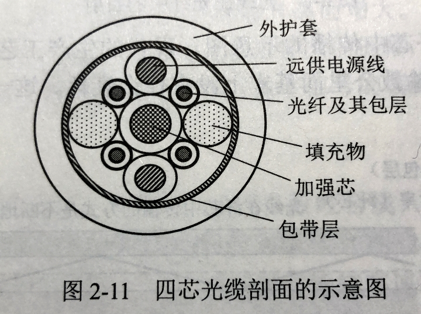
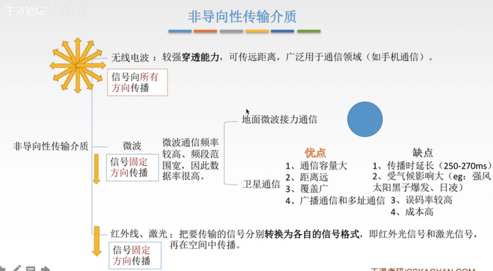

# 205 传输媒体

**传输媒体**，又称传输介质、传输媒介，是数据传输系统中在发送器和接收器之间的物理通路。

传输媒体，并不是，也不属于物理层。
在前面说过，物理层中的涉及到的，是抽象的逻辑通路，并不是实体。且物理层也不考虑实体的传输媒体。
所以也有人将实体的传输媒体，称为计算机网络体系结构在物理层之下的第 0 层。

传输媒体中传输的是信号，由于物理层规定了电气特性，所以由传输媒体传输的信号，可以物理层可以根据信号识别其代表的比特流。

传输媒体可分为两大类：

1. **导引型传输媒体**：

   此处 "导引型" 的英文为 guided，所以译为 "导向传输媒体" 也可。

   在导引型传输媒体中。电磁波被导引沿着固体媒体（铜线或光纤）传播。

2. **非导引型传输媒体**：

   非导引型传输媒体，就是指在自由空间中传播。
   非导引型传输媒体中电磁波的传输常称为无线传输。

## 一. 导引型传输媒体

### 1.1 双绞线

图1.双绞线

双绞线，又称双扭线，是最古老又最常用的传输媒体。

将**两根互相绝缘的铜导线**并排放在一起，然后用规则的方法**绞合**（twist）起来，就构成了双绞线。
绞合可减少对相邻导线的电磁干扰。

**屏蔽双绞线**（STP，Shielded Twisted Pair）：为了提高双绞线抗电磁干扰的能力，也可以在双绞线外在加上一层由金属丝编织成的屏蔽层。
相对的，前者没有屏蔽层的就是**无屏蔽双绞线**（UTP，Unshielded Twisted Pair）。

双绞线，价格便宜，是最常用的传输媒体之一，在局域网和传统电话网中普遍使用。
**模拟传输**和**数字传输**都可以使用双绞线，其通信距离一般为几公里到数十供里。
距离太远时，对于模拟传输，需要使用**放大器**放大衰减的信号；对于数字传输，需要使用**中继器**将失真信号整形

### 1.2 同轴电缆

图2.同轴电缆

同轴电缆由内**导体铜质芯线**（单股实心线或多股绞合线）、**绝缘层**、网状编指的**外导体屏蔽层**以及**保护塑料外层**所组成。

具有很好的抗干扰特性（有外导体屏蔽层），被广泛用于传输较高速率的数据。

可分为：

1. 基带同轴电缆：主要在局域网中使用（不过局域网还是双绞线用的多）
2. 宽带同轴电缆：传送带通信号，主要用于有线电视系统。

同轴电缆比双绞线：抗干扰特性更强、广泛用于传输较高速率的速率、传输距离更远。

### 1.3 光缆

图3.光缆

光纤通信就是利用光导纤维（简称光纤）传递**光脉冲**来进行通信。有光脉冲相当于 1，没有光脉冲相当于 0。
由于可见光的频率非常高，约为 $10^8MHz$ 的量级，因此一个光纤通信系统的传输带宽**远远大于**目前其他各种传输媒体的带宽。

光纤，在发送端有光源，可以采用发光二极管或半导体激光器，它们能在电脉冲的作用下产生出光脉冲。在接收端利用光电二极管做成光检测器，在检测到光脉冲是可还原出电脉冲。

光纤是主要由**纤芯**和**包层**构成的双层通信圆柱体。
纤芯很细，光波通过纤芯进行传导。包层较之纤芯有绞低的折射率（纤芯是实体啊，不是空心的）。
当光纤从高折射率的媒体射向低折射率的媒体时，其折射角将大于入射角。当入射角足够大时，就会出现全反射，即光纤碰到包层时就会全反射回纤芯。这个过程不断重复，光也就沿着光纤传输下去了。如图 3 中所示。

图3.单模光纤、多模光纤

在图 3 中只画出了一条光线。
那么按道理，只要满足产生全反射的角度，都能在光纤中传输的（当然还有其他条件限制）。
所以，对于只允许一种光在该光纤内传播的光纤（在横向模式直接传输光信号的光纤），称为**单模光纤**。
对于允许光纤内可传播多个种光的光纤（有多种传输光信号模式的光纤），称为**多模光纤**。

单模光纤的光纤直径只有一个光的波长，使得光纤一直向前传播，而不会产生多次反射（已经可以近似看作直线传播）。
能量衰减少，适合远距离传输。
使用激光二极管作为光源。
当然，成本也更高。

多模光纤，光脉冲在光纤种传输会逐渐展宽，造成失真。
使用发光二极管 LED 作为光源。
适合近距离传输。
相比单模光纤更便宜。

图4.光缆

**光缆**：因为光纤直径很小，所以实际使用中，把多个光纤和其他一些东西弄成一根线，就是光缆。

## 二. 非导引型传输媒体

图5.非导向型传输介质

### 2.1 无线电波

无线电波，信号向所有方向传播。

穿透能力强，可传远距离，广泛用于通信领域。

### 2.2 微波

微波，信号沿固定方向传播。

微波通信频率较高、频段范围宽，数据率很高。

主要用于：

1. 地面微波接力通信
2. 卫星通信

### 2.3 红外线、激光

红外线、激光，信号沿固定方向传播。

红外线、激光，把要传输的信号**转换**为各自的信号**格式**，即红外线信号和激光信号，再在空间中传播。
（主要和微波对比一下，红外线、激光多**转换格式**的步骤）

2021.01.26

