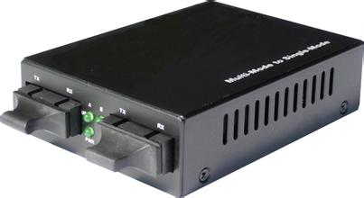
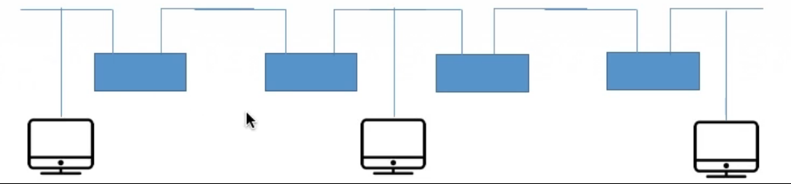
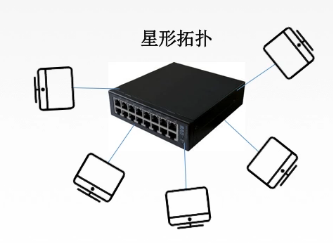

# 206 物理层设备

## 一. 中继器

又称转发器。

由于信号传播存在损耗，在线路上传输的信号功率会逐渐衰减，衰减到一定程度时将造成信号失真，因此会导致接收错误。

中继器的**功能**：对信号进行**再生和还原**，对衰减的信号进行放大，保持与原数据相同，以增加信号传输的距离，延长网络的长度。

中继器用于的是**再生数字信号**，是数字信号。用给模拟信号的是另一种设备叫放大器。

图1.中继器

中继器两端：
中继器两端连接的网络部分是网段，而不是子网（网段、子网在后面数据链路层讲）。
中继器适用于**完全相同的两类网络**（即同一类型的网段）的互连，且两个网段**速率要相同**。
中继器两端的网段一定要是**同一个协议**（中继器不会存储转发）。
中继器的两端可以连相同传输媒体，也可连不同传输媒体。

中继器不属于物理层。
中继器仅是将电缆信号发送到另一电缆上，不管数据是否有错或数据是否为不适于网段的数据。

**5-4-3 规则**：

网络标准中都对信号的延迟范围做了具体的规定，所以中继器也只能在符合规定的条件下进行工作，否则会网络故障。
（计算机在一定时间内没有得到回应就会认为数据发送失败。而中继器再生数字信号需要时间，所以给出规则也就是限制条件，使得在满足该规则的条件下，不会出现延迟过大导致网络不通。）

图1.5-4-3规则

5-4-3规则指，在10M以太网中，网络总长度不得超过5个区段，4台网络延长设备（中继器或集线器），且5个区段中只有3个区段可接网络设备。

## 二. 集线器（多口中继器）

集线器，或者多口中继器，既然是中继器，显然功能也有再生、放大信号。

集线器的**功能**：对信号进行再生放大转发，对衰减的信号进行放大，接着转发到其他所有（除了输入端口外）处于工作状态的端口上，以增加信号传输的距离，延长网络的长度。不具备信号的定向传送能力，是一个共享式设备。

图3.集线器

**冲突域**（collision domain)，指某个网络上的两台计算机在同时通信时会发生冲突，那么这个网络就是一个冲突域。

显然，如图 3 中，如果当两台计算机同时向集线器发送信号时，会引发冲突。
所以集线器与其所连主机就构成了冲突域。

当发生冲突时，相互冲突的计算机暂停发送信号，经过一个随机的时间后，再次发送信号。直到不冲突时，信号即可正常发送。

连在同一集线器上的主机平分带宽。

2021.01.27