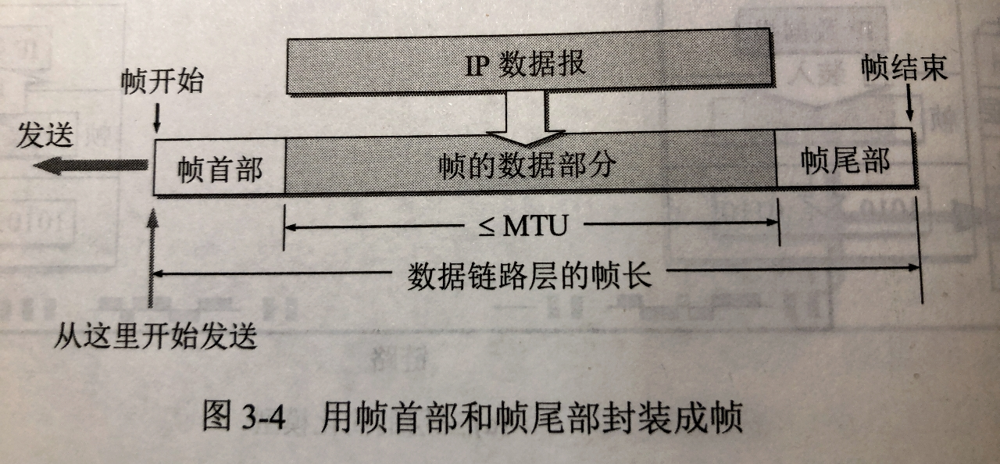

# 302 封装成帧和透明传输

## 一. 封装成帧 framing

**封装成帧（framing）**就是在一段数据的前后分别添加首部和尾部，这样就构成了一个帧。
接收端在收到物理层上交的比特流后，就能根据首部和尾部的比特流，从收到的比特流中识别帧的开始和结束。

**帧同步**：接收方应当能从接收到的二进制比特流中区分出帧的起始和终止。

图1.封装成帧

首部和尾部包含许多必要的控制信息。其中一个重要作用就是进行**帧定界**（即确定帧的界限）。

帧长：帧首部+帧尾部+帧的数据部分，的总长度。

帧的数据部分，
就是网络层的 PDU（协议数据单元，Protocol Data Unit），
或者说是上层（网络层）传给该层（数据链路层）的 SDU（服务数据单元，Service Data Unit）。
加上帧首部、帧尾部后，就成为了一个帧，即数据链路层的 PDU。

显然，为了提高帧的传输效率，应当使帧的数据部分长度尽可能地大于首部和尾部地长度。
不过也不能无限制的大，实际上，在每一种链路层协议中都规定了帧的**数据部分长度上限——最大传送单元 MTU（Maximum Transfer Unit）**。

## 二. 透明传输

**透明**：某一个实际存在的事物看起来却好像不存在一样。

在这里，在数据链路层透明传输数据的意思是，无论什么样的比特组合的数据，都能够按照原样没有差错地通过这个数据链路层。
因此，对所传送的数据来说，这些数据就 "看不见" 数据链路层有什么妨碍数据传输的东西。
或者说，数据链路层对这些数据来说是透明的。

图2.用控制字符进行帧定界的方法举例

其实吧，说了一堆，意思就是，帧是比特流，帧首部的**帧开始符**和帧尾部的**帧结束符**，本身也是通过特定的、约定好的比特组合。
如果当帧的数据部分中，不存在与帧开始符、帧结束符的比特组合相同的比特组合时，这样的传输就是透明传输。
显然嘛，在帧的数据部分中，是可能出现与帧开始符、帧结束符的比特组合相同的比特组合的。这就不是透明传输了。

如图 2 所示，使用控制字符 **SOH（Start Of Header）**作为帧开始符，控制字符 **EOT（End Of Transmissioon）**作为帧结束符。
而 **SOH 的二进制是 0000 0001，EOT 的二进制是 0000 0100**。
当帧的数据部分是文本文件时，是透明传输。因为文本文件都是可打印字符，不会与控制字符相同。
而当帧的数据部分不是文本文件时，是有可能在帧开始符和帧结束符之间出现相同的比特组合的。

为了解决透明传输的问题，自然是在发送端解决这个问题。就有了组帧四种方法。

## 三. 组帧的四种方法

### 3.1 字符计数法：

图3.字符计数法

在帧首部使用一个计数字段（**第一个字节**，8 bit），来标明帧内字符数。

如图 3 ，传输了 4 个帧，每帧的第一个字节标明了该帧共有多少个字符，接收端可以知道该帧的长度，从而避免了接收端因为在帧中途出现的与帧起始符、帧结束符相同的比特组合而出错。

但这个方法的问题在于，数据传输本身是可能会出错的。
如果第一个字节在传输过程中，本身出错了导致与帧内字符数不符，就会导致传输出错。
所以这方法，不常用。

### 3.2 字符（节）填充法：

图4.字符填充法

使用 SOH 作为帧开始符，EOT 作为帧结束符。

当传输的帧是文本文件时，透明传输。

当传输的帧非文本文件时，对在中间数据与 SOH、EOT 相同的比特组合前，插入一个**转义字符 ESC（二进制为 0001 1011）**。
发送端发送插入了转义字符后的数据。

如果中间有**与转义字符相同**的比特组合，也是同样的，在其前面插入转义字符。

图5.字符填充法

当接收端接收到后，读取到转义字符，就会知道下一个字符只是与帧开始符或帧结束符比特组合相同，而非真正的帧开始符或帧结束符（忽视转义字符后接下来的一个字节）。
接收端把转义字符删除，得到原始的帧。

### 3.3 零比特填充法：

图6.零比特填充法

使用 0111 1110 作为帧开始符和帧结束符。
所以，对中间的数据，凡是 5 个连续的 1，就在其后添上 1 个 0（即便原本就是 1 1111，也添 0）。

接收端接受到数据，先帧定界，然后用硬件对比特流进行扫描，将凡是 1 1111 后的 0 都删除（当然帧开始符、帧结束符的不删）。

特点：在传输的比特流中可以传送任意比特组合，不会引起错误的帧定界。

### 3.4 违规编码法：

图7.违规编码法

使用曼彻斯特编码，因为曼彻斯特编码只使用高-低，低-高来表示 1 或 0，所以使用其没有用到的高-高，低-低来作为帧开始符和帧结束符。

### 3.5 总结

由于字节计数法中计数字段的脆弱性，字符填充法实现上的复杂性和不兼容性，目前比较普遍使用的帧同步法是**零比特填充法**和**违规编码法**。

2021.01.28