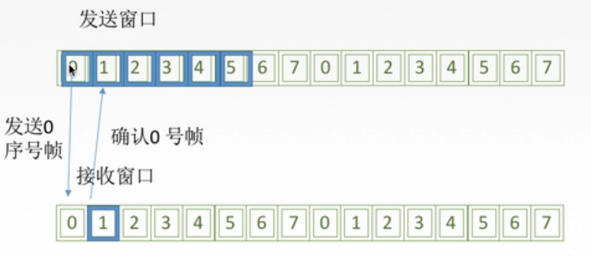

# 304 流量控制与可靠传输机制

## 一. 流量控制

较高的发送速度和较低的接收能力的不匹配，会造成传输出错，因此流量控制也是数据链路层的一项重要工作。

由于传输层也有流量控制，所以对比一下：

数据链路层的流量控制是**点对点**的（相邻结点之间）。
传输层的流量控制是**端到端**的（主机之间）。

控制手段：
数据链路层：接收方收不下就不回复**确认**（确认是一个确认帧，是不包含数据的控制帧）。
传输层：接收端给发送端一个**窗口公告**（窗口公告，告诉发送端，现在接收端的窗口有多少，缓冲区还有多大）。

## 二. 流量控制的方法：

此处流量控制的方法，不特指在哪层，只是介绍方法。

在上一节得最后我引用了书上原话，因为早期的通信链路质量不太好，所以选择让数据链路层向上层提供可靠传输服务。
不过现在的通信链路质量提高了，所以对于通信链路质量良好的有线传输链路，那么数据链路层就不提供可靠传输服务了，而是检测位错就行了，把可靠传输交给传输层来负责；对于通信链路质量较差的无线传输链路，那么数据链路层就向上层提供可靠传输服务。

流量控制的方法：

1. **停止等待协议**：

   每发送完一个帧就停止发送，等待对方的确认，在收到确认后再发送下一个帧。

   （实际上就是，发送窗口大小=1，接收窗口大小=1。）

2. **滑动窗口协议**：

   

   
图1.发送窗口大小为6，接收窗口大小为1的滑动窗口协议

   （这里王道<计网>视频讲得模糊，是我自己结合网上信息写的，大意没问题，可以看，细节肯定是缺少了的。）

   发送端具有发送窗口，接收端有接收窗口。
   对帧进行编号（编号可重复，但窗口内的帧号唯一）。

   以图 1 按照左端开始发送为例：
   发送端将发送窗口中的帧发送出去（按序），则已发送出去了发送窗口内左侧的部分帧，就是**已发送未确认**的状态，当发送窗口内最左侧的已发送未确认的帧收到了该帧的确认，则是**已发送已确认**的状态，则发送窗口右移。使得发送窗口外左侧全是**已发送已确认**的帧。
   接收端只接收接收窗口内编号的帧，其他帧丢弃。接收端接收了接收窗口内的帧后，则发出该帧的确认。当接收窗口最左侧的帧接收到后，接收窗口右移。使得接收窗口外左侧的帧都是已接收的帧。

   自动重发机制：如果发送方超过一定时间没有收到已发送未确认帧的确认，则重发该帧。

   2.1 **后退 N 帧协议（GBN）**：

   发送窗口大小>1，接收窗口大小=1。

   2.2 **选择重传协议（SR）**：

   发送窗口大小>1，接收窗口大小>1。

**自动重传请求（Auto Repeat reQuest，ARQ）**通过接收方请求发送方重传出错的数据帧来恢复出错的帧，是通信中用于处理信道所带来的差错的方法之一。
传统自动重传请求分为三种：停止-等待（Stop-and-Wait）ARQ、后退 N 帧（Go-Back-N）ARQ、选择性重传（Selective Repeat）ARQ。
后两种协议是滑动窗口技术与请求重发技术的结合，由于窗口尺寸开到足够大时，帧在线路上可以连续地流动，因此又称其为**连续 ARQ 协议**。
注意，**在数据链路层中流量控制和可靠传输机制是交织在一起的**。

## 三. 可靠传输、滑动窗口、流量控制

**可靠传输**：发送端发送什么，在接收端就接收到什么。（注意，除了保证避免了位错，也要保证避免了帧错）。

**流量控制**：控制发送速率，使接收方有足够的缓冲空间来接收每一个帧。

**滑动窗口**，解决了流量控制问题（收到确认后才会移动发送窗口，发送新的帧），也解决了可靠传输问题（存在发送方自动重传机制）。

2021.01.29