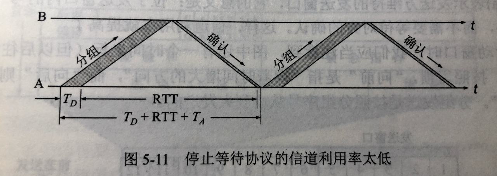
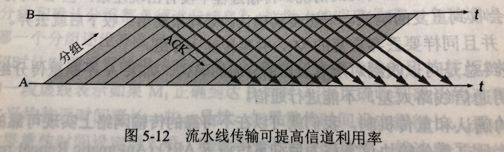

# 305 停止等待协议

停止-等待（Stop-and-Wait）

## 一. 为什么要有停止等待协议

原因：

1. 除了比特差错外，底层信道还会出现丢包问题。

   **丢包**：物理线路故障、设备故障、病毒攻击、路由信息错误等原因，会导致数据包丢失。
   数据包：指每层的 PDU，对数据链路层是帧，对网络层是 IP 数据报或分组，对传输层是报文段......

2. 为了实现流量控制。

## 二. 研究停止等待协议的前提

也就是在这一节，讨论停止-等待协议的默认条件。

虽然现在常用全双工通信方式，但为了讨论问题方便，仅考虑**一方发送数据（发送方）**，**一方接收数据（接受方）**。

因为只是讨论可靠传输的原理，所以不考虑数据是在那一层次上传输的。
（下面使用数据包，来代替数据帧、报文段......）

停止等待，就是没法送完一个分组就停止发送，等待对方的确认。在收到确认后在发送下一个分组。

## 三. 停止等待协议的应用情况

### 3.1 无差错情况

很简单，全程无差错。

发送方发送帧 $M_1$ ，
接收方接收 $M_1$ ，发送确认，
发送方收到确认，发送 $M_2$ ，
接收方接收 $M_2$ ，发送确认，
发送方收到确认，发送 $M_3$ ，
......

因为没差错，所以很多细节也没体现出来。

### 3.2 有差错情况

#### 3.2.1 数据包丢失或检测到数据包出错

发送方发送数据包 $M_1$ ，
接收方接收 $M_1$ ，发送确认，
发送方收到确认，发送 $M_2$ ，
出现 $M_2$ 丢失，接收方未接收到 $M_2$ ；或者接收方检测到数据包出错，丢弃该数据包，但并不发送确认。

实际上，发送方对发送的每一个数据包都设置了一个**超时计时器**，在超时计时器到期前收到了相应的确认，就撤销已设置的超时计时器。
显然现在这种情况是收不到了，所以当发送方超过了一段时间（即超时计时器设置的重传时间）没有收到确认，就认为刚才的数据包丢失了，所以重传刚才发送过的数据包。这就叫做**超时重传**。

注意：

1. 发送方发送一个数据包后，**必须在暂时保留它的副本**（在发生超时重传时使用）。只有在收到相应的确认后才能清除暂时保留的副本。
2. 数据包与确认数据包都必须**编号**，才能明确是哪一个发送出去的数据包收到了确认，而哪一个数据包还没有收到确认。
3. 超时计时器设置的重传时间**应当比数据在分组传输的平均往返时间更长一些**。

#### 3.2.2 ACK 丢失

**ACK(Acknowledge character)**，确认字符。是控制字符，表示发来的数据已确认无误。

ACK 是的 ASCLL 码为 0000 0110 ，是一个字符呀。
但确认，肯定是不止一个字符的。毕竟确认里面还得有数据包的编号等等。

但王道<计网>视频直接用的 ACK 表示确认了。
应该是指 ACK 信号或 ACK 数据包，即确认信号，而不是指确认字符吧。
下面我也直接使用 ACK 来表示确认信号。

当接收方接受到数据包后，会发送一个 ACK 信号（ACK 数据），即确认。

发送方发送数据包 $M_1$ ，
接收方接收 $M_1$ ，发送 ACK；
发送方收到确认，发送 $M_2$ ，
接收方接收 $M_2$ ，发送 ACK；
出现该 ACK 丢失，发送方未接收到该 ACK；
发送方，超过了重传时间后，仍未收到 ACK，重发 $M_2$ ，
接收方收到 $M_2$ ，因为前面已经收到了 $M_2$ ，所以丢弃这次重复的 $M_2$ ，**发送 ACK**；
发送方收到确认，发送 $M_3$ ，
......

#### 3.2.3 ACK 迟到

发送方发送数据包 $M_1$ ，
接收方接收 $M_1$ ，发送 ACK；
发送方收到确认，发送 $M_2$ ，
接收方接收 $M_2$ ，发送 ACK；
该 ACK 未丢失，但超过了重传时间也没有到发送方，所以发送方超过了重传时间后，仍未收到 ACK，重发 $M_2$ ，
接收方收到 $M_2$ ，因为前面已经收到了 $M_2$ ，所以丢弃这次重复的 $M_2$ ，发送 ACK；
发送方收到确认，发送 $M_3$ ，
然后，发送方收到了 $M_2$ 的 ACK，直接丢弃（我猜是因为根本就没有 $M_2$ 的超时计时器了。）
......

## 四. 停止等待协议性能分析

优点：简单。
缺点：信道利用率低。

**信道利用率**：发送方在一个发送周期内，有效地发送数据所需要的时间占整个发送周期的比率。
发送周期，从开始发送数据，到收到第一个确认为止。

**信道吞吐量**：信道利用率 × 发送方的发送速率（发送方的数据传输率）。

图1.停止等待协议的信道利用率低

可见，停止等待协议的信道利用率 $U$ 为： $\begin{aligned}U=\frac{T_D}{T_d+RTT+T_A}\end{aligned}$ 。

那么为了提高信道使用率，可以不采用停止等待协议，而是采用**流水线传输**：

图2.采用流水线传输提高信道利用率

这也就设及到接下来讲的滑动窗口协议：后退 N 帧协议、选择重传协议。

2021.01.29