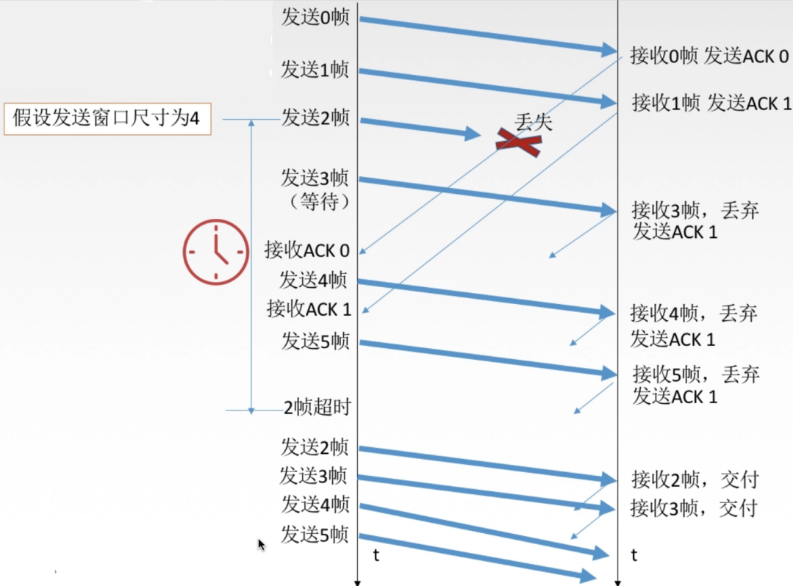

# 306 后退 N 帧（GBN，Go-Back-N）协议

发送窗口：发送方维持一组连续的允许发送的数据包的序号。
接收窗口：接收方维持一组连续的允许接收的数据包的序号。

在**后退 N 帧协议（GBN，Go-Back-N）**中，**发送窗口大小 $1\leq W\leq 2^n-1$ ，接收窗口大小=1**。

## 一. GBN 协议发送方要做的事

GBN 协议发送方必须响应的三件事：

1. 上层的调用：

   这里以上层为网络层为例，则指当网络层要发送数据时，GBN 协议的数据链路层应该做什么。

   当上层要发送数据时，发送方先检查发送窗口是否已满，
   如果**未满**，则产生一个帧并将其发送；
   如果**已满**，发送方将数据返回给上层，表示上层窗口已满。上层等一会儿再发送。
   （实际实现中，发送方可以缓存这些数据，等窗口不满时再发送帧。）

2. 收到一个 ACK：

   对 GBN 协议，通常接收方采用**累计确认**的方式，即接收方只**对按序到达的最后一个数据包**发送确认，表示包括这个数据包及之前的数据包都正确收到了。
   这样，发送端收到确认就认为该数据包及之前数据包都设为已发送已确认状态。

3. 超时事件：

   当发送方的发送窗口内的某个数据包超时时，则重新发送发送窗口内该数据包及其之后所有数据包（已发送未确认的包）。

   因为 GBN 协议接收窗口大小只有 1，所以接收方是只会按序接收的。
   所以发送方收到的确认，就代表着，该确认编号及其之前的数据包都已经被接收了。

   比如发送了 5 个数据包。
   出现了第 3 个包丢失或出错的状况，接收方只会接收第 1，2 个数据包。
   所以发送方也只会将第 1，2个数据包设为已发送已确认状态。
   然后等待一段时间，第 3 个数据包超时，重发第 3，4，5 个数据包。

   这也就是为什么叫**后退 N 帧协议**。
   本来都发送到第 5 个数据包了，又后退到第 3 个数据包开始发送。

## 二. GBN 协议接收方要做的事

接收方要做的事：

1. 如果正确按序接收到数据包，那么发送该数据包的 ACK，并将该数据包交给上层。

2. 其余情况（出错，不按序）则丢弃数据包，**并且**发送最近按序接收的最后一个数据包的 ACK。
   接收方不需要缓存任何失序的数据包，只需要维护一个信息：expectedseqnum（下一个期待的按序接收的数据包的序号）。

   也就是当数据包编号与 expectedseqnum 的值不一致时，丢弃该数据包，且发送一个确认，该确认中为最近接收的数据包编号。

## 三. 自己总结一下后退 N 帧协议的过程

自己总结的。

发送方将发送窗口中的数据包发送出去，对于 GBN 协议，发送方无需等待每个数据包的确认后再发送下一个，而是连续地将发送窗口中的数据包发送出去。在发送窗口内已发送出去而尚未收到确认的数据包，就处于**已发送未确认**的状态，

接收方只接收接收窗口内编号的数据包，其他数据包丢弃。
因为 GBN 协议的接收窗口大小为1，所以实际就是**按序**接收。

接收方接收数据包的情况：
当接收窗口内最左侧的数据包接收到后，接收窗口右移，使得接收窗口外左侧的数据包都是已接收的数据包，但不一定发送该数据包的确认。
因为为了减少开销，对于 GBN 协议，通常采用的并非是对每个接收到的数据包都发送确认，而是接收方采用**累计确认**的方式，即接收方只**对按序到达的最后一个数据包**发送确认，表示包括这个数据包及之前的数据包都正确收到了。

接收方丢弃数据包的情况：
当接收方收到的数据包出错，或不按序，则接收方丢弃该数据包，并发出最近按序接收的最后一个数据包的确认。

采用累计确认的方式，当发送方收到确认，就将该数据包及之前数据包都设为**已发送已确认**状态。然后发送窗口右移。使得发送窗口外左侧全是**已发送已确认**的数据包。

如果发送方的发送窗口内的某个数据包超时，则重新发送发送窗口内该数据包及其之后所有数据包（已发送未确认的包）。

这里补充一点细节：

因为超时重传，所以发送方发送数据包，也需要暂时保留其副本。直到收到该数据包的确认才清除。

发送窗口中的数据包不一定都可发送，可能数据包数量没有发送窗口大小多。等到上层传来新的数据包就继续发送。

除了累计确认外，还有一种**捎带确认**，指接收方在给发送方发送数据时才顺带发送确认，将确认信息附带在发送的数据的首部中的 ack 域。
因为实际上双方都是可以互相发送信息的嘛。

下面是王道<计网>视频里的举例流程：

图1.GBN 流程示意

不过看这流程，是采用的接收方接收每个数据包都发送确认吧。

ACK 0，指对数据包 0 的确认。

## 四. 窗口长度

如果采用 n 个 bit 对数据包编号，那么发送窗口的大小 W 应该满足 $1\leq W\leq 2^n-1$ 。

因为 n 个 bit 共有 $2^n$ 个不同状态，所以发送窗口大小显然应该 $W\leq2^n$ ，如果 $W>2^n$ ，那么发送窗口中就会有重复编号了。

为什么要减去 1 是 $W\leq2^n-1$ 呢。
因为如果刚好是 $W=2^n$ 的话，当发送方发送了 $2^n$ 个数据包，接收方也都接受了，此时，接收方下一个期待接收的是第二轮的编号 0 数据包。
但是，运气非常不好，接收方发送的确认，全部丢失，导致发送方没有收到任何确认。
于是，发送方从编号 0 开始重新发送数据包。
这下，就会导致，接收方把重发的数据包 0 当作了新发的第二轮的数据包 0。
所以是 $W\leq2^n-1$ 。

## 五. GBN 协议性能分析

优点：因连续发送数据包而提高了信道利用率。

缺点：在重传时，必须把原本已经正确传送的数据包重传，使得传送效率低。

其实我感觉这个缺点，是因为接收窗口大小只有 1 ，只能按序接收才导致的。
导致发送方发送的数据包本来只丢了中间 1 个，但是后面的也不会被接受，所以只能后面的全部都重传。
盲猜后面的选择重传协议就是解决这个问题的。

## 六. 习题

习题一：数据链路层采用后退 N 帧（GBN）协议，发送方已经发送了编号为 0-7 的帧。当计时器超时时，若发送方只收到 0，2，3 号帧的确认，则发送方需要重发的帧数是：（选择题，我就直接当填空了。）

GBN协议，接收方只会按序接收，所以发送方收到的确认，其含义必然是该确认编号及其之前的的数据包都被接收了。
所以这题，收到了 0，2，3 号帧的确认，即是 3 号帧及其之前的帧都已被接收。
所以，需要重发 4，5，6，7 号帧，共 4 帧。

2021.01.29