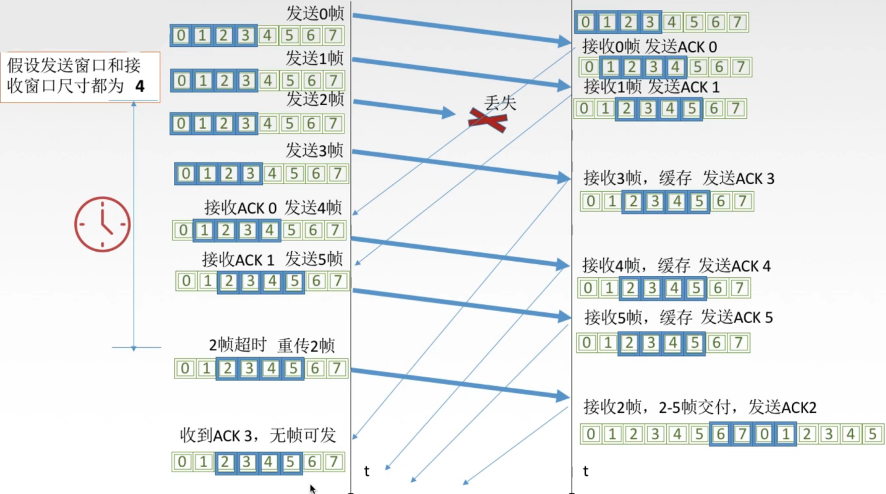

# 307 选择重传（SR，Selective Repeat）协议

在**选择重传（SR，Selective Repeat）协议**中，**发送窗口大小>1，接收窗口大小>1**。

## 一. SR 协议发送方要做的事

SR 协议发送方要做的事：

1. 上层的调用：

   从上层收到数据后，检查可用于该数据的编号，如果编号位于发送窗口内，则发送该数据包；否则，要么将该数据包缓存，要么将该数据返回给上层，等待一段时间后上层再调用。

2. 收到了一个 ACK：

   收到了一个 ACK，如果该 ACK 确认的数据包的编号在发送窗口内，则将该数据包设为已发送已确认状态。
   如果位于发送窗口最左端已发送未确认的数据包被确认，则发送窗口右移，直至发送窗口外左侧都是已发送已确认的数据包，发送窗口内最左端为未确认的数据包。
   如果发送窗口右移后，在发送窗口内有未发送的数据包，则发送这些数据包。

3. 超时事件：

   每个数据包都有自己的超时计时器，一个超时事件发送后**只重发该数据包**。

## 二. SR 协议接收方要做的事

SR 协议接收方要做的事：

1. 收到数据包：

   对接收窗口内编号的没出错的数据包，**不论次序**都接收。并发送该数据包的确认。

   失序的数据包（其前面的包还未接收）会被接收，但暂时**缓存**，直到其前面的包都被接收，成为一批有序的数据包，再将这一批有序的数据包交给上层。然后接收窗口向右移动，直到接收窗口外左侧都是已接收的数据包，接收窗口内最左侧是未接收的数据包。

   对接收窗口外左侧编号的数据包，显然是由于发送方没有收到该数据包的确认而重发的数据包，所以接受方返回该数据包的确认。

   其他情况，忽略该数据包。

## 三. 自己总结一下选择重传协议的过程

对于选择重传协议：

发送方将发送窗口中的数据包发送出去，在发送窗口内已发送出去而尚未收到确认的数据包，就处于**已发送未确认**的状态，

接收方只接收接收窗口内编号的数据包，其他数据包丢弃。
因为 SR 协议的接收窗口大小大于 1，所以实际不一定是按序接收。

接收方接收数据包的情况：

当接收方收到接收窗口内的数据包时，接收数据包，发送该数据包的确认。
当接收一个数据包后，如果接收窗口内从最左端开始有一批（个）有序的数据包，则将这批（个）数据包交付给上层。然后接收窗口右移，直到接收窗口外左侧都为已接收的数据包，接收窗口内最左端为未接收的数据包。
如果没有，则暂存该数据包，直至出现上述情况。

当接收方收到接收窗口外左侧编号的数据包时，显然原因是发送方未接收到该数据包的确认，超时重发。所以接收方发送该数据包的确认。

其他情况，接收方丢弃数据包。

发送方对发送窗口内的每个数据包都有超时计时器，当某个数据包的超时计时器到期时，只重发该数据包。

发送方收到确认时，如果是发送窗口内最左端的数据包的确认，则发送窗口右移，使得发送窗口外左侧都为已发送已确认的数据包，发送窗口内最左侧为未确认的数据包。

图1.SR 流程示意

## 四. 滑动窗口大小

 $W_T$ ：发送窗口大小；
 $W_R$ ：接收窗口大小；

对于滑动窗口机制，如果采用 n 个 bit 对数据包编号，那么窗口大小应该满足 $W_t+W_R\leq 2^n$ 。

本质就是，不能使发送窗口和接收窗口中出现相同的编号。
因为可能接收窗口发出的确认丢失，导致发送窗口内左侧的数据包超时重发，使得接收窗口将重发的数据包当作了新一轮的数据包，因为编号一样了。

可知，当 $W_R=1$ 时，就是 GBN 协议的发送窗口大小限制 $W_T\leq 2^n-1$ 。

对于选择重传协议，**应该满足 $W_T\leq W_R$** 。
因为如果发送窗口大于接受窗口，没什么意义，小于等于就好了。

另外，发送窗口与接收窗口大小最好**相等**。
相等的情况下，$W_{Tmax}=W_{Rmax}=2^{n-1}$ 。
这也是选择重传协议中，发送/接受窗口的最大尺寸。

## 六. 习题

习题一：数据链路层采用选择重传（SR）协议，发送方已经发送了编号为 0-3 的帧。现已收到 1 号帧的确认，而 0，2 号帧依次超时，则发送方需要重发的帧数是：（选择题，我就直接当填空了。）

SR 协议，接收方收到一个确认一个，所以发送方收到的确认只表示该帧被确认了。
所以这题，1 号帧确认，0，2 号帧超时，需要重发，3 号帧虽然未确认但还未超时。所以重发 2 帧。

2021.01.30