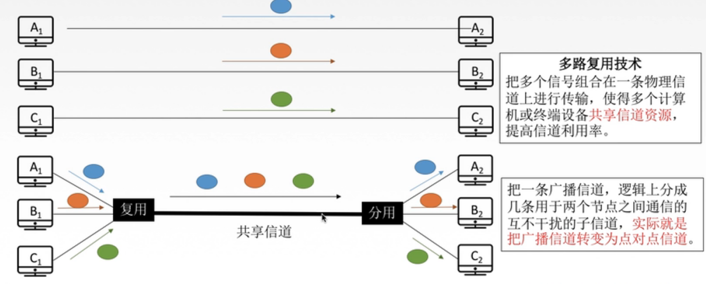
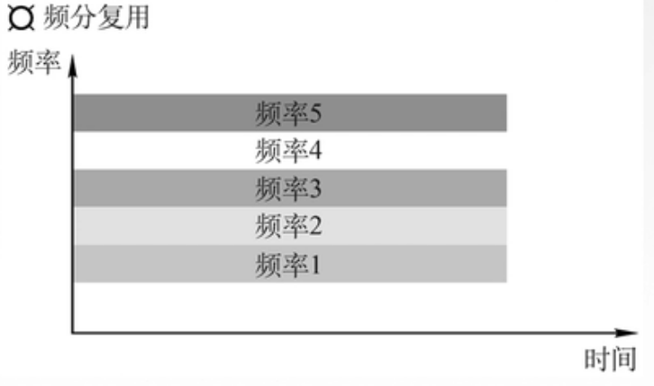
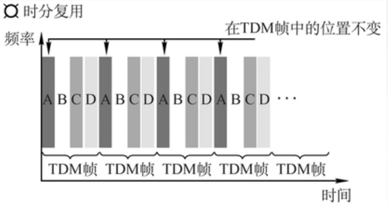
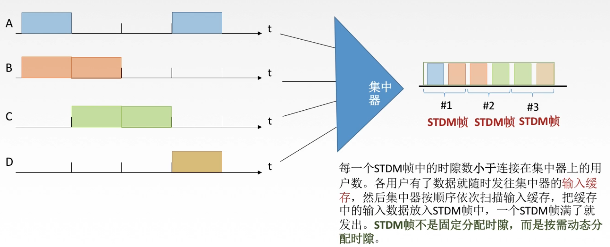
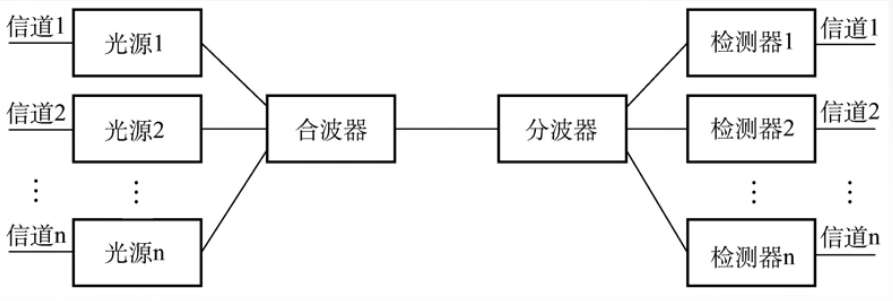

# 309 信道划分介质访问控制

介质访问控制—静态划分信道—信道划分介质访问控制。

信道划分介质访问控制：将使用介质的每个设备与来自同一信道的其他设备的**通信隔离开**，把**时域和频域资源**合理地分配给网络上的设备。

图1.多路复用技术

**多路复用技术**：把多个信号组合在一条物理信道上进行传输，使得多个计算机或终端设备**共享信道资源**，提高信道利用率。

如图 1，原本有 $A_1-A_2,B_1-B_2,C_1-C_3$ 互连，现在使用多路复用技术， $A_1,B_1,C_1$ 的信号会传到**复用器**上，然后经过共用一个共享信道，到达**分路器**，分路器分出该信号是给哪台主机的，将该信号传给对应的信道。

本质上，是将广播信道，在逻辑上转变为点对点信道。
即虽然共享信道实际上是广播式信道，但使用时是点对点信道。

当然这就需要对该信道进行访问控制来实现。

## 一. 频分多路复用 FDM（Frequency Division Multiplexing）

图2.频分复用

用户在分配到一定的频带后，在通信过程中始终都占用这个频道。频分复用的所有用户在同样的时间占用不同的带宽（频率带宽）资源。

即便多用户同时在共享信道中传输信号，由于使用的信号频率不同，也可以分辨出是哪个用户的信号。

特点：充分利用传输介质带宽，系统**效率较高**；由于技术比较成熟，实现也比较容易。

## 二. 时分多路复用 TDM（Time Division Multiplexing）

图3.时分复用

将时间划分为一段段等长的时分复用帧（TDM 帧），每一个时分复用的用户在每一个 TDM 帧中占用**固定序号的时隙**，所有用户轮流占用信道。

但假设如图 3 所示，当一个 TDM 帧内 A，B，C 都不使用信道时，D 仍然需要等待 3 个时隙，才能使用信道。
于是对于间隙发送数据的状况，就有了对时分复用的改进：

**统计时分复用STDM**：

图4.统计时分复用

多台主机的数据发送至集中器的**输入缓存**，集中器按顺序依次扫描输入缓冲，把缓存中的数据放入 STDM 帧中，当一个 STDM 帧满了就发出该帧。由此实现了**不是固定分配时隙，而是按需动态分配时隙**。

STDM 帧的时隙数应小于连接在集中器上的用户数。

## 三. 波分多路复用 WDM（Wavelength Division Multiplexing）

图5.波分多路复用

波分多路复用，就是光的频分多路复用。
在一根光纤中传输多种不同波长（频率）的光信号，由于波长（频率）不用，所以各路光信号互不干扰，最后再用波长分解复用器将各路波长分解出来。

## 四. 码分多路复用 CDM（Code Division Multiplexing）

这里王道<计网>视频只讲怎么做题。

**码分多址（CDMA）**是码分复用的一种方式。
即将 1 个 bit 分为多个**码片/芯片（chip）**，每个站点被指派一个唯一的 m 位的**码片序列（chip sequence）**。
该站点发送 1 时，发送码片序列；发送 0 时，发送码片序列的反码。

例如，主机 A，B 使用共享信道与主机 C 通信。
为了举例，取 $m = 8$ （通常 m 为 64 或 128）。则：
**（在 CDMA 中，码片中的 0 写成 -1）**
A 站点的码片序列为：$+1,-1,-1,+1,+1,+1,+1,-1$ ；
B 站点的码片序列为：$-1,+1,-1,+1,-1,+1,+1,+1$ 。
于是 A 传输：$(+1,-1,-1,+1,+1,+1,+1,-1)$ 表示 1， $(-1,+1,+1,-1,-1,-1,-1,+1)$ 表示 0；
于是 B 传输：$(-1,+1,-1,+1,-1,+1,+1,+1)$ 表示 1， $(-1,-1,+1,-1,+1,-1,-1,-1)$ 表示 0；

我这里写成了向量的形式，方便表示。
 $\vec A$ 表示 A 发出的信号； $\vec a_1$ 表示 A 的码片序列； $\vec a_0$ 表示 A 的码片序列的反码。
B 同理。

如何避免相互干扰。
对于芯片序列，要求各个站点的码片序列互相**正交**，即要求**规格化内积**为 0：$\begin{aligned}\frac{1}{8}\vec a_1\cdot\vec b_1=0\end{aligned}$ 。
显然嘛，两码片正交，则于其正交的码片的反码也正交。

如何同时共用信道。
各路数据在信道中线性相加。
例如，此时 A 发送 0，B 发送 1，则共享信道中传输的信号为： $\vec c =\vec a_0+\vec b_1=(-2,+2,0,0,-2,0,0,+2)$ 。

主机 C 如何分辨接收的数据中 A 或 B 发送的数据。
将接收到的数据 $\vec c$ 与 A 或 B 的码片**规格化内积**。
本质上就是利用了不同站点码片正交，所以可以用该站点的码片提取出该站点的信息：

例如提取出 A 站点的信息： $\begin{aligned}\frac{1}{8}\vec a_1\cdot\vec c&=\frac{1}{8}\vec a_1\cdot(\vec A+\vec B)\\&=\frac{1}{8}\vec a_1\cdot\vec A+\vec a_1\cdot\vec B\\&=\frac{1}{8}\vec a_1\cdot\vec A+0\\&=\frac{1}{8}\vec a_1\cdot\vec A\\&=\begin{cases}1,表示比特 1\\-1,表示比特 0\end{cases}\end{aligned}$ 。无论 $\vec B$ 是否发出信息，因为码片正交，所以 $\vec a_1\cdot\vec B=0$ ，不会影响提取 A 的信息。

如该例中：
 $\begin{aligned}\frac{1}{8}\vec c\cdot\vec a_1=-1\end{aligned}$ ，则 C 收到了 A 传输的数据是比特 0；
 $\begin{aligned}\frac{1}{8}\vec c\cdot\vec b_1=1\end{aligned}$ ，则 C 收到了 B 传输的数据是比特 1。

2021.01.30