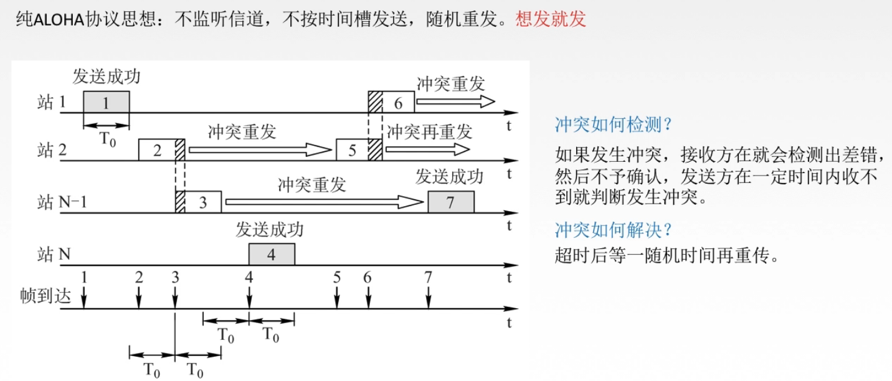
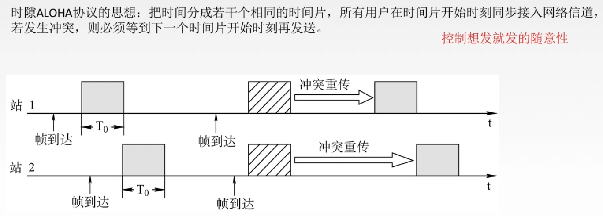

# 311 ALOHA 协议

介质访问控制—动态划分信道—随机访问介质控制—ALOHA 协议。

随机访问控制：指所有用户可随机发送信息，发送信息时占用全部带宽。

显然当多个用户同时发送信息时，就会出冲突。

## 一. 纯 ALOHA 协议

图1.纯 ALOHA 协议

纯 ALOHA 协议的思想：不监听信道，不按时间槽发送，随机重发。想发就发。

当发生冲突时，接收方会受到乱的数据而检查出错误，就不会接收，也不会发送确认。发送方也就不会收到确认了。

发送方发送的帧超时后，不一定立即重传，而是等待一个随机时间后再重传。

## 二. 时隙 ALOHA 协议

图2.时隙 ALOHA 协议

时隙 ALOHA（S-ALOHA）协议的思想：把时间分成若干个相同的时间片，所有用户在时间片开始时刻同步接入网络信道。若发送冲突，则必须经过一个随机时间并在一个时间片的开始时刻才再发送。

例如，站 A 的信息发送到一半，此时站 B 发送信息，则在纯 ALOHA 协议中，就会出现冲突。而使用时隙 ALOHA 协议，站 B 的信息会等待到下一个时间片才发送，也就避免了和 A 冲突。

所以，时隙 ALOHA 协议的冲突只会在时隙开始时发生，而不会出现某站发送到中途，其他站也开始发送的情况。
如果发生冲突，则也不会接受到确认，所以也是等待一段随机时间后再重发，当然也是在一时隙开始时发送。

## 三. 对比

1. 纯 ALOHA 协议比时隙 ALOHA 协议吞吐量更低，效率更低。
2. 纯 ALOHA 想发就发，时隙 ALOHA 只有在时间片开始时才能发。

2021.01.31