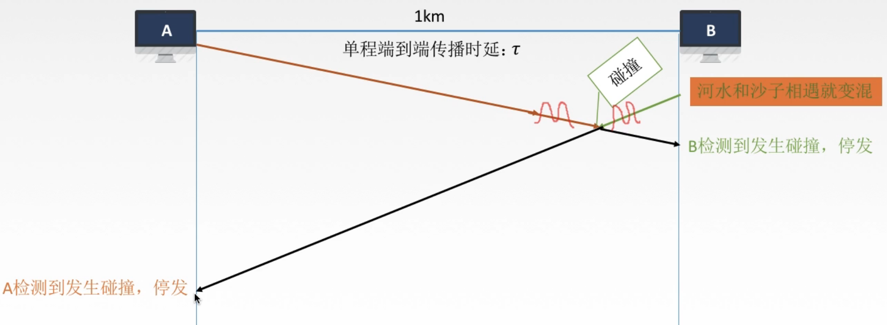

# 312 CSMA/CD协议

介质访问控制—动态划分信道—随机访问介质控制—CSMA/CD 协议。

看名字就知道，是从 CSMA 基础上改进的。

载波监听多点接入/碰撞检测，CSMA/CD（Carrier Sense Multiple Access with Collision Detection）

CS：载波监听，不过相比 CDMA 协议，CSMA/CD 协议是，每一个站在**发送数据前**以及**发送数据中**都要检测总线上是否有其他计算机在发送数据。

同样的，也是检测信道上的电压摆动值。

MA：多点接入，表示许多计算机以多点接入的方式连接在一根总线上。（总线型网络）

CD：碰撞检测（冲突检测），适配器边发送数据边检测信道上信号电压的变化情况，一边判断自己在发送数据时其他站是否也在发送数据。

## 一. 发生碰撞

由于信号的传播速率有限，所以实际上可能某主机监听到信道空闲，于是发送信号，但其实信道上有其他主机的信号在传输，只是还未传播到该主机。
这就导致了冲突。

图1.发生冲突

如图1，A 先发送，B监听信道空闲，于是发送，发送了冲突。
发生冲突，由于信号的相互影响，导致信道上的信号严重失真，无法从中恢复出有用信息。

当主机收到错误的信号时，就知道发生了冲突，则立即停止发送。免得继续进行无效的发送，拜拜浪费网络资源，然后等待一段随机时间后再次发送。

时间上的问题：
假设单程端到端传播时延为 $\tau$ ，B 检测到发生碰撞的时刻为 B 发出信号后经过 $\delta$ 时间。于是，可知从 A 发出信号开始，到 A 知晓该帧发生碰撞的时间为 $2\tau-\delta$ 。

可知，当 $\delta$ 趋近于 0 时，从 A 发出信号开始，到 A 知晓该帧发生碰撞的最大时间为 $2\tau$ 。
我们将 $2\tau$ 称为**争用期（contention period）**，或**碰撞窗口（collision window）**。
得出结论：**经过争用期这段时间还没有检测到碰撞，则可肯定这次发生不会发生碰撞**。

## 二. 发生碰撞后，重发时机

使用**截断二进制指数退避（truncated binary exponential backoff）**算法来确认碰撞后的重传时机。

1. 确定基本退避（推迟）时间为争用期 $2\tau$ 。
2. 定义参数 $k=\min\{重传数次,10\}$ ，即当重传次数小于 10，k 等于重传次数；当重传次数大于等于 10，k 始终等于 10。
3. 从离散的帧数集合 $[0,1,...,2^k-1]$ 中随机取出一个数 r，重传所需要的退避（推迟）时间就是 r 倍的基本退避时间，即 $r\cdot2\tau$ 。
4. 当重传达到 **16 次**仍不能成功时，说明网络太拥挤，认为此帧无法正确发出，抛弃此帧并向上层报告出错。

若连续多次发生冲突，就表明可能有较多的站参与争用信道。使用该退避算法可使重传需要推迟的平均时间随重传次数而增大（这也称为**动态退避**），因而减小发生碰撞的概率，有利于整个系统的稳定。

## 三. 最小帧长问题

这里是我自己的理解，我觉得书上和王道<计网>视频都没说清楚。

当一个帧很短时，发送方 A 很快就把该帧发送完了，于是连续发送很短的帧，而第一个很短的帧达到接受方 B 的前一时刻，发送了冲突，那么此时，信道上有 A 发出的 n 个很短的帧，都会受到该冲突的影响变为了错误的信号。
那么 A 收到该冲突信号，无法确定是哪个帧出错了。
是第一帧在 B 的门口发送冲突了吗，还是中间的某帧在中间冲突了，还是正在传的帧在 A 门口冲突了。

解决办法就是限制最小帧长，使得如果发生冲突，也能在发送该帧的时间内能收到冲突信号。
即，当收到冲突的信号时，发送方仍在发送这一帧，这样就能确定发送冲突的肯定是这一帧了。

显然需要满足帧的发送时延至少是传输时延的两倍 $2\tau$ 。即：
$$
\frac{帧长(bit)}{数据传输速率(bit/s)}\geq2\cdot传播时延\tau
$$
则**最小帧长**为：
$$
最小帧长=数据传输速率\times2\cdot总线传播时延\tau
$$
在以太网中规定最小帧长为 64 B，所以发送的帧一定长于 64 B，因此可认为**凡是长度小于 64 B 的帧都是由于冲突而异常中止的无效帧**。

如果发送的数据真的没有这么长，那就加入一些填充字节，使其不短于最小帧长，再发送。

来源于 2012 真题：快速以太网（100Mbps/S）中数据帧的最小长度为 46B。

2021.01.31