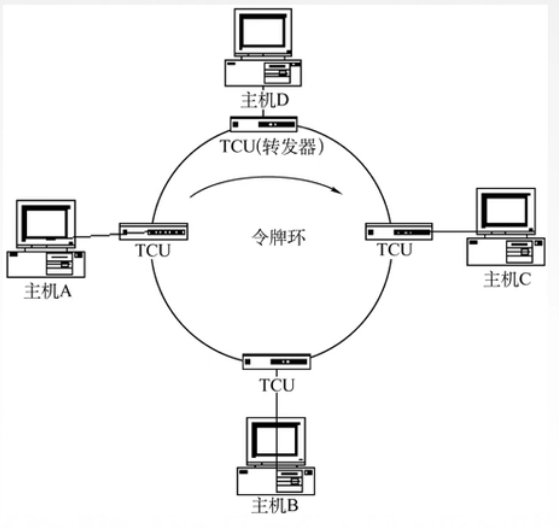

# 310 轮询访问介质访问控制

介质访问控制—动态划分信道—轮询访问介质访问控制。

这里用 **MAC（Multiple Access Control）**协议来代替前面的**介质访问控制**协议这个词。
（话说我在网上看到 MAC 都是 Medium Access Control 的缩写。）

信道划分 MAC 协议，基于**多路复用**技术，划分资源。
当网络负责重时：共享信道效率高，公平。
当网络负载轻时：共享信道效率低。

随机访问 MAC 协议： 
用户根据意愿**随机**发送信息，发送信息时可独占信道带宽。
当网络负责重时：会产生**冲突**开销。
当网络负载轻时：共享信道效率高，单个节点可利用信道的全部带宽。

轮询访问 MAC 协议（轮流协议，轮转访问 MAC 协议）：
**既不**产生冲突，**又**在发送时占全部带宽。

下面介绍轮询访问 MAC 协议中的轮询协议和令牌传送协议。

## 一. 轮询协议

轮询协议：主结点轮流询问从属结点是否发送数据。

询问，也就是发送 MAC 帧（数据帧）来询问嘛。

问题：

1. 有轮询开销。主结点花时间对从属结点发送多次数据帧。
2. 有等待延迟。从属结点需要等待主结点从前面一台一台的询问到它。
3. 有单点故障。如果主结点坏了，那其从属结点也没法通过主结点往外发信息了。

不是考研重点，所以就简单介绍这些。

## 二. 令牌传送协议

图1.令牌传送协议

令牌：是一个特殊格式的 MAC 帧，不含任何信息。用于控制信道的使用，确保同一时刻只有一个结点独占信道。

令牌在主机之间传递，当有令牌的主机，才能发送数据帧，而其他没有的主机，则不能发送。

主机 D 获得令牌后，修改令牌中的标志位，表示忙，并在令牌后加上要发送的数据，形成数据帧，发送出去，发送给 A 。
主机 C 收到该数据帧，发现不是给自己的，转发给下一个主机。
主机 B 收到该数据帧，发现不是给自己的，转发给下一个主机。
主机 A 接收该数据帧，是给自己的，复制一份，转发给下一个主机。
主机 D 接收了自己发送出去的数据帧，检查是否出错，若出错，可能重传一次；若没有出错，则修改令牌中的标志位，表示闲置，传递给下一个主机。
主机 C 收到令牌，检查令牌标志位，发现为闲置，若主机 C 需要发送数据，则如上；若不发送，则将令牌传递给下一位。

如果主机 D 要发送很长的数据，显然每次令牌都是在主机 D 那里，那么一直都会是主机 D 在发送数据。
所以为了避免这种一台主机长时间占用的情况，当该主机一直发送数据超过一个限定时间后，就需要将令牌传递出去，等待下一次获得空闲令牌再发送。

问题：

1. 令牌开销。花时间传递令牌。
2. 等待延迟。
3. 单点故障。

应用于逻辑环网（物理星型拓扑、逻辑环形拓扑），
令牌传送方式常用于为**负载较重，通信量较大**的网络。

（毕竟负载轻了，令牌就一直再空转。）

2021.02.08