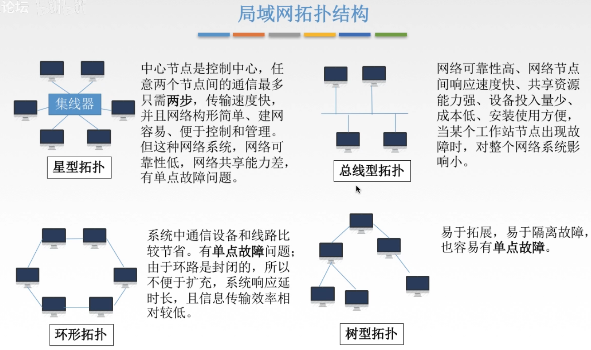
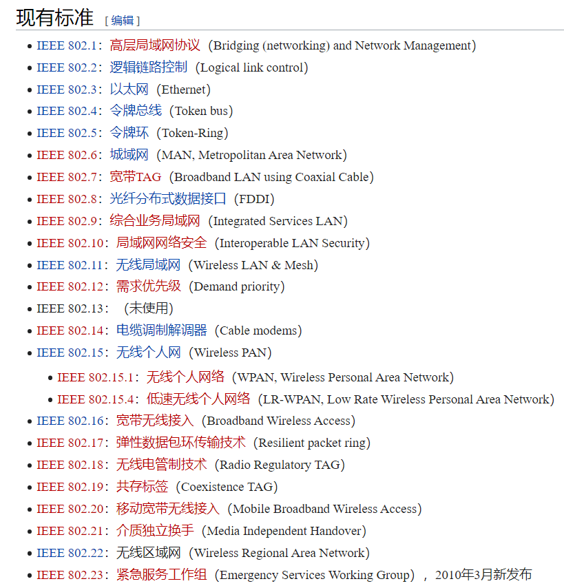

# 315 局域网基本概念和体系结构

局域网（LAN，Local Area Network），指在**某一区域内**由多态计算机互连组成的计算机组，使用**广播信道**。

特点：

1. 覆盖的地理范围较小，只在一个相对独立的局部范围内互连，如一座或集中的建筑群内。
2. 使用专门铺设的传输介质（双绞线、同轴电缆，当然也有无线）进行联网，数据传输速率高（10Mb/s-10Gb/s）。
3. 通信延迟时间短，误码率低，可靠性较高。
4. 各站为平等关系，共享传输信道。
5. 多采用分布式控制和广播式通信，能进行广播和组播。

决定局域网的主要要素为：**网络拓扑**，**传输介质**和**介质访问控制方法**。

## 一. 局域网拓扑结构

图1.局域网拓扑结构

## 二. 局域网传输介质

$$
局域网\begin{cases}
有线局域网，常用介质：双绞线、同轴电缆、光纤\\
无线局域网，常用介质：电磁波
\end{cases}
$$

## 三. 介质访问控制方法

介质访问控制方法：

1. CSMA/CD

   常用于**总线型局域网**，也用于**树型网络**。

2. 令牌总线

   常用于**总线型局域网**，也用于**树型网络**。

   将总线型或树型网络中的各个工作站按照一定顺序（如按接口地址大小）排列成一个逻辑环。只有令牌持有者才能控制总线，才有发送信息的权力。

3. 令牌环

   常用于**环形局域网**，如令牌环网。

## 四. 局域网的分类

局域网的分类：

1. 以太网：

   以太网是应用最广泛的局域网，包括标准以太网（10Mbps），快速以太网（100Mbps），千兆以太网（1000Mbps）和 10G 以太网，它们都符合 IEEE 802.3 系列标准规范。

   逻辑拓扑为总线型，物理拓扑为星型或拓展星型。使用 CSMA/CD。

2. 令牌环网：

   逻辑拓扑为环型拓扑结构，物理上采用了星型拓扑结构。已经很少用了。

3. FDDI（Fiber Distributed Data Interface） 网：

   逻辑拓扑为环型拓扑结构，物理上采用了双环拓扑结构。

4. ATM（Asynchronous Transfer Mode）网：

   较新型的单元交换技术，使用 53 字节固定长度的单元进行信息交换。

5. 无线局域网（WLAN，Wireless Local Area Network）：

   采用 IEEE 802.11 标准。

## 五. IEEE802 标准

IEEE 802 系列标准是 IEEE 802 LAN/MAN 标准呢委员会制定的局域网、城域网技术标准（1980 年 2 月成立）。其中最广泛使用的有以太网、令牌环、无线局域网等。这一系列标准中的每一个子标准都有委员会中的一个专门工作组负责。

图2.IEEE 802 现有标准

记一下 3（以太网），5（令牌环网），8（FDDI 网、光纤），11（无线局域网）。

## 六. MAC 子层和 LLC 子层

IEEE 802 标准所描述的局域网模型，只对应 OSI 参考模型中的数据链路层和物理层。

在 IEEE 802 标准中，将数据链路层分为了 **LLC 子层（逻辑链路控制子层）**和 **MAC 子层（介质访问控制子层）**。

LLC 子层的功能：
负责识别网络层协议，然后对它们进行封装。
LLC 报头告述数据链路层一旦帧被接收时，应当对数据包做何处理。
为网络层提供服务：无确认无连接、面向连接、带确认无连接、高速传送。

MAC 子层的功能：
数据帧的封装、卸装，帧的寻址和识别，帧的接收与发送，链路的管理，帧的差错控制等。
MAC 子层的存在屏蔽了不同物理链路种类的差异性。

2021.02.09