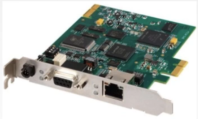
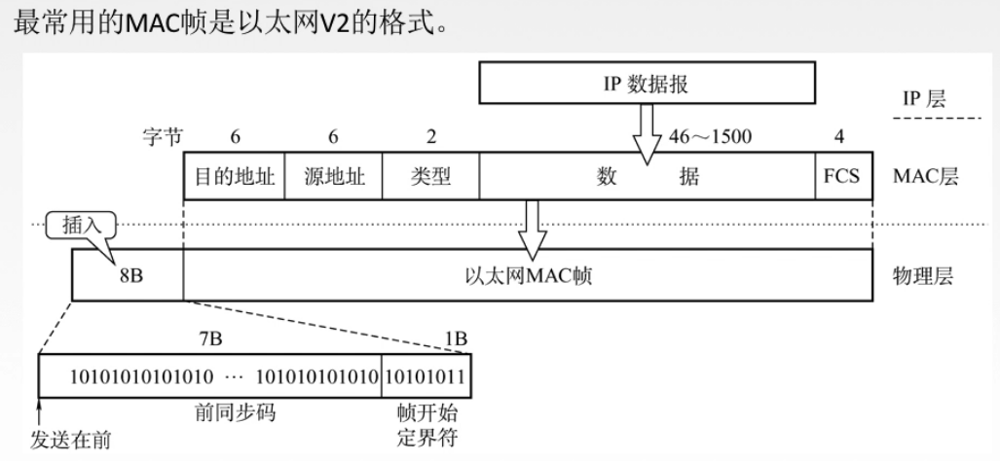

# 316 以太网

## 一. 以太网概述

以太网（Ethernet）指的是由 Xerox 公式创建并由 Xerox、Intel 和 DEC 董事联合开发的**基带总线局域网规范**，是当今现有局域网采用的最通用的通信协议标准。

以太网使用 **CSMA/CD** 技术。

以太网在局域网各种技术中占据统治性地位：

1. 造假低廉（以太网网卡不到 100 块）。
2. 是应用最广泛的局域网技术。
3. 比令牌环网、ATM 网便宜，简单。
4. 满足网络速率的要求：10Mb/s-10Gb/s。

以太网的两个标准：

1. DIX Ethernet V2：第一个局域网产品（以太网）规约。
2. IEEE 802.3：IEEE 802 委员会 802.3 工作组制定的第一个 IEEE 以太网标准。

一个局域网满足以上任一标准，都可以叫作以太网。

（实际上两标准就只有 MAC 帧的格式略有不同。）

## 二. 以太网提供无连接、不可靠的服务

无连接：发送方和接收方之间无 "握手过程" 。
不可靠：不对发送方的数据帧编号，接收方不向发送方进行确认，差错帧直接丢弃，差错纠正由高层负责。

总结：以太网只实现无差错接收，不实现可靠传输。

无差错接收，凡是接收了的数据帧，其内容无差错（无位错）。
可靠传输，包含了无差错接收，因为接收的数据帧虽然内容无差错，但可能失序（有帧错）。

## 三. 以太网传输介质与拓扑结构的发展

传输介质发展：粗同轴电缆—>细同轴电缆—>双绞线+集线器。

物理拓扑发展：总线型—>星型（逻辑上还是总线型）。

## 四 10BASE-T 以太网

10BASE-T，10 指 10Mb/s，BASE 指传输**基带信号**（数字信号），T 指使用双绞线。

现在的 10BASE-T 采用的是**无屏蔽双绞线**（UTP），传输速率是 **10Mb/s**。

物理上采用星型拓扑，逻辑上总线型，每段双绞线最长为 **100m**。

采用**曼彻斯特编码**。

采用 CSMA/CD 介质访问控制方式。

顺带记一下其他以太网：

10BASE5：粗缆以太网，数据率为 10Mb/s，每段电缆最大长度为 500m；使用特殊的收发器连接到电缆上，收发器完成载波监听和冲突检测的功能。

10BASE2：细缆以太网，数据率为 10Mb/s，每段电缆最大长度为 185m；使用 BNC 连接器形成 T 形连接，无源部件。

## 五. 适配器和 MAC 地址

MAC 地址：每个适配器有一个全球**唯一**的 48 位二进制地址，前 24 位代表厂家（由 IEEE 规定），后 24 位厂家自己指定。常用 12 个十六进制数来表示。
例如 01-00-5E-7F-FF-FF。

图1.通信适配器

计算机与外界有线局域网的连接是通过**通信适配器**的。

适配器就是一个板子， 是在主机箱内插入的一块**网络接口板**，也叫做**网络接口卡（NIC，network interface card）**，俗称**网卡**。

（现在计算机主板上都自带嵌入了适配器了。)

适配器上装有处理器和存储器（包括 RAM 和 ROM），ROM 中存储着计算机**硬件地址**，也就是 **MAC 地址**。

在局域网中，硬件地址，又称为物理地址，或 MAC 地址。
MAC 地址本质就是在数据链路层中，标志不同主机的标识符。

MAC 地址的前 3 字节（高 24 位），是生产局域网适配器（网卡）的厂商得向 IEEE 的**注册广利机构 RA（Registration Authority）**购买的，称为**组织唯一标识符 OUI（Organizationally Unique Identifier）**，通常叫作**公司标识符（company_id）**。
后 3 字节（低 24 位）则由厂商自行指派，称为**扩展标识符（extended identifier）**，只要保证生产出的适配器没有重复地址即可。

IEEE 规定了地址字段的第 1 字节的最低位为 I/G 位（Individual/Group），当 I/G 位为 0 时，表示单个站地址；当 I/G 位为 1 时，表示组地址，用来进行多播。
因此，实际上，IEEE 只分配前 3 字节的 23 位。

## 六. 以太网的 MAC 帧

因为以太网有两种标准，DIX Ethernet V2 和 IEEE 802.3，而这两种标准的 MAC 帧的格式略有不同。

图1.V2 格式的 MAC 帧

最常用的 MAC 帧是以太网 V2 的格式：

1. 目的地址：

   接收方的 MAC 地址。有三种情况：
   为单播地址，即目的地址是某一台主机的 MAC 地址。
   为广播地址，即目的地址全为 1，表示发送给所有主机，每台主机都会接收该 MAC 帧。 
   为多播地址，即发送给一组主机。

2. 源地址：

   发送方的 MAC 地址。

3. 类型：

   指明网络层使用的是什么协议。以便将接收的 MAC 帧上交给对应的协议。

4. 数据：

   就是网络层传下来要传输的数据。

   长度有限制，
   最长为 1500 B，也就是前面说过的，在每一种链路层协议中都规定了帧的**数据部分长度上限——最大传送单元 MTU（Maximum Transfer Unit）**。
   最短为 46 B，在最小帧长时说过，以太网最小帧长为 64 B，6+6+2+46+4=64 B。

5. FCS：

   循环冗余码的**帧检测序列 FCS（Frame Check Sequence）**。

在物理层，会在 MAC 帧插入 8B 的前导码，其中前 7B 为前同步码 1010...1010，目的是使接收方实现位同步；后 1B 为帧开始符 10101011，可以注意到前面还是 101010，最后两位为 11 了。

可以注意到，那么 MAC 帧中没有帧结束符，这是因为以太网使用曼彻斯特编码，在接收信号时，那么每个码元都会有电压变化，而当该帧的信号已经全部接收，自然就不会有电压变化了，也就知道该帧结束了。

当然，这也是因为，以太网发送帧存在间隔，所以即便是连续地接收帧，帧之间也存在间隔。

知道了帧的结束位置，往回数 4B 就找到了数据部分结束位置了。

当数据部分不足 46B 时，MAC 子层会在数据部分后面填充字段，以保证数据部分大于等于 46B。
可以注意到，MAC 帧中只能知道数据部分的起始和结束位置，而无法知道中间是否有填充字段。
所以，是否有填充字段，是交给上层的功能。上层会判断出是否有填充字段，并丢弃填充字段。

IEEE 802.3 格式：

1. 第三个字段是长度或类型。

2. 当长度或类型字段值大于0x0600（十进制 1536）时，此时表示类型，这样的情况与 V2 格式相同。

3. 当长度或类型字段值小于0x0600时，此时表示长度，则 MAC 帧的数据字段必须装入 LLC 子层的 LLC 帧。

   这里应该是指，当表示长度时，则是 IEEE 标准中 MAC 层—— LLC 层——网络层的层次结构；当为类型时，就是 V2 的 MAC 层—— 网络层的层次结构。

   所以这里第 3 点的意思应该是，当表示长度时，MAC 帧的数据字段里是 LLC 帧，LLC 帧的数据字段里才是网络层的 IP 数据报。

因为现在几乎都是 V2 标准的以太网，所以 LLC 子层的知识就很少说了。

## 七. 高速以太网

高速以太网，指速度大于等于 100Mb/s 的以太网：

1. 100BASE-T 以太网：

   在**双绞线**上传送 **100Mb/s** 基带信号的星型拓扑以太网，仍使用 IEEE802.3 的 CSMA/CD 协议。

   支持**全双工和半双工**，可在全双工方式下工作而无冲突。

   全双工方式下，中间的集线器换成交换机，交换机能够将原本的一个冲突域隔离成多个冲突域，也就是交换机的一个端口就对应一个冲突域，而现在一个端口只连一个主机，所以不会冲突。
   自然，全双工方式下，不使用 CSMA/CD 协议。

2. 吉比特以太网：

   在**光纤或双绞线**上传送 **1Gb/s** 信号。

   支持**全双工和半双工**，可在全双工方式下工作而无冲突。

3. 10吉比特：

   在**光纤**上传送 **10Gb/s** 信号。

   只支持**全双工**，无争用问题。

2021.02.09

补充一个王道的题目，不是真题。

> 在一个以太网中，有 A，B，C，D 四台主机，若 A 向 B 发送数据，则：
>
> A. 只有 B 可以接受到数据。
>
> B. 四台主机都能接受到数据。
>
> C. 只有 B，C，D 能接受到数据。
>
> D. 四台主机都不能接收到数据。
>
> 答案：B
