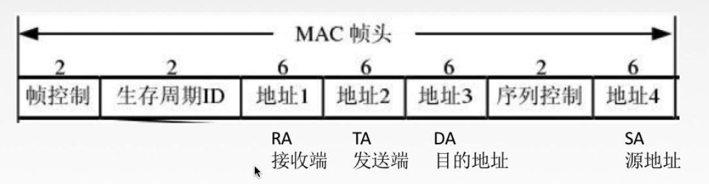
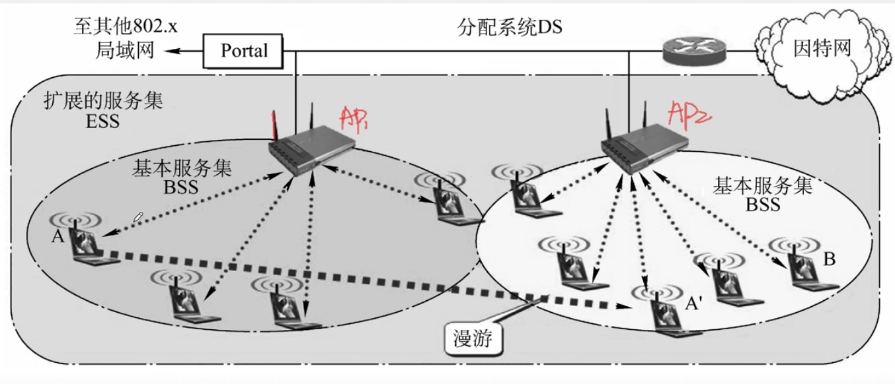
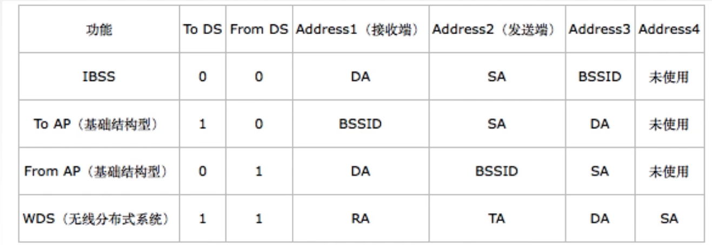
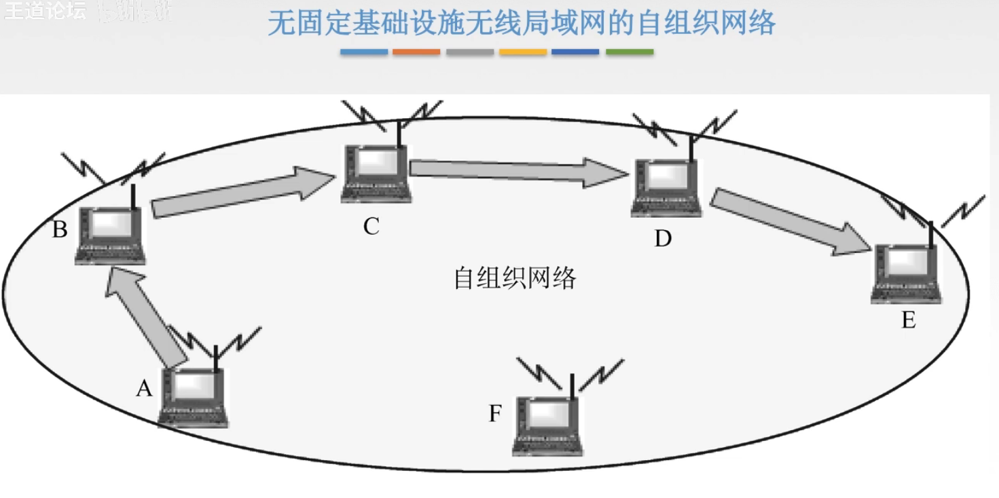

# 无线局域网

## 一. 802.11 的 MAC 帧头格式

IEEE 802.11 是**无线局域网**通用的标准，是由 IEEE 所定义的无线网络通信的标准。

图1.802.11 MAC 帧头格式

802.11 的 MAC 帧头格式：

1. 帧控制：
2. 生存周期 ID：
3. 地址 1 ：RA，接收端。本次接收该帧的主机的 MAC 地址。
4. 地址 2 ：TA，发送端。本次发送该帧的主机的 MAC 地址。
5. 地址 3 ：DA，目的地址。最终接收信息的主机的 MAC 地址。
6. 序列控制：
7. 地址 4：SA，源地址。最初发送信息的主机的 MAC 地址。

主要就知道这几个地址就行了，考试不考太多，讲这几个地址也是因为有一次考到了。

实际上，802.11 中共有四种 MAC 帧头的格式：

图2.不同主机间通信的 MAC 帧格式

这里王道<计网>视频讲的非常不清楚。我自己结合网上信息讲。

工作站 STA（Station），指主机。

独立基本服务集 IBSS（Independent Basic Service Set），由多个互连的 STA 构成一个 IBSS 的，互相可直接访问，不需要经过中间结点。当然 IBSS 范围也小，STA 数量也少。

基本服务集 BSS（Basic Service Set），由连接同一 AP 而互连的 STA ，构成一个 BSS。
基本服务集标识符 BSSID，就是标示这个 BSS 的 ID，实际上就是该 AP 的 MAC 地址。

顺带一提，服务集标识符 SSID（Service Set Identifier），就是日常搜 Wi-Fi 看见的 Wi-Fi 名。

无线 AP（Access Point），指无线接入点，也就是 STA 接入无线网络的第一个基站。

DS（Distribution system），分布系统。
AP 接入 DS，与其他 AP 通信。
我感觉就是 STA 接入的无线网络的第一个基站叫无线 AP，AP 之后往后的信息传输就忽略掉细节，方便我们分析，所以 AP 之后的网络就是 DS。

拓展服务集 ESS ，由多个连通的 BSS 构成。
两个属于不同 BSS 的 STA 进行信息交流，就叫漫游。
（怪不得以前打外地电话要漫游费）

（可想为这样的模型，假设每个城市只有一个手机基站和多个手机，那么一个城市中，手机就是工作站，手机基站就是无线 AP，AP 之后是传递信息的网络就是 DS）

图3.MAC 帧格式

|             |                          To DS = 0                           | To DS = 1                 |
| ----------- | :----------------------------------------------------------: | ------------------------- |
| From DS = 0 | 同一个 IBSS 中，从一个 STA 到另一个 STA 的MAC帧；或同一个 BSS 中，从非 AP 的 STA 到另一个非 AP 的 STA 的 MAC 帧 | 发送给 DS 或 AP 的 MAC 帧 |
| From DS = 1 |                   来自 DS 或 AP 的 MAC 帧                    | 无线桥接器上的数据帧      |

1. IBSS：

   IBSS 中 STA 直接发送给 STA。

   显然 To DS = 0，From DS = 0。

   接收端目的地址 DA，发送端为源地址 SA。后面是BSSID，是一个随机值，与 MAC 地址无关，毕竟反正也没用。

2. To AP（基本结构型）：

   基本结构型，就是指有 AP 的，也就是指 BSS。
   所以 To AP，From AP，我觉得就是指 STA—>AP 和 AP—>STA。
   （我着实没找到确切的信息，但这么理解对得上结果）

   STA 发送给 AP 的 MAC 帧。（发送给 DS 也得经过 AP）

   To DS = 1，From DS = 0。

   接收端为 AP 的 MAC 地址 BSSID，发送端为源地址 SA。后面是目的地址 DA。

3. From AP（基本结构型）：

   从 AP 发送给 STA 的 MAC 帧。

   To DS = 0，From DS = 1。

   接收端为目的地址 DA，发送端本此发送方 TA。后面是目的地址 DA，源地址 SA。

4. WDS（无线分布式系统）：

   从 AP 发送给 STA 的 MAC 帧。

   To DS = 1，From DS = 1。

   接收端为本此发送方 RA，发送端为该 AP 的 MAC 地址 BSSID。后面是源地址 SA。

还是有地方很模糊，比如 WDS 是什么东西。没办法啊，现在水平有限啊。

（2021.08.22 新增）个人理解：

IBSS：指该帧为本次 IBSS 内部 STA 间传送的 MAC 帧，这里是指把 AP 也视为 IBSS 内部的一个 STA，或者说没有 AP 的概念。
TO AP：指该帧为本次从 STA 发送给 AP 的 MAC 帧，注意，这里有了 AP 的概念，意味着这个帧是要发送给 DS 与该 BSS 外的 STA 联系。
FROM AP：指该帧为本次从 AP 发送给 STA 的 MAC 帧，注意，这里有了 AP 的概念，意味着这个帧是该 BSS 外的 STA 发出经有 DS 发送给 BSS 中的 STA 的。
WDS：指该帧为本次从 DS 发送给 DS 的 MAC 帧。

TO DS：该帧为本次发送给 DS 的 MAC 帧。（显然要么是 AP 发给 DS，要么是 DS 发给 DS）
FROM DS：该帧为本此来自 DS 的 MAC 帧。（显然要么是 DS 发给 AP，要么是 DS 发给 DS）

所以可以解释：

IBSS：0 0。
TO AP：1 0。
FROM AP：0 1。
WDS：1 1。

不过这只是我从这单词字面意思而来的理解，虽然看起来符合上了，并未找相关资料确认罢。

## 二. 无线局域网的分类

分类：

1. 有固定基础设施的无线局域网 BSS。

2. 无固定基础设施的无线局域网的自组织网络 IBSS。

   

   
图4. IBSS

2021.02.09

