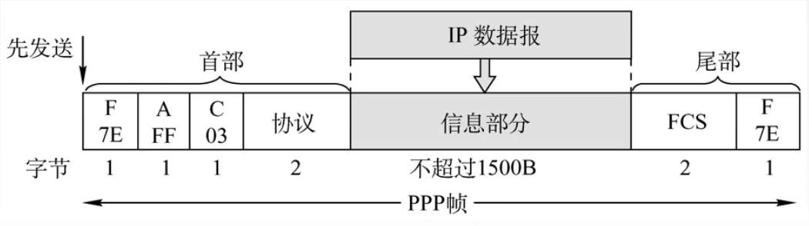
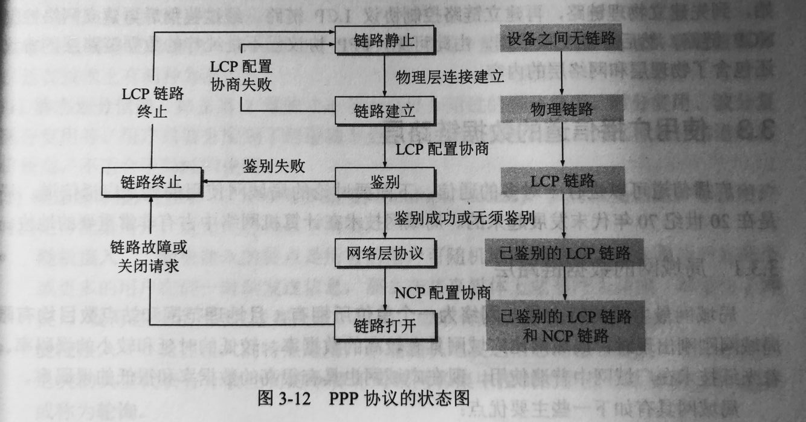
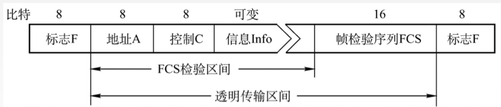

# 318 PPP 协议和 HDLC 协议

前面的协议，都是用于广播信道，可以看到，前面讲述的例子都是总线型、星型。

而 PPP 协议和 HDLC 协议都是点对点的协议。

## 一. 广域网

因为这两种协议通常用于广域网当中，所以先了解广域网的概念。

**广域网（WAN，Wide Area Network）**，通常跨接很大的物理范围，所覆盖的范围从几十公里到几千供里，它能连接多个城市或国家，或横跨几个洲并能提供远距离通信，形成国际性的远程网络。

广域网的通信子网主要使用**分组交换**技术（分组交换技术在之后网络层在详说）。
广域网的通信子网可以利用公用分组交换网、卫星通信网和无线分组交换网，它将分布在不同地区的**局域网或计算机系统**互连起来，达到**资源共享**的目的。如互联网（Internet）是世界范围内最大的广域网。

## 二. PPP 协议

**点对点协议（PPP，Point-to-Point Protocol）**，是目前使用最广泛的数据链路层协议，用户使用拨号电话接入互联网时一般都使用 PPP 协议。

实际上对于物理层、数据链路层和网络层，PPP 协议都有涉及。

### 2.1 PPP 协议应满足的需求：

IETF 认为，在设计 PPP 协议时必须考虑一下多方面的需求：

1. 简单：对于链路层的帧，无需纠错，无需序号，无需流量控制。
2. 封装成帧：规定特殊字符作为帧定界符。
3. 透明性：即前面说过的，无论数据是什么比特流也能传输，即便数据部分有与帧定界符相同比特组合，也要保证能正常传输。
4. 多种网络层协议：PPP 协议必须能够在同一条物理链路上同时支持多种网络层协议。
5. 多种类型链路：多种，例如：串行/并行，同步/异步，电/光的链路。
6. 差错检测：丢弃有差错的帧（位错）。
7. 检测连接状态：PPP 协议必须具有一种机制能够及时（不超过几分钟）自动检测出链路是否处于正常工作状态。
8. 最大传送单元：PPP 协议必须对每一种类型的点对点链路设置最大传送单元 MTU 的标准默认值。MTU 是数据部分的最大长度，而非帧的总长度。
9. 网络层地址协商：PPP 协议必须提供一种机制使通信的两个网络层的实体能够通过协商知道或能够配置彼此的网络层地址。
10. 数据压缩协商：PPP 协议必须提供一种方法来协商使用数据压缩算法。

### 2.2 PPP 协议不需要做的事情：

1. 不纠错，只检错丢弃。
2. 不对数据帧帧编序号。
3. 不进行流量控制。
4. 不支持多点线路（指一个主站轮流和链路上的多个从站进行通信），只支持点对点的链路通信。
5. PPP 协议不支持单工、半双工链路，只支持全双工链路。

### 2.3 PPP 协议的帧格式

图1.PPP 帧

1. F（Flag）：标志字段，表示帧的开始或结束，也就是帧定界符。规定为 0x7E（0111 1110）
2. A（Address）：地址字段，规定为 0xFF（1111 1111）。
3. C（Control）：控制字段，规定为 0x03（0000 0011）。
4. 协议：协议字段，标示信息部分是什么类型，如，
   若协议字段为 0x0021 时，则信息部分是 IP 数据报；
   若协议字段为 0xC021 时，则信息部分是链路控制协议 LCP 的数据。
   若协议字段为 0x8021 时，则信息部分是网络层的控制数据，
5. 信息部分：长度可变，不超过 1500B。
6. FCS：帧检验序列。

设计时，设计了 A、C 两个字段，但至今这两个字段也没有用上，所以目前 A、C 仍是固定的值，也就说 A、C 实际上没有携带 PPP 帧的信息。

有可能在信息部分出现也与帧界定符相同的比特组合 0x7E 导致错误，所以需要采取一定的措施来避免这种情况。

当 PPP 使用**异步传输**（逐字符的传输）时，定义**转义字符 0x7D（0111 1101）**，使用**字节填充**的方式，RFC 1662 规定了填充方法：

1. 把信息字段中出现的每一个 0x7E（0111 1110） 转变为 2 字节序列（0x7D，0x5E）。
2. 若信息字段中出现一个 0x7D，则把 0x7D 转变为 2 字节序列（0x7D，0x5D）。
3. 若信息字段中出现 ASCLL 码控制字符（即数值小于 0x20 的字符），则在该字符前面要加入一个 0x7D，同时将该字符的编码加以改变，例如，出现 **0x03** 就转变为 2 字节序列（0x7D，**0x23**）。

当 PPP 使用**同步传输**（一连串的比特连续传输），采用**零比特填充**方法来实现透明传输。
零比特填充法前面说过，在此不赘述。

接收端对接收的数据进行相反的变换，就可以正确地恢复出原来的信息。

### 2.4 异步传输、同步传输

顺带在这里说明一下异步传输和同步传输：

1. **异步传输**：
   通常以字符（8 位）为单位进行传输，发送方可以在任意时刻发送，接收方不知道什么时候会收到信号。每个字符的间隔时间也是不定。
   发送方发送一个字符后，无需等待回应，可发送下一个字符。

   通常，在没有数据时电路电平为 1，所以当电路电平突然变为 0 时，就表示接下来是开始，接下来就是一个字符（8 位），然后结束时电平恢复为 1，表示该字符传输结束。

   例如传输字符 0011 1000，则实际传输的是 0 0011 1000 1。

   也由于一个字符（8 位）需要附加上额外 2 位，所以传输效率低。

2. **同步传输**：
   每次传输一串比特流。也就是每次传输一个数据帧。

   采用帧定界符来识别帧的开始与结束。

   接收方以与发送方相同的时间间隔来接收每一位信息。
   也就是需要时钟同步，这就是为什么前面的物理层编码方式中，说有的编码方式拥有自同步能力，比如曼彻斯特编码，因为它可以从本身的电平变化判断出它发送比特的周期。

   发送方需要等待接收方回复确认后，才可发送下一个数据。

   为了使得接收方有响应时间，而不是检测到有信息传递，但之前的信息已经过去了，所以在每个字符前加上 1 位作为开始的标志，在每个字符后加上 1 位作为结束的标志。

这也就可以解释为什么异步传输使用字节填充的方式，而同步传输采用零比特填充的方式。
因为异步的单位是字节，而同步的单位是比特。
所以当以异步传输的方式传输 PPP 帧时，只需要考虑字节是否与帧定界符相同或该字节为 ASCLL 控制字符。
而当以同步传输的方式传输 PPP 帧时，可能会出现前一字节的末尾与本字节的前端形成了与帧定界符相同的比特组合。

### 2.5 PPP 协议的三个组成部分：

1. 一个将 IP 数据报封装到链路的方法。
2. **链路控制协议（LCP，Link Control Protocol）**：建立并维护数据链路连接。可用于实现身份验证。
3. **网络控制协议（NCP，Network Control Protocol）**：PPP协议可以支持多种网络层协议，每个不同的网络层协议都要一个相应的 NCP 来配置，为网络层协议建立和配置逻辑连接。每一个 NCP 支持不同网络层协议。

### 2.6 PPP 协议的状态图

图2.PPP 协议的状态图

过程简述：
用户拨号接入 ISP（Internet Service Provider，互联网服务提供商）后，就建立了一条从用户个人电脑到 ISP 的物理连接。

这时，用户个人电脑向 ISP 发送一系列的链路控制协议 LCP 分组（封装成多个 PPP 帧），以便建立 LCP 连接。这些分组及其响应选择了将要使用的一些 PPP 参数。

接着还要进行网络层配置，网络控制协议 NCP 给新接入的用户个人电脑分配了一个临时的 IP 地址。这样用户个人电脑就成为了互联网上的一个有 IP 地址的主机了。

当用户通信完毕时，NCP 释放网络层连接，收回原来分配出去的 IP 地址。接着，LCP 释放数据链路层连接。最后释放的是物理层的连接。

详细过程：

1. 未开始时，处于**链路静止（Link Dead）**状态，此时，用户主机与 **ISP（Internet Service Provider，互联网服务提供商）**之间不存在物理层的连接。

2. 当个人电脑通过调制解调器呼叫路由器时（通常是在电脑上点击 "连接" 按钮），路由器就能够检测到调制解调器的载波信号。这样，成功建立了物理层连接，之后，PPP 就进入了**链路建立（Link Establish）**状态。其目的是建立链路层的 LCP 连接。

3. LCP 层开始协商一些**配置选项**，比如链路上的最大帧长、所使用的**鉴别协议（authentication protocol）**的规定（如果有的话），以及不使用 PPP 帧中的地址和控制字段（毕竟这两字段这么多年都没用而且不携带信息，所以可以选择省略）。

   也就是发起通信方发送 LCP 的**配置请求帧（Configure-Request）**，这是个 PPP 帧，其协议字段为 LCP 对应的代码，即 0xC021；其信息字段则包含了对特定配置选项的请求。

   链路的另一端，则可发送以下几种响应的一种：

   a. 配置确认帧（Configure-Ack）：表示所有选项都接受。
   b. 配置否认帧（Configure-Nak）：表示所有选项都理解但不能接受。
   c. 配置拒绝帧（Configure-Reject）：表示有的无法识别或不能接收，需要协商。

4. 协商结束后，双方就建立了 LCP 链路，接着就进入**鉴别（Authenticate）**状态。

   在这一状态，只运行传送 LCP 协议的分组、鉴别协议的分组、监测链路质量的分组。

   若使用**口令鉴别协议 PAP（Password Authentication Protocol）**，则需要发起通信方发送身份标示符和口令。系统可允许用户重试多次。但如果需要有更好的安全性，则可以使用更复杂的**口令握手鉴别协议 CHAP（Challenge-Handshake Authentication Protocol）**。

   若鉴别身份失败，则转到**链路终止（Link Terminate）**状态；
   若鉴别身份成功，则进入**网络层协议（Network-Layer Protocol）**状态。

5. 在网络层协议状态，PPP 链路的两端的网络控制协议 NCP 根据网络层的不同协议互相交换网络层特定的网络控制分组。

   如果在 PPP 链路上运行的是 IP 协议，则对 PPP 链路的每一端配置 IP 协议模块（如分配 IP 地址）时，就要使用 NCP 中支持 IP 的协议——**IP 控制协议 IPCP（IP Control Protocol）**。IPCP 分组也封装成 PPP 帧在 PPP 链路上传送（协议字段为 0x8021）。

6. 当网络层配置完毕后，链路就进入可进行数据通信的**链路打开（Link Open）**状态。链路的两个 PPP 端点可以彼此向对方发送分组。

   两个 PPP 端点还可发送**回送请求 LCP**分组（Echo-Request）和**回送回答 LCP**分组（Echo-Reply），以检查链路的状态。

7. 数据传输结束后，可以有链路的一端发出**终止请求 LCP** 分组（Terminate-Request）请求终止链路连接，在收到对方发来的**确认终止 LCP **分组（Terminate-Ack）后，转到链路终止状态。

   如果链路出现故障，也会从链路打开状态转到链路终止状态。

8. 当调制解调器的载波停止后，则回到链路静止状态。

由此过程可见，PPP 协议已不是纯粹的数据链路层的协议，它还包含路物理层和网络层的内容。

## 三. HDLC 协议

高级数据链路控制（HDLC，High-Level Data Link Control），是一个在**同步**网上传输比特，**面向比特**的数据链路层协议，它是由国际标准化组织 ISO 根据 IBM 公司的 SDLC（Synchronous Data Link Control）协议扩展开发而成的。

显然，由于是面向比特的协议，自然是使用的**零比特填充法**实现透明传输。

采用全双工通信。

所有帧采用 CRC 检验，对信息帧进行顺序**编号**，可防止漏收或重份，传输可靠性高。

HDLC 有编号和确认机制，提供了**可靠传输**。

### 3.1 HDLC 的站

1. 主站：主要功能是发送命令（包括数据信息）帧、接收响应帧，并负责对整个链路的控制系统的初启、流程的控制、差错检测或恢复等。
2. 从站：主要功能是接收由主站法来的命令帧，向主站发送响应帧，并且配合主站参与差错恢复等链路控制。
3. 复合站：（既当主站又当从站）主要功能是技能发送，又能接收命令帧和响应帧，并且负责整个链路的控制。

有三种数据操作方式：

1. 正常响应方式(Normal Response Mode，NRM)：用于非平衡配置，只有主站才能发起向从站的数据传输，从站只有收到主站的命令帧后才能向主站发送数据。
2. 异步响应方式(Asynchronous Response Mode，ARM)：用于非平衡配置，在主站未发送命令帧时，从站也可以主动向主站发送数据，但是主站需要对链路进行管理。
3. 异步平衡方式(Asynchronous Balanced Mode，ABM)：用于平衡配置方式，任何一个复合站都可以启动数据传输，而不需要对方复合站的允许。

平衡配置，指链路两端的两个站都是复合站。
每个复合站都可以平等地发起数据传输。而不需要得到对方的允许。
通常情况下，平衡配置主要用于点对点链路，链路两端的站点具有同等的地位。

非平衡配置，指是由一个主站控制整个链路的工作。
主站可以发起向次站的数据传输，而次站只有在主站轮询到它时，它才能向主站发送数据，否则它只能等待。
通常情况下，非平衡配置主要用于多点链路，其中只有一个主站，其他站为从站。

### 3.2 HDLC 的帧格式

图3.HDLC 帧格式

HDLC 帧和 PPP 帧挺像的，实际上 PPP 就是在 HDLC 基础上改进的。

因为 HDLC **只支持 IP 协议**，而 PPP 支持多种网络层协议，自然 PPP 协议就多了一个协议字段用来指出信息部分是使用的什么协议。

因为 HDLC 是面向比特的协议，所以只使用零比特填充法。

1. 标志 F：表示帧的开始或结束，也为 0111 1110。

2. 地址 A：如果采用异步平衡方式，地址字段为该帧接收方的地址；如果采用另外两种方式，地址为从站的地址，但发送是给主站；

3. 控制 C：表示帧的类型，只看前两位。

   ​	3.1信息帧（I）：第一位为 0，用来传输数据信息，或使用捎带技术进行确认。

   ​	3.2监督帧（S）：前两位为 10，用于流量控制和差错控制，指向对信息的确认、请求重发和请求暂停发送等功能。

   ​	3.3无编号帧（U）：前两位为 11，用于提供对链路的建立、拆除等多种控制功能。

## 四. PPP  和 HDLC 对比

HDLC、PPP 都只支持全双工链路。

HDLC、PPP 都可以实现透明传输。
但 HDLC 只使用零比特填充法。
而 PPP 可使用字节填充法（异步传输）也可使用零比特填充法（同步传输）。

HDLC、PPP 都可以实现差错检测，但并不纠正差错。
但 HDLC 有序号和确认机制，提供了可靠传输。
而 PPP 无序号和确认机制，不提供可靠传输。

PPP 协议比 HDLC 协议多了一个大小为 2B 的协议字段。

HDLC 是面向比特的；
PPP 协议是面向字节的（这句话是王道说的，但根据我上面补充的，不是也可以按比特流传输嘛）。

2021.02.15

