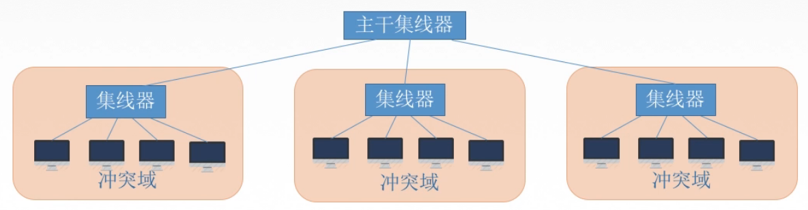
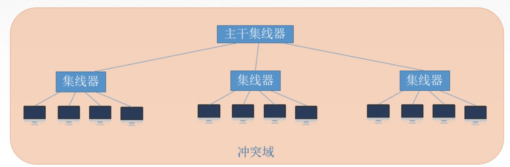
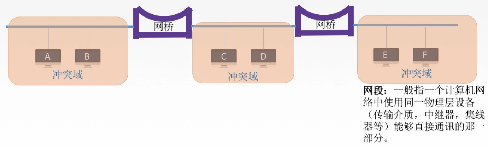

# 319 链路层设备

## 一. 物理层扩展以太网

首先由物理层扩展以太网来引入。

例如，在 10BASE-T 以太网中，集线器到主机之间双绞线最长为 100m。
那么为了使以太网的覆盖范围更大，距离更远。
在物理层，我们可以使用光纤或多个集线器连接的方式，来首先以太网的扩展。

图1. 使用光纤拓展以太网

主机发出电信号，经过光纤调制器，变为光信号，经过光纤解调器，还原为电信号，传给集线器。
这样主机与集线器的距离就可以很远。

图2.多个集线器连接

冲突域，指在该冲突域内，同时只能由一个主机发送信息，否则会冲突。

通过将多个集线器连接到同一集线器，从而原本属于不同冲突域的主机可以互相通信，实现了以太网的扩展。

图3.变成了一个大的冲突域

但是这种方式，因为集线器是将收到的信息转发给所有端口，所以集线器并不能分割冲突域。自然，连接后，多个冲突域变为了一个大的冲突域。

冲突域中的主机数量增加，也就导致了发生冲突的可能性增大，使得通信效率降低。

## 二. 链路层扩展以太网

在链路层使用**网桥**或**交换机**来拓展以太网。

（网桥可以说是交换机的前身，现在通常都使用交换机而不是网桥了。）

### 2.1 网桥

**网桥**：根据 MAC 帧的目的地址对帧进行转发和过滤。
当网桥收到一个帧时，并不像所有接口转发此帧，而是检查此帧的目的 MAC 地址，然后再确定将该帧转发到哪一个接口，或者是把它丢弃（即过滤）。

网桥的接口通常比较少，通常只有两个接口。

图4.使用网桥拓展以太网

**网段**：一般指一个计算机网络中使用同一物理层设备（传输介质、中继器、集线器）能够直接通信的那一部分。

可以看出，网桥具有分割冲突域的能力。
图 4 中通过网桥互连的三个冲突域，仍然是三个冲突域，其冲突域内的主机通信不受其他冲突域的影响。
同时，也能够实现不同冲突域之间的通信。

这就是因为网桥具有定向转发、过滤的功能嘛，冲突域内的通信信号，就被网桥过滤了，不会出现在其他冲突域。

如果图 4 中的网桥是集线器，那就成了一个大的冲突域了。

网桥的优点：

1. 过滤通信量，增大吞吐量。
   增大吞吐量指，三个冲突域仍然可以同时在冲突域内通信，吞吐量变为原本的 3 倍；而使用集线器变为一个冲突域，吞吐量没有变化。
2. 扩大了物理范围。
3. 提高了可靠性。
   指一台主机故障，只对所属网段有影响，对其他网段没影响。
4. **可互连不同物理层、不同 MAC 子层和不同速率的以太网。**

#### 2.1.1 透明网桥

对于网桥分为了两类：透明网桥，源路由网桥。

**透明网桥**：透明，指以太网上的站点并不知道所发送的帧将经过哪几个网桥，是一种即插即用设备（通过自学习算法实现即插即用）。

怎么实现的：（即插即用，自学习）
透明网桥，本身会存储一地址表，表项为地址与其对应的网桥接口。
当透明网桥刚接入网络时，此时转发为空。

当透明网桥收到数据帧时，
在地址表中查询该帧中的源地址：
若没有，则记录该帧中的源地址、接收该帧的接口；
若有则不用记录了。
然后，在地址表中查询该帧中的目的地址：
若没有，则从除接收该帧的接口以外的所有接口转发出去；
若有，且对应接口与接收该帧的接口一致，则丢弃；
若有，且对应接口与接收该帧的接口不一致，则从对应接口转发出去。

地址表并非一直不变，而是对地址表中的每个项目都有一定的有效时间，当超出了有效时间，则删除该项。以这样的方法，在保持地址表中的数据符合当前网络的实际状况。

#### 2.1.2 源路由网桥

**源路由网桥**：在发送帧时，把详细的最佳路由信息放在帧首部中。
最佳路由信息的指标可以是路由最少或时间最短。

实现方法：
源站以广播的方式向欲通信的目的站发送一个发现帧。
发现帧每经过一个源路由网桥，都会在帧头记录，以形成自己的路径。
当发现帧到达目的站时，就沿各自的路由返回源站。
所以源站就可以从返回的发现帧中，得知有 n 个路径可以与目的站进行通信，并且也知道每个路径的用时或经过路由数量。
选择出路由最少或用时最短的路径，以后每个从源站发送至该目的站的帧首部，都必须携带源站所确定的这一路由信息，也就是确定走这条路径。

实际上，现实中绝大多数还是用的透明网桥。

### 2.2 以太网交换机（多接口网桥）

1990 年问世的**交换式集线器（switching hub）**，很快淘汰了网桥。
交换式集线器常称为以太网**交换机（switch）**或**第二次交换机（L2 switch）**，强调这种交换机工作在数据链路层。

以太网交换机本质就是一个多接口的网桥，通常都有十几个或更多的接口。

一般都工作在全双工方式。

以太网交换机还具有并行性，即能同时连通多对接口，使多对主机能同时通信（而网桥只能一次分析和转发一个帧）。且相互通信的主机都是**独占传输媒体，无碰撞的传输数据**。
例如，对于 10BASE-T 以太网，若有 10 个用户，则每个用户平均带宽只有 1 Mbit/s。
而若使用以太网交换机来连接这些主机，虽然每个接口到主机还是 10 Mbit/s，但由于一个用户在通信时是独占而不是和其他网络用户共享带宽，因此在使用以太网交换机的10BASE-T 以太网中，拥有 10 个接口的交换机的总容量则为 100 Mbit/s，用户为 10 Mbit/s。

以太网交换机是一种即插即用设备，其内部的帧**交换表**（又称**地址表**）是通过**自学习**散发自动地建立起来的（自学习在前面透明网桥讲过了）。
以太网交换机由于使用了专用的交换结构芯片，用硬件转发，其转发速率要比使用软件转发的网桥快很多。

以太网交换机一般具有多种速率的接口，大大方便了各种不同情况的用户。

以太网交换机的性能远远超过了普通的集线器，而且价格也不贵，这就使得工作在物理层的集线器逐渐地退出了市场。

以太网交换机的两种交换方式：

#### 2.2.1 直通式交换机

接收到帧的同时就按帧的目的 MAC 地址决定转发接口，不检查正确性，立即转发。

延迟小（立即转发），可靠性低（不进行差错检测），**无法支持**具有不同速率的端口的交换（发送和接收端口速率差距太大容易出现问题）。

> 【2013 统考真题】对于 100Mb/s 的以太网交换机，当输出端口五排队，以直通交换（cut-through switching）方式转发一个以太网帧（不包括前导码）时，引入的转发时延至少是（）
>
> A. 0us B. 0.48us C. 5.12us D. 121.44us
>
> 解答：
>
> 以太网帧为：目的地址 6B + 源地址 6B + 类型 2B + 数据部分 46-1500B + FCS 4B。
>
> 直通式交换机只检查帧首部的目的地址，知晓了目的地址了后就立即转发。
>
> 所以时延为 6B/100Mb/s = 0.48us。

补充一下直通式交换机的方式（来源于网上）：

以太网的直通交换方式在输入端口检测到一个数据包时，检查该包的包头，获取包的目的地址，启动内部的动态查找表转换成相应的输出端口，在输入与输出交叉处接通，把数据包直通到相应的端口，实现交换功能。它只检查数据包的包头（包括 7 个字节的前同步码 + 1 个字节的帧开始界定符 + 6 个字节的目的地址共 14 个字节），有时题目说明不包含前导码，即只包 6 个字节含目的地址。那么转发时延 = 6B/100Mbps =0.48us。

#### 2.2.2 存储转发式交换机

接收到帧，将帧放入高速缓存，并检查是否正确，正确则转发，错误则丢弃。

延迟大，可靠性高，**可以支持**具有不同速率的端口的交换。

#### 生成树协议 STP（Spanning Tree Protocol）

在实际中，为了增加网络的可靠性，使用以太网交换机组网时，会增加一些冗余的链路，比如两台互连的交换机有两个链路互连，那么这种情况可能会导致在自学习的过程中出现数据帧在这两台交换机中无限循环转发。

如，连接交换机 #1 的主机 A 发送信息给连接交换机 #2 的主机 B。

#1 的交换表中没有 B 的地址，于是广播，从 #1 接口 2 转发给 #2 的接口 2。
#2 的交换表中没有 B 的地址，于是广播，则 #1 从接口 3 收到了 #2 的接口 3 传来的数据帧。
然后开始重复：
#1 的交换表中没有 B 的地址，于是广播，从 #1 接口 2 转发给交换机 #2 的接口 2，
#2 的交换表中没有 B 的地址，于是广播，则 #1 从接口 3 收到了 #2 的接口 3 广播的数据帧。
......

为了解决这个循环转发问题，IEEE 的 802.1D 标准制定了一个**生成树协议 STP（Spanning Tree Protocol）**。其要点就是不改变网络的实际拓扑，但在逻辑上切断了某些链路，使得从一台主机到其他所有主机的路径是无环路的树状结构，从而消除了兜圈子现象。

不过书上就说生成树协议解决了循环转发这个问题，没说是怎么解决的。

## 三. 冲突域和广播域

**冲突域**：
在同一个冲突域中的每个结点都嫩收到所有被发送的帧。
简单地说，同一时间内只能有一台设备发送信息的范围。

**广播域**：
网络中能接收任意设备发出的广播帧的所有设备的集合。
简单地说，如果站点发出一个广播信号，所有能接收到这个信号的设备的范围为一个广播域。

物理层设备（中继器、集线器）：
隔离冲突域：不能。
隔离广播域：不能。

链路层设备（网桥、交换机）：
隔离冲突域：能。
隔离广播域：不能。

网络层设备（路由器）：
隔离冲突域：能。
隔离广播域：能。

2021.02.15

