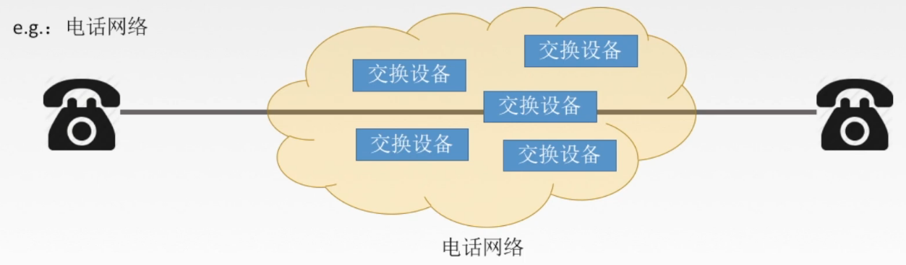
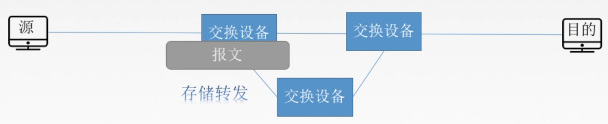
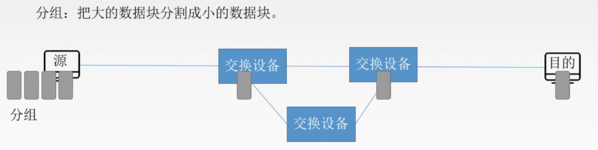
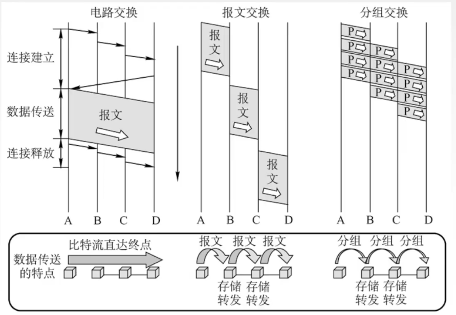

# 402 数据交换方式

通过路由器，可将异构网络互连。

## 一. 电路交换

例如，电话网络使用电路交换。

图1.电话网络使用电路交换

摘抄<计算机网络>书上原话：

> 当被叫用户听到交换机送来的振铃音并摘机后，从主叫端到被叫端就建立了一条连接，也就是一条**专用的物理通路**。这条连接保证了双方就能互相通电话。通话完毕挂机后，交换机释放刚才使用的这条专用的物理通路（即把刚才占用的所有通信资源归还给电信网）。
>
> 这种必须经过**建立连接**（占用通信资源）——**通话**（一直占用通信资源）——**释放连接**（归还通信资源）三个步骤的交换方式称为**电路交换**。
>
> 电路交换的一个重要特点就是**在通话的全部时间内，通话的两个用户始终占用端到端的通信资源**。
>
> 当使用电路交换来传送计算机数据时，其**线路的传输效率往往很低**。这是因为计算机数据是突发式地出现在传输线路上的，因此线路上真正用来传输数据的时间往往不到 10% 甚至 1%。

特点：独占资源

优点：通信延时小；有序传输；没有冲突；实时性强。

缺点：建立连接时间长；线路独占，使用效率低；灵活性差；无差错控制能力。

## 二. 报文交换

报文交换：以报文作为数据传输单位。

报文：要发送的整块数据。
报文是应用层的单元，比如要发送一个 PDF 文件，那么这个 PDF 文件称为一个报文。

图2.报文交换

报文从源端传递出去后，交换设备先将报文暂时存储，等待后续传输链路有空闲，再继续转发出去（**存储转发**）。

从图 2 可见，从源端到目的端的传输的路线并不是固定的，而是有空闲的路线就可以传输。

优点：无需建立连接；存储转发，动态分配线路；线路可靠性较高；线路利用率较高；多目标服务（一个报文可以发给多个目的端）。

缺点：有存储转发时延；报文大小不定，需要网络结点有较大缓存空间。

## 三. 分组交换

在报文交换上改进，也是存储转发，但将大的数据块分割成小的分组，以分组作为数据传输的单位。

分组：将大的数据块（报文），分割成若干更小的数据块（分组或包，packet）。

图3.分组交换

图 3 分组交换与 图 2 报文交换对比可见。
同一份文件进行传输，报文交换需要等待整个文件接受完，然后存储转发，在此期间，其后的链路是未利用的。
而分组转发，传输更小，所以在同样的时间内，可以利用起来其后的链路。

优点：无需建立连接；存储转发，动态分配线路；线路可靠性较高；线路利用率较高；相对于报文交换，存储管理更容易。

缺点：有存储转发时延；需要传输额外的信息量（每个分组都需要携带说明信息）；乱序达到目的主机时，要对分组进行重新排序。

### 3.1 数据报方式

下一节讲。

### 3.2 虚电路方式

下一节讲。

## 四. 三种数据交换方式对比。

图4.三种数据交换方式对比

可见分组交换近似并行传输。

> 电路交换：整个报文的比特流连续地从源点直达终点。
> 报文交换：整个报文先传送到相邻结点，全部存储下来后查找转发表，转发到下一个结点。
> 分组交换：单个分组（这只是整个报文的一部分）传送到相邻结点，全部存储下来后查找转发表，转发到下一个结点。
>
> 若要传送大量数据，且其传送时间远远大于连接建立时间，则电路交换传输速率较快。报文交换和分组交换不需要预先分配传输带宽，在传送突发数据时可提高整个网络的信道利用率。由于一个分组的长度往往远小于整个报文的长度，因此分组交换比报文交换的时延小，同时也具有更好的灵活性。

2021.02.20