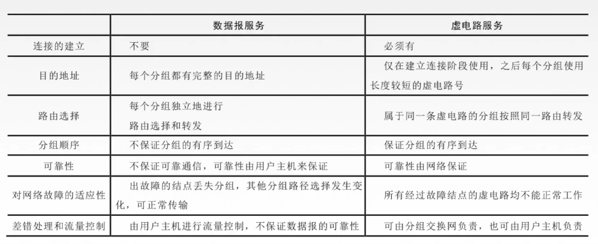

# 403 数据报方式、虚电路方式

分组交换——数据报方式、虚电路方式

数据报方式：为网络层提供无连接服务。
虚电路方式：为网络层提供连接服务。

无连接服务：不实现为分组的传输确定传输路径，每个分组独立确定传输路径，不同分组传输路径可能不同。
连接服务：首先为分组的传输确定传输路径（建立连接），然后沿该路径（连接）传输系列分组，系列分组传输路径相同，传输结束后拆除连接。

## 一. 各层传输单元名词辨析

应用层：报文。

传输层：报文段（如果报文过大，分为多个报文段）。

网络层：IP 数据报，分组（如果报文段过大，分为多个分组。IP 数据报就是在报文段加上发送方和接收方的 IP 地址，如果加上后过大了，还是要分成分组。）。

数据链路层：数据帧。

物理层：比特流。

## 二. 数据报方式

每个分组携带源地址和目的地址。

路由器根据分组的目的地址转发分组：基于路由协议/算法构建转发表；检索转发表；每个分组独立选路。

最基础的转发表，表项为：目的网络地址、链路接口。

## 三. 虚电路方式

将数据报方式和电路交换方式结合。

两台计算机进行通信时，也应当先建立连接，以预留双方通信所需的一切网络资源。然后双方沿着已建立的虚电路发送分组。这样分组的首部不需要填写完整的目的主机地址，而只需要填写这条虚电路的编号，因而减少了分组的开销。在通信结束后要释放建立的虚电路。

**虚电路 VC（Virtual Circuit）**：一条源主机到目的主机的类似于电路的路径（逻辑连接），路径上所有结点都要维持这条虚电路的建立，都维持一张虚电路表，每一项记录了一个打开的虚电路的信息。

## 四. 虚电路与数据报方式对比

图5.虚电路与数据报方式对比

数据报：
不需要建立连接；
每个分组携带目的地址；
每个分组独立进行路由选择和转发；
不保证有序到达；
不保证可靠通信。如果需要可靠性，则可靠性由用户主机保证（由网络的主机的运输层负责）；
出现故障结点，可正常传输；
由用户主机进行流量控制。

虚电路：
需要建立连接；
每个分组携带虚电路号；
属于同一虚电路的分组按同一路由进行转发；
保证有序到达；
保证可靠性，可靠性由网络保证；
出现故障结点，通过该故障结点的虚电路均不能工作。
可由网络负责，也可由用户主机负责流量控制。

TCP/IP 体系的网络层提供的是数据报服务。

2021.02.20